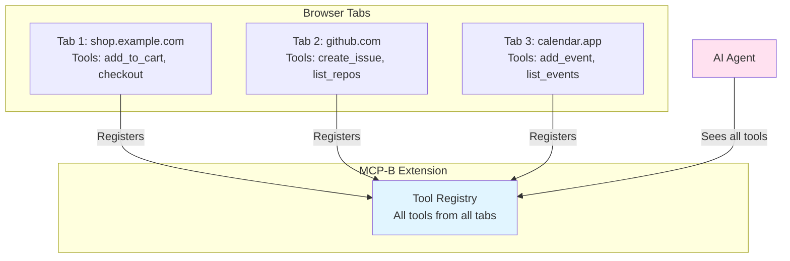
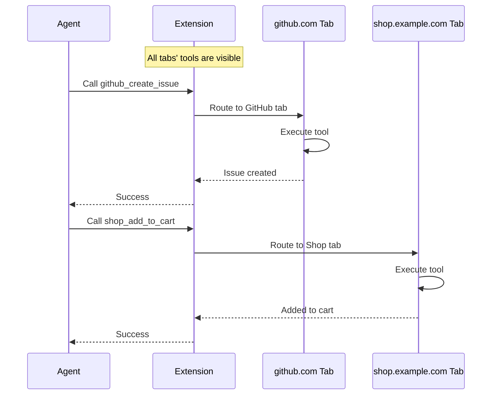
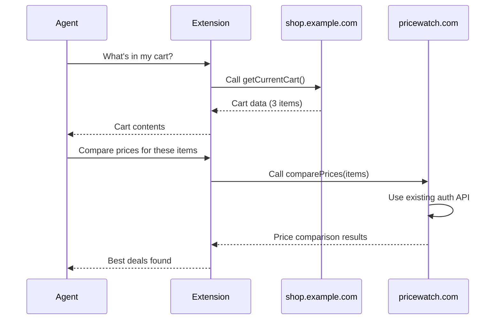
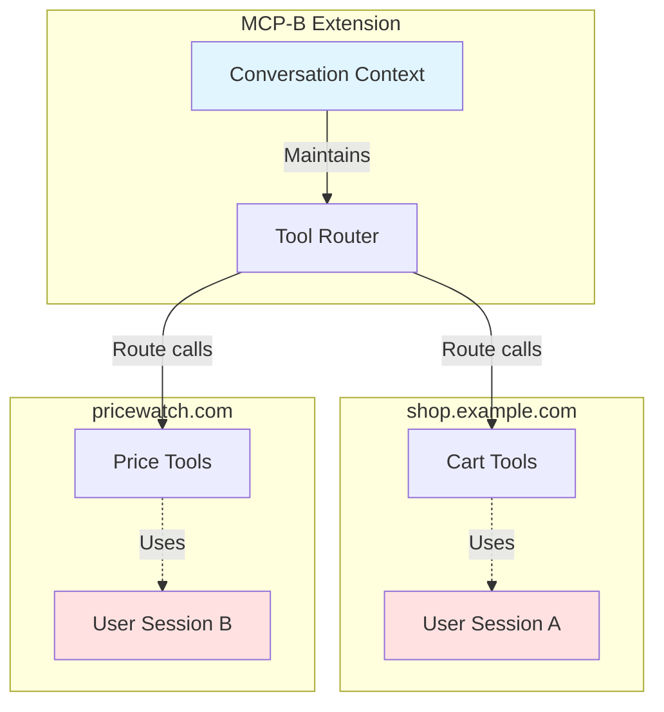

## Dynamic Tool Registration

### Conditional Tools Based on User State

Register tools based on authentication, permissions, or user roles:

```tsx
import { useWebMCP } from '@mcp-b/react-webmcp';
import { useAuth } from './auth';
import { z } from 'zod';

function AdminPanel() {
  const { user } = useAuth();

  // Only register admin tools if user is admin
  useWebMCP({
    name: 'delete_user',
    description: 'Delete a user account (admin only)',
    inputSchema: {
      userId: z.string().uuid()
    },
    handler: async ({ userId }) => {
      if (!user?.isAdmin) {
        throw new Error('Unauthorized');
      }
      await api.users.delete(userId);
      return { success: true };
    },
    // Only register if user is admin
    enabled: user?.isAdmin
  });

  return <div>Admin Panel</div>;
}
```

### Page-Specific Tools

Register tools based on the current route - tools appear and disappear as users navigate:

```tsx
function ProductPage({ productId }) {
  useWebMCP({
    name: 'add_to_cart',
    description: 'Add this product to cart',
    inputSchema: { quantity: z.number().min(1).default(1) },
    handler: async ({ quantity }) => {
      await addToCart(productId, quantity);
      return { success: true };
    }
  });

  return <div>Product Page</div>;
}
```

## Context Engineering

<Note>
For comprehensive context engineering patterns including URL-based scoping, progressive disclosure, role-based tools, component lifecycle scoping, and feature flags, see the dedicated [Context Engineering](/concepts/context-engineering) guide.
</Note>

The key principle: limit tool availability based on application state to reduce AI model confusion and improve decision quality. Use the `enabled` prop on `useWebMCP` to conditionally register tools.

## State Synchronization

### React State Integration

Tools can access and update React state:

```tsx
function Counter() {
  const [count, setCount] = useState(0);

  useWebMCP({
    name: 'increment',
    inputSchema: { amount: z.number().default(1) },
    handler: async ({ amount }) => {
      setCount(prev => prev + amount);
      return { newValue: count + amount };
    }
  });

  return <div>Count: {count}</div>;
}
```

### Context API Integration

Share tools across the component tree using React Context:

```tsx
function AppProvider({ children }) {
  const [state, setState] = useState({});

  useWebMCP({
    name: 'update_settings',
    inputSchema: { theme: z.enum(['light', 'dark']).optional() },
    handler: async (settings) => {
      setState(prev => ({ ...prev, ...settings }));
      return { success: true };
    }
  });

  return <AppContext.Provider value={{ state }}>{children}</AppContext.Provider>;
}
```

## Advanced Validation

### Complex Input Validation

Zod supports sophisticated validation patterns:

```tsx
useWebMCP({
  name: 'create_event',
  inputSchema: {
    title: z.string().min(1).max(100),
    startDate: z.string().datetime(),
    attendees: z.array(z.string().email()).min(1).max(50),
    recurrence: z.object({
      frequency: z.enum(['daily', 'weekly', 'monthly']),
      interval: z.number().min(1).max(365)
    }).optional()
  },
  handler: async (event) => await api.events.create(event)
});
```

### Custom Validation Logic

Add business logic validation in your handler:

```tsx
useWebMCP({
  name: 'transfer_funds',
  inputSchema: {
    fromAccount: z.string(),
    toAccount: z.string(),
    amount: z.number().positive()
  },
  handler: async ({ fromAccount, toAccount, amount }) => {
    const balance = await getAccountBalance(fromAccount);
    if (balance < amount) throw new Error(`Insufficient funds`);
    if (fromAccount === toAccount) throw new Error('Same account transfer');

    await api.transfer({ fromAccount, toAccount, amount });
    return { success: true };
  }
});
```

## Error Handling

Handle errors gracefully and provide clear feedback:

```tsx
useWebMCP({
  name: 'process_order',
  inputSchema: { orderId: z.string() },
  handler: async ({ orderId }) => {
    try {
      return await api.orders.process(orderId);
    } catch (error) {
      if (error.code === 'PAYMENT_FAILED') {
        return { success: false, error: 'Payment failed' };
      }
      throw error;
    }
  },
  onError: (error, input) => analytics.trackError('process_order_failed', { orderId: input.orderId })
});
```

## Performance Optimization

Use debouncing, throttling, and caching for expensive operations:

```tsx
// Debounce search requests
const debouncedSearch = useMemo(() => debounce(api.search, 300), []);

useWebMCP({
  name: 'search',
  inputSchema: { query: z.string().min(2) },
  handler: async ({ query }) => await debouncedSearch(query)
});

// Cache results
const cache = useRef(new Map());
useWebMCP({
  name: 'get_data',
  inputSchema: { id: z.string() },
  handler: async ({ id }) => {
    if (cache.current.has(id)) return cache.current.get(id);
    const data = await api.get(id);
    cache.current.set(id, data);
    return data;
  }
});
```

## Multi-Tab Tool Collection

The MCP-B Extension collects and maintains tools from **all open tabs simultaneously**, making them available to agents regardless of which tab is currently active.

<Info>
**Key behavior**: Unlike traditional tab-scoped approaches, the extension aggregates tools from every open tab, giving agents access to your entire browsing context at once.
</Info>

### How Tool Collection Works

When you have multiple tabs open with WebMCP servers:



### Tool Routing

When an agent calls a tool:

<Steps>
  <Step title="Agent requests tool">
    Agent calls a tool (e.g., `github_com_create_issue`)
  </Step>

  <Step title="Extension identifies source">
    Extension determines which tab owns that tool
  </Step>

  <Step title="Extension routes call">
    If the tab is open, the tool is executed immediately. If the tab was closed, the extension may need to reopen it.
  </Step>

  <Step title="Results returned">
    Tool execution results are returned to the agent
  </Step>
</Steps>



### Design Implications

Since all tools from all tabs are visible to the agent:

<AccordionGroup>
  <Accordion title="Tool Naming Matters">
    Use descriptive, namespaced tool names to avoid confusion:

    ```tsx
    // Good - clear which site/feature
    useWebMCP({
      name: 'github_create_issue',
      description: 'Create a new GitHub issue',
      // ...
    });

    // Avoid - ambiguous
    useWebMCP({
      name: 'create',
      description: 'Create something',
      // ...
    });
    ```
  </Accordion>

  <Accordion title="Context in Descriptions">
    Since agents see all tools at once, make descriptions specific:

    ```tsx
    // Good - describes what and where
    useWebMCP({
      name: 'add_to_cart',
      description: 'Add the currently viewed product from shop.example.com to your shopping cart',
      // ...
    });

    // Avoid - lacks context
    useWebMCP({
      name: 'add_to_cart',
      description: 'Add item to cart',
      // ...
    });
    ```
  </Accordion>

  <Accordion title="Tool Availability">
    Tools appear and disappear as you open/close tabs:

    ```tsx
    // This tool is available whenever the product page tab is open
    function ProductPage() {
      useWebMCP({
        name: 'get_current_product',
        description: 'Get details about the currently viewed product',
        handler: async () => {
          return await fetchProductDetails(productId);
        }
      });

      return <div>Product Details</div>;
    }

    // When user closes this tab, get_current_product disappears from the toolkit
    ```
  </Accordion>

  <Accordion title="Cross-Tab Workflows">
    Agents can naturally compose tools from different tabs:

    ```tsx
    // Tab 1: Calendar app
    useWebMCP({
      name: 'calendar_add_event',
      description: 'Add event to calendar',
      inputSchema: {
        title: z.string(),
        date: z.string().datetime()
      },
      handler: async ({ title, date }) => {
        return await calendar.addEvent({ title, date });
      }
    });

    // Tab 2: Email app
    useWebMCP({
      name: 'email_get_unread',
      description: 'Get unread emails',
      handler: async () => {
        return await email.getUnread();
      }
    });

    // Agent can: "Get my unread emails and add any meeting invites to my calendar"
    // It sees and can use tools from both tabs
    ```
  </Accordion>
</AccordionGroup>

### Managing Tool Overload

When many tabs are open, agents see many tools. Use context engineering patterns to help:

```tsx
// Add metadata to help agents understand when to use tools
useWebMCP({
  name: 'shop_checkout',
  description: 'Complete checkout on shop.example.com. Only use this after items have been added to cart and user has confirmed.',
  handler: async () => {
    return await processCheckout();
  }
});

// Or conditionally register tools based on state
function CartPage() {
  const { items } = useCart();

  // Only show checkout tool when cart has items
  useWebMCP({
    name: 'shop_checkout',
    description: 'Complete the checkout process',
    handler: async () => {
      return await processCheckout();
    },
    enabled: items.length > 0
  });

  return <div>Cart</div>;
}
```

<Tip>
See [Context Engineering Patterns](#context-engineering-patterns) for more strategies to limit tool availability based on application state.
</Tip>

## Multi-Step Workflows

### Stateful Multi-Step Operations

```tsx
function CheckoutFlow() {
  const [checkoutState, setCheckoutState] = useState({
    step: 'cart',
    cart: [],
    shipping: null,
    payment: null
  });

  useWebMCP({
    name: 'checkout_next_step',
    description: 'Proceed to next checkout step',
    inputSchema: {
      data: z.record(z.any())
    },
    handler: async ({ data }) => {
      const { step } = checkoutState;

      if (step === 'cart') {
        setCheckoutState(prev => ({
          ...prev,
          step: 'shipping',
          shipping: data
        }));
        return { nextStep: 'shipping' };
      }

      if (step === 'shipping') {
        setCheckoutState(prev => ({
          ...prev,
          step: 'payment',
          payment: data
        }));
        return { nextStep: 'payment' };
      }

      if (step === 'payment') {
        const order = await processOrder(checkoutState);
        setCheckoutState({ step: 'complete', orderId: order.id });
        return { complete: true, orderId: order.id };
      }
    }
  });

  useWebMCP({
    name: 'get_checkout_state',
    description: 'Get current checkout progress',
    handler: async () => checkoutState
  });

  return <div>Checkout Flow</div>;
}
```

## Cross-Site Tool Composition

One of the most powerful features of the MCP-B Extension is the ability to compose tools from different websites. Tools from one site can use data from another site, enabling complex multi-site workflows.

<Info>
**Key advantage**: Each site exposes its existing functionality as MCP tools, and the extension handles routing calls between them. The user maintains separate authentication contexts for each site.
</Info>

### How Cross-Site Calls Work



### Example: Cross-Site Tool Composition

**Site A** exposes cart data:

```tsx
useWebMCP({
  name: 'get_current_cart',
  handler: async () => ({ items: cart.items, total: cart.total })
});
```

**Site B** offers price comparison:

```tsx
useWebMCP({
  name: 'compare_prices',
  inputSchema: { productName: z.string() },
  handler: async ({ productName }) => {
    const response = await fetch('/api/products/search', {
      method: 'POST',
      credentials: 'same-origin', // Uses existing session
      body: JSON.stringify({ query: productName })
    });
    return await response.json();
  }
});
```

**How it works**: Agent can call tools from both sites. The extension routes each tool call to the correct tab, preserving separate authentication contexts for each site. Tools are thin wrappers around existing APIs - no special auth needed.



### Example: Content Aggregation

Agents can fetch content from one site and post to another:

```tsx
// News site
useWebMCP({
  name: 'get_top_stories',
  handler: async () => ({ stories: await fetch('/api/stories/top').then(r => r.json()) })
});

// Social site
useWebMCP({
  name: 'post_to_feed',
  inputSchema: { title: z.string(), url: z.string().url() },
  handler: async ({ title, url }) => await fetch('/api/posts', {
    method: 'POST',
    credentials: 'same-origin',
    body: JSON.stringify({ title, url })
  }).then(r => r.json())
});
```

Agents can fetch stories from the news site and share them on social media.

### Best Practices for Cross-Site Tools

<AccordionGroup>
  <Accordion title="Use descriptive tool names">
    Include the site domain or purpose in tool names to avoid collisions:

    ```tsx
    // Good
    name: 'github_create_issue'
    name: 'jira_create_ticket'

    // Avoid
    name: 'create_issue' // Which site?
    ```
  </Accordion>

  <Accordion title="Return structured data">
    Make it easy for tools on other sites to consume your data:

    ```tsx
    // Good - structured, predictable
    return {
      items: [...],
      total: 99.99,
      currency: 'USD'
    };

    // Avoid - unstructured text
    return "You have 3 items totaling $99.99";
    ```
  </Accordion>

  <Accordion title="Keep tools focused">
    Each tool should do one thing well, making them easier to compose:

    ```tsx
    // Good - focused tools
    useWebMCP({ name: 'get_cart', ... });
    useWebMCP({ name: 'add_to_cart', ... });
    useWebMCP({ name: 'checkout', ... });

    // Avoid - one tool that does everything
    useWebMCP({ name: 'cart_manager', ... });
    ```
  </Accordion>

  <Accordion title="Document data formats">
    Use clear descriptions and schemas so other sites know what to expect:

    ```tsx
    useWebMCP({
      name: 'get_cart',
      description: 'Get cart contents. Returns {items: Array<{name, price, sku, quantity}>, total: number}',
      handler: async () => { ... }
    });
    ```
  </Accordion>
</AccordionGroup>

### Security Considerations

<Warning>
When building tools that will be composed with other sites:
- Never expose sensitive data in tool responses
- Validate all inputs from external sources
- Don't trust data from other sites without validation
- Be aware that AI may pass data between sites
- Review [security best practices](/security) for multi-site scenarios
</Warning>

## Read-Only Context Tools

### Exposing Application State

```tsx
import { useWebMCPContext } from '@mcp-b/react-webmcp';

function AppLayout() {
  const { pathname } = useLocation();
  const { user } = useAuth();

  // Lightweight read-only context
  useWebMCPContext(
    'context_current_route',
    'Get the current page route and user info',
    () => ({
      path: pathname,
      user: user ? {
        id: user.id,
        name: user.name,
        role: user.role
      } : null,
      timestamp: new Date().toISOString()
    })
  );

  return <div>App Layout</div>;
}
```

## Security Best Practices

Always sanitize inputs, implement rate limiting, and validate permissions. See the [Security Guide](/security) for comprehensive patterns including:

- Input sanitization with DOMPurify
- Rate limiting implementations
- Permission checks and auth validation
- Handling sensitive data securely

## Next Steps

<CardGroup cols={2}>
  <Card
    title="Package Documentation"
    icon="npm"
    href="/packages/global"
  >
    Deep dive into package APIs
  </Card>

  <Card
    title="Examples"
    icon="code"
    href="/examples"
  >
    See complete working examples
  </Card>

  <Card
    title="Troubleshooting"
    icon="wrench"
    href="/troubleshooting"
  >
    Common issues and solutions
  </Card>

  <Card
    title="Discord Community"
    icon="discord"
    href="https://discord.gg/ZnHG4csJRB"
  >
    Get help from the community
  </Card>
</CardGroup>
