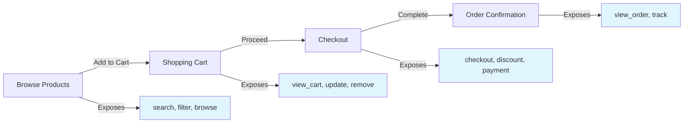
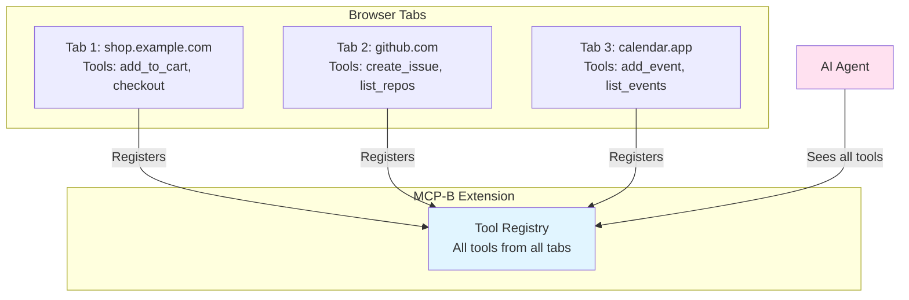
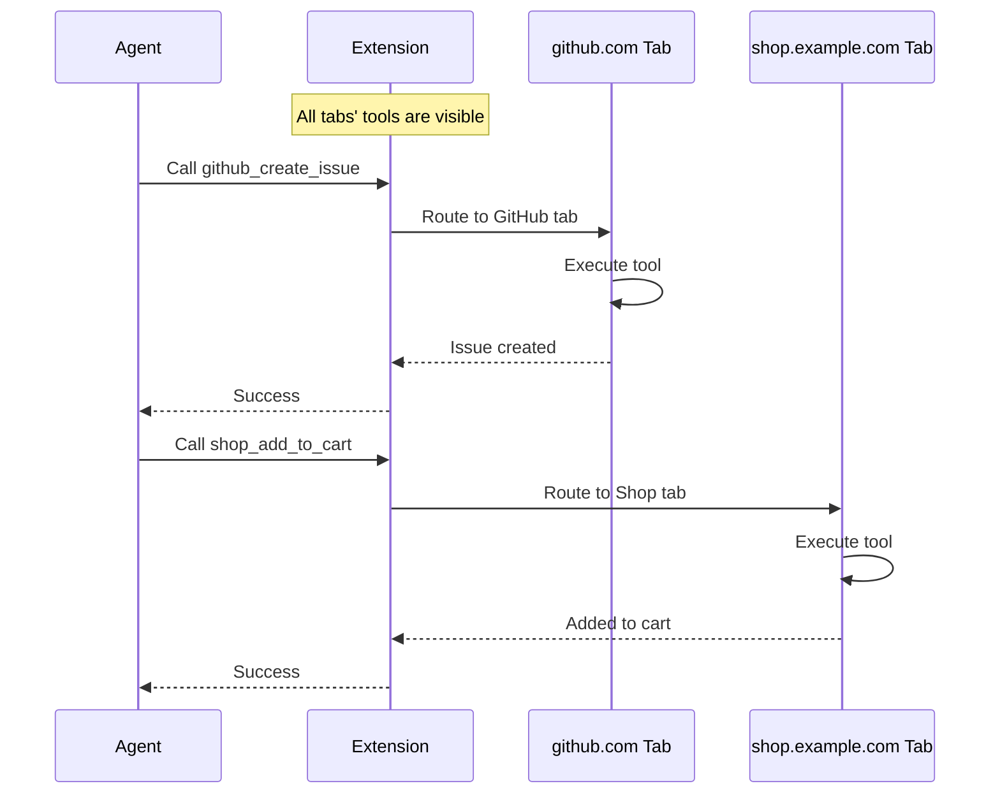
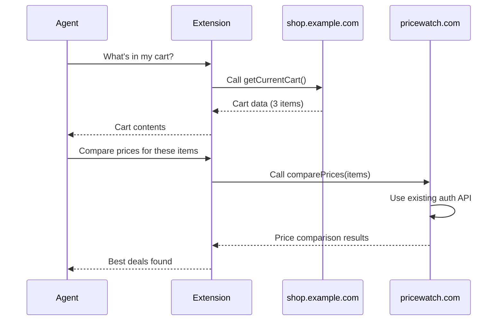
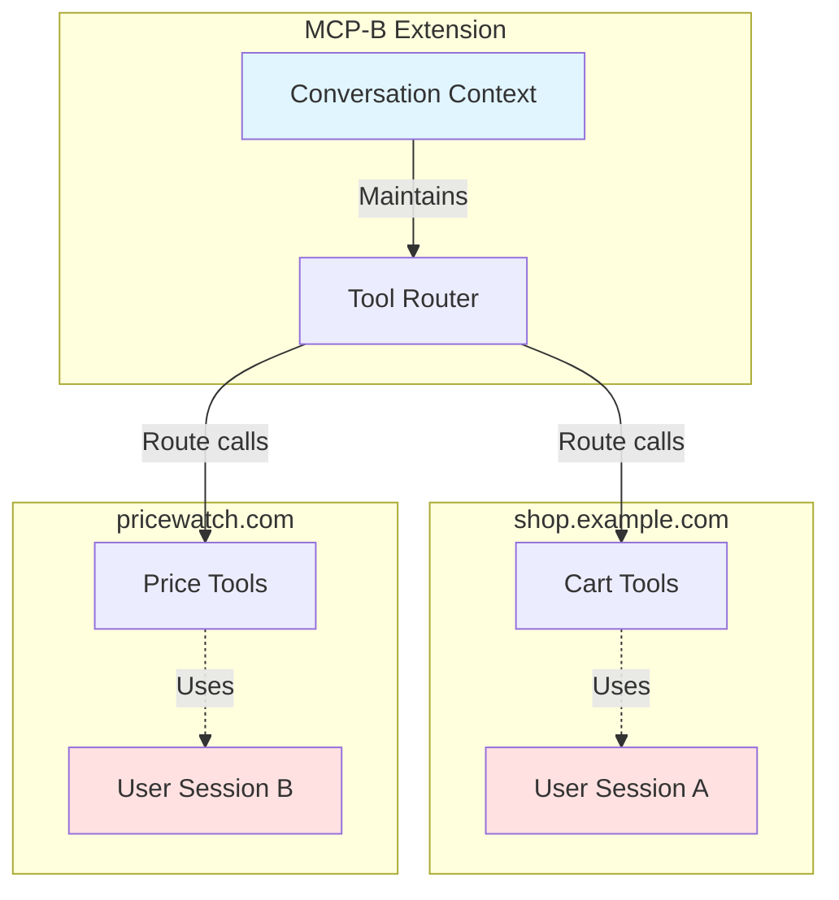

## Dynamic Tool Registration

### Conditional Tools Based on User State

Register tools based on authentication, permissions, or user roles:

```tsx
import { useWebMCP } from '@mcp-b/react-webmcp';
import { useAuth } from './auth';
import { z } from 'zod';

function AdminPanel() {
  const { user } = useAuth();

  // Only register admin tools if user is admin
  useWebMCP({
    name: 'delete_user',
    description: 'Delete a user account (admin only)',
    inputSchema: {
      userId: z.string().uuid()
    },
    handler: async ({ userId }) => {
      if (!user?.isAdmin) {
        throw new Error('Unauthorized');
      }
      await api.users.delete(userId);
      return { success: true };
    },
    // Only register if user is admin
    enabled: user?.isAdmin
  });

  return <div>Admin Panel</div>;
}
```

### Page-Specific Tools

Register different tools based on the current route:

```tsx
import { useWebMCP } from '@mcp-b/react-webmcp';
import { useLocation } from 'react-router-dom';
import { z } from 'zod';

function ProductPage({ productId }) {
  // Product-specific tools only available on this page
  useWebMCP({
    name: 'add_to_cart',
    description: 'Add this product to cart',
    inputSchema: {
      quantity: z.number().min(1).default(1)
    },
    handler: async ({ quantity }) => {
      await addToCart(productId, quantity);
      return { success: true, productId, quantity };
    }
  });

  useWebMCP({
    name: 'get_product_details',
    description: 'Get current product information',
    handler: async () => {
      const product = await fetchProduct(productId);
      return product;
    }
  });

  return <div>Product Page</div>;
}
```

### Component Lifecycle Tool Scoping

Tools tied to React component lifecycle automatically register when mounted and unregister when unmounted:

```tsx
import { useWebMCP } from '@mcp-b/react-webmcp';
import { useEffect } from 'react';
import { z } from 'zod';

function ShoppingCartTools({ cartId, items }) {
  // These tools exist only while this component is mounted
  useWebMCP({
    name: 'add_to_cart',
    description: 'Add an item to the shopping cart',
    inputSchema: {
      productId: z.string(),
      quantity: z.number().min(1)
    },
    handler: async ({ productId, quantity }) => {
      await cartService.addItem(cartId, productId, quantity);
      return { success: true, message: `Added ${quantity} of ${productId} to cart` };
    }
  });

  useWebMCP({
    name: 'remove_from_cart',
    description: 'Remove an item from the shopping cart',
    inputSchema: {
      itemId: z.string()
    },
    handler: async ({ itemId }) => {
      await cartService.removeItem(cartId, itemId);
      return { success: true, message: `Removed item ${itemId} from cart` };
    }
  });

  // Conditionally register checkout tool only if cart has items
  useWebMCP({
    name: 'checkout',
    description: 'Proceed to checkout with current cart items',
    inputSchema: {
      paymentMethod: z.enum(['credit', 'debit', 'paypal'])
    },
    handler: async ({ paymentMethod }) => {
      const order = await checkoutService.processCart(cartId, paymentMethod);
      return { success: true, orderId: order.id };
    },
    enabled: items.length > 0 // Only available when cart has items
  });

  return null; // No UI needed, just tool registration
}

// Usage in your app
function EcommerceApp() {
  const { cart } = useAppState();

  return (
    <Routes>
      <Route path="/cart" element={
        <>
          <CartPage />
          <ShoppingCartTools cartId={cart.id} items={cart.items} />
        </>
      } />
      <Route path="/product/:id" element={<ProductPage />} />
    </Routes>
  );
}
```

This pattern creates a **UI for LLMs** similar to how websites guide human users - instead of showing all tools at once, you progressively reveal capabilities based on context.

## Context Engineering Patterns

Context engineering is the practice of giving AI models only the tools and information relevant to their current task. Just as good UI design doesn't overwhelm users with every possible option, good WebMCP design limits tool availability based on context.

<Info>
**The principle**: If you give a model 100 tools when only 5 are relevant, performance suffers. Think of it like giving someone an entire Home Depot when they just need a saw, hammer, and nails.
</Info>

### URL-Based Tool Scoping

Expose different tools based on the current URL path:

```tsx
import { useWebMCP } from '@mcp-b/react-webmcp';
import { useLocation } from 'react-router-dom';
import { z } from 'zod';

function ToolProvider() {
  const { pathname } = useLocation();

  // Home page tools
  if (pathname === '/') {
    useWebMCP({
      name: 'search_products',
      description: 'Search for products in the catalog',
      inputSchema: {
        query: z.string(),
        category: z.string().optional()
      },
      handler: async ({ query, category }) => {
        return await searchAPI.search({ query, category });
      }
    });
  }

  // Product detail page tools
  if (pathname.startsWith('/product/')) {
    const productId = pathname.split('/')[2];

    useWebMCP({
      name: 'get_product_details',
      description: 'Get detailed information about the current product',
      handler: async () => {
        return await productAPI.getDetails(productId);
      }
    });

    useWebMCP({
      name: 'add_to_cart',
      description: 'Add the current product to cart',
      inputSchema: {
        quantity: z.number().min(1).default(1)
      },
      handler: async ({ quantity }) => {
        return await cartAPI.add(productId, quantity);
      }
    });
  }

  // Checkout page tools
  if (pathname === '/checkout') {
    useWebMCP({
      name: 'apply_discount',
      description: 'Apply a discount code to the order',
      inputSchema: {
        code: z.string()
      },
      handler: async ({ code }) => {
        return await checkoutAPI.applyDiscount(code);
      }
    });

    useWebMCP({
      name: 'complete_checkout',
      description: 'Complete the checkout process',
      inputSchema: {
        paymentMethod: z.enum(['credit', 'debit', 'paypal'])
      },
      handler: async ({ paymentMethod }) => {
        return await checkoutAPI.complete(paymentMethod);
      }
    });
  }

  return null;
}
```

### Progressive Tool Disclosure

Reveal tools as the user progresses through a workflow:



Each stage only shows tools relevant to that step, reducing cognitive load on the AI model.

### Role-Based Tool Exposure

Different tools for different user roles:

```tsx
function RoleBasedTools({ user }) {
  // Customer tools (available to everyone)
  useWebMCP({
    name: 'view_products',
    description: 'View product catalog',
    handler: async () => await productAPI.list()
  });

  // Moderator tools
  if (user?.role === 'moderator' || user?.role === 'admin') {
    useWebMCP({
      name: 'hide_comment',
      description: 'Hide inappropriate comments',
      inputSchema: {
        commentId: z.string()
      },
      handler: async ({ commentId }) => {
        return await moderationAPI.hideComment(commentId);
      }
    });
  }

  // Admin-only tools
  if (user?.role === 'admin') {
    useWebMCP({
      name: 'delete_user',
      description: 'Permanently delete a user account',
      inputSchema: {
        userId: z.string()
      },
      handler: async ({ userId }) => {
        return await adminAPI.deleteUser(userId);
      }
    });

    useWebMCP({
      name: 'update_product_price',
      description: 'Update product pricing',
      inputSchema: {
        productId: z.string(),
        newPrice: z.number().positive()
      },
      handler: async ({ productId, newPrice }) => {
        return await adminAPI.updatePrice(productId, newPrice);
      }
    });
  }

  return null;
}
```

### Feature Flag-Based Tools

Control tool availability with feature flags:

```tsx
import { useFeatureFlag } from './feature-flags';

function FeatureGatedTools() {
  const hasAIRecommendations = useFeatureFlag('ai-recommendations');
  const hasBetaCheckout = useFeatureFlag('beta-checkout');

  useWebMCP({
    name: 'get_ai_recommendations',
    description: 'Get AI-powered product recommendations',
    handler: async () => {
      return await recommendationAPI.get();
    },
    enabled: hasAIRecommendations
  });

  useWebMCP({
    name: 'beta_one_click_checkout',
    description: 'Complete purchase with one click (beta)',
    handler: async () => {
      return await betaCheckoutAPI.oneClick();
    },
    enabled: hasBetaCheckout
  });

  return null;
}
```

## State Synchronization

### React State Integration

Sync tools with React state for real-time updates:

```tsx
import { useWebMCP } from '@mcp-b/react-webmcp';
import { useState } from 'react';
import { z } from 'zod';

function ShoppingCart() {
  const [items, setItems] = useState([]);
  const [total, setTotal] = useState(0);

  useWebMCP({
    name: 'view_cart',
    description: 'View shopping cart contents',
    handler: async () => {
      return {
        items,
        total,
        itemCount: items.length
      };
    }
  });

  useWebMCP({
    name: 'update_quantity',
    description: 'Update item quantity in cart',
    inputSchema: {
      itemId: z.string(),
      quantity: z.number().min(0)
    },
    handler: async ({ itemId, quantity }) => {
      setItems(prev => {
        if (quantity === 0) {
          return prev.filter(item => item.id !== itemId);
        }
        return prev.map(item =>
          item.id === itemId ? { ...item, quantity } : item
        );
      });
      recalculateTotal();
      return { success: true };
    }
  });

  return <div>Cart UI</div>;
}
```

### Context API Integration

Share tools across component tree:

```tsx
import { createContext, useContext } from 'react';
import { useWebMCP } from '@mcp-b/react-webmcp';

const AppContext = createContext(null);

function AppProvider({ children }) {
  const [state, setState] = useState({});

  useWebMCP({
    name: 'get_app_state',
    description: 'Get current application state',
    handler: async () => {
      return state;
    }
  });

  useWebMCP({
    name: 'update_settings',
    description: 'Update application settings',
    inputSchema: {
      theme: z.enum(['light', 'dark']).optional(),
      language: z.string().optional()
    },
    handler: async (settings) => {
      setState(prev => ({ ...prev, ...settings }));
      return { success: true, settings };
    }
  });

  return (
    <AppContext.Provider value={{ state, setState }}>
      {children}
    </AppContext.Provider>
  );
}
```

## Advanced Validation

### Complex Input Validation

Use Zod for sophisticated validation:

```tsx
import { z } from 'zod';

useWebMCP({
  name: 'create_event',
  description: 'Create a new calendar event',
  inputSchema: {
    title: z.string().min(1).max(100),
    startDate: z.string().datetime(),
    endDate: z.string().datetime(),
    attendees: z.array(z.string().email()).min(1).max(50),
    location: z.string().optional(),
    recurrence: z.object({
      frequency: z.enum(['daily', 'weekly', 'monthly']),
      interval: z.number().min(1).max(365),
      endDate: z.string().datetime().optional()
    }).optional()
  },
  handler: async (event) => {
    // Input is fully validated and typed
    const created = await api.events.create(event);
    return created;
  }
});
```

### Custom Validation Logic

Add business logic validation:

```tsx
useWebMCP({
  name: 'transfer_funds',
  description: 'Transfer funds between accounts',
  inputSchema: {
    fromAccount: z.string(),
    toAccount: z.string(),
    amount: z.number().positive()
  },
  handler: async ({ fromAccount, toAccount, amount }) => {
    // Additional validation beyond schema
    const balance = await getAccountBalance(fromAccount);
    if (balance < amount) {
      throw new Error(`Insufficient funds. Balance: $${balance}`);
    }

    if (fromAccount === toAccount) {
      throw new Error('Cannot transfer to the same account');
    }

    await api.transfer({ fromAccount, toAccount, amount });
    return {
      success: true,
      newBalance: balance - amount
    };
  }
});
```

## Error Handling

### Custom Error Responses

```tsx
useWebMCP({
  name: 'process_order',
  description: 'Process a customer order',
  inputSchema: {
    orderId: z.string()
  },
  handler: async ({ orderId }) => {
    try {
      const order = await api.orders.process(orderId);
      return { success: true, order };
    } catch (error) {
      if (error.code === 'PAYMENT_FAILED') {
        return {
          success: false,
          error: 'Payment failed. Please check your payment method.'
        };
      }
      if (error.code === 'OUT_OF_STOCK') {
        return {
          success: false,
          error: 'Some items are out of stock.'
        };
      }
      throw error; // Re-throw unexpected errors
    }
  },
  onError: (error, input) => {
    // Log errors for monitoring
    analytics.trackError('process_order_failed', {
      error: error.message,
      orderId: input.orderId
    });
  }
});
```

## Performance Optimization

### Debouncing and Throttling

```tsx
import { useMemo } from 'react';
import { debounce } from 'lodash-es';
import { z } from 'zod';

function SearchComponent() {
  const debouncedSearch = useMemo(
    () => debounce(async (query) => {
      return await api.search(query);
    }, 300),
    []
  );

  useWebMCP({
    name: 'search',
    description: 'Search the database',
    inputSchema: {
      query: z.string().min(2)
    },
    handler: async ({ query }) => {
      return await debouncedSearch(query);
    }
  });

  return <div>Search UI</div>;
}
```

### Caching Results

```tsx
import { useRef } from 'react';

function DataComponent() {
  const cache = useRef(new Map());

  useWebMCP({
    name: 'get_user_data',
    description: 'Get user data with caching',
    inputSchema: {
      userId: z.string(),
      skipCache: z.boolean().optional()
    },
    handler: async ({ userId, skipCache }) => {
      if (!skipCache && cache.current.has(userId)) {
        return {
          ...cache.current.get(userId),
          cached: true
        };
      }

      const data = await api.users.get(userId);
      cache.current.set(userId, data);

      // Clear cache after 5 minutes
      setTimeout(() => {
        cache.current.delete(userId);
      }, 5 * 60 * 1000);

      return { ...data, cached: false };
    }
  });

  return <div>User Data</div>;
}
```

## Multi-Tab Tool Collection

The MCP-B Extension collects and maintains tools from **all open tabs simultaneously**, making them available to agents regardless of which tab is currently active.

<Info>
**Key behavior**: Unlike traditional tab-scoped approaches, the extension aggregates tools from every open tab, giving agents access to your entire browsing context at once.
</Info>

### How Tool Collection Works

When you have multiple tabs open with WebMCP servers:



### Tool Routing

When an agent calls a tool:

<Steps>
  <Step title="Agent requests tool">
    Agent calls a tool (e.g., `github_com_create_issue`)
  </Step>

  <Step title="Extension identifies source">
    Extension determines which tab owns that tool
  </Step>

  <Step title="Extension routes call">
    If the tab is open, the tool is executed immediately. If the tab was closed, the extension may need to reopen it.
  </Step>

  <Step title="Results returned">
    Tool execution results are returned to the agent
  </Step>
</Steps>



### Design Implications

Since all tools from all tabs are visible to the agent:

<AccordionGroup>
  <Accordion title="Tool Naming Matters">
    Use descriptive, namespaced tool names to avoid confusion:

    ```tsx
    // Good - clear which site/feature
    useWebMCP({
      name: 'github_create_issue',
      description: 'Create a new GitHub issue',
      // ...
    });

    // Avoid - ambiguous
    useWebMCP({
      name: 'create',
      description: 'Create something',
      // ...
    });
    ```
  </Accordion>

  <Accordion title="Context in Descriptions">
    Since agents see all tools at once, make descriptions specific:

    ```tsx
    // Good - describes what and where
    useWebMCP({
      name: 'add_to_cart',
      description: 'Add the currently viewed product from shop.example.com to your shopping cart',
      // ...
    });

    // Avoid - lacks context
    useWebMCP({
      name: 'add_to_cart',
      description: 'Add item to cart',
      // ...
    });
    ```
  </Accordion>

  <Accordion title="Tool Availability">
    Tools appear and disappear as you open/close tabs:

    ```tsx
    // This tool is available whenever the product page tab is open
    function ProductPage() {
      useWebMCP({
        name: 'get_current_product',
        description: 'Get details about the currently viewed product',
        handler: async () => {
          return await fetchProductDetails(productId);
        }
      });

      return <div>Product Details</div>;
    }

    // When user closes this tab, get_current_product disappears from the toolkit
    ```
  </Accordion>

  <Accordion title="Cross-Tab Workflows">
    Agents can naturally compose tools from different tabs:

    ```tsx
    // Tab 1: Calendar app
    useWebMCP({
      name: 'calendar_add_event',
      description: 'Add event to calendar',
      inputSchema: {
        title: z.string(),
        date: z.string().datetime()
      },
      handler: async ({ title, date }) => {
        return await calendar.addEvent({ title, date });
      }
    });

    // Tab 2: Email app
    useWebMCP({
      name: 'email_get_unread',
      description: 'Get unread emails',
      handler: async () => {
        return await email.getUnread();
      }
    });

    // Agent can: "Get my unread emails and add any meeting invites to my calendar"
    // It sees and can use tools from both tabs
    ```
  </Accordion>
</AccordionGroup>

### Managing Tool Overload

When many tabs are open, agents see many tools. Use context engineering patterns to help:

```tsx
// Add metadata to help agents understand when to use tools
useWebMCP({
  name: 'shop_checkout',
  description: 'Complete checkout on shop.example.com. Only use this after items have been added to cart and user has confirmed.',
  handler: async () => {
    return await processCheckout();
  }
});

// Or conditionally register tools based on state
function CartPage() {
  const { items } = useCart();

  // Only show checkout tool when cart has items
  useWebMCP({
    name: 'shop_checkout',
    description: 'Complete the checkout process',
    handler: async () => {
      return await processCheckout();
    },
    enabled: items.length > 0
  });

  return <div>Cart</div>;
}
```

<Tip>
See [Context Engineering Patterns](#context-engineering-patterns) for more strategies to limit tool availability based on application state.
</Tip>

## Multi-Step Workflows

### Stateful Multi-Step Operations

```tsx
function CheckoutFlow() {
  const [checkoutState, setCheckoutState] = useState({
    step: 'cart',
    cart: [],
    shipping: null,
    payment: null
  });

  useWebMCP({
    name: 'checkout_next_step',
    description: 'Proceed to next checkout step',
    inputSchema: {
      data: z.record(z.any())
    },
    handler: async ({ data }) => {
      const { step } = checkoutState;

      if (step === 'cart') {
        setCheckoutState(prev => ({
          ...prev,
          step: 'shipping',
          shipping: data
        }));
        return { nextStep: 'shipping' };
      }

      if (step === 'shipping') {
        setCheckoutState(prev => ({
          ...prev,
          step: 'payment',
          payment: data
        }));
        return { nextStep: 'payment' };
      }

      if (step === 'payment') {
        const order = await processOrder(checkoutState);
        setCheckoutState({ step: 'complete', orderId: order.id });
        return { complete: true, orderId: order.id };
      }
    }
  });

  useWebMCP({
    name: 'get_checkout_state',
    description: 'Get current checkout progress',
    handler: async () => checkoutState
  });

  return <div>Checkout Flow</div>;
}
```

## Cross-Site Tool Composition

One of the most powerful features of the MCP-B Extension is the ability to compose tools from different websites. Tools from one site can use data from another site, enabling complex multi-site workflows.

<Info>
**Key advantage**: Each site exposes its existing functionality as MCP tools, and the extension handles routing calls between them. The user maintains separate authentication contexts for each site.
</Info>

### How Cross-Site Calls Work



### Example: Shopping Cart + Price Comparison

**Site A (shop.example.com)** exposes cart state:

```tsx
import { useWebMCP } from '@mcp-b/react-webmcp';
import { useCartContext } from './cart';

function CartTools() {
  const { cart } = useCartContext();

  useWebMCP({
    name: 'get_current_cart',
    description: 'Get current shopping cart contents',
    handler: async () => {
      return {
        items: cart.items.map(item => ({
          name: item.name,
          price: item.price,
          quantity: item.quantity,
          sku: item.sku
        })),
        total: cart.total,
        itemCount: cart.items.length
      };
    }
  });

  return null;
}
```

**Site B (pricewatch.com)** wraps its existing authenticated API:

```tsx
import { useWebMCP } from '@mcp-b/react-webmcp';
import { z } from 'zod';

function PriceComparisonTools() {
  useWebMCP({
    name: 'compare_prices',
    description: 'Search for product prices across retailers',
    inputSchema: {
      productName: z.string().describe('Product name to search for'),
      sku: z.string().optional().describe('Product SKU for exact matching')
    },
    handler: async ({ productName, sku }) => {
      // Uses the site's existing API with user's current session
      // No additional auth needed - cookies/headers already set
      const response = await fetch('/api/products/search', {
        method: 'POST',
        headers: { 'Content-Type': 'application/json' },
        credentials: 'same-origin', // Uses existing session cookies
        body: JSON.stringify({
          query: productName,
          sku: sku,
          includeShipping: true
        })
      });

      const results = await response.json();

      return {
        bestPrice: results.prices[0],
        averagePrice: results.average,
        retailers: results.retailers.slice(0, 5)
      };
    }
  });

  return null;
}
```

### Multi-Site Workflow

When the AI agent wants to compare prices for cart items:

<Steps>
  <Step title="Get cart data">
    Extension calls `shop_example_com_get_current_cart` on the shopping site tab
  </Step>

  <Step title="Agent processes data">
    Model receives cart data and decides to check prices
  </Step>

  <Step title="Route to price site">
    Agent calls `pricewatch_com_compare_prices`. Extension detects this tool belongs to a different domain
  </Step>

  <Step title="Open price site">
    Extension opens pricewatch.com in a new tab (or switches if already open)
  </Step>

  <Step title="Wait for tools">
    Extension waits for MCP server to initialize on that tab
  </Step>

  <Step title="Execute tool">
    Extension executes the tool call with product data from step 1
  </Step>

  <Step title="Return results">
    Results are returned to the agent's context
  </Step>
</Steps>

### Authentication Context Preservation

The key insight is that `fetch('/api/products/search')` uses whatever authentication the user already has with pricewatch.com:

- Session cookies
- Authorization headers
- Any other browser-managed auth

The MCP tool is just a thin wrapper around the site's existing API endpoints. The extension manages tab navigation and maintains conversation context across sites, while each site's tools operate with their own authentication context.



### Example: Content Aggregation

Combine content from multiple sources:

**News Site A:**
```tsx
useWebMCP({
  name: 'get_top_stories',
  description: 'Get today\'s top news stories',
  handler: async () => {
    const response = await fetch('/api/stories/top');
    const stories = await response.json();
    return { stories: stories.slice(0, 10) };
  }
});
```

**Social Site B:**
```tsx
useWebMCP({
  name: 'post_to_feed',
  description: 'Post content to user\'s social feed',
  inputSchema: {
    title: z.string(),
    url: z.string().url(),
    description: z.string()
  },
  handler: async ({ title, url, description }) => {
    const response = await fetch('/api/posts', {
      method: 'POST',
      credentials: 'same-origin',
      body: JSON.stringify({ title, url, description })
    });
    return await response.json();
  }
});
```

**Agent workflow:**
1. Call `newssite_get_top_stories` to fetch articles
2. User selects interesting stories
3. Call `socialsite_post_to_feed` for each story to share

### Best Practices for Cross-Site Tools

<AccordionGroup>
  <Accordion title="Use descriptive tool names">
    Include the site domain or purpose in tool names to avoid collisions:

    ```tsx
    // Good
    name: 'github_create_issue'
    name: 'jira_create_ticket'

    // Avoid
    name: 'create_issue' // Which site?
    ```
  </Accordion>

  <Accordion title="Return structured data">
    Make it easy for tools on other sites to consume your data:

    ```tsx
    // Good - structured, predictable
    return {
      items: [...],
      total: 99.99,
      currency: 'USD'
    };

    // Avoid - unstructured text
    return "You have 3 items totaling $99.99";
    ```
  </Accordion>

  <Accordion title="Keep tools focused">
    Each tool should do one thing well, making them easier to compose:

    ```tsx
    // Good - focused tools
    useWebMCP({ name: 'get_cart', ... });
    useWebMCP({ name: 'add_to_cart', ... });
    useWebMCP({ name: 'checkout', ... });

    // Avoid - one tool that does everything
    useWebMCP({ name: 'cart_manager', ... });
    ```
  </Accordion>

  <Accordion title="Document data formats">
    Use clear descriptions and schemas so other sites know what to expect:

    ```tsx
    useWebMCP({
      name: 'get_cart',
      description: 'Get cart contents. Returns {items: Array<{name, price, sku, quantity}>, total: number}',
      handler: async () => { ... }
    });
    ```
  </Accordion>
</AccordionGroup>

### Security Considerations

<Warning>
When building tools that will be composed with other sites:
- Never expose sensitive data in tool responses
- Validate all inputs from external sources
- Don't trust data from other sites without validation
- Be aware that AI may pass data between sites
- Review [security best practices](/security) for multi-site scenarios
</Warning>

## Read-Only Context Tools

### Exposing Application State

```tsx
import { useWebMCPContext } from '@mcp-b/react-webmcp';

function AppLayout() {
  const { pathname } = useLocation();
  const { user } = useAuth();

  // Lightweight read-only context
  useWebMCPContext(
    'context_current_route',
    'Get the current page route and user info',
    () => ({
      path: pathname,
      user: user ? {
        id: user.id,
        name: user.name,
        role: user.role
      } : null,
      timestamp: new Date().toISOString()
    })
  );

  return <div>App Layout</div>;
}
```

## Security Best Practices

### Input Sanitization

```tsx
import DOMPurify from 'dompurify';

useWebMCP({
  name: 'post_comment',
  description: 'Post a comment',
  inputSchema: {
    text: z.string().max(1000),
    postId: z.string().uuid()
  },
  handler: async ({ text, postId }) => {
    // Sanitize HTML content
    const sanitized = DOMPurify.sanitize(text);

    await api.comments.create({
      text: sanitized,
      postId
    });

    return { success: true };
  }
});
```

### Rate Limiting

```tsx
import { useRef } from 'react';

function RateLimitedComponent() {
  const callCount = useRef(new Map());

  const checkRateLimit = (key: string, maxCalls = 10, windowMs = 60000) => {
    const now = Date.now();
    const calls = callCount.current.get(key) || [];
    const recentCalls = calls.filter(time => now - time < windowMs);

    if (recentCalls.length >= maxCalls) {
      throw new Error(`Rate limit exceeded. Try again in ${Math.ceil((windowMs - (now - recentCalls[0])) / 1000)}s`);
    }

    recentCalls.push(now);
    callCount.current.set(key, recentCalls);
  };

  useWebMCP({
    name: 'send_message',
    description: 'Send a message',
    inputSchema: {
      to: z.string(),
      message: z.string()
    },
    handler: async ({ to, message }) => {
      checkRateLimit('send_message', 5, 60000); // 5 per minute

      await api.messages.send({ to, message });
      return { success: true };
    }
  });

  return <div>Messaging</div>;
}
```

## Next Steps

<CardGroup cols={2}>
  <Card
    title="Package Documentation"
    icon="npm"
    href="/packages/global"
  >
    Deep dive into package APIs
  </Card>

  <Card
    title="Examples"
    icon="code"
    href="/examples"
  >
    See complete working examples
  </Card>

  <Card
    title="Troubleshooting"
    icon="wrench"
    href="/troubleshooting"
  >
    Common issues and solutions
  </Card>

  <Card
    title="Discord Community"
    icon="discord"
    href="https://discord.gg/ZnHG4csJRB"
  >
    Get help from the community
  </Card>
</CardGroup>
