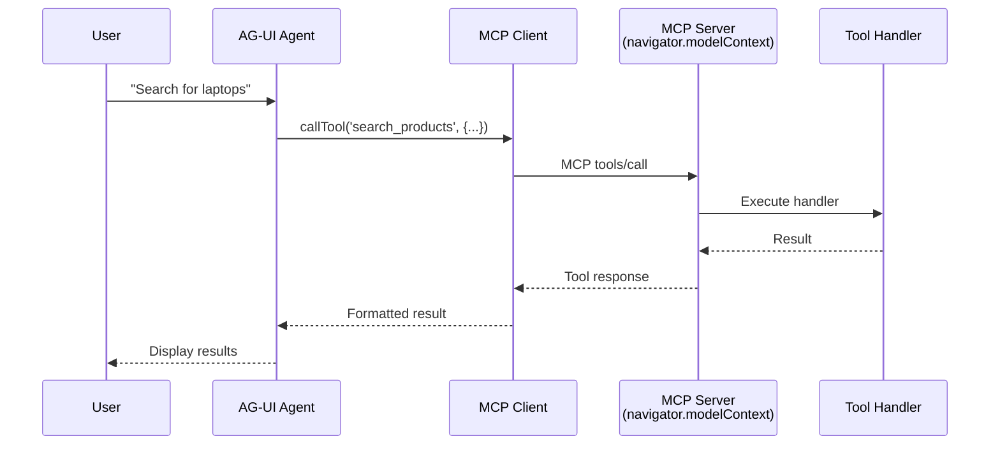

## Overview

[AG-UI](https://docs.ag-ui.com/concepts/tools#frontend-defined-tools) is an agentic UI framework that supports frontend-defined tools, making it a natural fit for WebMCP integration.

This guide shows how to expose your WebMCP tools to an AG-UI agent so it can interact with your website.

## Prerequisites

<Steps>
  <Step title="Complete basic setup">
    Follow the [Setup Guide](/ai-frameworks/setup) to install packages and understand the architecture
  </Step>

  <Step title="Install all required packages">
    ```bash
    npm install @mcp-b/global @mcp-b/react-webmcp @mcp-b/transports @modelcontextprotocol/sdk @ag-ui/core zod
    ```
  </Step>

  <Step title="Have AG-UI configured">
    Ensure you have AG-UI set up in your application
  </Step>
</Steps>

## How It Works



1. **WebMCP server** runs on your page (via `@mcp-b/global`)
2. **useWebMCP** registers tools with the server
3. **MCP client** discovers tools from the server
4. **AG-UI agent** receives tools and can call them

## Integration Example

### Step 1: Set Up the MCP Client Provider

First, initialize the polyfill and create the MCP client:

```tsx "main.tsx" icon="react"
import '@mcp-b/global'; // Initialize navigator.modelContext and MCP server
```

```tsx "App.tsx" icon="react"
import { McpClientProvider } from '@mcp-b/react-webmcp';
import { Client } from '@modelcontextprotocol/sdk/client/index.js';
import { TabClientTransport } from '@mcp-b/transports';

// Create MCP client and transport ONCE, outside components
const mcpClient = new Client(
  { name: 'AGUIApp', version: '1.0.0' },
  { capabilities: {} }
);

const transport = new TabClientTransport({
  targetOrigin: window.location.origin,
  channelId: 'mcp-default'
});

export function App() {
  return (
    <McpClientProvider client={mcpClient} transport={transport}>
      <ToolRegistration />
      <ShoppingAssistant />
    </McpClientProvider>
  );
}
```

### Step 2: Register Your Tools

Create a component that registers tools with WebMCP:

```tsx "ToolRegistration.tsx" icon="react"
import { useWebMCP } from '@mcp-b/react-webmcp';
import { z } from 'zod';

export function ToolRegistration() {
  useWebMCP({
    name: 'search_products',
    description: 'Search for products in the catalog',
    inputSchema: {
      query: z.string().describe('Search query'),
      category: z.string().optional().describe('Filter by category'),
      limit: z.number().min(1).max(50).default(10).describe('Max results')
    },
    handler: async (input) => {
      const results = await searchProducts(input.query, {
        category: input.category,
        limit: input.limit
      });
      return {
        results,
        count: results.length,
        query: input.query
      };
    }
  });

  useWebMCP({
    name: 'add_to_cart',
    description: 'Add a product to the shopping cart',
    inputSchema: {
      productId: z.string().describe('Product ID to add'),
      quantity: z.number().min(1).default(1).describe('Quantity')
    },
    handler: async (input) => {
      const result = await addToCart(input.productId, input.quantity);
      return {
        success: true,
        message: `Added ${input.quantity}x ${result.productName} to cart`,
        cartTotal: result.cartTotal
      };
    }
  });

  useWebMCP({
    name: 'view_cart',
    description: 'View the current shopping cart contents',
    inputSchema: {},
    handler: async () => {
      const cart = await getCart();
      return {
        items: cart.items,
        itemCount: cart.items.length,
        total: cart.total
      };
    }
  });

  return null;
}
```

### Step 3: Create the AG-UI Agent

Use the MCP client to create an AG-UI agent with your tools:

```tsx "ShoppingAssistant.tsx" icon="react"
import { useMemo } from 'react';
import { useMcpClient } from '@mcp-b/react-webmcp';
import { createAgent } from '@ag-ui/core';

export function ShoppingAssistant() {
  const { client, tools, isConnected, isLoading, error } = useMcpClient();

  // Create agent with MCP tools
  const agent = useMemo(() => {
    if (!isConnected || tools.length === 0) return null;

    return createAgent({
      name: 'ShoppingAssistant',
      description: 'Helps users browse products and manage their cart',
      tools: tools.map(mcpTool => ({
        name: mcpTool.name,
        description: mcpTool.description,
        parameters: mcpTool.inputSchema,
        execute: async (args: Record<string, unknown>) => {
          const result = await client.callTool({
            name: mcpTool.name,
            arguments: args
          });

          // Extract text content from MCP response
          return result.content
            .filter((c): c is { type: 'text'; text: string } => c.type === 'text')
            .map(c => c.text)
            .join('\n');
        }
      }))
    });
  }, [client, tools, isConnected]);

  if (isLoading) return <div>Connecting to tools...</div>;
  if (error) return <div>Error: {error.message}</div>;
  if (!isConnected) return <div>Not connected</div>;
  if (!agent) return <div>Setting up agent...</div>;

  return (
    <div>
      <h1>Shopping Assistant</h1>
      <p>Agent ready with {tools.length} tools</p>
      {/* Your AG-UI chat interface here */}
    </div>
  );
}
```

## Complete Working Example

Here's everything put together:

```tsx "App.tsx" icon="react" lines
import '@mcp-b/global';
import { useMemo, useState } from 'react';
import { McpClientProvider, useMcpClient, useWebMCP } from '@mcp-b/react-webmcp';
import { Client } from '@modelcontextprotocol/sdk/client/index.js';
import { TabClientTransport } from '@mcp-b/transports';
import { createAgent } from '@ag-ui/core';
import { z } from 'zod';

// Create MCP client and transport
const mcpClient = new Client(
  { name: 'ShoppingAGApp', version: '1.0.0' },
  { capabilities: {} }
);

const transport = new TabClientTransport({
  targetOrigin: window.location.origin,
  channelId: 'mcp-default'
});

// Main App
export function App() {
  return (
    <McpClientProvider client={mcpClient} transport={transport}>
      <ShoppingApp />
    </McpClientProvider>
  );
}

// Tool Registration Component
function ShoppingTools() {
  const [cart, setCart] = useState<Array<{ productId: string; quantity: number }>>([]);

  useWebMCP({
    name: 'add_to_cart',
    description: 'Add a product to the shopping cart',
    inputSchema: {
      productId: z.string().describe('Product ID'),
      quantity: z.number().min(1).default(1).describe('Quantity')
    },
    handler: async (input) => {
      const newCart = [...cart, { productId: input.productId, quantity: input.quantity }];
      setCart(newCart);
      return {
        success: true,
        itemCount: newCart.length,
        message: `Added ${input.quantity}x ${input.productId}`
      };
    }
  });

  useWebMCP({
    name: 'view_cart',
    description: 'View the shopping cart contents',
    inputSchema: {},
    handler: async () => ({
      items: cart,
      count: cart.length,
      total: cart.reduce((sum, item) => sum + item.quantity, 0)
    })
  });

  useWebMCP({
    name: 'clear_cart',
    description: 'Clear all items from the cart',
    inputSchema: {},
    handler: async () => {
      setCart([]);
      return { success: true, message: 'Cart cleared' };
    }
  });

  return (
    <div>
      <h3>Cart ({cart.length} items)</h3>
      <ul>
        {cart.map((item, i) => (
          <li key={i}>{item.quantity}x {item.productId}</li>
        ))}
      </ul>
    </div>
  );
}

// AG-UI Agent Component
function ShoppingApp() {
  const { client, tools, isConnected, isLoading, error } = useMcpClient();

  const agent = useMemo(() => {
    if (!isConnected || tools.length === 0) return null;

    return createAgent({
      name: 'ShoppingAssistant',
      description: 'Helps users shop and manage their cart',
      tools: tools.map(mcpTool => ({
        name: mcpTool.name,
        description: mcpTool.description,
        parameters: mcpTool.inputSchema,
        execute: async (args: Record<string, unknown>) => {
          const result = await client.callTool({
            name: mcpTool.name,
            arguments: args
          });

          return result.content
            .filter((c): c is { type: 'text'; text: string } => c.type === 'text')
            .map(c => c.text)
            .join('\n');
        }
      }))
    });
  }, [client, tools, isConnected]);

  if (isLoading) return <div>Connecting to tools...</div>;
  if (error) return <div>Error: {error.message}</div>;
  if (!isConnected) return <div>Not connected</div>;
  if (!agent) return <div>Setting up agent...</div>;

  return (
    <div>
      <ShoppingTools />
      <hr />
      <h1>Shopping Assistant</h1>
      <p>Available tools: {tools.map(t => t.name).join(', ')}</p>
      {/* Your AG-UI chat interface here */}
    </div>
  );
}
```

## Key Concepts

### Tool Mapping

MCP tools map directly to AG-UI's tool format:

```tsx
// MCP Tool format (from useMcpClient)
{
  name: 'search_products',
  description: 'Search for products',
  inputSchema: { type: 'object', properties: { ... } }
}

// AG-UI Tool format
{
  name: 'search_products',
  description: 'Search for products',
  parameters: { type: 'object', properties: { ... } },
  execute: async (args) => { /* call via MCP client */ }
}
```

### Agent Creation with useMemo

Use `useMemo` to create the agent only when tools or connection state changes:

```tsx
const agent = useMemo(() => {
  if (!isConnected || tools.length === 0) return null;

  return createAgent({
    name: 'MyAgent',
    tools: tools.map(mcpTool => ({
      name: mcpTool.name,
      description: mcpTool.description,
      parameters: mcpTool.inputSchema,
      execute: async (args) => {
        const result = await client.callTool({
          name: mcpTool.name,
          arguments: args
        });
        return formatResult(result);
      }
    }))
  });
}, [client, tools, isConnected]);
```

### Dynamic Tool Updates

When tools are registered or unregistered, the MCP server notifies connected clients. The `McpClientProvider` automatically refetches the tool list, which triggers `useMemo` to recreate the agent with updated tools.

## Resources

<CardGroup cols={2}>
  <Card title="AG-UI Docs" icon="book" href="https://docs.ag-ui.com/concepts/tools#frontend-defined-tools">
    Official AG-UI documentation
  </Card>

  <Card title="Best Practices" icon="stars" href="/ai-frameworks/best-practices">
    Learn optimization patterns
  </Card>

  <Card title="React Hooks" icon="react" href="/packages/react-webmcp">
    Complete React WebMCP API reference
  </Card>

  <Card title="Examples" icon="code" href="/examples">
    See complete working examples
  </Card>
</CardGroup>
