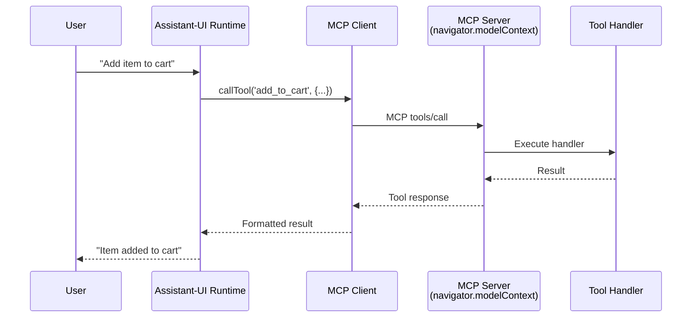

## Overview

[Assistant-UI](https://www.assistant-ui.com/docs/copilots/model-context) is a React framework for building AI assistants with built-in support for tool calling and Model Context Protocol.

This guide shows how to expose your WebMCP tools to an Assistant-UI runtime so your AI assistant can interact with your website.

## Prerequisites

<Steps>
  <Step title="Complete basic setup">
    Follow the [Setup Guide](/ai-frameworks/setup) to install packages and understand the architecture
  </Step>

  <Step title="Install all required packages">
    ```bash
    npm install @mcp-b/global @mcp-b/react-webmcp @mcp-b/transports @modelcontextprotocol/sdk @assistant-ui/react zod
    ```
  </Step>

  <Step title="Have Assistant-UI configured">
    Ensure you have an Assistant-UI runtime set up in your application
  </Step>
</Steps>

## How It Works



1. **WebMCP server** runs on your page (via `@mcp-b/global`)
2. **useWebMCP** registers tools with the server
3. **MCP client** discovers tools from the server
4. **Assistant-UI runtime** receives tools and can call them

## Integration Example

### Step 1: Set Up the MCP Client Provider

First, initialize the polyfill and create the MCP client:

```tsx "main.tsx" icon="react"
import '@mcp-b/global'; // Initialize navigator.modelContext and MCP server
```

```tsx "App.tsx" icon="react"
import { McpClientProvider } from '@mcp-b/react-webmcp';
import { Client } from '@modelcontextprotocol/sdk/client/index.js';
import { TabClientTransport } from '@mcp-b/transports';
import { AssistantRuntimeProvider } from '@assistant-ui/react';

// Create MCP client and transport ONCE, outside components
const mcpClient = new Client(
  { name: 'AssistantUIApp', version: '1.0.0' },
  { capabilities: {} }
);

const transport = new TabClientTransport({
  targetOrigin: window.location.origin,
  channelId: 'mcp-default'
});

export function App() {
  return (
    <McpClientProvider client={mcpClient} transport={transport}>
      <AssistantRuntimeProvider runtime={yourRuntime}>
        <ToolRegistration />
        <YourAssistantUI />
      </AssistantRuntimeProvider>
    </McpClientProvider>
  );
}
```

### Step 2: Register Your Tools

Create a component that registers tools with WebMCP:

```tsx "ToolRegistration.tsx" icon="react"
import { useWebMCP } from '@mcp-b/react-webmcp';
import { z } from 'zod';

export function ToolRegistration() {
  // Register tools that the AI can call
  useWebMCP({
    name: 'get_user_info',
    description: 'Get information about the current logged-in user',
    inputSchema: {},
    handler: async () => {
      const user = await getCurrentUser();
      return {
        name: user.name,
        email: user.email,
        role: user.role
      };
    }
  });

  useWebMCP({
    name: 'add_to_cart',
    description: 'Add a product to the shopping cart',
    inputSchema: {
      productId: z.string().describe('The product ID to add'),
      quantity: z.number().min(1).default(1).describe('Quantity to add')
    },
    handler: async (input) => {
      const result = await addToCart(input.productId, input.quantity);
      return {
        success: true,
        message: `Added ${input.quantity}x ${result.productName} to cart`,
        cartTotal: result.cartTotal
      };
    }
  });

  return null; // This component just registers tools
}
```

### Step 3: Bridge MCP Tools to Assistant-UI

Create a hook that converts MCP tools to Assistant-UI format:

```tsx "useWebMCPTools.ts" icon="react"
import { useEffect } from 'react';
import { useMcpClient } from '@mcp-b/react-webmcp';
import { tool, useAssistantRuntime } from '@assistant-ui/react';

export function useWebMCPTools() {
  const { client, tools, isConnected } = useMcpClient();
  const runtime = useAssistantRuntime();

  useEffect(() => {
    if (!isConnected || tools.length === 0) return;

    // Convert MCP tools to Assistant-UI tool format
    const assistantTools = Object.fromEntries(
      tools.map(mcpTool => [
        mcpTool.name,
        tool({
          description: mcpTool.description,
          parameters: mcpTool.inputSchema,
          execute: async (args) => {
            const result = await client.callTool({
              name: mcpTool.name,
              arguments: args
            });

            // Extract text content from MCP response
            return result.content
              .filter((c): c is { type: 'text'; text: string } => c.type === 'text')
              .map(c => c.text)
              .join('\n');
          }
        })
      ])
    );

    // Register tools with Assistant-UI runtime
    const unregister = runtime.registerModelContextProvider({
      getModelContext: () => ({
        tools: assistantTools
      })
    });

    return () => unregister();
  }, [client, tools, isConnected, runtime]);
}
```

### Step 4: Use the Hook in Your Assistant

```tsx "YourAssistantUI.tsx" icon="react"
import { useMcpClient } from '@mcp-b/react-webmcp';
import { Thread } from '@assistant-ui/react';
import { useWebMCPTools } from './useWebMCPTools';

export function YourAssistantUI() {
  const { isConnected, isLoading, tools } = useMcpClient();

  // Bridge MCP tools to Assistant-UI
  useWebMCPTools();

  if (isLoading) {
    return <div>Connecting to tools...</div>;
  }

  if (!isConnected) {
    return <div>Failed to connect to WebMCP</div>;
  }

  return (
    <div>
      <p>Connected with {tools.length} tools available</p>
      <Thread />
    </div>
  );
}
```

## Complete Working Example

Here's everything put together:

```tsx "App.tsx" icon="react" lines
import '@mcp-b/global';
import { useEffect, useState } from 'react';
import { McpClientProvider, useMcpClient, useWebMCP } from '@mcp-b/react-webmcp';
import { Client } from '@modelcontextprotocol/sdk/client/index.js';
import { TabClientTransport } from '@mcp-b/transports';
import {
  AssistantRuntimeProvider,
  useAssistantRuntime,
  tool,
  Thread
} from '@assistant-ui/react';
import { z } from 'zod';

// Create MCP client and transport
const mcpClient = new Client(
  { name: 'AssistantUIDemo', version: '1.0.0' },
  { capabilities: {} }
);

const transport = new TabClientTransport({
  targetOrigin: window.location.origin,
  channelId: 'mcp-default'
});

// Main App
export function App() {
  return (
    <McpClientProvider client={mcpClient} transport={transport}>
      <AssistantRuntimeProvider runtime={yourRuntime}>
        <AppContent />
      </AssistantRuntimeProvider>
    </McpClientProvider>
  );
}

// Tool Registration Component
function ToolRegistration() {
  const [counter, setCounter] = useState(0);

  useWebMCP({
    name: 'get_counter',
    description: 'Get the current counter value',
    inputSchema: {},
    handler: async () => ({ value: counter })
  });

  useWebMCP({
    name: 'increment_counter',
    description: 'Increment the counter by a specified amount',
    inputSchema: {
      amount: z.number().min(1).default(1).describe('Amount to increment by')
    },
    handler: async (input) => {
      const newValue = counter + input.amount;
      setCounter(newValue);
      return {
        previousValue: counter,
        newValue,
        message: `Counter incremented from ${counter} to ${newValue}`
      };
    }
  });

  return <div>Counter: {counter}</div>;
}

// Hook to bridge MCP tools to Assistant-UI
function useWebMCPTools() {
  const { client, tools, isConnected } = useMcpClient();
  const runtime = useAssistantRuntime();

  useEffect(() => {
    if (!isConnected || tools.length === 0) return;

    const assistantTools = Object.fromEntries(
      tools.map(mcpTool => [
        mcpTool.name,
        tool({
          description: mcpTool.description,
          parameters: mcpTool.inputSchema,
          execute: async (args) => {
            const result = await client.callTool({
              name: mcpTool.name,
              arguments: args
            });

            return result.content
              .filter((c): c is { type: 'text'; text: string } => c.type === 'text')
              .map(c => c.text)
              .join('\n');
          }
        })
      ])
    );

    const unregister = runtime.registerModelContextProvider({
      getModelContext: () => ({ tools: assistantTools })
    });

    return () => unregister();
  }, [client, tools, isConnected, runtime]);
}

// Main Content Component
function AppContent() {
  const { isConnected, isLoading, error, tools } = useMcpClient();

  // Bridge MCP tools to Assistant-UI
  useWebMCPTools();

  if (isLoading) return <div>Connecting to WebMCP...</div>;
  if (error) return <div>Error: {error.message}</div>;
  if (!isConnected) return <div>Not connected</div>;

  return (
    <div>
      <ToolRegistration />
      <hr />
      <p>Available tools: {tools.map(t => t.name).join(', ')}</p>
      <Thread />
    </div>
  );
}
```

## Key Concepts

### Tool Format Conversion

MCP tools use a specific format that needs to be converted to Assistant-UI's format:

```tsx
// MCP Tool format (from useMcpClient)
{
  name: 'add_to_cart',
  description: 'Add product to cart',
  inputSchema: { type: 'object', properties: { ... } }
}

// Assistant-UI Tool format
tool({
  description: 'Add product to cart',
  parameters: { type: 'object', properties: { ... } },
  execute: async (args) => { /* call via MCP client */ }
})
```

### Runtime Registration

Assistant-UI uses `registerModelContextProvider` to make tools available to the AI:

```tsx
runtime.registerModelContextProvider({
  getModelContext: () => ({
    tools: { /* tool name -> tool definition */ }
  })
});
```

This is called in a `useEffect` and returns an unregister function for cleanup.

### Dynamic Tool Updates

When tools are registered or unregistered (e.g., component mount/unmount), the MCP server sends a `tools/list_changed` notification. The `McpClientProvider` automatically refetches the tool list, triggering a re-render and updating Assistant-UI.

## Resources

<CardGroup cols={2}>
  <Card title="Assistant-UI Docs" icon="book" href="https://www.assistant-ui.com/docs/copilots/model-context">
    Official Assistant-UI documentation
  </Card>

  <Card title="Best Practices" icon="stars" href="/ai-frameworks/best-practices">
    Learn optimization patterns
  </Card>

  <Card title="React Hooks" icon="react" href="/packages/react-webmcp">
    Complete React WebMCP API reference
  </Card>

  <Card title="Examples" icon="code" href="/examples">
    See complete working examples
  </Card>
</CardGroup>
