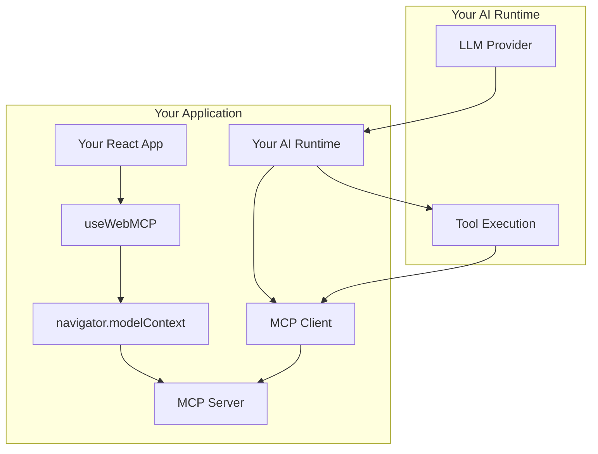

## Overview

This guide shows how to integrate WebMCP with any AI framework or build your own custom runtime. You'll learn the core patterns for discovering tools, calling them, and handling results.

## Prerequisites

<Steps>
  <Step title="Complete basic setup">
    Follow the [Setup Guide](/ai-frameworks/setup) to install packages and understand the architecture
  </Step>

  <Step title="Install required packages">
    ```bash
    npm install @mcp-b/global @mcp-b/react-webmcp @mcp-b/transports @modelcontextprotocol/sdk zod
    ```
  </Step>
</Steps>

## Architecture Overview



The key insight is that WebMCP uses the standard **Model Context Protocol**:

1. **Server side**: Your webpage runs an MCP server (via `@mcp-b/global`)
2. **Client side**: Your AI runtime connects via MCP client to discover and call tools

## Basic Integration Pattern

### Step 1: Set Up the MCP Server (Tool Provider)

```tsx "main.tsx" icon="react"
import '@mcp-b/global'; // Starts the MCP server
```

```tsx "ToolProvider.tsx" icon="react"
import { useWebMCP } from '@mcp-b/react-webmcp';
import { z } from 'zod';

export function ToolProvider() {
  useWebMCP({
    name: 'get_weather',
    description: 'Get current weather for a location',
    inputSchema: {
      location: z.string().describe('City name or coordinates')
    },
    handler: async (input) => {
      const weather = await fetchWeather(input.location);
      return {
        temperature: weather.temp,
        conditions: weather.conditions,
        humidity: weather.humidity
      };
    }
  });

  return null;
}
```

### Step 2: Create the MCP Client

```tsx "mcpClient.ts" icon="server"
import { Client } from '@modelcontextprotocol/sdk/client/index.js';
import { TabClientTransport } from '@mcp-b/transports';
import type { Tool } from '@modelcontextprotocol/sdk/types.js';

// Create transport targeting your page
const transport = new TabClientTransport({
  targetOrigin: window.location.origin,
  channelId: 'mcp-default'
});

// Create MCP client
export const mcpClient = new Client(
  { name: 'CustomRuntime', version: '1.0.0' },
  { capabilities: {} }
);

// Connection state
let isConnected = false;
let onToolsChanged: ((tools: Tool[]) => void) | null = null;

export async function connectMCP() {
  if (isConnected) return;

  await mcpClient.connect(transport);
  isConnected = true;

  // Listen for tool list changes
  mcpClient.setNotificationHandler(
    'notifications/tools/list_changed',
    async () => {
      console.log('Tools changed, refreshing...');
      const { tools } = await mcpClient.listTools();
      onToolsChanged?.(tools);
    }
  );
}

export function setToolsChangedHandler(handler: (tools: Tool[]) => void) {
  onToolsChanged = handler;
}

export async function listTools() {
  const { tools } = await mcpClient.listTools();
  return tools;
}

export async function callTool(name: string, args: Record<string, unknown>) {
  const result = await mcpClient.callTool({ name, arguments: args });
  return result;
}
```

### Step 3: Build Your Custom Runtime

```tsx "CustomAIRuntime.tsx" icon="react"
import { useEffect, useState, useCallback } from 'react';
import { connectMCP, listTools, callTool, setToolsChangedHandler } from './mcpClient';
import type { Tool } from '@modelcontextprotocol/sdk/types.js';

interface Message {
  role: 'user' | 'assistant';
  content: string;
}

export function CustomAIRuntime() {
  const [tools, setTools] = useState<Tool[]>([]);
  const [messages, setMessages] = useState<Message[]>([]);
  const [isConnected, setIsConnected] = useState(false);

  // Connect to MCP server on mount
  useEffect(() => {
    async function connect() {
      try {
        await connectMCP();
        const availableTools = await listTools();
        setTools(availableTools);
        setIsConnected(true);

        // Listen for tool changes
        setToolsChangedHandler((newTools) => {
          setTools(newTools);
        });
      } catch (error) {
        console.error('Failed to connect:', error);
      }
    }

    connect();
  }, []);

  // Convert tools to LLM format (e.g., OpenAI function calling format)
  const toolsForLLM = tools.map(tool => ({
    type: 'function' as const,
    function: {
      name: tool.name,
      description: tool.description,
      parameters: tool.inputSchema
    }
  }));

  // Handle tool calls from LLM
  const executeToolCall = useCallback(async (
    toolName: string,
    args: Record<string, unknown>
  ) => {
    try {
      const result = await callTool(toolName, args);

      // Extract text content from MCP response
      const textContent = result.content
        .filter((c): c is { type: 'text'; text: string } => c.type === 'text')
        .map(c => c.text)
        .join('\n');

      return { success: true, result: textContent };
    } catch (error) {
      return { success: false, error: String(error) };
    }
  }, []);

  // Your chat handling logic
  const handleUserMessage = async (message: string) => {
    // Add user message
    setMessages(prev => [...prev, { role: 'user', content: message }]);

    // Send to your LLM with tools
    const llmResponse = await yourLLMProvider.chat({
      messages: [...messages, { role: 'user', content: message }],
      tools: toolsForLLM
    });

    // Handle tool calls if any
    if (llmResponse.toolCalls) {
      for (const toolCall of llmResponse.toolCalls) {
        const result = await executeToolCall(
          toolCall.function.name,
          JSON.parse(toolCall.function.arguments)
        );

        // Continue conversation with tool result
        // ... your LLM continuation logic
      }
    }

    // Add assistant response
    setMessages(prev => [...prev, {
      role: 'assistant',
      content: llmResponse.content
    }]);
  };

  if (!isConnected) {
    return <div>Connecting to tools...</div>;
  }

  return (
    <div>
      <h2>Custom AI Runtime</h2>
      <p>Connected with {tools.length} tools</p>

      {/* Your chat UI */}
      <div className="messages">
        {messages.map((msg, i) => (
          <div key={i} className={`message ${msg.role}`}>
            {msg.content}
          </div>
        ))}
      </div>

      {/* Your input UI */}
    </div>
  );
}
```

## Using with React Provider

For React applications, you can use the built-in `McpClientProvider`:

```tsx "App.tsx" icon="react"
import '@mcp-b/global';
import { McpClientProvider, useMcpClient, useWebMCP } from '@mcp-b/react-webmcp';
import { Client } from '@modelcontextprotocol/sdk/client/index.js';
import { TabClientTransport } from '@mcp-b/transports';
import { z } from 'zod';

const mcpClient = new Client(
  { name: 'CustomRuntime', version: '1.0.0' },
  { capabilities: {} }
);

const transport = new TabClientTransport({
  targetOrigin: window.location.origin,
  channelId: 'mcp-default'
});

export function App() {
  return (
    <McpClientProvider client={mcpClient} transport={transport}>
      <ToolProvider />
      <CustomRuntime />
    </McpClientProvider>
  );
}

function ToolProvider() {
  useWebMCP({
    name: 'calculate',
    description: 'Perform a calculation',
    inputSchema: {
      expression: z.string().describe('Math expression to evaluate')
    },
    handler: async (input) => {
      const result = eval(input.expression); // Use a safe math parser in production!
      return { result };
    }
  });

  return null;
}

function CustomRuntime() {
  const { client, tools, isConnected, isLoading, error } = useMcpClient();

  if (isLoading) return <div>Connecting...</div>;
  if (error) return <div>Error: {error.message}</div>;
  if (!isConnected) return <div>Not connected</div>;

  // Now you have access to:
  // - tools: Array of available tools
  // - client.callTool(): Method to execute tools

  const handleToolCall = async (name: string, args: Record<string, unknown>) => {
    const result = await client.callTool({ name, arguments: args });
    return result.content;
  };

  return (
    <div>
      <h2>Tools available:</h2>
      <ul>
        {tools.map(tool => (
          <li key={tool.name}>
            <strong>{tool.name}</strong>: {tool.description}
          </li>
        ))}
      </ul>
      {/* Your custom AI interface */}
    </div>
  );
}
```

## Tool Format Reference

### MCP Tool List Response

When you call `client.listTools()`, you get:

```typescript
{
  tools: [
    {
      name: 'get_weather',
      description: 'Get current weather for a location',
      inputSchema: {
        type: 'object',
        properties: {
          location: {
            type: 'string',
            description: 'City name or coordinates'
          }
        },
        required: ['location']
      }
    }
  ]
}
```

### MCP Tool Call Response

When you call `client.callTool()`, you get:

```typescript
{
  content: [
    {
      type: 'text',
      text: '{"temperature": 72, "conditions": "sunny"}'
    }
  ],
  isError: false
}
```

### Converting to OpenAI Format

```typescript
// MCP → OpenAI Function Calling
const openAITools = mcpTools.map(tool => ({
  type: 'function',
  function: {
    name: tool.name,
    description: tool.description,
    parameters: tool.inputSchema
  }
}));
```

### Converting to Anthropic Format

```typescript
// MCP → Anthropic Tool Use
const anthropicTools = mcpTools.map(tool => ({
  name: tool.name,
  description: tool.description,
  input_schema: tool.inputSchema
}));
```

## Handling Tool Results

MCP tool results come in a specific format. Here's how to process them:

```typescript
import type { CallToolResult } from '@modelcontextprotocol/sdk/types.js';

async function processToolResult(result: CallToolResult) {
  // Check for errors
  if (result.isError) {
    const errorText = result.content
      .filter(c => c.type === 'text')
      .map(c => c.text)
      .join('\n');
    throw new Error(errorText);
  }

  // Process different content types
  const processed = result.content.map(content => {
    switch (content.type) {
      case 'text':
        // Try to parse as JSON, fall back to raw text
        try {
          return JSON.parse(content.text);
        } catch {
          return content.text;
        }

      case 'image':
        return {
          type: 'image',
          data: content.data,
          mimeType: content.mimeType
        };

      case 'resource':
        return {
          type: 'resource',
          uri: content.resource.uri,
          text: content.resource.text
        };

      default:
        return content;
    }
  });

  return processed.length === 1 ? processed[0] : processed;
}
```

## Vanilla JavaScript Usage

You don't need React to use WebMCP. Here's a vanilla JS example:

```html "index.html"
<!DOCTYPE html>
<html>
<head>
  <script src="https://unpkg.com/@mcp-b/global@latest/dist/index.iife.js"></script>
</head>
<body>
  <div id="app">
    <button id="connect">Connect</button>
    <div id="tools"></div>
    <button id="callTool" disabled>Call get_time</button>
    <div id="result"></div>
  </div>

  <script type="module">
    import { Client } from 'https://esm.sh/@modelcontextprotocol/sdk/client/index.js';
    import { TabClientTransport } from 'https://esm.sh/@mcp-b/transports';

    // Register a tool
    navigator.modelContext.registerTool({
      name: 'get_time',
      description: 'Get the current time',
      inputSchema: { type: 'object', properties: {} },
      async execute() {
        return {
          content: [{
            type: 'text',
            text: new Date().toISOString()
          }]
        };
      }
    });

    // Create client
    const client = new Client(
      { name: 'VanillaDemo', version: '1.0.0' },
      { capabilities: {} }
    );

    const transport = new TabClientTransport({
      targetOrigin: window.location.origin,
      channelId: 'mcp-default'
    });

    // Connect button
    document.getElementById('connect').onclick = async () => {
      await client.connect(transport);

      const { tools } = await client.listTools();
      document.getElementById('tools').textContent =
        `Tools: ${tools.map(t => t.name).join(', ')}`;

      document.getElementById('callTool').disabled = false;
    };

    // Call tool button
    document.getElementById('callTool').onclick = async () => {
      const result = await client.callTool({
        name: 'get_time',
        arguments: {}
      });

      const text = result.content
        .filter(c => c.type === 'text')
        .map(c => c.text)
        .join('\n');

      document.getElementById('result').textContent = `Result: ${text}`;
    };
  </script>
</body>
</html>
```

## Best Practices

### 1. Handle Connection Lifecycle

```typescript
// Reconnect on disconnect
mcpClient.onclose = async () => {
  console.log('Disconnected, reconnecting...');
  await new Promise(r => setTimeout(r, 1000));
  await mcpClient.connect(transport);
};
```

### 2. Cache Tool Definitions

```typescript
import type { Tool } from '@modelcontextprotocol/sdk/types.js';

// Don't refetch tools on every message
let cachedTools: Tool[] | null = null;

async function getTools() {
  if (cachedTools) return cachedTools;
  const { tools } = await mcpClient.listTools();
  cachedTools = tools;
  return tools;
}

// Invalidate cache on change
mcpClient.setNotificationHandler(
  'notifications/tools/list_changed',
  () => { cachedTools = null; }
);
```

### 3. Handle Errors Gracefully

```typescript
async function safeCallTool(name: string, args: Record<string, unknown>) {
  try {
    const result = await client.callTool({ name, arguments: args });

    if (result.isError) {
      return {
        error: true,
        message: result.content
          .filter(c => c.type === 'text')
          .map(c => c.text)
          .join('\n')
      };
    }

    return { error: false, result };
  } catch (error) {
    return {
      error: true,
      message: error instanceof Error ? error.message : 'Unknown error'
    };
  }
}
```

## Resources

<CardGroup cols={2}>
  <Card title="MCP Specification" icon="book" href="https://spec.modelcontextprotocol.io/">
    Official Model Context Protocol specification
  </Card>

  <Card title="Best Practices" icon="stars" href="/ai-frameworks/best-practices">
    Learn optimization patterns
  </Card>

  <Card title="React Hooks" icon="react" href="/packages/react-webmcp">
    Complete React WebMCP API reference
  </Card>

  <Card title="Examples" icon="code" href="/examples">
    See complete working examples
  </Card>
</CardGroup>
