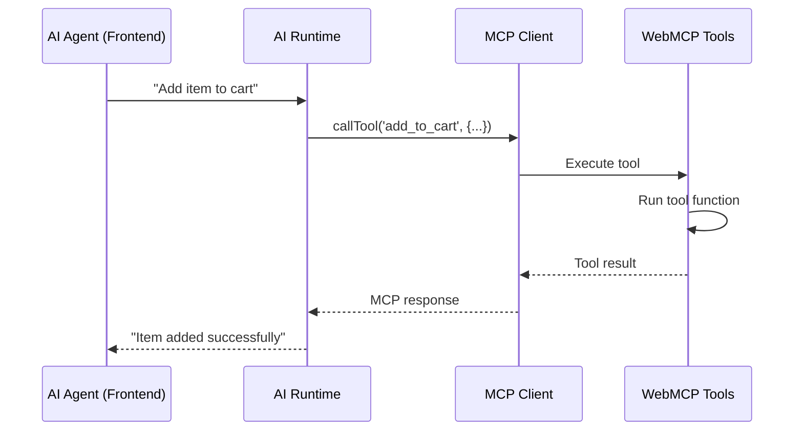

## Overview

Your frontend AI agents need a way to interact with your website. This guide shows how to wire WebMCP tools into frameworks like Assistant-UI, AG-UI, or custom runtimes, then use the MCP client protocol to let agents discover and call your tools. By the end, your AI will be able to understand and use every feature you expose.

## How Frontend Tool Calling Works

<Steps>
  <Step title="Register tools on your website">
    Tools are defined and registered on your website using `navigator.modelContext`
  </Step>

  <Step title="Connect an MCP client">
    Your AI runtime connects to the website's tools using an MCP client
  </Step>

  <Step title="Register tools with AI runtime">
    The MCP tools are registered with your frontend AI framework
  </Step>

  <Step title="AI calls tools">
    When the AI needs to use a tool, it calls through your runtime → MCP client → WebMCP
  </Step>

  <Step title="Tool executes on frontend">
    The tool runs in the browser, returns results to the AI
  </Step>
</Steps>



## Supported Frameworks

WebMCP tools work with any frontend AI framework that supports tool calling:

<CardGroup cols={2}>
  <Card title="Assistant-UI" icon="robot" href="/ai-frameworks/assistant-ui">
    React framework for building AI assistants with built-in tool support
  </Card>

  <Card title="AG-UI" icon="sparkles" href="/ai-frameworks/ag-ui">
    Agentic UI framework with frontend-defined tools
  </Card>

  <Card title="Custom Runtime" icon="code" href="/ai-frameworks/custom-runtime">
    Build your own integration with any AI framework
  </Card>
</CardGroup>

## Key Benefits

### Tool Execution in Browser

With WebMCP frontend tool calling, tools execute **in the browser**:

- ✅ Direct access to DOM, localStorage, app state
- ✅ No server roundtrip required
- ✅ Works offline
- ✅ Real-time UI updates

### MCP Client as Bridge

The MCP client acts as a bridge between your AI runtime and WebMCP:

```
AI Runtime → MCP Client → WebMCP → Tool Function → Result
```

### Dynamic Tool Updates

Tools can be registered/unregistered dynamically, and the AI runtime stays synchronized:

```typescript
// Register a new tool
const registration = navigator.modelContext.registerTool({
  name: 'new_feature',
  description: 'A new feature',
  inputSchema: { type: 'object', properties: {} },
  async execute() {
    return { content: [{ type: 'text', text: 'Done!' }] };
  }
});

// Tool is immediately available to the AI

// Later, remove it
registration.unregister();
```

## Getting Started

<CardGroup cols={2}>
  <Card title="Setup Guide" icon="gear" href="/ai-frameworks/setup">
    Install packages and configure your MCP client
  </Card>

  <Card title="Best Practices" icon="stars" href="/ai-frameworks/best-practices">
    Learn patterns for building robust AI integrations
  </Card>

  <Card title="React Hooks" icon="react" href="/packages/react-webmcp">
    Use `@mcp-b/react-webmcp` for easier integration
  </Card>

  <Card title="Examples" icon="code" href="/examples">
    See complete working examples
  </Card>
</CardGroup>
