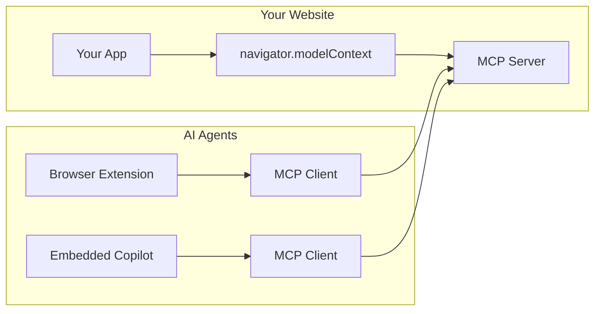

## What is WebMCP?

WebMCP lets you expose JavaScript functions on your website as **tools** that AI agents can discover and call. It implements the [Model Context Protocol (MCP)](https://modelcontextprotocol.io) in the browser.



## How It Works

WebMCP consists of two main parts:

### 1. The Server (Your Website)

When you import `@mcp-b/global`, your webpage starts an **MCP server**:

```tsx "main.tsx"
import '@mcp-b/global'; // Starts MCP server on your page
```

Then you register tools using `useWebMCP`:

```tsx "MyComponent.tsx"
import { useWebMCP } from '@mcp-b/react-webmcp';
import { z } from 'zod';

function MyComponent() {
  useWebMCP({
    name: 'add_to_cart',
    description: 'Add a product to the shopping cart',
    inputSchema: {
      productId: z.string(),
      quantity: z.number().min(1)
    },
    handler: async (input) => {
      await addToCart(input.productId, input.quantity);
      return { success: true };
    }
  });

  return <div>...</div>;
}
```

### 2. The Client (AI Agents)

AI agents connect to your page using an **MCP client**:

```tsx
import { Client } from '@modelcontextprotocol/sdk/client/index.js';
import { TabClientTransport } from '@mcp-b/transports';

const client = new Client(
  { name: 'MyAgent', version: '1.0.0' },
  { capabilities: {} }
);

const transport = new TabClientTransport({
  targetOrigin: 'https://your-website.com',
  channelId: 'mcp-default'
});

await client.connect(transport);

// Discover tools
const { tools } = await client.listTools();

// Call a tool
const result = await client.callTool({
  name: 'add_to_cart',
  arguments: { productId: 'abc', quantity: 2 }
});
```

## Common Use Cases

<CardGroup cols={2}>
  <Card title="External AI Agents" icon="chrome">
    Browser extensions, desktop apps, or other AI agents discover and call your tools
  </Card>

  <Card title="Embedded Copilots" icon="robot">
    AI assistants built into your website that can interact with your app
  </Card>

  <Card title="Agentic UIs" icon="sparkles">
    Frameworks like Assistant-UI or AG-UI that support frontend-defined tools
  </Card>

  <Card title="Custom Runtimes" icon="code">
    Build your own AI integration with any LLM provider
  </Card>
</CardGroup>

## Architecture Patterns

### Pattern A: External AI Agents (Most Common)

Your website exposes tools. External AI agents connect as clients.

```
Your Website (Server)          External AI Agent (Client)
┌─────────────────────┐        ┌─────────────────────┐
│  @mcp-b/global      │   ←    │  MCP Client         │
│  + useWebMCP        │        │  (Browser Extension)│
└─────────────────────┘        └─────────────────────┘
```

**You need:** `@mcp-b/global`, `@mcp-b/react-webmcp`, `zod`

### Pattern B: Embedded Copilot

Your website both hosts tools AND has an embedded AI assistant that uses them.

```
Your Website
┌─────────────────────────────────────────┐
│  @mcp-b/global (Server)                 │
│  + useWebMCP (Tool Registration)        │
│                                         │
│  McpClientProvider (Client)             │
│  + AI Framework (Assistant-UI, AG-UI)   │
└─────────────────────────────────────────┘
```

**You need:** `@mcp-b/global`, `@mcp-b/react-webmcp`, `@mcp-b/transports`, `@modelcontextprotocol/sdk`, `zod`, + your AI framework

## Choose Your Integration

<CardGroup cols={2}>
  <Card title="Setup Guide" icon="gear" href="/ai-frameworks/setup">
    **Start here** - Install packages and understand the architecture
  </Card>

  <Card title="Assistant-UI" icon="robot" href="/ai-frameworks/assistant-ui">
    Integrate with the Assistant-UI React framework
  </Card>

  <Card title="AG-UI" icon="sparkles" href="/ai-frameworks/ag-ui">
    Integrate with the AG-UI agentic framework
  </Card>

  <Card title="Custom Runtime" icon="code" href="/ai-frameworks/custom-runtime">
    Build your own integration with any AI framework
  </Card>
</CardGroup>

## Quick Start

The fastest way to get started:

```bash
npm install @mcp-b/global @mcp-b/react-webmcp zod
```

```tsx "main.tsx"
import '@mcp-b/global';
import { createRoot } from 'react-dom/client';
import App from './App';

createRoot(document.getElementById('root')!).render(<App />);
```

```tsx "App.tsx"
import { useWebMCP } from '@mcp-b/react-webmcp';
import { z } from 'zod';

export function App() {
  // Register a tool that AI agents can call
  useWebMCP({
    name: 'get_page_info',
    description: 'Get information about the current page',
    inputSchema: {},
    handler: async () => ({
      title: document.title,
      url: window.location.href,
      timestamp: new Date().toISOString()
    })
  });

  return <div>My AI-enabled App</div>;
}
```

Your page now exposes a `get_page_info` tool that any MCP client can discover and call.

## Resources

<CardGroup cols={2}>
  <Card title="React Hooks API" icon="react" href="/packages/react-webmcp">
    Full API reference for useWebMCP, McpClientProvider, and useMcpClient
  </Card>

  <Card title="Transports" icon="arrows-rotate" href="/packages/transports">
    TabClientTransport, TabServerTransport, and other transport options
  </Card>

  <Card title="Best Practices" icon="stars" href="/ai-frameworks/best-practices">
    Performance optimization and patterns
  </Card>

  <Card title="Examples" icon="code" href="/examples">
    Complete working examples
  </Card>
</CardGroup>
