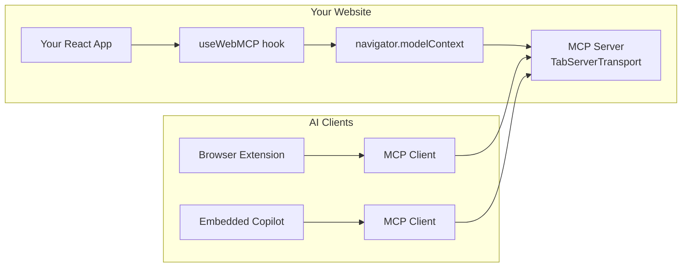
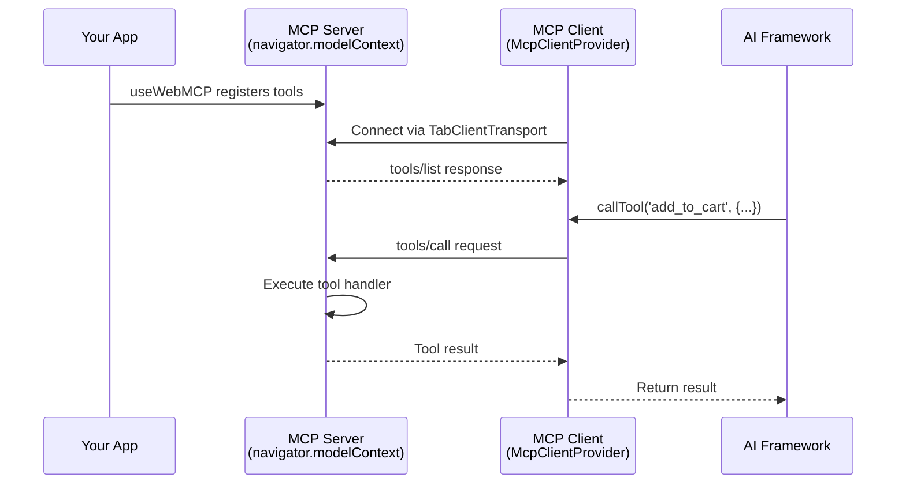

## Understanding the Architecture

Before diving into setup, it's important to understand how WebMCP works:



**Key concepts:**

1. **`@mcp-b/global`** - A polyfill that adds `navigator.modelContext` to the browser and runs an **MCP server**
2. **`useWebMCP`** - A React hook that registers tools with `navigator.modelContext`
3. **External AI agents** (browser extensions, copilots) connect as **MCP clients** to discover and call your tools

When you import `@mcp-b/global`, your webpage becomes an MCP server that AI agents can connect to.

## Installation

Install the required packages:

<Tabs>
  <Tab title="npm">
```bash
npm install @mcp-b/global @mcp-b/react-webmcp zod
```
  </Tab>
  <Tab title="yarn">
```bash
yarn add @mcp-b/global @mcp-b/react-webmcp zod
```
  </Tab>
  <Tab title="pnpm">
```bash
pnpm add @mcp-b/global @mcp-b/react-webmcp zod
```
  </Tab>
</Tabs>

<Note>
  For embedded AI copilots that call your own tools, you'll also need `@mcp-b/transports` and `@modelcontextprotocol/sdk`. See [Embedded Copilot Setup](#embedded-copilot-setup) below.
</Note>

## Basic Setup: Exposing Tools to AI Agents

This is the most common pattern: your website registers tools that external AI agents can discover and call.

### Step 1: Initialize the Polyfill

Import `@mcp-b/global` once at your app's entry point. This auto-initializes `navigator.modelContext` and starts the MCP server:

```tsx "main.tsx" icon="react"
import '@mcp-b/global'; // Auto-initializes navigator.modelContext
import { StrictMode } from 'react';
import { createRoot } from 'react-dom/client';
import App from './App';

createRoot(document.getElementById('root')!).render(
  <StrictMode>
    <App />
  </StrictMode>
);
```

### Step 2: Register Tools with useWebMCP

Use the `useWebMCP` hook to register tools. Tools are automatically registered when components mount and unregistered when they unmount:

```tsx "ShoppingCart.tsx" icon="react"
import { useWebMCP } from '@mcp-b/react-webmcp';
import { z } from 'zod';

function ShoppingCart() {
  const [cart, setCart] = useState<CartItem[]>([]);

  // Register a tool that AI agents can call
  useWebMCP({
    name: 'add_to_cart',
    description: 'Add a product to the shopping cart',
    inputSchema: {
      productId: z.string().describe('Product ID to add'),
      quantity: z.number().min(1).default(1).describe('Quantity to add')
    },
    handler: async (input) => {
      const item = await addToCart(input.productId, input.quantity);
      setCart(prev => [...prev, item]);

      return {
        message: `Added ${input.quantity}x ${item.name} to cart`,
        cartTotal: calculateTotal([...cart, item])
      };
    }
  });

  return <div>{/* Your cart UI */}</div>;
}
```

That's it! Your tools are now discoverable by any MCP client connecting to your page.

## How External AI Agents Connect

External AI agents (like browser extensions or standalone apps) use an MCP client to connect to your page's tools:

```tsx "BrowserExtension.ts" icon="chrome"
import { Client } from '@modelcontextprotocol/sdk/client/index.js';
import { TabClientTransport } from '@mcp-b/transports';

// Create transport targeting the webpage
const transport = new TabClientTransport({
  targetOrigin: 'https://your-website.com', // Required for security
  channelId: 'mcp-default' // Optional, defaults to 'mcp-default'
});

// Create MCP client
const client = new Client(
  { name: 'MyAIAgent', version: '1.0.0' },
  { capabilities: {} }
);

// Connect and discover tools
await client.connect(transport);

// List available tools
const { tools } = await client.listTools();
console.log('Available tools:', tools.map(t => t.name));

// Call a tool
const result = await client.callTool({
  name: 'add_to_cart',
  arguments: { productId: 'prod-123', quantity: 2 }
});
```

<Warning>
  The `targetOrigin` parameter is **required** for security. It must match the origin of the webpage hosting the MCP server.
</Warning>

## Embedded Copilot Setup

If you're building an AI copilot embedded within your own website (like Assistant-UI or AG-UI), you need to connect an MCP client to your own MCP server.

### Additional Installation

```bash
npm install @mcp-b/transports @modelcontextprotocol/sdk
```

### Full Setup with McpClientProvider

```tsx "App.tsx" icon="react"
import '@mcp-b/global'; // Initialize the MCP server
import { McpClientProvider, useMcpClient, useWebMCP } from '@mcp-b/react-webmcp';
import { Client } from '@modelcontextprotocol/sdk/client/index.js';
import { TabClientTransport } from '@mcp-b/transports';
import { z } from 'zod';

// Create client and transport ONCE, outside components
const mcpClient = new Client(
  { name: 'EmbeddedCopilot', version: '1.0.0' },
  { capabilities: {} }
);

const transport = new TabClientTransport({
  targetOrigin: window.location.origin, // Connect to self
  channelId: 'mcp-default'
});

export function App() {
  return (
    <McpClientProvider client={mcpClient} transport={transport}>
      <ToolProvider />
      <AICopilot />
    </McpClientProvider>
  );
}

// Component that registers tools
function ToolProvider() {
  useWebMCP({
    name: 'get_user_info',
    description: 'Get current user information',
    inputSchema: {},
    handler: async () => {
      const user = getCurrentUser();
      return { name: user.name, email: user.email };
    }
  });

  return null; // This component just registers tools
}

// Component that uses tools via MCP client
function AICopilot() {
  const { client, tools, isConnected, isLoading, error } = useMcpClient();

  if (isLoading) return <div>Connecting to tools...</div>;
  if (error) return <div>Error: {error.message}</div>;
  if (!isConnected) return <div>Not connected</div>;

  const callTool = async (name: string, args: Record<string, unknown>) => {
    const result = await client.callTool({ name, arguments: args });
    return result.content
      .filter(c => c.type === 'text')
      .map(c => c.text)
      .join('\n');
  };

  return (
    <div>
      <h2>AI Copilot</h2>
      <p>Available tools: {tools.map(t => t.name).join(', ')}</p>
      {/* Your AI chat interface here */}
    </div>
  );
}
```

### How It Works

1. `@mcp-b/global` starts an MCP server on your page via `TabServerTransport`
2. `useWebMCP` registers tools with `navigator.modelContext` (the server)
3. `McpClientProvider` creates an MCP client that connects back to the same page
4. `useMcpClient` provides access to discovered tools and the ability to call them



## Configuration Options

### Polyfill Options

Configure `@mcp-b/global` before auto-initialization:

```tsx
// Set before importing @mcp-b/global
window.__webModelContextOptions = {
  transport: {
    tabServer: {
      allowedOrigins: ['https://trusted-agent.com'], // Restrict who can connect
      channelId: 'my-custom-channel'
    },
    iframeServer: false // Disable iframe transport if not needed
  }
};

import '@mcp-b/global';
```

### TabClientTransport Options

```tsx
const transport = new TabClientTransport({
  targetOrigin: 'https://example.com', // Required: origin of the MCP server
  channelId: 'mcp-default'             // Optional: channel for communication
});
```

## Verifying Your Setup

Check that tools are registered correctly:

```tsx
function DebugPanel() {
  const tools = navigator.modelContext.listTools();

  return (
    <div>
      <h3>Registered Tools ({tools.length})</h3>
      <ul>
        {tools.map(tool => (
          <li key={tool.name}>
            <strong>{tool.name}</strong>: {tool.description}
          </li>
        ))}
      </ul>
    </div>
  );
}
```

## Next Steps

Now that you have the basic setup complete, choose your framework integration:

<CardGroup cols={2}>
  <Card title="Assistant-UI" icon="robot" href="/ai-frameworks/assistant-ui">
    Integrate with Assistant-UI framework
  </Card>

  <Card title="AG-UI" icon="sparkles" href="/ai-frameworks/ag-ui">
    Integrate with AG-UI framework
  </Card>

  <Card title="Custom Runtime" icon="code" href="/ai-frameworks/custom-runtime">
    Build your own integration
  </Card>

  <Card title="Best Practices" icon="stars" href="/ai-frameworks/best-practices">
    Learn optimization patterns
  </Card>
</CardGroup>
