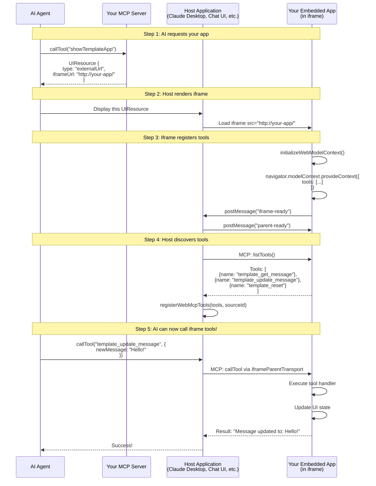

## What You're Building

`npx create-webmcp-app` scaffolds a bidirectional system with three components:

1. **MCP Server** (Cloudflare Worker) - Exposes tools to AI agents
2. **Embedded Web App** (React or Vanilla JS) - Runs in an iframe, registers its own tools
3. **Communication Layer** - IframeParentTransport ↔ IframeChildTransport

Your embedded app registers tools that AI can call, creating bidirectional interaction.

## Quick Navigation

<CardGroup cols={3}>
  <Card title="Quick Start" icon="bolt" href="#quick-start">
    Get started in minutes with npx
  </Card>
  <Card title="Architecture" icon="diagram-project" href="#the-complete-architecture">
    Understand the system design
  </Card>
  <Card title="MCP Server" icon="server" href="#part-1-the-mcp-server">
    Build the backend tools
  </Card>
  <Card title="Vanilla App" icon="code" href="#part-2-the-embedded-app-vanilla">
    HTML/CSS/JS implementation
  </Card>
  <Card title="React App" icon="react" href="#part-3-the-embedded-app-react">
    TypeScript + React implementation
  </Card>
  <Card title="Deployment" icon="rocket" href="#deployment">
    Deploy to production
  </Card>
</CardGroup>

## Quick Start

```bash
npx create-webmcp-app
```

<Tabs>
  <Tab title="Vanilla Template" icon="code">
    HTML/CSS/JavaScript with no build step. Uses CDN for dependencies.

    ```bash
    # Select "vanilla" when prompted
    cd your-project
    pnpm dev
    ```

    Runs at: `http://localhost:8889`
  </Tab>

  <Tab title="React Template" icon="react">
    React + TypeScript + Vite with hot module replacement.

    ```bash
    # Select "react" when prompted
    cd your-project
    pnpm dev
    ```

    Runs at: `http://localhost:8888`
  </Tab>
</Tabs>

## Architecture



## Part 1: The MCP Server

The MCP server (`worker/mcpServer.ts`) exposes tools that return UI resources.

### Example: Template MCP Server

```typescript
import { createUIResource } from '@mcp-ui/server';
import { McpServer } from '@modelcontextprotocol/sdk/server/mcp.js';
import { McpAgent } from 'agents/mcp';

export class TemplateMCP extends McpAgent<Cloudflare.Env> {
  server = new McpServer({
    name: 'webmcp-template',
    version: '1.0.0',
  });

  async init() {
    /**
     * This tool tells the AI "here's an interactive web app you can use"
     * Returns a UIResource that the host application will render
     */
    this.server.tool(
      'showTemplateApp',
      `Display the template web application with WebMCP integration.

After calling this tool, the app will appear and register the following WebMCP tools:
- template_get_message: Get the current message from the app
- template_update_message: Update the message displayed in the app
- template_reset: Reset the message to default`,
      {},
      async () => {
        // Point to your embedded app
        const iframeUrl = `${this.env.APP_URL}/`;

        // Create UI resource with iframe URL
        const uiResource = createUIResource({
          uri: 'ui://template-app',
          content: {
            type: 'externalUrl',  // Tell host to load this in iframe
            iframeUrl: iframeUrl,
          },
          encoding: 'blob',
        });

        return {
          content: [
            {
              type: 'text',
              text: `# Template App Started

The template app is now displayed in the side panel.

**Available tools** (registered via WebMCP):
- \`template_get_message\` - View the current message
- \`template_update_message\` - Change the message
- \`template_reset\` - Reset to default

Try calling these tools to interact with the app!`,
            },
            uiResource,
          ],
        };
      }
    );
  }
}
```

<Warning>
The tools mentioned in the description are registered by the iframe, not by this server.
</Warning>

## Part 2: The Embedded App (Vanilla)

The Vanilla template uses `@mcp-b/global` via CDN. No build step required.

### Example: Vanilla Template (`public/index.html`)

```html
<!DOCTYPE html>
<html lang="en">
<head>
  <meta charset="UTF-8">
  <title>WebMCP Template</title>

  <!-- Load @mcp-b/global IIFE - provides navigator.modelContext -->
  <script src="https://unpkg.com/@mcp-b/global@latest/dist/index.iife.js"></script>
  <script src="https://cdn.tailwindcss.com"></script>
</head>
<body class="bg-gray-50">
  <div id="app" class="p-8">
    <h1 class="text-3xl font-bold">WebMCP Template</h1>

    <!-- Connection status -->
    <div id="status" class="mt-4">
      <span class="bg-yellow-100 px-3 py-1 rounded">Connecting...</span>
    </div>

    <!-- Message display -->
    <div class="mt-6 p-4 bg-blue-50 rounded">
      <p id="message">Hello from WebMCP Template!</p>
    </div>

    <!-- Action buttons -->
    <div class="mt-4 space-x-2">
      <button id="btn-update" class="px-4 py-2 bg-blue-600 text-white rounded">
        Update Message
      </button>
      <button id="btn-reset" class="px-4 py-2 bg-gray-600 text-white rounded">
        Reset
      </button>
    </div>
  </div>

  <script>
    // App state
    let isReady = false;
    let message = 'Hello from WebMCP Template!';

    // DOM elements
    const statusEl = document.getElementById('status');
    const messageEl = document.getElementById('message');
    const btnUpdate = document.getElementById('btn-update');
    const btnReset = document.getElementById('btn-reset');

    // Update UI
    function updateUI() {
      messageEl.textContent = message;

      if (isReady) {
        statusEl.innerHTML = '<span class="bg-green-100 px-3 py-1 rounded">Connected</span>';
        btnUpdate.disabled = false;
        btnReset.disabled = false;
      } else {
        statusEl.innerHTML = '<span class="bg-yellow-100 px-3 py-1 rounded">Connecting...</span>';
        btnUpdate.disabled = true;
        btnReset.disabled = true;
      }
    }

    // Listen for parent ready signal
    window.addEventListener('message', (event) => {
      if (event.data?.type === 'parent_ready') {
        isReady = true;
        updateUI();
        console.log('[App] Parent is ready');
      }
    });

    // Notify parent we're ready
    window.parent.postMessage({ type: 'iframe_ready' }, '*');

    // UI button handlers
    btnUpdate.addEventListener('click', () => {
      const newMessage = prompt('Enter new message:');
      if (newMessage) {
        message = newMessage;
        updateUI();
      }
    });

    btnReset.addEventListener('click', () => {
      message = 'Hello from WebMCP Template!';
      updateUI();
    });

    /**
     * CRITICAL: Register WebMCP tools
     *
     * window.navigator.modelContext is provided by @mcp-b/global
     * These tools will be discovered by the parent and made available to the AI
     */
    window.navigator.modelContext.provideContext({
      tools: [
        {
          name: 'template_get_message',
          description: 'Get the current message displayed in the app',
          inputSchema: {
            type: 'object',
            properties: {}
          },
          async execute() {
            console.log('[Tool] template_get_message called');
            return {
              content: [{
                type: 'text',
                text: `Current message: ${message}`
              }]
            };
          }
        },
        {
          name: 'template_update_message',
          description: 'Update the message displayed in the app',
          inputSchema: {
            type: 'object',
            properties: {
              newMessage: {
                type: 'string',
                description: 'The new message to display'
              }
            },
            required: ['newMessage']
          },
          async execute({ newMessage }) {
            console.log('[Tool] template_update_message called with:', newMessage);
            // Update state - same logic as UI button!
            message = newMessage;
            updateUI();
            return {
              content: [{
                type: 'text',
                text: `Message updated to: ${message}`
              }]
            };
          }
        },
        {
          name: 'template_reset',
          description: 'Reset the message to its default value',
          inputSchema: {
            type: 'object',
            properties: {}
          },
          async execute() {
            console.log('[Tool] template_reset called');
            // Reset state - same logic as UI button!
            message = 'Hello from WebMCP Template!';
            updateUI();
            return {
              content: [{
                type: 'text',
                text: `Message reset to: ${message}`
              }]
            };
          }
        }
      ]
    });

    // Initial UI update
    updateUI();
    console.log('[App] WebMCP tools registered successfully');
  </script>
</body>
</html>
```

<Note>
Key points: `@mcp-b/global` provides `navigator.modelContext`. Tool handlers and UI buttons should share state management logic.
</Note>

## Part 3: The Embedded App (React)

<Warning>
`initializeWebModelContext()` must be called before React renders.
</Warning>

**src/main.tsx** - Initialize WebMCP:

```typescript
import { initializeWebModelContext } from '@mcp-b/global';
import { StrictMode } from 'react';
import { createRoot } from 'react-dom/client';
import App from './App.tsx';
import './index.css';

// CRITICAL: Initialize BEFORE React renders
// This sets up the IframeChildTransport
initializeWebModelContext({
  transport: {
    tabServer: {
      allowedOrigins: ['*'], // Allow any origin (use specific origins in production)
    },
  },
});

createRoot(document.getElementById('root')!).render(
  <StrictMode>
    <App />
  </StrictMode>
);
```

**src/App.tsx** - Register tools with `useWebMCP`:

```typescript
import { useWebMCP } from '@mcp-b/react-webmcp';
import { useState } from 'react';
import { z } from 'zod';

export default function App() {
  const [message, setMessage] = useState('Hello from WebMCP Template!');
  const [isReady, setIsReady] = useState(false);

  // Listen for parent ready signal
  useEffect(() => {
    const handleMessage = (event: MessageEvent) => {
      if (event.data?.type === 'parent_ready') {
        setIsReady(true);
      }
    };
    window.addEventListener('message', handleMessage);
    window.parent.postMessage({ type: 'iframe_ready' }, '*');
    return () => window.removeEventListener('message', handleMessage);
  }, []);

  /**
   * Tool 1: Get current message
   * Read-only, idempotent
   */
  useWebMCP({
    name: 'template_get_message',
    description: 'Get the current message displayed in the app',
    annotations: {
      readOnlyHint: true,
      idempotentHint: true,
    },
    handler: async () => {
      return `Current message: ${message}`;
    },
  });

  /**
   * Tool 2: Update message
   * Uses Zod for validation, updates React state
   */
  useWebMCP({
    name: 'template_update_message',
    description: 'Update the message displayed in the app',
    inputSchema: {
      newMessage: z.string().describe('The new message to display'),
    },
    annotations: {
      idempotentHint: false,
    },
    handler: async ({ newMessage }) => {
      setMessage(newMessage);  // Same state update as UI button!
      return `Message updated to: ${newMessage}`;
    },
  });

  /**
   * Tool 3: Reset message
   * Destructive but idempotent
   */
  useWebMCP({
    name: 'template_reset',
    description: 'Reset the message to its default value',
    annotations: {
      destructiveHint: true,
      idempotentHint: true,
    },
    handler: async () => {
      const defaultMessage = 'Hello from WebMCP Template!';
      setMessage(defaultMessage);  // Same state update as UI button!
      return `Message reset to: ${defaultMessage}`;
    },
  });

  return (
    <div className="p-8">
      <h1 className="text-3xl font-bold">WebMCP Template (React)</h1>

      <div className="mt-4">
        {isReady ? (
          <span className="bg-green-100 px-3 py-1 rounded">Connected</span>
        ) : (
          <span className="bg-yellow-100 px-3 py-1 rounded">Connecting...</span>
        )}
      </div>

      <div className="mt-6 p-4 bg-blue-50 rounded">
        <p>{message}</p>
      </div>

      <div className="mt-4 space-x-2">
        <button
          onClick={() => {
            const newMsg = prompt('Enter new message:');
            if (newMsg) setMessage(newMsg);
          }}
          disabled={!isReady}
          className="px-4 py-2 bg-blue-600 text-white rounded disabled:bg-gray-300"
        >
          Update Message
        </button>
        <button
          onClick={() => setMessage('Hello from WebMCP Template!')}
          disabled={!isReady}
          className="px-4 py-2 bg-gray-600 text-white rounded disabled:bg-gray-300"
        >
          Reset
        </button>
      </div>
    </div>
  );
}
```

<Note>
`useWebMCP` hook automatically registers and unregisters tools. Tool handlers and UI should share the same React state.
</Note>

## Part 4: How the Host Application Integrates This

When your AI agent calls `showTemplateApp`, here's what happens in the host application (e.g., Claude Desktop, chat-ui):

### Step 1: Tool Result Contains UIResource

```typescript
// In host application (chat-ui)
const result = await mcpClient.callTool({
  name: 'showTemplateApp',
  arguments: {}
});

// result.content contains:
// [
//   { type: 'text', text: '# Template App Started...' },
//   { type: 'resource', resource: { uri: 'ui://template-app', ... } }
// ]
```

### Step 2: Host Detects and Adds UIResource

```typescript
// McpToolBridge component (simplified)
result.content.forEach((content) => {
  if (isUIResource(content) && content.resource) {
    // Add to UI resources context
    addResource({
      toolName: 'showTemplateApp',
      resource: content.resource,
    });
  }
});
```

### Step 3: Host Renders Iframe with Lifecycle Setup

```typescript
// ToolResponsePanel component (simplified)
<UIResourceRenderer
  resource={selectedResource.resource}
  htmlProps={{
    iframeProps: {
      ref: iframeRef,
      onLoad: async (e) => {
        // CRITICAL: Setup WebMCP connection when iframe loads
        await setupIframe(e.currentTarget, selectedResource.id);
      },
    },
  }}
/>
```

### Step 4: useIframeLifecycle Discovers Tools

```typescript
// useIframeLifecycle.ts (simplified)
async function setupIframe(iframe: HTMLIFrameElement, sourceId: string) {
  // 1. Handle parent-child ready protocol
  const handleMessage = (event: MessageEvent) => {
    if (event.data?.type === 'ui-lifecycle-iframe-ready') {
      iframe.contentWindow?.postMessage({ type: 'parent-ready' }, '*');
    }
  };
  window.addEventListener('message', handleMessage);

  // 2. Create MCP client for this iframe
  const client = new Client({
    name: 'WebMCP Client',
    version: '1.0.0',
  });

  // 3. Create IframeParentTransport
  const transport = new IframeParentTransport({
    targetOrigin: new URL(serverUrl).origin,
    iframe: iframe,
  });

  // 4. Connect to iframe's MCP server
  await client.connect(transport);

  // 5. Discover tools from iframe
  const toolsResponse = await client.listTools();
  // toolsResponse.tools = [
  //   { name: 'template_get_message', ... },
  //   { name: 'template_update_message', ... },
  //   { name: 'template_reset', ... }
  // ]

  // 6. Register these tools with the host
  registerWebMcpTools(toolsResponse.tools, sourceId);
  registerWebMcpClient(sourceId, client);

  // 7. Listen for dynamic tool updates
  client.setNotificationHandler(ToolListChangedNotificationSchema, async () => {
    const updated = await client.listTools();
    registerWebMcpTools(updated.tools, sourceId);
  });
}
```

### Step 5: Tools Available to AI

```typescript
// MCPToolRegistry component routes tool calls
{webMcpTools.map((tool) => {
  const sourceId = tool._sourceId;
  return (
    <McpToolBridge
      toolName={tool.name}
      callTool={(name, args) => {
        // Route to correct WebMCP client based on source ID
        const webMcpClient = webMcpClients.current?.get(sourceId);
        return webMcpClient.callTool({ name, arguments: args });
      }}
    />
  );
})}
```

**Now the AI can call:**
- `showTemplateApp` → from MCP server (returns iframe)
- `template_get_message` → routed to iframe via IframeParentTransport
- `template_update_message` → routed to iframe
- `template_reset` → routed to iframe

## Development Workflow

<Steps>
  <Step title="Start Development Server">
    Launch your local development environment:

    ```bash
    pnpm dev
    ```

    This starts:
    - **MCP server**: `http://localhost:8888/mcp` (or 8889 for vanilla)
    - **Embedded app**: `http://localhost:8888/` (served by the worker)
    - **Hot reload**: Changes to your app update instantly
  </Step>

  <Step title="Connect a Test Client">
    <Tabs>
      <Tab title="Chat UI" icon="messages">
        Use the included chat-ui (in mcp-ui-webmcp repo):

        ```bash
        # In a separate terminal
        cd ../chat-ui
        pnpm dev
        # Open http://localhost:5173
        ```
      </Tab>

      <Tab title="Claude Desktop" icon="desktop">
        Add to your Claude Desktop MCP config:

        ```json
        {
          "mcpServers": {
            "my-app": {
              "command": "http",
              "args": ["http://localhost:8888/mcp"]
            }
          }
        }
        ```
      </Tab>
    </Tabs>
  </Step>

  <Step title="Test the Interaction">
    1. AI calls `showTemplateApp` → iframe appears
    2. AI calls `template_get_message` → reads current state
    3. AI calls `template_update_message` → updates the UI
    4. UI buttons use the same logic as tool handlers
  </Step>
</Steps>

## Best Practices

### 1. Share Logic Between UI and Tools

UI handlers and WebMCP tools should call the same underlying functions.

**❌ Bad:** Duplicate logic
```typescript
// UI button
button.onclick = () => {
  message = "Updated!";
  messageEl.textContent = message;
};

// WebMCP tool
async execute({ newMessage }) {
  message = newMessage;  // Duplicate!
  messageEl.textContent = message;  // Duplicate!
}
```

**✅ Good:** Single source of truth
```typescript
// Shared function
function updateMessage(newMsg) {
  message = newMsg;
  messageEl.textContent = message;
  return `Message updated to: ${message}`;
}

// UI button
button.onclick = () => {
  const newMsg = prompt('Enter message:');
  if (newMsg) updateMessage(newMsg);
};

// WebMCP tool
async execute({ newMessage }) {
  return updateMessage(newMessage);
}
```

### 2. Use Tool Annotations

```typescript
useWebMCP({
  name: 'delete_all',
  description: 'Delete all data',
  annotations: {
    destructiveHint: true,  // Warns AI this destroys data
    idempotentHint: true,   // Calling twice = same result
    readOnlyHint: false,    // Modifies state
  },
  handler: async () => { /* ... */ }
});
```

### 3. Handle Parent-Ready Protocol

Always wait for parent to be ready before sending notifications:

```typescript
const [isParentReady, setIsParentReady] = useState(false);

useEffect(() => {
  const handleMessage = (event) => {
    if (event.data?.type === 'parent-ready') {
      setIsParentReady(true);
    }
  };
  window.addEventListener('message', handleMessage);
  window.parent.postMessage({ type: 'iframe-ready' }, '*');
  return () => window.removeEventListener('message', handleMessage);
}, []);

// Only send notifications when ready
if (isParentReady) {
  window.parent.postMessage({
    type: 'notify',
    payload: { message: 'Something happened!' }
  }, '*');
}
```

### 4. Validate Inputs

```typescript
// Vanilla: Use inputSchema
{
  name: 'update_score',
  inputSchema: {
    type: 'object',
    properties: {
      points: {
        type: 'number',
        minimum: 0,
        maximum: 100
      }
    },
    required: ['points']
  },
  async execute({ points }) {
    // points is validated!
  }
}

// React: Use Zod
useWebMCP({
  name: 'update_score',
  inputSchema: {
    points: z.number().min(0).max(100)
  },
  handler: async ({ points }) => {
    // points is validated and typed!
  }
});
```

## Deployment

<Steps>
  <Step title="Build for Production">
    ```bash
    pnpm build
    ```

    This creates:
    - `dist/client/` - Your embedded app (HTML, CSS, JS)
    - `dist/worker/` - Your MCP server (Cloudflare Worker bundle)
  </Step>

  <Step title="Deploy to Cloudflare Workers">
    ```bash
    # Update .prod.vars with your worker URL
    echo "APP_URL=https://your-app.your-username.workers.dev" > .prod.vars

    # Deploy
    pnpm deploy
    ```
  </Step>

  <Step title="Update MCP Client Configuration">
    Point your AI clients to the production URL:

    **Claude Desktop:**
    ```json
    {
      "mcpServers": {
        "my-app": {
          "command": "http",
          "args": ["https://your-app.workers.dev/mcp"]
        }
      }
    }
    ```

    **Chat UI (.env.production):**
    ```
    VITE_MCP_SERVER_URL=https://your-app.workers.dev/mcp
    ```
  </Step>
</Steps>

## Advanced Topics

### Dynamic Tool Registration

Tools can be added/removed at runtime:

```typescript
const [isAdmin, setIsAdmin] = useState(false);

// Only register admin tools when user is admin
{isAdmin && useWebMCP({
  name: 'admin_delete_all',
  description: 'Delete all data (admin only)',
  handler: async () => {
    // Admin action
  }
})}
```

When tools change, send notification:

```typescript
// @mcp-b/global handles this automatically
// Host listens for 'tools/list_changed' notification
```

### Multiple Embedded Apps

You can create multiple apps, each with its own tools:

```typescript
// MCP Server
this.server.tool('showGame1', ..., async () => {
  return createUIResource({
    uri: 'ui://game1',
    content: { type: 'externalUrl', iframeUrl: `${this.env.APP_URL}/game1/` }
  });
});

this.server.tool('showGame2', ..., async () => {
  return createUIResource({
    uri: 'ui://game2',
    content: { type: 'externalUrl', iframeUrl: `${this.env.APP_URL}/game2/` }
  });
});
```

Each iframe gets its own WebMCP client and tool namespace.

### Cross-Origin Security

**Development:** Allow all origins
```typescript
initializeWebModelContext({
  transport: {
    tabServer: {
      allowedOrigins: ['*']
    }
  }
});
```

**Production:** Whitelist specific origins
```typescript
initializeWebModelContext({
  transport: {
    tabServer: {
      allowedOrigins: [
        'https://claude.ai',
        'https://your-chat-ui.com'
      ]
    }
  }
});
```

## Next Steps

<CardGroup cols={2}>
  <Card title="MCP-UI + WebMCP Integration" icon="heart" href="/mcpui-webmcp-integration">
    Complete integration guide with advanced patterns
  </Card>

  <Card title="Examples" icon="code" href="/examples">
    Production examples including TicTacToe game
  </Card>

  <Card title="@mcp-b/react-webmcp" icon="react" href="/packages/react-webmcp">
    React hooks API reference
  </Card>

  <Card title="@mcp-b/transports" icon="arrows-left-right" href="/packages/transports">
    Transport layer documentation
  </Card>
</CardGroup>

## Troubleshooting

<AccordionGroup>
  <Accordion title="Iframe tools not appearing">
    1. Check browser console for WebMCP initialization errors
    2. Verify `initializeWebModelContext()` runs BEFORE React renders
    3. Check that `provideContext()` is called with valid tools
    4. Ensure parent-child ready protocol completes
    5. Verify `allowedOrigins` includes the parent's origin
  </Accordion>

  <Accordion title="Tools execute but UI doesn't update">
    1. Ensure tool handlers update the same state as UI
    2. Check that state updates trigger re-renders (React) or manual DOM updates (vanilla)
    3. Verify `updateUI()` function is called after state changes
  </Accordion>

  <Accordion title="'Parent not ready' errors">
    1. Implement parent-ready protocol correctly
    2. Wait for `isParentReady` before sending notifications
    3. Check that parent sends 'parent-ready' signal
  </Accordion>

  <Accordion title="MCP server not found">
    1. Verify worker is running (`pnpm dev`)
    2. Check `.dev.vars` has correct `APP_URL`
    3. Ensure MCP endpoint is `/mcp` not `/`
    4. Test with `curl http://localhost:8888/mcp`
  </Accordion>
</AccordionGroup>

## Resources

- **Source Code**: [mcp-ui-webmcp repository](https://github.com/WebMCP-org/mcp-ui-webmcp)
- **Live Demos**:
  - [TicTacToe Game](https://beattheclankers.com)
  - [Chat UI](https://mcp-ui.mcp-b.ai)
- **Documentation**:
  - [MCP-UI Docs](https://mcpui.dev)
  - [WebMCP Specification](https://github.com/webmachinelearning/webmcp)
- **Community**: [WebMCP Discord](https://discord.gg/ZnHG4csJRB)
