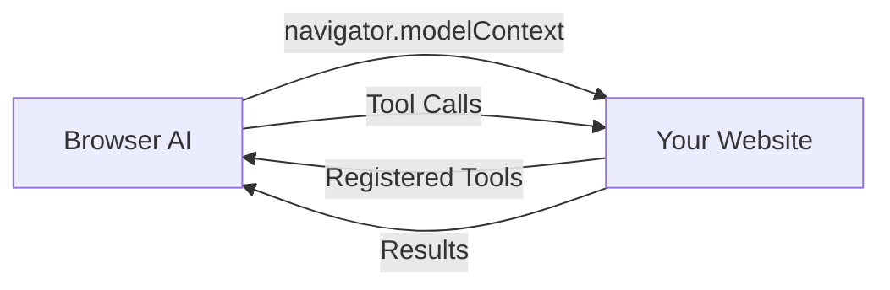

AI browsers are web browsers with built-in AI assistants that can interact with websites using WebMCP. When you register tools via `navigator.modelContext`, these browser agents can discover and use them automatically.

## Supported Browsers

<CardGroup cols={2}>
  <Card title="Chrome AI" icon="chrome">
    Google Chrome's built-in AI assistant (coming soon)
  </Card>

  <Card title="Perplexity Browser" icon="compass">
    AI-native browser with search integration
  </Card>

  <Card title="Arc Browser" icon="arc">
    Browser with AI features and WebMCP support
  </Card>

  <Card title="Edge Copilot" icon="edge">
    Microsoft Edge with Copilot integration
  </Card>
</CardGroup>

<Info>
Browser AI support is actively being developed. Check individual browser documentation for current WebMCP compatibility.
</Info>

## How It Works

AI browsers have native access to the `navigator.modelContext` API:



When a user asks the browser AI to perform an action:

1. The AI discovers tools registered on the current page
2. It selects appropriate tools based on the user's request
3. Tools execute in the browser with the user's session
4. Results are returned to the AI for response generation

## Preparing Your Website

To ensure your website works with AI browsers:

<Steps>
  <Step title="Register your tools">
    Use `navigator.modelContext.registerTool()` to expose functionality:

    ```typescript
    navigator.modelContext.registerTool({
      name: 'search_products',
      description: 'Search the product catalog',
      inputSchema: {
        type: 'object',
        properties: {
          query: { type: 'string' }
        }
      },
      async execute({ query }) {
        const results = await searchProducts(query);
        return { content: [{ type: 'text', text: JSON.stringify(results) }] };
      }
    });
    ```
  </Step>

  <Step title="Add clear descriptions">
    Browser AIs rely on tool descriptions to understand when to use them. Be specific:

    ```typescript
    // Good
    description: 'Add a product to the shopping cart by product ID and quantity'

    // Too vague
    description: 'Add to cart'
    ```
  </Step>

  <Step title="Follow security best practices">
    Browser AIs run with user permissions. Ensure your tools validate inputs:

    ```typescript
    async execute({ productId, quantity }) {
      if (quantity < 1 || quantity > 100) {
        throw new Error('Quantity must be between 1 and 100');
      }
      // ... rest of implementation
    }
    ```
  </Step>
</Steps>

## Testing Without AI Browsers

While waiting for AI browser support, test your tools with:

<CardGroup cols={2}>
  <Card title="Embedded Agent" icon="robot" href="/calling-tools/embedded-agent">
    Add a drop-in AI assistant to your site
  </Card>

  <Card title="MCP-B Extension" icon="puzzle-piece" href="/calling-tools/extension">
    Test tools via the browser extension
  </Card>

  <Card title="Chrome DevTools MCP" icon="chrome" href="/calling-tools/devtools-mcp">
    Automated testing with MCP clients
  </Card>
</CardGroup>

## Security Considerations

<Warning>
AI browser tools execute with the same permissions as your website. They can access localStorage, cookies, and make authenticated requests.
</Warning>

- Tools inherit the user's browser session
- Same-origin policy applies
- Browser AI will request user permission for sensitive operations

<Card title="Security Guide" icon="shield-halved" href="/security">
  Review comprehensive security guidelines
</Card>
