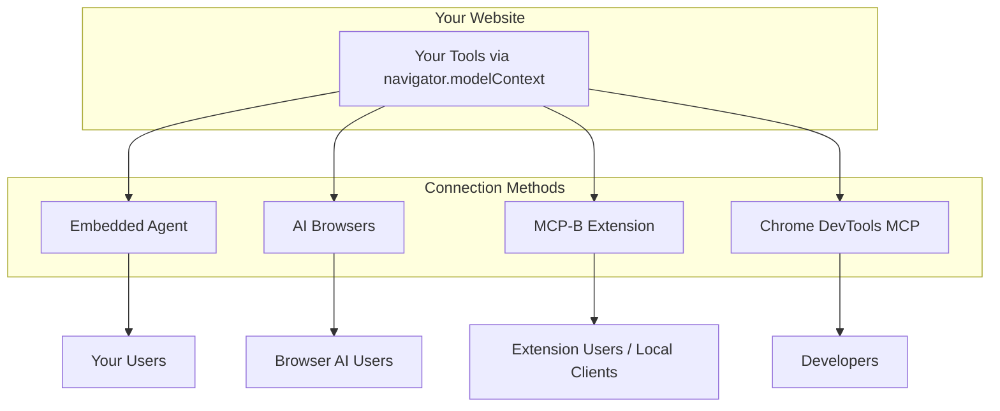
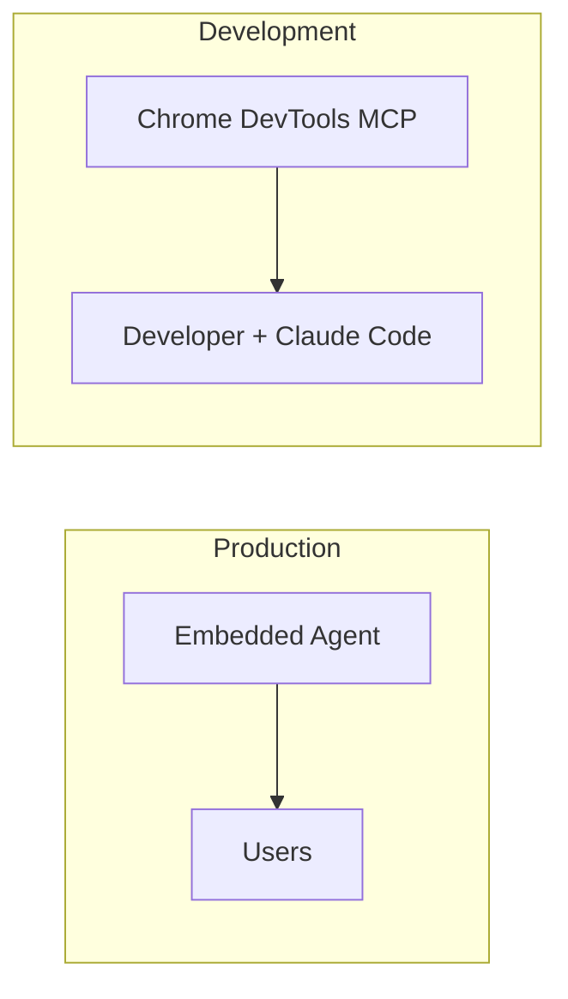

WebMCP provides four ways for AI agents to connect to your website's tools. Each serves different use cases, and understanding their trade-offs helps you choose the right approach.

## The Four Methods at a Glance



| Method | Primary Use Case | Who Controls the AI |
|--------|-----------------|---------------------|
| **Embedded Agent** | Production websites | You (the site owner) |
| **AI Browsers** | Future-proofing | Browser vendor |
| **MCP-B Extension** | Power users, local clients | User |
| **Chrome DevTools MCP** | Development & testing | Developer |

## Decision Framework

### Use Embedded Agent When...

You want to **ship an AI assistant to your users today**.

The embedded agent is a drop-in component you control. You provide the AI backend (or use a hosted service), and users interact with a chat interface on your site.

**Best for:**
- E-commerce sites wanting AI-powered product discovery
- SaaS apps adding conversational interfaces
- Documentation sites with AI search
- Any site wanting to own the user experience

**Trade-offs:**
- Requires API backend (yours or hosted)
- You're responsible for AI costs
- Full control over UX, branding, and behavior

```html
<webmcp-agent app-id="your-app" api-base="https://your-api.com" />
```

<Card title="Set Up Embedded Agent" icon="robot" href="/calling-tools/embedded-agent">
  Complete setup guide
</Card>

---

### Use AI Browsers When...

You want to **prepare for browser-native AI** without adding visible components.

AI browsers (Chrome AI, Perplexity, Arc, Edge Copilot) have built-in assistants that can discover and use your tools automatically. If you've registered tools via `navigator.modelContext`, these browsers can use them—no additional code needed.

**Best for:**
- Future-proofing your site for browser AI
- Sites that don't want visible AI UI
- Progressive enhancement strategies

**Trade-offs:**
- Limited browser support today
- No control over AI behavior or responses
- Depends on browser vendor implementation

```javascript
// This is all you need—AI browsers discover it automatically
navigator.modelContext.registerTool({ ... });
```

<Card title="Prepare for AI Browsers" icon="browser" href="/calling-tools/ai-browsers">
  How to prepare your site
</Card>

---

### Use MCP-B Extension When...

You want to **connect browser tools to local AI clients** like Claude Desktop.

The extension collects tools from all open tabs and bridges them to MCP clients running on your machine. This lets Claude Desktop, Claude Code, or other MCP-compatible tools interact with any website.

**Best for:**
- Developers connecting websites to Claude Desktop
- Power users who want AI access to any site
- Testing tools across multiple websites
- Creating personal automation workflows

**Trade-offs:**
- Requires extension installation
- User must configure native server for local clients
- Not suitable for general end-users

```json
// In your MCP client config
{
  "mcpServers": {
    "webmcp": {
      "type": "streamable-http",
      "url": "http://127.0.0.1:12306/mcp"
    }
  }
}
```

<Card title="Set Up the Extension" icon="puzzle-piece" href="/calling-tools/extension">
  Installation and configuration
</Card>

---

### Use Chrome DevTools MCP When...

You're **developing and testing WebMCP tools** with AI assistance.

Chrome DevTools MCP connects MCP clients directly to Chrome via the DevTools Protocol. Your AI can navigate, inspect, and call tools—perfect for AI-driven development workflows.

**Best for:**
- Developing WebMCP tools with AI assistance
- Automated testing of tool implementations
- CI/CD pipelines testing tool behavior
- Debugging tool execution

**Trade-offs:**
- Development-only (not for production)
- Requires Chrome and MCP client setup
- More complex configuration

```bash
claude mcp add chrome-devtools npx @mcp-b/chrome-devtools-mcp@latest
```

<Card title="Set Up DevTools MCP" icon="chrome" href="/calling-tools/devtools-mcp">
  Development workflow guide
</Card>

---

## Comparison Table

| Aspect | Embedded Agent | AI Browsers | Extension | DevTools MCP |
|--------|---------------|-------------|-----------|--------------|
| **Setup effort** | Low | None | Medium | Medium |
| **Works today** | Yes | Partial | Yes | Yes |
| **Production ready** | Yes | Depends | No | No |
| **Requires backend** | Yes | No | No | No |
| **User sees AI UI** | Yes | Browser UI | Extension UI | No UI |
| **You control AI** | Yes | No | No | Yes |
| **Local client support** | No | No | Yes | Yes |

## Common Patterns

### Pattern 1: Production + Development

Most teams use **Embedded Agent** for production and **Chrome DevTools MCP** for development:



### Pattern 2: Future-Proof Production

Add the embedded agent now, but structure your tools to also work with AI browsers:

```javascript
// Tools work with both embedded agent AND future AI browsers
navigator.modelContext.registerTool({
  name: "search_products",
  description: "Search products by name, category, or price range", // Clear for any AI
  // ...
});
```

### Pattern 3: Power User Bridge

Let technical users connect your site to their preferred AI:

1. Ship embedded agent for casual users
2. Document that power users can use the extension
3. Tools work the same way regardless of connection method

## Security Considerations

Each method has different security implications:

| Method | Trust Model |
|--------|-------------|
| **Embedded Agent** | You control the AI; tools run in user's session |
| **AI Browsers** | Browser vendor controls AI; same-origin policy applies |
| **Extension** | User installs extension; tools scoped by domain |
| **DevTools MCP** | Developer has full access during development |

All methods share a common principle: **tools execute in the browser with the user's permissions**. A tool can access anything the user can access on that page.

<Card title="Security Best Practices" icon="shield-halved" href="/security">
  Comprehensive security guide
</Card>

## Summary

- **Want AI on your site today?** → Embedded Agent
- **Want zero-config future-proofing?** → AI Browsers (just register tools)
- **Want local AI access to websites?** → MCP-B Extension
- **Want AI-assisted development?** → Chrome DevTools MCP

Most production sites will use the **Embedded Agent**. If you're building WebMCP tools, use **Chrome DevTools MCP** during development.
