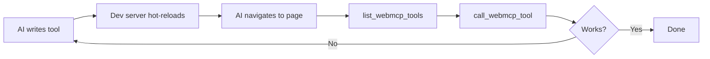

`@mcp-b/chrome-devtools-mcp` is a fork of Google's official [Chrome DevTools MCP](https://github.com/ChromeDevTools/chrome-devtools-mcp) server that adds **WebMCP integration**. It connects MCP clients (Claude Code, Cursor, etc.) directly to Chrome using the Chrome DevTools Protocol.

<Info>
**Fork of Official Chrome DevTools MCP**

This package extends the [official Chrome DevTools MCP](https://github.com/ChromeDevTools/chrome-devtools-mcp) by Google with two additional tools: `list_webmcp_tools` and `call_webmcp_tool`. All 28 browser automation tools from the original are included.
</Info>

## Prerequisite: Add the WebMCP Polyfill

For AI agents to call your WebMCP tools, your website must have the `@mcp-b/global` polyfill installed. This adds `navigator.modelContext` to your page.

<Tabs>
  <Tab title="Script Tag (Easiest)">
    Add to your HTML `<head>`:

    ```html
    <script src="https://unpkg.com/@mcp-b/global@latest/dist/index.iife.js"></script>
    ```

    That's it! The polyfill auto-initializes and is ready immediately.
  </Tab>

  <Tab title="ESM Import">
    ```javascript
    import 'https://unpkg.com/@mcp-b/global@latest/dist/index.esm.js';
    ```
  </Tab>

  <Tab title="NPM">
    ```bash
    npm install @mcp-b/global
    ```

    ```javascript
    import '@mcp-b/global';
    ```
  </Tab>
</Tabs>

<Warning>
Without the polyfill, `list_webmcp_tools` will return an empty list and `call_webmcp_tool` will fail.
</Warning>

## Quick Setup

<Steps>
  <Step title="Add polyfill to your website">
    Add to your HTML `<head>`:
    ```html
    <script src="https://unpkg.com/@mcp-b/global@latest/dist/index.iife.js"></script>
    ```
  </Step>

  <Step title="Register a tool">
    ```javascript
    navigator.modelContext.registerTool({
      name: "hello",
      description: "Say hello",
      inputSchema: { type: "object", properties: {} },
      async execute() {
        return { content: [{ type: "text", text: "Hello from WebMCP!" }] };
      }
    });
    ```
  </Step>

  <Step title="Add MCP server to your AI client">
    ```bash
    claude mcp add chrome-devtools npx @mcp-b/chrome-devtools-mcp@latest
    ```
  </Step>

  <Step title="Test the connection">
    Ask your AI:
    ```
    Navigate to http://localhost:3000, list available WebMCP tools, and call the hello tool
    ```
  </Step>
</Steps>

## WebMCP Integration

The server provides two key tools for WebMCP:

| Tool | Description |
|------|-------------|
| `list_webmcp_tools` | Discover all tools registered on the current page |
| `call_webmcp_tool` | Execute a WebMCP tool with arguments |

### Example Workflow



This creates a tight feedback loop for AI-driven development:

1. AI writes tool code
2. Your dev server hot-reloads
3. AI navigates to the page
4. AI discovers tools with `list_webmcp_tools`
5. AI tests with `call_webmcp_tool`
6. AI iterates until working

<Info>
This is **TDD for AI** - agents build and verify their own tools in real-time.
</Info>

## Browser Automation Tools

Beyond WebMCP, you get 28 browser automation tools:

<Tabs>
  <Tab title="Navigation">
    - `navigate` - Go to URL
    - `go_back` / `go_forward` - Browser history
    - `refresh` - Reload page
  </Tab>

  <Tab title="Interaction">
    - `click` - Click elements
    - `type` - Enter text
    - `scroll` - Scroll page
    - `hover` - Mouse hover
  </Tab>

  <Tab title="Inspection">
    - `screenshot` - Capture page
    - `get_page_content` - Get HTML/text
    - `evaluate` - Run JavaScript
  </Tab>

  <Tab title="Tabs">
    - `list_tabs` - See open tabs
    - `switch_tab` - Change active tab
    - `new_tab` / `close_tab` - Manage tabs
  </Tab>
</Tabs>

## Development Workflow

Use Chrome DevTools MCP during development to let your AI:

1. **Build tools** - Write WebMCP tool code
2. **Test immediately** - Navigate and call tools
3. **Debug issues** - Inspect results, check console
4. **Iterate quickly** - Fix and re-test in seconds

```bash
# Start your dev server
pnpm dev

# AI can now navigate, discover tools, and test them
```

## Best For

- AI-driven tool development
- Automated testing of WebMCP tools
- Browser automation scripts
- Development and debugging

## Not Ideal For

- Production tool consumption (use [Embedded Agent](/calling-tools/embedded-agent))
- End-user interactions (use [MCP-B Extension](/calling-tools/extension))

<Card title="Chrome DevTools MCP Package" icon="npm" href="/packages/chrome-devtools-mcp">
  Complete API reference and configuration options
</Card>
