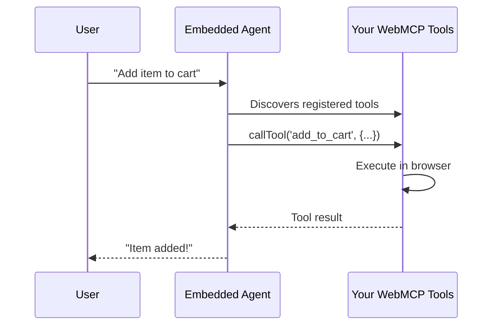

The WebMCP Embedded Agent is a drop-in AI assistant for any website. Add a custom element to your HTML, and users can interact with all the tools your site exposes via `navigator.modelContext`.

## Quick Start

<Steps>
  <Step title="Install the packages">
    ```bash
    npm install @mcp-b/global @mcp-b/embedded-agent
    ```
  </Step>

  <Step title="Initialize in your app entry">
    ```typescript "main.tsx"
    import '@mcp-b/global';
    import '@mcp-b/embedded-agent/web-component';
    ```
  </Step>

  <Step title="Add the custom element">
    ```html "index.html"
    <body>
      <div id="root"></div>
      <script type="module" src="/src/main.tsx"></script>
      <webmcp-agent
        app-id="your-app-id"
        api-base="https://your-api-endpoint"
        view-mode="pill"
      />
    </body>
    ```
  </Step>
</Steps>

## How It Works



Your website registers tools using `navigator.modelContext`, and the embedded agent can discover and call them automatically.

## Configuration

### Required Attributes

| Attribute | Description |
|-----------|-------------|
| `app-id` | Your application identifier |
| `api-base` | Your API endpoint URL |

### Optional Attributes

| Attribute | Default | Description |
|-----------|---------|-------------|
| `view-mode` | `"pill"` | Display mode: `"pill"`, `"panel"`, or `"fullscreen"` |

## Development Mode

During development, you can use your own API keys to test without cost:

```html
<webmcp-agent
  app-id="dev"
  api-base="http://localhost:3001"
  openai-api-key="sk-..."
  anthropic-api-key="sk-ant-..."
  view-mode="panel"
/>
```

<Warning>
Never expose API keys in production. Development keys are for local testing only.
</Warning>

## Registering Tools

The embedded agent automatically discovers tools registered on your page:

```tsx "ProductPage.tsx" twoslash
import { useWebMCP } from '@mcp-b/react-webmcp';
import { z } from 'zod';

export function ProductPage() {
  useWebMCP({
    name: 'add_to_cart',
    description: 'Add a product to the shopping cart',
    inputSchema: {
      productId: z.string().describe('Product ID to add'),
      quantity: z.number().min(1).describe('Quantity to add')
    },
    handler: async ({ productId, quantity }) => {
      await addToCart(productId, quantity);
      return { success: true, message: `Added ${quantity} item(s)` };
    }
  });

  return <div>...</div>;
}
```

For vanilla JavaScript:

```javascript "app.js"
import '@mcp-b/global';

navigator.modelContext.registerTool({
  name: 'search_products',
  description: 'Search the product catalog',
  inputSchema: {
    type: 'object',
    properties: {
      query: { type: 'string', description: 'Search query' }
    },
    required: ['query']
  },
  async execute({ query }) {
    const results = await searchProducts(query);
    return {
      content: [{ type: 'text', text: JSON.stringify(results) }]
    };
  }
});
```

## Loading via CDN

You can also load the embedded agent without a build step:

### ESM

```html
<script type="module">
  import 'https://unpkg.com/@mcp-b/global@latest/dist/index.esm.js';
  import 'https://unpkg.com/@mcp-b/embedded-agent@latest/dist/web-component.esm.js';
</script>

<webmcp-agent app-id="your-app-id" api-base="https://api.example.com" />
```

### IIFE (No Module Support)

```html
<script src="https://unpkg.com/@mcp-b/global@latest/dist/index.iife.js"></script>
<script src="https://unpkg.com/@mcp-b/embedded-agent@latest/dist/web-component.iife.js"></script>

<webmcp-agent app-id="your-app-id" api-base="https://api.example.com" />
```

## View Modes

The agent supports three display modes:

<Tabs>
  <Tab title="Pill">
    A compact floating button that expands into a chat interface. Best for minimal UI impact.

    ```html
    <webmcp-agent view-mode="pill" ... />
    ```
  </Tab>

  <Tab title="Panel">
    A slide-out panel anchored to the side of the screen. Good for extended interactions.

    ```html
    <webmcp-agent view-mode="panel" ... />
    ```
  </Tab>

  <Tab title="Fullscreen">
    Takes over the entire viewport. Ideal for dedicated AI experiences.

    ```html
    <webmcp-agent view-mode="fullscreen" ... />
    ```
  </Tab>
</Tabs>

## Security

<Info>
The embedded agent runs in your page's context and has access to the same tools your users can access. All tool executions happen client-side.
</Info>

- Tools inherit your website's permissions and origin policies
- User authentication is handled through your `app-id` configuration
- API keys are never exposed in production builds

<Card title="Security Best Practices" icon="shield-halved" href="/security">
  Review comprehensive security guidelines for WebMCP implementations
</Card>

## Next Steps

<CardGroup cols={2}>
  <Card title="Tool Registration" icon="wrench" href="/concepts/tool-registration">
    Learn how to create powerful tools for the agent to use
  </Card>

  <Card title="React Integration" icon="react" href="/packages/react-webmcp">
    Use the `useWebMCP` hook for easier tool registration
  </Card>

  <Card title="Best Practices" icon="stars" href="/best-practices">
    Patterns for building effective AI-powered features
  </Card>

  <Card title="Examples" icon="code" href="/examples">
    See complete working implementations
  </Card>
</CardGroup>
