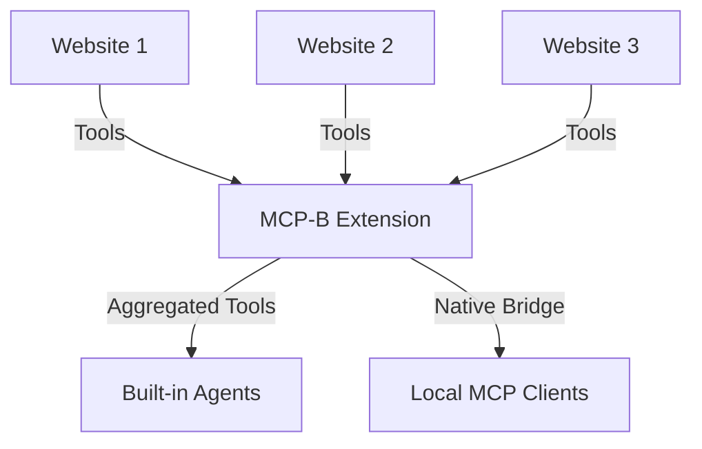

The [MCP-B Extension](https://chromewebstore.google.com/detail/mcp-b-extension/daohopfhkdelnpemnhlekblhnikhdhfa) is a Chrome extension that collects WebMCP tools from all open tabs and makes them available to AI agents.

## Installation

<Card
  title="Install MCP-B Extension"
  icon="chrome"
  href="https://chromewebstore.google.com/detail/mcp-b-extension/daohopfhkdelnpemnhlekblhnikhdhfa"
>
  Get the extension from the Chrome Web Store
</Card>

## How It Works



The extension:
- Discovers tools registered via `navigator.modelContext` on any tab
- Aggregates tools from all open tabs
- Provides built-in agents for common tasks
- Bridges tools to local MCP clients (Claude Desktop, Claude Code, etc.)

## Built-in Agents

The extension includes specialized agents:

<CardGroup cols={2}>
  <Card title="Userscript Engineer" icon="code">
    Build custom scripts to enhance websites
  </Card>

  <Card title="WebMCP Server" icon="server">
    Turn websites into AI-accessible tools
  </Card>

  <Card title="Browsing Agent" icon="browser">
    Navigate and inspect web pages
  </Card>

  <Card title="Chat Companion" icon="message">
    Ask questions without automation
  </Card>
</CardGroup>

<Card title="Understanding Agents" icon="robot" href="/extension/agents">
  Learn about each agent and when to use them
</Card>

## Connecting to Local MCP Clients

Bridge your browser tools to Claude Desktop, Claude Code, or other MCP clients:

<Steps>
  <Step title="Install the native server">
    ```bash
    npm install -g @mcp-b/native-server
    ```
  </Step>

  <Step title="Start the server">
    ```bash
    @mcp-b/native-server
    ```
  </Step>

  <Step title="Configure your MCP client">
    Add to your MCP client config (e.g., `~/.config/claude/mcp.json`):

    ```json
    {
      "mcpServers": {
        "webmcp": {
          "type": "streamable-http",
          "url": "http://127.0.0.1:12306/mcp"
        }
      }
    }
    ```
  </Step>
</Steps>

<Card title="Native Host Setup" icon="server" href="/native-host-setup">
  Complete setup guide for local MCP client integration
</Card>

## Creating Custom Tools

Use userscripts to add tools to any website:

<Card title="Managing Userscripts" icon="code" href="/extension/managing-userscripts">
  Create and manage custom WebMCP tools
</Card>

## Privacy & Security

- The extension only accesses tools that websites explicitly register
- Tools are scoped by domain
- Native server listens on localhost only
- No data is sent to external servers

<Card title="Extension Architecture" icon="diagram-project" href="/concepts/extension">
  Technical details about how the extension works
</Card>
