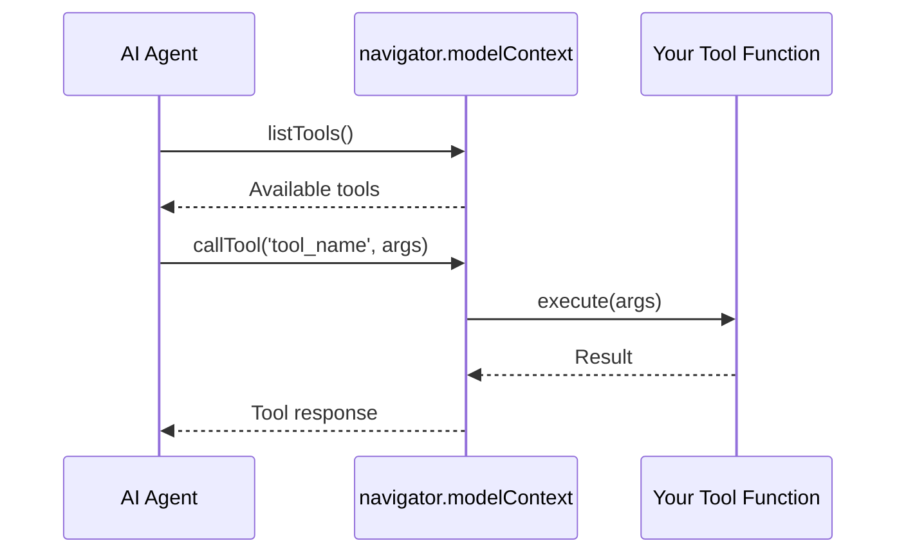

WebMCP lets websites expose tools that AI agents can discover and call. This section covers the different ways to connect agents to your tools.

## Where to Start

<CardGroup cols={2}>
  <Card title="New to WebMCP?" icon="graduation-cap" href="/calling-tools/tutorial">
    **Start with the tutorial** — Build a working AI assistant step-by-step and learn how tools and agents work together.
  </Card>

  <Card title="Know what you need?" icon="rocket" href="/calling-tools/embedded-agent">
    **Jump to setup** — Get the embedded agent running on your site with the how-to guide.
  </Card>

  <Card title="Not sure which method?" icon="compass" href="/calling-tools/choosing-a-method">
    **Compare options** — Understand the trade-offs between the four connection methods.
  </Card>

  <Card title="Need API details?" icon="book" href="/calling-tools/embedded-agent-reference">
    **Check the reference** — Full documentation of attributes, events, and methods.
  </Card>
</CardGroup>

## Connection Methods

Four ways to connect AI agents to your tools:

| Method | Best For | Setup |
|--------|----------|-------|
| [**Embedded Agent**](/calling-tools/embedded-agent) | Production websites | Add `<webmcp-agent>` element |
| [**AI Browsers**](/calling-tools/ai-browsers) | Future-proof integration | Just register tools |
| [**MCP-B Extension**](/calling-tools/extension) | Power users, local clients | Install extension |
| [**Chrome DevTools MCP**](/calling-tools/devtools-mcp) | Development, testing | Configure MCP client |

<Card title="Choosing a Method" icon="compass" href="/calling-tools/choosing-a-method">
  Detailed comparison with decision framework
</Card>

## How It Works

All methods follow the same pattern:



1. Your website registers tools via `navigator.modelContext`
2. The agent discovers available tools
3. When needed, the agent calls tools with arguments
4. Tools execute in the browser and return results

The connection method determines *how* the agent connects, but your tools work the same way regardless.

## Quick Example

Register a tool:

```javascript
navigator.modelContext.registerTool({
  name: 'search_products',
  description: 'Search the product catalog',
  inputSchema: {
    type: 'object',
    properties: {
      query: { type: 'string', description: 'Search query' }
    }
  },
  async execute({ query }) {
    const results = await searchProducts(query);
    return { content: [{ type: 'text', text: JSON.stringify(results) }] };
  }
});
```

Add the agent:

```html
<webmcp-agent app-id="your-app" api-base="https://your-api.com" />
```

That's it. The agent discovers your tool and can call it when users ask to search products.

<Card title="Build Your First AI Assistant" icon="graduation-cap" href="/calling-tools/tutorial">
  Full tutorial with step-by-step instructions
</Card>
