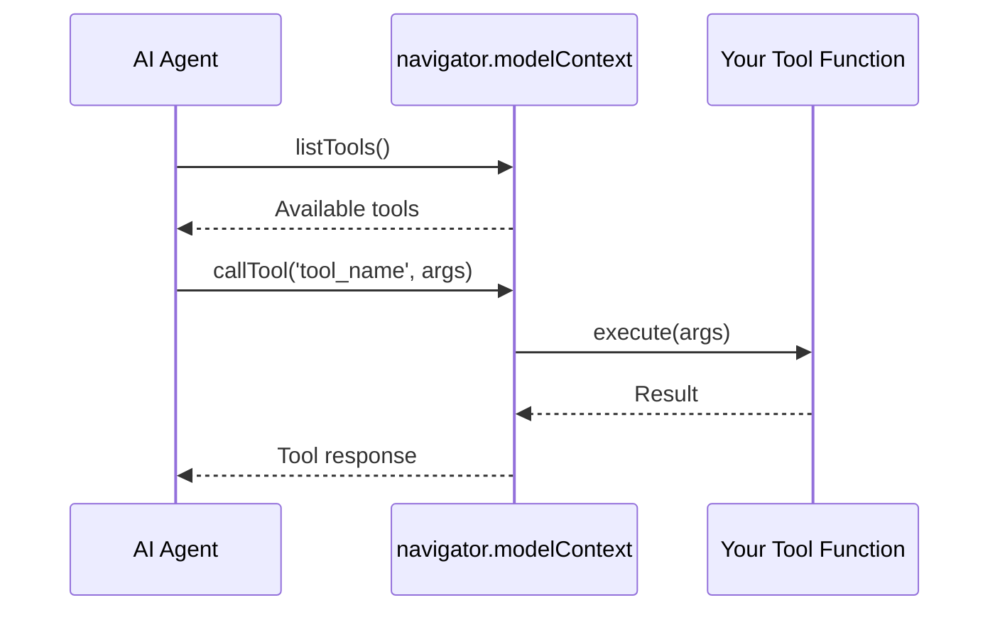

WebMCP lets websites expose tools that AI agents can discover and call. This section covers the different ways agents can connect to your tools.

## Connection Options

<CardGroup cols={2}>
  <Card title="Embedded Agent" icon="robot" href="/calling-tools/embedded-agent">
    **Recommended** - Drop-in AI assistant for your website
  </Card>

  <Card title="AI Browsers" icon="browser" href="/calling-tools/ai-browsers">
    Native browser AI (Chrome AI, Perplexity, etc.)
  </Card>

  <Card title="MCP-B Extension" icon="puzzle-piece" href="/calling-tools/extension">
    Browser extension for any website
  </Card>

  <Card title="Chrome DevTools MCP" icon="chrome" href="/calling-tools/devtools-mcp">
    Development and testing via DevTools Protocol
  </Card>
</CardGroup>

## Comparison

| Method | Setup | Best For | Requirements |
|--------|-------|----------|--------------|
| **Embedded Agent** | Add `<webmcp-agent>` element | Production websites | App ID |
| **AI Browsers** | None | Future-proof integration | AI-enabled browser |
| **MCP-B Extension** | Install extension | Testing, any website | Chrome extension |
| **Chrome DevTools MCP** | MCP client config | Development, automation | Chrome + MCP client |

## How It Works

All methods follow the same pattern:



1. Your website registers tools via `navigator.modelContext`
2. The agent discovers available tools
3. When needed, the agent calls tools with arguments
4. Tools execute in the browser and return results

## Quick Start

The fastest way to get started is with the Embedded Agent:

```html
<script type="module">
  import 'https://unpkg.com/@mcp-b/global@latest/dist/index.esm.js';
  import 'https://unpkg.com/@mcp-b/embedded-agent@latest/dist/web-component.esm.js';
</script>

<webmcp-agent
  app-id="your-app-id"
  api-base="https://your-api-endpoint"
/>
```

<Card title="Get Started with Embedded Agent" icon="rocket" href="/calling-tools/embedded-agent">
  Complete setup guide and configuration options
</Card>
