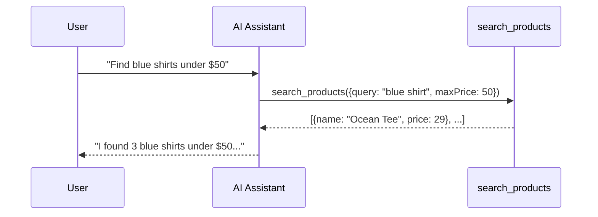

In this tutorial, you'll add an AI assistant to a website that can search products and answer questions. By the end, you'll have a working assistant that users can chat with.

<Info>
**What you'll learn:**
- How to register tools that AI agents can use
- How to add the embedded agent to your page
- How tools and agents work together
</Info>

## What We're Building

We'll create a simple product page with an AI assistant. Users will be able to ask things like "find me a blue shirt" and the assistant will search your products.



## Prerequisites

You need:
- A basic HTML page (we'll provide one)
- A code editor
- A browser

No frameworks required—we'll use plain JavaScript.

## Step 1: Create Your HTML Page

Create a new file called `index.html`:

```html "index.html"
<!DOCTYPE html>
<html lang="en">
<head>
  <meta charset="UTF-8">
  <meta name="viewport" content="width=device-width, initial-scale=1.0">
  <title>My Shop</title>
</head>
<body>
  <h1>Welcome to My Shop</h1>
  <p>Ask the AI assistant to help you find products!</p>
</body>
</html>
```

Open this file in your browser. You should see a simple heading and paragraph.

## Step 2: Add the WebMCP Polyfill

The WebMCP polyfill adds `navigator.modelContext` to your page. This is the API that lets you register tools.

Add these script tags inside `<head>`:

```html "index.html" {4-5}
<head>
  <meta charset="UTF-8">
  <meta name="viewport" content="width=device-width, initial-scale=1.0">
  <script src="https://unpkg.com/@mcp-b/global@latest/dist/index.iife.js"></script>
  <script src="https://unpkg.com/@mcp-b/embedded-agent@latest/dist/web-component.iife.js"></script>
  <title>My Shop</title>
</head>
```

Refresh your browser. Nothing visible changes yet, but `navigator.modelContext` is now available.

## Step 3: Create Sample Product Data

Before we register a tool, let's add some products to search through.

Add this script before the closing `</body>` tag:

```html "index.html"
<script>
  // Our product catalog
  const products = [
    { id: 1, name: "Ocean Blue Tee", color: "blue", price: 29, category: "shirts" },
    { id: 2, name: "Forest Green Hoodie", color: "green", price: 59, category: "hoodies" },
    { id: 3, name: "Midnight Black Jeans", color: "black", price: 79, category: "pants" },
    { id: 4, name: "Sky Blue Polo", color: "blue", price: 39, category: "shirts" },
    { id: 5, name: "Ruby Red Sweater", color: "red", price: 49, category: "sweaters" },
    { id: 6, name: "Classic White Tee", color: "white", price: 25, category: "shirts" },
  ];
</script>
```

## Step 4: Register Your First Tool

Now the key part—registering a tool that the AI can call.

Add this code inside the same `<script>` tag, after the products array:

```javascript "index.html"
// Register a search tool
navigator.modelContext.registerTool({
  name: "search_products",
  description: "Search the product catalog by query, color, category, or price range",
  inputSchema: {
    type: "object",
    properties: {
      query: {
        type: "string",
        description: "Search term to match against product names"
      },
      color: {
        type: "string",
        description: "Filter by color (blue, green, black, red, white)"
      },
      category: {
        type: "string",
        description: "Filter by category (shirts, hoodies, pants, sweaters)"
      },
      maxPrice: {
        type: "number",
        description: "Maximum price filter"
      }
    }
  },
  async execute({ query, color, category, maxPrice }) {
    let results = products;

    if (query) {
      results = results.filter(p =>
        p.name.toLowerCase().includes(query.toLowerCase())
      );
    }
    if (color) {
      results = results.filter(p => p.color === color.toLowerCase());
    }
    if (category) {
      results = results.filter(p => p.category === category.toLowerCase());
    }
    if (maxPrice) {
      results = results.filter(p => p.price <= maxPrice);
    }

    return {
      content: [{
        type: "text",
        text: results.length > 0
          ? `Found ${results.length} product(s):\n${results.map(p =>
              `- ${p.name} ($${p.price})`
            ).join('\n')}`
          : "No products found matching your criteria."
      }]
    };
  }
});

console.log("Tool registered! Check navigator.modelContext.listTools()");
```

Refresh your browser. Open the developer console (F12) and type:

```javascript
await navigator.modelContext.listTools()
```

You should see your `search_products` tool listed. The AI assistant will be able to call this.

## Step 5: Add the AI Assistant

Now let's add the visible assistant that users interact with.

Add this element just before the closing `</body>` tag (before the `<script>`):

```html "index.html"
<webmcp-agent
  app-id="demo"
  api-base="https://webmcp.sh/api"
  view-mode="pill"
/>
```

Refresh your browser. You should see a small floating button in the corner of the page.

<Info>
The `app-id="demo"` and `api-base` shown here connect to WebMCP's demo API. For production, you'll use your own credentials.
</Info>

## Step 6: Test Your Assistant

Click the floating button to open the chat interface. Try asking:

- "What products do you have?"
- "Show me blue shirts"
- "Find something under $40"
- "Do you have any hoodies?"

Watch how the assistant calls your `search_products` tool to answer questions.

## Step 7: Add a Second Tool

Let's add another tool to make the assistant more useful—one that provides product details.

Add this after your first `registerTool` call:

```javascript "index.html"
navigator.modelContext.registerTool({
  name: "get_product_details",
  description: "Get detailed information about a specific product by ID",
  inputSchema: {
    type: "object",
    properties: {
      productId: {
        type: "number",
        description: "The product ID to look up"
      }
    },
    required: ["productId"]
  },
  async execute({ productId }) {
    const product = products.find(p => p.id === productId);

    if (!product) {
      return {
        content: [{ type: "text", text: "Product not found." }]
      };
    }

    return {
      content: [{
        type: "text",
        text: `**${product.name}**\n` +
              `- Price: $${product.price}\n` +
              `- Color: ${product.color}\n` +
              `- Category: ${product.category}\n` +
              `- In stock: Yes`
      }]
    };
  }
});
```

Refresh and try: "Tell me more about the Ocean Blue Tee"

The assistant will first search for it, find the ID, then call `get_product_details`.

## Complete Code

Here's the full `index.html` for reference:

<Accordion title="Complete index.html">
```html "index.html"
<!DOCTYPE html>
<html lang="en">
<head>
  <meta charset="UTF-8">
  <meta name="viewport" content="width=device-width, initial-scale=1.0">
  <script src="https://unpkg.com/@mcp-b/global@latest/dist/index.iife.js"></script>
  <script src="https://unpkg.com/@mcp-b/embedded-agent@latest/dist/web-component.iife.js"></script>
  <title>My Shop</title>
</head>
<body>
  <h1>Welcome to My Shop</h1>
  <p>Ask the AI assistant to help you find products!</p>

  <webmcp-agent
    app-id="demo"
    api-base="https://webmcp.sh/api"
    view-mode="pill"
  />

  <script>
    const products = [
      { id: 1, name: "Ocean Blue Tee", color: "blue", price: 29, category: "shirts" },
      { id: 2, name: "Forest Green Hoodie", color: "green", price: 59, category: "hoodies" },
      { id: 3, name: "Midnight Black Jeans", color: "black", price: 79, category: "pants" },
      { id: 4, name: "Sky Blue Polo", color: "blue", price: 39, category: "shirts" },
      { id: 5, name: "Ruby Red Sweater", color: "red", price: 49, category: "sweaters" },
      { id: 6, name: "Classic White Tee", color: "white", price: 25, category: "shirts" },
    ];

    navigator.modelContext.registerTool({
      name: "search_products",
      description: "Search the product catalog by query, color, category, or price range",
      inputSchema: {
        type: "object",
        properties: {
          query: { type: "string", description: "Search term to match against product names" },
          color: { type: "string", description: "Filter by color (blue, green, black, red, white)" },
          category: { type: "string", description: "Filter by category (shirts, hoodies, pants, sweaters)" },
          maxPrice: { type: "number", description: "Maximum price filter" }
        }
      },
      async execute({ query, color, category, maxPrice }) {
        let results = products;
        if (query) results = results.filter(p => p.name.toLowerCase().includes(query.toLowerCase()));
        if (color) results = results.filter(p => p.color === color.toLowerCase());
        if (category) results = results.filter(p => p.category === category.toLowerCase());
        if (maxPrice) results = results.filter(p => p.price <= maxPrice);

        return {
          content: [{
            type: "text",
            text: results.length > 0
              ? `Found ${results.length} product(s):\n${results.map(p => `- ${p.name} ($${p.price})`).join('\n')}`
              : "No products found matching your criteria."
          }]
        };
      }
    });

    navigator.modelContext.registerTool({
      name: "get_product_details",
      description: "Get detailed information about a specific product by ID",
      inputSchema: {
        type: "object",
        properties: {
          productId: { type: "number", description: "The product ID to look up" }
        },
        required: ["productId"]
      },
      async execute({ productId }) {
        const product = products.find(p => p.id === productId);
        if (!product) return { content: [{ type: "text", text: "Product not found." }] };
        return {
          content: [{
            type: "text",
            text: `**${product.name}**\n- Price: $${product.price}\n- Color: ${product.color}\n- Category: ${product.category}\n- In stock: Yes`
          }]
        };
      }
    });
  </script>
</body>
</html>
```
</Accordion>

## What You Learned

You've now built a working AI assistant that:

1. **Discovers tools** registered via `navigator.modelContext`
2. **Understands user intent** and selects appropriate tools
3. **Calls tools** with the right arguments
4. **Returns results** in a conversational way

This is the foundation of WebMCP—your website exposes capabilities as tools, and AI agents use them.

## Next Steps

<CardGroup cols={2}>
  <Card title="Choosing a Method" icon="compass" href="/calling-tools/choosing-a-method">
    Learn when to use embedded agents vs. other connection methods
  </Card>

  <Card title="Tool Design" icon="wrench" href="/concepts/tool-design">
    Best practices for designing effective tools
  </Card>

  <Card title="React Integration" icon="react" href="/packages/react-webmcp">
    Use the `useWebMCP` hook for cleaner tool registration
  </Card>

  <Card title="Examples" icon="code" href="/examples">
    See more complete implementations
  </Card>
</CardGroup>
