<Note>
  **TL;DR:** WebMCP lets you turn JavaScript functions into AI-accessible tools using `navigator.modelContext.registerTool()`. AI agents can then discover and call these tools to help users interact with your website.
</Note>

## What is WebMCP?

**WebMCP** (Web Model Context Protocol) is a **W3C web standard** currently being incubated by the [Web Machine Learning Community Group](https://www.w3.org/community/webmachinelearning/) that defines how websites expose structured tools to AI agents through the browser's `navigator.modelContext` API.

- **W3C Specification**: [github.com/webmachinelearning/webmcp](https://github.com/webmachinelearning/webmcp)
- **Technical Proposal**: [WebMCP API Proposal](https://github.com/webmachinelearning/webmcp/blob/main/docs/proposal.md)

### Design Philosophy

WebMCP is built on a **human-in-the-loop** philosophy where the human web interface remains primary and AI agents augment (rather than replace) user interaction. This means:

- Users maintain visibility and control over all agent actions
- Tools enable collaborative workflows between humans and AI
- The web page UI remains the primary interaction method

### Relationship to MCP

WebMCP is inspired by Anthropic's [Model Context Protocol (MCP)](https://modelcontextprotocol.io) but adapted specifically for web browsers. While WebMCP shares similar concepts with MCP (tools, resources, structured communication), it is evolving as an independent web standard with its own specification path.

#### Key Architectural Decision: SDK vs Transport

The W3C community decided to implement WebMCP as an **SDK/abstraction layer** rather than a pure transport. This architectural choice provides important benefits:

1. **Browser implements WebMCP primitives** - `navigator.modelContext` is a web-native API, not just a message pipe
2. **Protocol independence** - Browsers can maintain backwards compatibility as MCP evolves without breaking existing implementations
3. **Platform-specific security** - Web security models (same-origin policy, CSP) are natively enforced at the browser level
4. **Declarative future** - Enables future declarative APIs (e.g., manifest-based tool registration)

**MCP-B's Role**: The MCP-B packages provide:
1. **W3C API polyfill** - Implements `navigator.modelContext` for browsers that don't yet support it natively
2. **Translation layer** - Bridges between WebMCP's web-native API and the MCP protocol

This dual role allows:
- Tools declared in WebMCP format to work with MCP clients
- Tools declared in MCP format to work with WebMCP browsers
- Version independence as both standards evolve
- Web-specific security features (same-origin policy, CSP)

#### Complementary, Not Competing

Both protocols serve different purposes and can work together:

- **Use MCP** for backend services, server-to-agent communication, headless integrations
- **Use WebMCP** for browser-based tools, user-present workflows, client-side interactions
- Both protocols can coexist in the same application

## Key Components

<CardGroup cols={2}>
  <Card title="W3C Web Model Context API" icon="globe">
    Standard browser API (`navigator.modelContext`) for registering tools - the WebMCP specification
  </Card>

  <Card title="MCP-B Polyfill & Bridge" icon="arrows-left-right">
    Implements navigator.modelContext for current browsers and translates between WebMCP and MCP protocols
  </Card>

  <Card title="Transport Layer" icon="tower-broadcast">
    Communication between browser contexts (tabs, extensions, pages)
  </Card>

  <Card title="MCP-B Extension" icon="puzzle-piece">
    Development and testing tool that collects WebMCP servers from tabs and supports userscript injection
  </Card>
</CardGroup>

## Architecture Overview

### High-Level Architecture

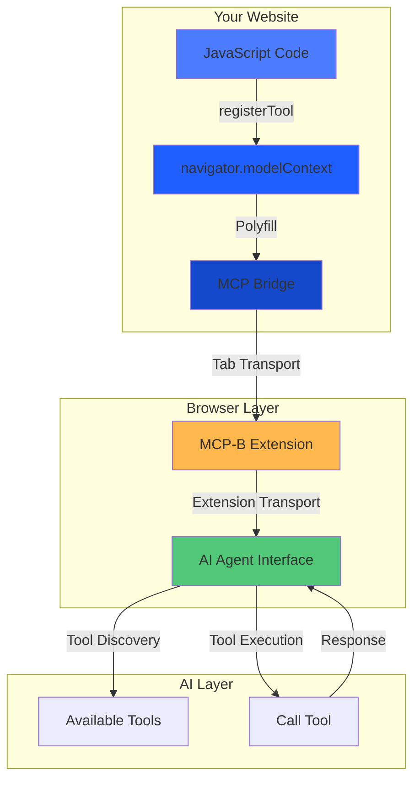

### Component Interaction Flow

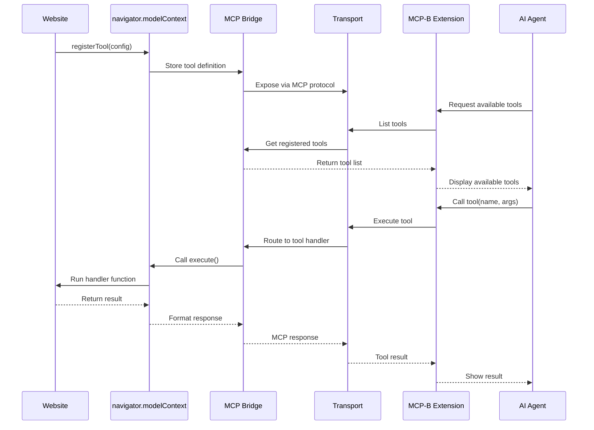

## Tool Registration

### The Simple Way: `registerTool()`

For most use cases, use `registerTool()` to add tools one at a time:

```javascript
const registration = navigator.modelContext.registerTool({
  name: "add_to_cart",
  description: "Add a product to the shopping cart",
  inputSchema: {
    type: "object",
    properties: {
      productId: { type: "string" },
      quantity: { type: "number" }
    }
  },
  async execute({ productId, quantity }) {
    await addToCart(productId, quantity);
    return {
      content: [{ type: "text", text: `Added ${quantity} items` }]
    };
  }
});

// Optional: Unregister later if needed
registration.unregister();
```

**Why `registerTool()` is the default:**
- ✅ Works everywhere (React, Vue, vanilla JS)
- ✅ Automatic cleanup when unregistered
- ✅ Perfect for component-scoped tools
- ✅ Simple and intuitive

<Accordion title="Advanced: provideContext() for base tools">
  Only use `provideContext()` when you need to set application-level base tools all at once:

  ```javascript
  navigator.modelContext.provideContext({
    tools: [/* array of tool definitions */]
  });
  ```

  **When to use:**
  - Defining core application tools at startup
  - Setting up a foundation tool set

  **Important:** This replaces all base tools each time it's called. For most use cases, stick with `registerTool()` instead.

  See [Advanced Patterns](/advanced) for detailed guidance.
</Accordion>


## Transport Types

### Tab Transport (In-Page Communication)

For communication within the same browser tab:

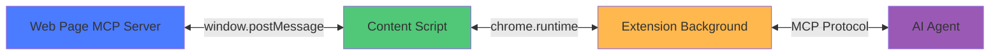

**Use cases:**
- Website exposing tools to extension
- Same-origin communication
- Real-time tool updates

### Extension Transport (Cross-Context)

For communication between extension components:

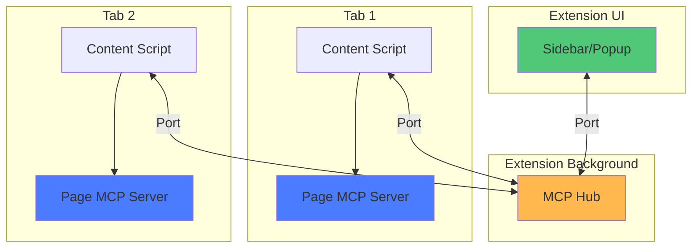

**Use cases:**
- Multi-tab tool aggregation
- Extension-to-extension communication
- Centralized tool management

## Tool Lifecycle

### React Component Example

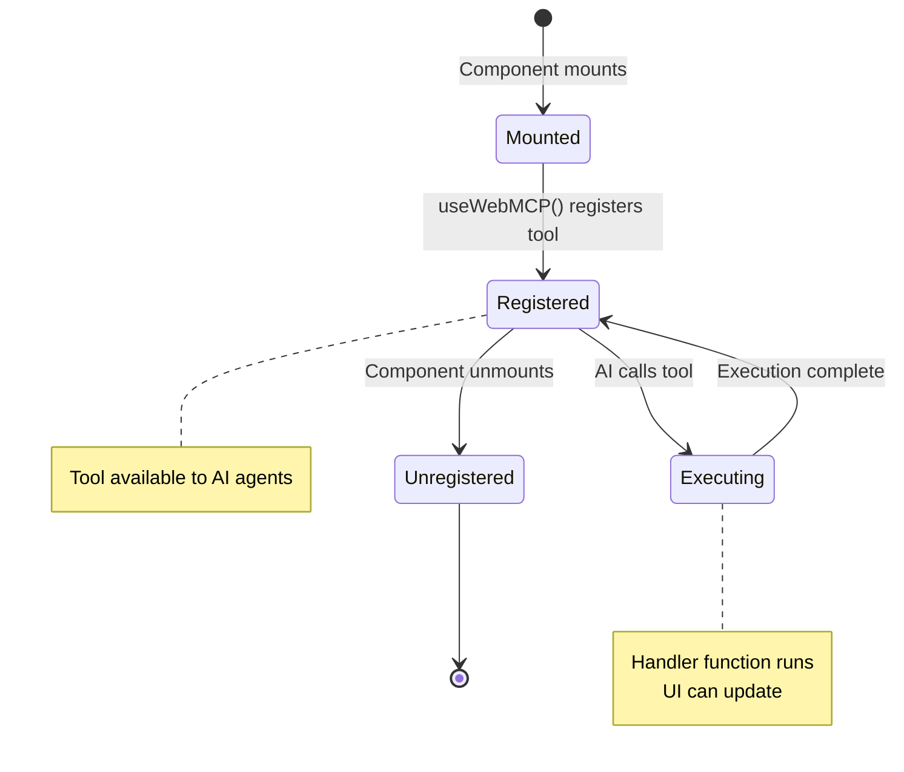

### Vanilla JavaScript Example

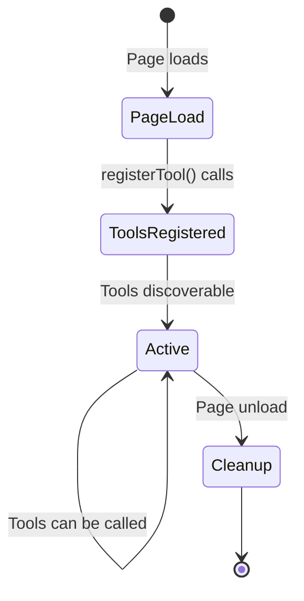

## Data Flow

Understanding how data flows through WebMCP when AI agents interact with your website tools.

### Tool Execution Flow

The following diagram shows how the extension maintains a fresh tool list and handles AI requests:

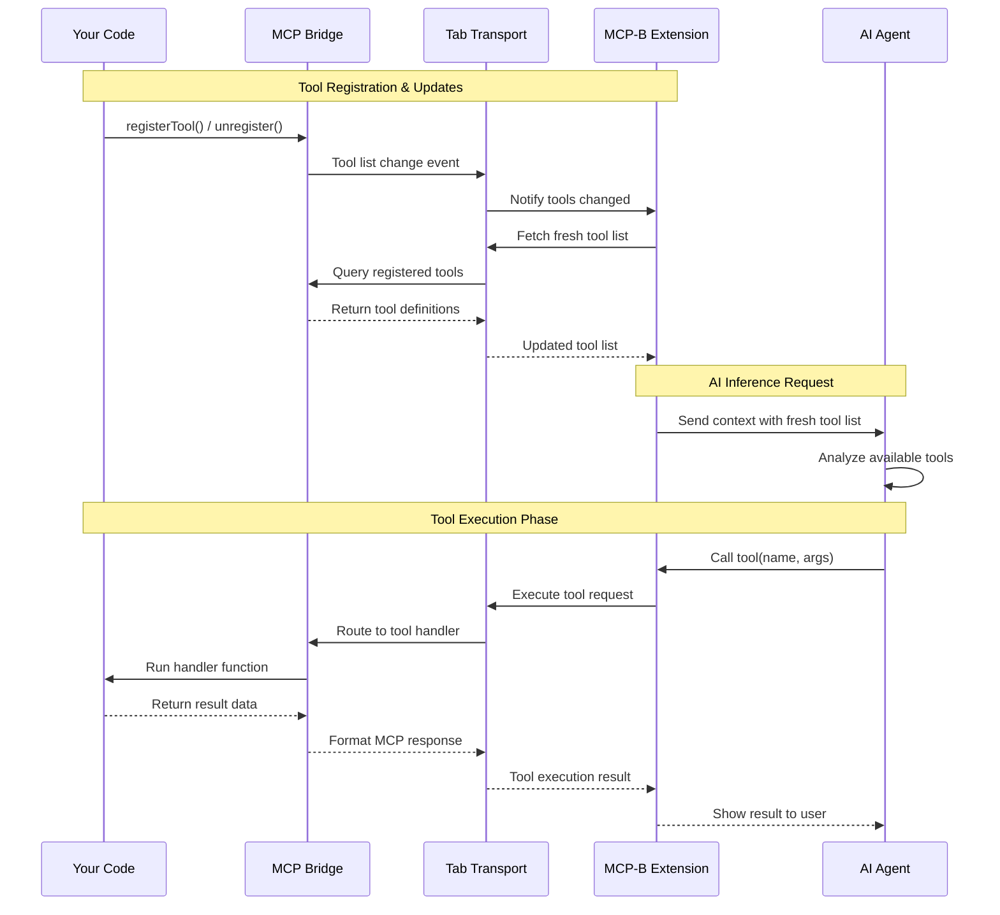

## Security Model

### Authentication & Authorization

Tools run in the user's browser context with their existing session:

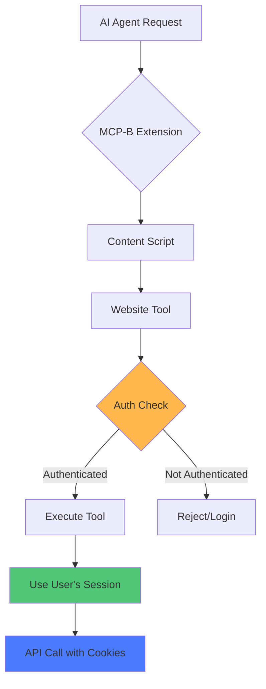

**Security principles:**
- ✅ Tools inherit user authentication
- ✅ Same-origin policy enforced
- ✅ No credential sharing needed
- ✅ Tools respect existing permissions

### Origin Validation

Tab Transport validates origins:

```javascript
new TabServerTransport({
  allowedOrigins: ['https://myapp.com', 'https://api.myapp.com']
  // or ['*'] for development only
});
```

## Extension Architecture

### MCP-B Extension Components

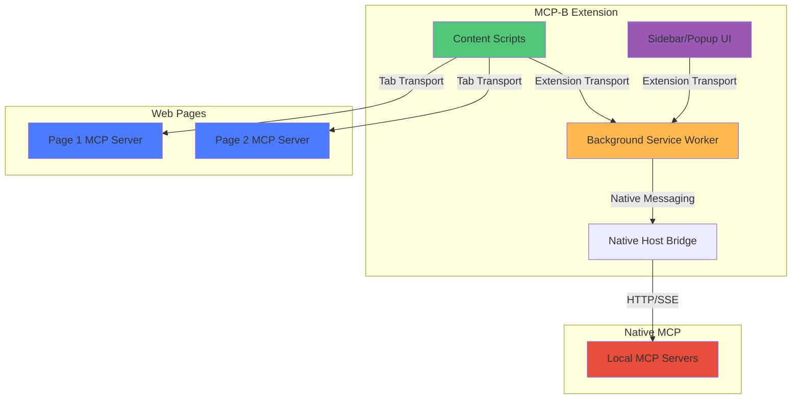

## MCP UI + WebMCP: Bidirectional AI Integration

### Overview

**MCP UI + WebMCP** enables a powerful pattern where AI assistants invoke tools that render interactive web applications, and those embedded apps can dynamically register new tools back to the AI in real-time. This creates a bidirectional feedback loop between conversational interfaces and embedded applications.

<Note>
  This pattern combines **MCP UI resources** (tools that return visual interfaces) with **WebMCP tool registration** (apps registering new tools via `navigator.modelContext`).
</Note>

### The Core Workflow

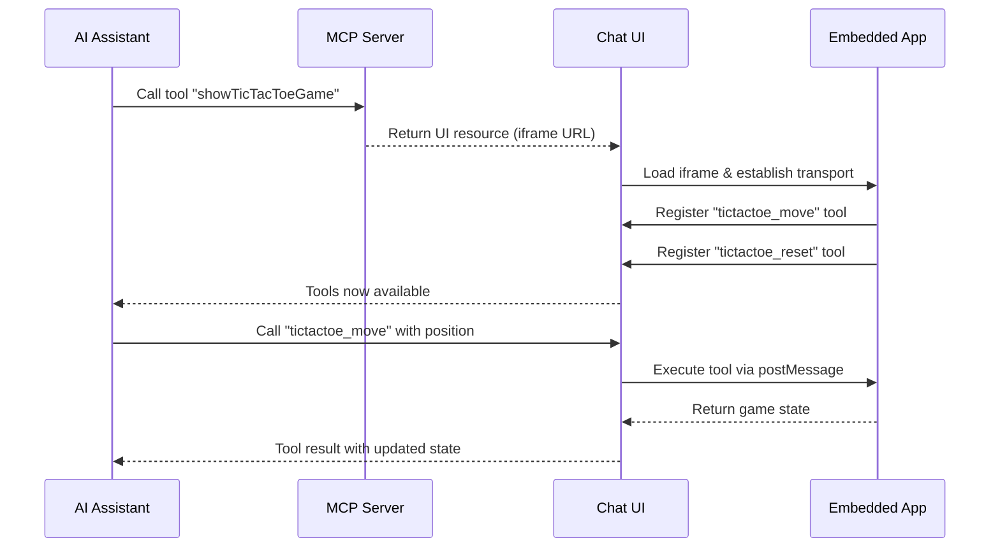

### Architecture Components

This pattern involves three main components working together:

#### 1. Chat UI (Parent Context)

The parent application that hosts the AI conversation and manages embedded apps:

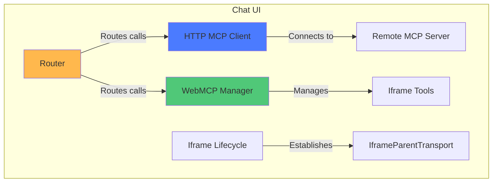

**Responsibilities:**
- Connects to remote MCP servers via HTTP/SSE
- Manages iframe lifecycle and transport channels
- Routes tool calls to appropriate clients (HTTP MCP or WebMCP)
- Displays AI conversation and embedded apps

#### 2. Embedded Apps (Iframe Context)

Mini-applications that run in iframes and register tools dynamically:

```mermaid
graph TB
    subgraph "Embedded App (Iframe)"
        A[React Component] -->|Uses| B[useWebMCP Hook]
        B -->|Registers via| C[navigator.modelContext]
        C -->|Polyfilled by| D[@mcp-b/global]
        D -->|Communicates via| E[IframeChildTransport]
        E <-->|postMessage| F[Parent Window]
    end

    style A fill:#4B7BFF
    style B fill:#50C878
    style D fill:#FFB84D
```

**Example tool registration:**

```typescript
import { useWebMCP } from '@mcp-b/react-webmcp';
import { z } from 'zod';

function TicTacToeGame() {
  const [gameState, setGameState] = useState(/* ... */);

  // Register a tool that AI can call
  useWebMCP({
    name: "tictactoe_ai_move",
    description: "Make a move at the specified position (0-8)",
    inputSchema: {
      position: z.number().int().min(0).max(8)
        .describe('Cell position in row-major order')
    },
    annotations: {
      idempotentHint: false,
    },
    handler: async ({ position }) => {
      // Update game state
      const newState = makeMove(gameState, position);
      setGameState(newState);

      return {
        content: [{
          type: "text",
          text: JSON.stringify({
            success: true,
            board: newState.board,
            winner: newState.winner
          })
        }]
      };
    }
  });

  return <div>{/* Game UI */}</div>;
}
```

#### 3. MCP Server

Remote server that exposes initial tools returning UI resources:

```typescript
import { McpAgent } from 'agents';
import { createUIResource } from '@mcp-ui/server';

class MyMCP extends McpAgent {
  async init() {
    // Register a tool that returns a UI resource
    this.server.tool(
      'showTicTacToeGame',
      'Display an interactive TicTacToe game',
      {},
      async () => {
        const uiResource = createUIResource({
          uri: 'ui://tictactoe',
          content: {
            type: 'externalUrl',
            iframeUrl: `${this.env.APP_URL}/`
          },
          encoding: 'text'
        });

        return {
          content: [uiResource]
        };
      }
    );
  }
}
```

### Communication Flow

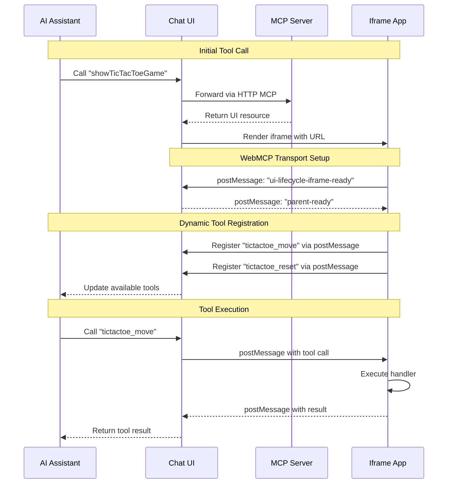

### MCP UI Resource Types

The MCP server can return three types of UI resources:

<AccordionGroup>
  <Accordion title="externalUrl - Iframe Embedding">
    Load a complete web application in an iframe:

    ```typescript
    createUIResource({
      uri: 'ui://myapp',
      content: {
        type: 'externalUrl',
        iframeUrl: 'https://example.com/app'
      },
      encoding: 'text'
    })
    ```

    **Best for:** Full-featured applications, existing web apps, complex interactions
  </Accordion>

  <Accordion title="rawHtml - Sanitized Markup">
    Inject sanitized HTML directly into the page:

    ```typescript
    createUIResource({
      uri: 'ui://widget',
      content: {
        type: 'rawHtml',
        htmlString: '<div class="widget">Content</div>'
      },
      encoding: 'text'
    })
    ```

    **Best for:** Simple widgets, static content, lightweight components
  </Accordion>

  <Accordion title="remoteDom - Dynamic Content">
    Stream dynamic DOM updates to the parent:

    ```typescript
    createUIResource({
      uri: 'ui://dynamic',
      content: {
        type: 'remoteDom',
        script: 'console.log("Dynamic content")',
        framework: 'vanilla'
      },
      encoding: 'text'
    })
    ```

    **Best for:** Real-time updates, streaming data, live visualizations
  </Accordion>
</AccordionGroup>

### WebMCP vs MCP-B

It's important to understand the distinction:

- **WebMCP**: The W3C standard specification defining `navigator.modelContext` API
- **MCP-B**: Reference implementation providing polyfills and npm packages before native browser support

The MCP-B packages (`@mcp-b/react-webmcp`, `@mcp-b/transports`, `@mcp-b/global`) enable WebMCP functionality today by:
1. Polyfilling `navigator.modelContext` for current browsers
2. Providing transport layers (iframe, tab, extension)
3. Bridging between WebMCP and MCP protocols

<Warning>
  **Critical Implementation Detail**: When using `@mcp-b/global`, you must call `initializeWebModelContext()` BEFORE React renders. This initialization must happen at module scope in your main.tsx entry point:

  ```typescript
  import { initializeWebModelContext } from '@mcp-b/global';

  // MUST run before React
  initializeWebModelContext({
    transport: {
      tabServer: {
        allowedOrigins: ['*'], // Restrict in production
      },
    },
  });

  // Then render React
  createRoot(document.getElementById('root')!).render(<App />);
  ```
</Warning>

### Getting Started

#### Quick Start with Scaffolding

Create a new bidirectional MCP UI + WebMCP project:

```bash
npx create-webmcp-app
cd your-project
pnpm install
pnpm dev
```

Choose between:
- **Vanilla template**: HTML/CSS/JS with no build step
- **React template**: TypeScript + Vite + React 19

#### Repository & Examples

<CardGroup cols={2}>
  <Card title="MCP UI WebMCP Repository" icon="github" href="https://github.com/WebMCP-org/mcp-ui-webmcp">
    Source code, templates, and comprehensive examples
  </Card>

  <Card title="Live Demo: Chat UI" icon="globe" href="https://mcp-ui.mcp-b.ai">
    Interactive chat interface with embedded MCP UI apps
  </Card>

  <Card title="Live Demo: Full App" icon="rocket" href="https://beattheclankers.com">
    Complete example showcasing bidirectional integration
  </Card>

  <Card title="Create WebMCP App" icon="terminal" href="https://www.npmjs.com/package/create-webmcp-app">
    CLI tool for scaffolding new projects
  </Card>
</CardGroup>

### Use Cases

This pattern is ideal for:

- **Interactive Games**: AI plays games by calling dynamically registered moves
- **Data Visualization**: Charts and graphs that expose filtering/manipulation tools
- **Form Builders**: Dynamic forms that register validation and submission tools
- **Collaboration Tools**: Whiteboards, document editors with AI-accessible operations
- **Configuration UIs**: Settings panels that expose configuration tools to AI

### Key Benefits

<AccordionGroup>
  <Accordion title="Dynamic Tool Discovery">
    Tools are registered based on app state, user context, or loaded features. The AI automatically discovers new capabilities as they become available.
  </Accordion>

  <Accordion title="Separation of Concerns">
    UI logic stays in the embedded app, while the parent manages the conversation. Each component has clear responsibilities.
  </Accordion>

  <Accordion title="Reusable Components">
    Apps can be embedded in multiple contexts (chat UIs, extensions, native apps) without modification.
  </Accordion>

  <Accordion title="Security Isolation">
    Iframes provide security boundaries while postMessage enables controlled communication.
  </Accordion>

  <Accordion title="Progressive Enhancement">
    Apps work as standalone web pages and gain AI capabilities when embedded in supporting contexts.
  </Accordion>
</AccordionGroup>

### Best Practices

When building MCP UI + WebMCP applications:

<AccordionGroup>
  <Accordion title="Keep iframes lightweight">
    - Minimize bundle size for fast loading
    - Use code splitting for large applications
    - Lazy load features as needed
  </Accordion>

  <Accordion title="Handle transport failures gracefully">
    - Detect when MCP-B transport is unavailable
    - Provide fallback UI for standalone usage
    - Show connection status to users
  </Accordion>

  <Accordion title="Design tools for AI consumption">
    - Use clear, descriptive tool names and descriptions
    - Return structured data (JSON) in tool results
    - Include success/error states in responses
    - Use annotations to provide hints: `idempotentHint`, `readOnlyHint`, `destructiveHint`
  </Accordion>

  <Accordion title="Manage tool lifecycle carefully">
    - Register tools when features are available
    - Unregister tools when features are removed
    - Use React hooks (useWebMCP) for automatic cleanup
  </Accordion>

  <Accordion title="Test both standalone and embedded modes">
    - Ensure apps work without MCP-B polyfill
    - Test iframe communication in different browsers
    - Verify tool calls work end-to-end
  </Accordion>
</AccordionGroup>

### Technical Requirements

**Minimum versions:**
- Node.js 24.3.0+
- pnpm 10.14.0+

**Key dependencies:**
- `@mcp-b/react-webmcp` - React hooks for WebMCP
- `@mcp-b/transports` - Iframe transport implementation
- `@mcp-b/global` - Core WebMCP polyfill (navigator.modelContext)
- `@modelcontextprotocol/sdk` - MCP protocol implementation
- `@mcp-ui/server` - MCP UI resource creation utilities

**Deployment targets:**
- Cloudflare Workers (MCP server)
- Cloudflare Pages (Chat UI)
- Any static hosting (embedded apps)

## Tool Schema & Validation

### Input Schema (JSON Schema)

```javascript
{
  type: "object",
  properties: {
    userId: {
      type: "string",
      pattern: "^[a-zA-Z0-9]+$",
      description: "User identifier"
    },
    limit: {
      type: "number",
      minimum: 1,
      maximum: 100,
      default: 10
    }
  },
  required: ["userId"]
}
```

### Zod Schema (React)

```typescript
import { z } from 'zod';

const schema = {
  userId: z.string().regex(/^[a-zA-Z0-9]+$/),
  limit: z.number().min(1).max(100).default(10)
};
```

## Best Practices

### Tool Design

<AccordionGroup>
  <Accordion title="Use descriptive names">
    Follow `verb_noun` pattern with domain prefix:
    - ✅ `posts_create`, `graph_navigate`, `db_query`
    - ❌ `doStuff`, `action1`, `helper`
  </Accordion>

  <Accordion title="Provide detailed descriptions">
    Help AI understand when and how to use your tools:
    ```javascript
    description: "Search products by name, category, or SKU. Returns paginated results with stock status."
    ```
  </Accordion>

  <Accordion title="Validate all inputs">
    Use JSON Schema or Zod to enforce types and constraints:
    ```javascript
    inputSchema: {
      productId: z.string().uuid(),
      quantity: z.number().positive().int()
    }
    ```
  </Accordion>

  <Accordion title="Return structured data">
    Use consistent response format:
    ```javascript
    return {
      content: [{ type: "text", text: JSON.stringify(result) }]
    };
    ```
  </Accordion>

  <Accordion title="Handle errors gracefully">
    Provide clear error messages:
    ```javascript
    return {
      content: [{ type: "text", text: "Product not found" }],
      isError: true
    };
    ```
  </Accordion>
</AccordionGroup>

## Performance Considerations

### Tool Registration

- ✅ Register tools once per component lifecycle
- ✅ Unregister when components unmount
- ❌ Don't register/unregister repeatedly
- ❌ Avoid creating too many tools (>50 per page)

### Tool Execution

- ✅ Use async/await for all operations
- ✅ Implement proper error handling
- ✅ Show loading states in UI
- ❌ Don't block the main thread
- ❌ Avoid heavy computations in handlers

## Related Documentation

<CardGroup cols={2}>
  <Card title="Quick Start" icon="rocket" href="/quickstart">
    Get started with WebMCP in minutes
  </Card>

  <Card title="Glossary" icon="book" href="/glossary">
    Key terminology and definitions
  </Card>

  <Card title="API Reference" icon="code" href="/packages/global">
    @mcp-b/global package documentation
  </Card>

  <Card title="Security Guide" icon="shield" href="/security">
    Security best practices
  </Card>

  <Card title="MCP Specification" icon="book" href="https://modelcontextprotocol.io">
    Official Model Context Protocol docs
  </Card>

  <Card title="Examples" icon="code" href="/examples">
    Real-world implementations
  </Card>
</CardGroup>
