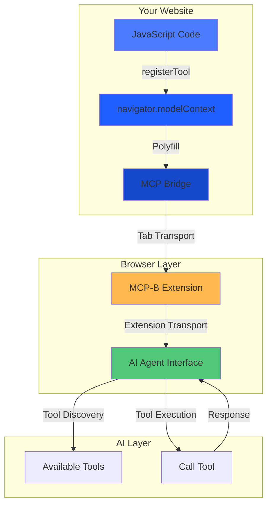
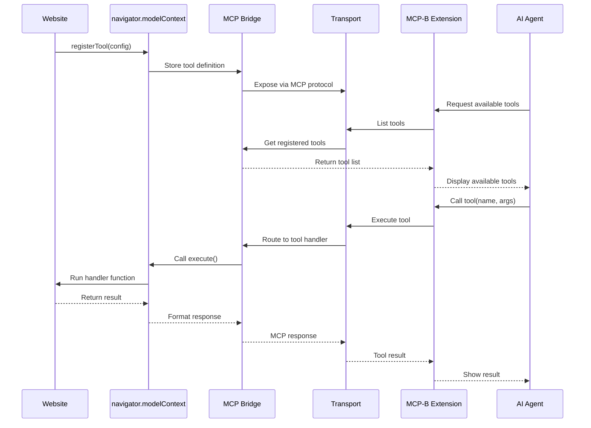
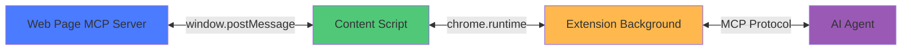
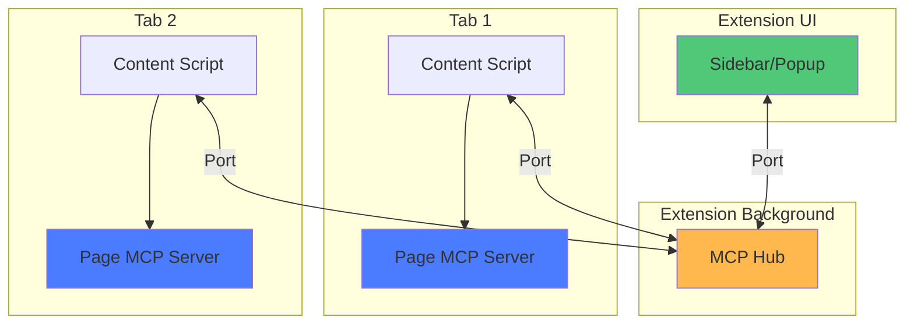
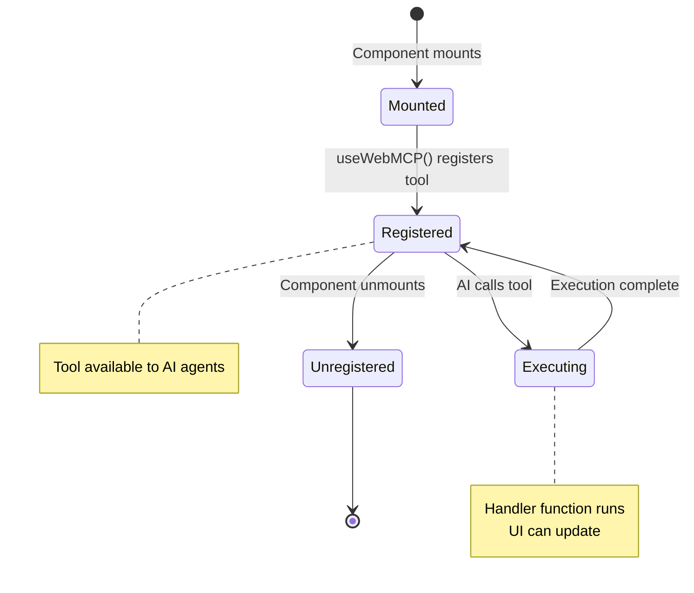
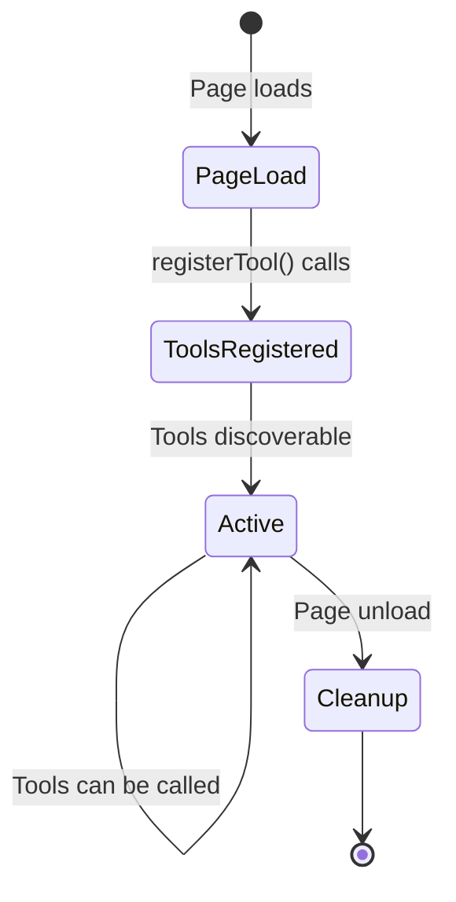
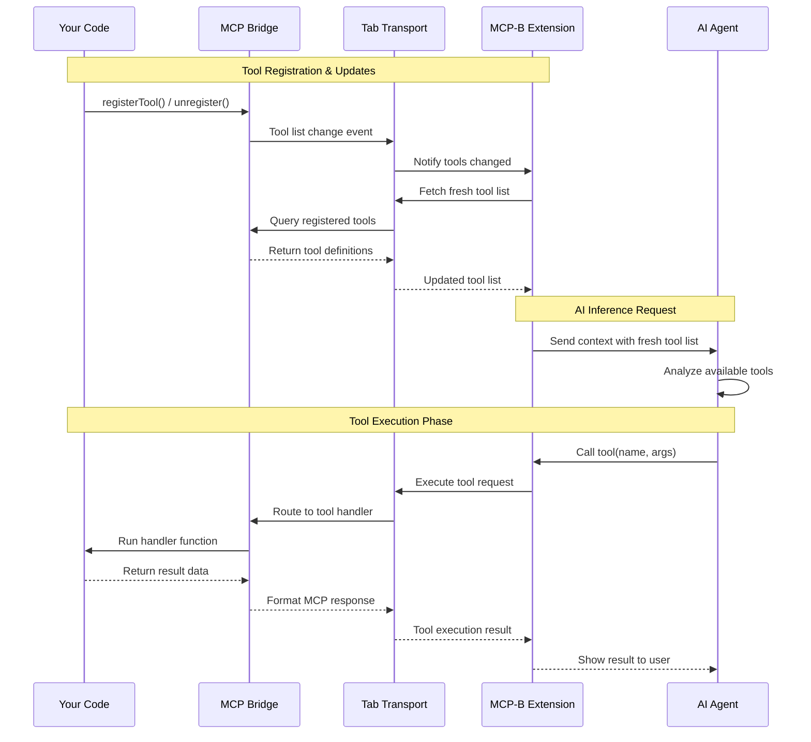
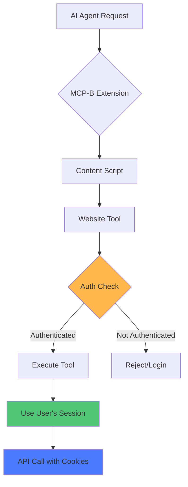
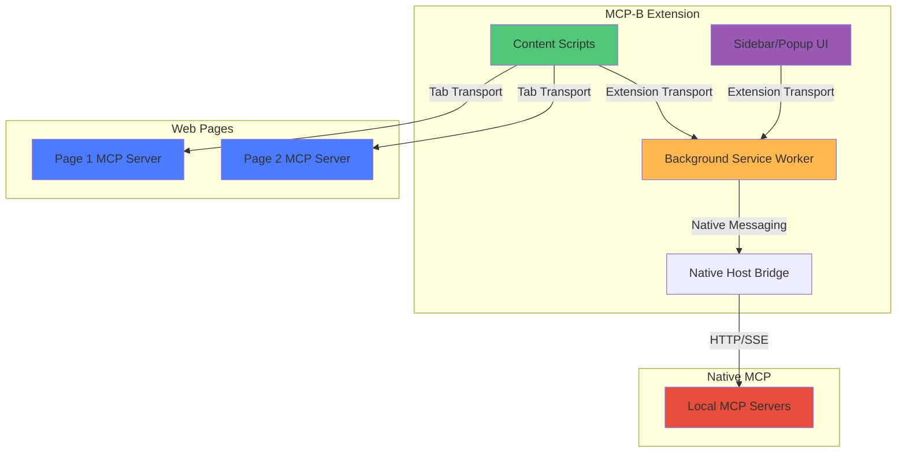

<Note>
  **TL;DR:** WebMCP lets you turn JavaScript functions into AI-accessible tools using `navigator.modelContext.registerTool()`. AI agents can then discover and call these tools to help users interact with your website.
</Note>

## What is WebMCP?

**WebMCP** (Web Model Context Protocol) is a **W3C web standard** currently being incubated by the [Web Machine Learning Community Group](https://www.w3.org/community/webmachinelearning/) that defines how websites expose structured tools to AI agents through the browser's `navigator.modelContext` API.

- **W3C Specification**: [github.com/webmachinelearning/webmcp](https://github.com/webmachinelearning/webmcp)
- **Technical Proposal**: [WebMCP API Proposal](https://github.com/webmachinelearning/webmcp/blob/main/docs/proposal.md)

### Design Philosophy

WebMCP is built on a **human-in-the-loop** philosophy where the human web interface remains primary and AI agents augment (rather than replace) user interaction. This means:

- Users maintain visibility and control over all agent actions
- Tools enable collaborative workflows between humans and AI
- The web page UI remains the primary interaction method

### What WebMCP Is NOT

<Warning>
These use cases are explicitly out of scope for the WebMCP standard.
</Warning>

WebMCP is **not** designed for:

- **Headless browsing** - Requires an active browsing context with the user present
- **Fully autonomous workflows** - Designed for collaborative human-AI interaction, not unsupervised agents
- **Backend service integration** - For server-to-agent communication without a UI, use [MCP](https://modelcontextprotocol.io)
- **UI replacement** - Tools augment the human interface, they don't replace it

### Relationship to MCP

WebMCP is inspired by Anthropic's [Model Context Protocol (MCP)](https://modelcontextprotocol.io) but adapted specifically for web browsers. While WebMCP shares similar concepts with MCP (tools, resources, structured communication), it is evolving as an independent web standard with its own specification path.

#### Key Architectural Decision: SDK vs Transport

The W3C community decided to implement WebMCP as an **SDK/abstraction layer** rather than a pure transport. This architectural choice provides important benefits:

1. **Browser implements WebMCP primitives** - `navigator.modelContext` is a web-native API, not just a message pipe
2. **Protocol independence** - Browsers can maintain backwards compatibility as MCP evolves without breaking existing implementations
3. **Platform-specific security** - Web security models (same-origin policy, CSP) are natively enforced at the browser level
4. **Declarative future** - Enables future declarative APIs (e.g., manifest-based tool registration)

**MCP-B's Role**: The MCP-B packages provide:
1. **W3C API polyfill** - Implements `navigator.modelContext` for browsers that don't yet support it natively
2. **Translation layer** - Bridges between WebMCP's web-native API and the MCP protocol

This dual role allows:
- Tools declared in WebMCP format to work with MCP clients
- Tools declared in MCP format to work with WebMCP browsers
- Version independence as both standards evolve
- Web-specific security features (same-origin policy, CSP)

#### Complementary, Not Competing

Both protocols serve different purposes and can work together:

- **Use MCP** for backend services, server-to-agent communication, headless integrations
- **Use WebMCP** for browser-based tools, user-present workflows, client-side interactions
- Both protocols can coexist in the same application

## Key Components

<CardGroup cols={2}>
  <Card title="W3C Web Model Context API" icon="globe">
    Standard browser API (`navigator.modelContext`) for registering tools - the WebMCP specification
  </Card>

  <Card title="MCP-B Polyfill & Bridge" icon="arrows-left-right">
    Implements navigator.modelContext for current browsers and translates between WebMCP and MCP protocols
  </Card>

  <Card title="Transport Layer" icon="tower-broadcast">
    Communication between browser contexts (tabs, extensions, pages)
  </Card>

  <Card title="MCP-B Extension" icon="puzzle-piece">
    Development and testing tool that collects WebMCP servers from tabs and supports userscript injection
  </Card>
</CardGroup>

## Architecture Overview

### High-Level Architecture



### Component Interaction Flow



## Tool Registration

### The Simple Way: `registerTool()`

For most use cases, use `registerTool()` to add tools one at a time:

```javascript
const registration = navigator.modelContext.registerTool({
  name: "add_to_cart",
  description: "Add a product to the shopping cart",
  inputSchema: {
    type: "object",
    properties: {
      productId: { type: "string" },
      quantity: { type: "number" }
    }
  },
  async execute({ productId, quantity }) {
    await addToCart(productId, quantity);
    return {
      content: [{ type: "text", text: `Added ${quantity} items` }]
    };
  }
});

// Optional: Unregister later if needed
registration.unregister();
```

**Why `registerTool()` is the default:**
- ✅ Works everywhere (React, Vue, vanilla JS)
- ✅ Automatic cleanup when unregistered
- ✅ Perfect for component-scoped tools
- ✅ Simple and intuitive

<Accordion title="Advanced: provideContext() for base tools">
  Only use `provideContext()` when you need to set application-level base tools all at once:

  ```javascript
  navigator.modelContext.provideContext({
    tools: [/* array of tool definitions */]
  });
  ```

  **When to use:**
  - Defining core application tools at startup
  - Setting up a foundation tool set

  **Important:** This replaces all base tools each time it's called. For most use cases, stick with `registerTool()` instead.

  See [Advanced Patterns](/advanced) for detailed guidance.
</Accordion>

<AccordionGroup>
  <Accordion title="Implementation Detail: Two-Bucket Tool System">
    WebMCP internally uses a dual-bucket system for tool organization. This is mostly transparent to you, but helps explain how `provideContext()` and `registerTool()` work together:

    ```mermaid
    graph LR
        subgraph "Bucket A: Base Tools"
            A1[App Tool 1]
            A2[App Tool 2]
        end

        subgraph "Bucket B: Dynamic Tools"
            B1[Component Tool 1]
            B2[Component Tool 2]
            B3[Feature Tool 1]
        end

        P[provideContext] -.->|Replaces| A1
        P -.->|Replaces| A2

        R1[registerTool] -->|Adds| B1
        R2[registerTool] -->|Adds| B2
        R3[registerTool] -->|Adds| B3

        B1 -.->|unregister| D1[Removed]

        style A1 fill:#FFB84D
        style A2 fill:#FFB84D
        style B1 fill:#4B7BFF
        style B2 fill:#4B7BFF
        style B3 fill:#4B7BFF
    ```

    **Key behaviors:**
    - Base tools (Bucket A) are replaced when `provideContext()` is called
    - Dynamic tools (Bucket B) persist independently
    - Each `registerTool()` returns an `unregister()` function
    - Tool name collisions throw errors

    **Why this matters:** If you use `provideContext()`, be aware it replaces all base tools. Tools registered with `registerTool()` are unaffected.
  </Accordion>
</AccordionGroup>

## Transport Types

### Tab Transport (In-Page Communication)

For communication within the same browser tab:



**Use cases:**
- Website exposing tools to extension
- Same-origin communication
- Real-time tool updates

### Extension Transport (Cross-Context)

For communication between extension components:



**Use cases:**
- Multi-tab tool aggregation
- Extension-to-extension communication
- Centralized tool management

## Tool Lifecycle

### React Component Example



### Vanilla JavaScript Example



## Data Flow

Understanding how data flows through WebMCP when AI agents interact with your website tools.

### Tool Execution Flow

The following diagram shows how the extension maintains a fresh tool list and handles AI requests:



## Security Model

### Authentication & Authorization

Tools run in the user's browser context with their existing session:



**Security principles:**
- ✅ Tools inherit user authentication
- ✅ Same-origin policy enforced
- ✅ No credential sharing needed
- ✅ Tools respect existing permissions

### Origin Validation

Tab Transport validates origins:

```javascript
new TabServerTransport({
  allowedOrigins: ['https://myapp.com', 'https://api.myapp.com']
  // or ['*'] for development only
});
```

## Extension Architecture

### MCP-B Extension Components



## Tool Schema & Validation

### Input Schema (JSON Schema)

```javascript
{
  type: "object",
  properties: {
    userId: {
      type: "string",
      pattern: "^[a-zA-Z0-9]+$",
      description: "User identifier"
    },
    limit: {
      type: "number",
      minimum: 1,
      maximum: 100,
      default: 10
    }
  },
  required: ["userId"]
}
```

### Zod Schema (React)

```typescript
import { z } from 'zod';

const schema = {
  userId: z.string().regex(/^[a-zA-Z0-9]+$/),
  limit: z.number().min(1).max(100).default(10)
};
```

## Best Practices

### Tool Design

<AccordionGroup>
  <Accordion title="Use descriptive names">
    Follow `verb_noun` pattern with domain prefix:
    - ✅ `posts_create`, `graph_navigate`, `db_query`
    - ❌ `doStuff`, `action1`, `helper`
  </Accordion>

  <Accordion title="Provide detailed descriptions">
    Help AI understand when and how to use your tools:
    ```javascript
    description: "Search products by name, category, or SKU. Returns paginated results with stock status."
    ```
  </Accordion>

  <Accordion title="Validate all inputs">
    Use JSON Schema or Zod to enforce types and constraints:
    ```javascript
    inputSchema: {
      productId: z.string().uuid(),
      quantity: z.number().positive().int()
    }
    ```
  </Accordion>

  <Accordion title="Return structured data">
    Use consistent response format:
    ```javascript
    return {
      content: [{ type: "text", text: JSON.stringify(result) }]
    };
    ```
  </Accordion>

  <Accordion title="Handle errors gracefully">
    Provide clear error messages:
    ```javascript
    return {
      content: [{ type: "text", text: "Product not found" }],
      isError: true
    };
    ```
  </Accordion>
</AccordionGroup>

## Performance Considerations

### Tool Registration

- ✅ Register tools once per component lifecycle
- ✅ Unregister when components unmount
- ❌ Don't register/unregister repeatedly
- ❌ Avoid creating too many tools (>50 per page)

### Tool Execution

- ✅ Use async/await for all operations
- ✅ Implement proper error handling
- ✅ Show loading states in UI
- ❌ Don't block the main thread
- ❌ Avoid heavy computations in handlers

## External Standards & Specifications

Learn more about the underlying protocols:

<CardGroup cols={2}>
  <Card title="MCP Specification" icon="book" href="https://modelcontextprotocol.io">
    Official Model Context Protocol documentation from Anthropic
  </Card>

  <Card title="MCP SDK" icon="code" href="https://github.com/modelcontextprotocol/typescript-sdk">
    TypeScript SDK for building MCP servers and clients
  </Card>
</CardGroup>

## Related Resources

<CardGroup cols={2}>
  <Card title="Glossary" icon="book" href="/glossary">
    Key terminology and definitions
  </Card>

  <Card title="Quick Start" icon="rocket" href="/quickstart">
    Get started in minutes
  </Card>

  <Card title="API Reference" icon="code" href="/packages/global">
    Detailed API documentation
  </Card>

  <Card title="Security Guide" icon="shield" href="/security">
    Security best practices
  </Card>
</CardGroup>

## Next Steps

<Steps>
  <Step title="Understand the glossary">
    Review [key terminology](/glossary) used throughout the documentation
  </Step>

  <Step title="Follow the quickstart">
    Build your first WebMCP integration in [Quick Start](/quickstart)
  </Step>

  <Step title="Explore examples">
    See real-world implementations in [Examples](/examples)
  </Step>

  <Step title="Deep dive into packages">
    Learn about specific packages in the [NPM Packages](/packages/global) section
  </Step>
</Steps>
