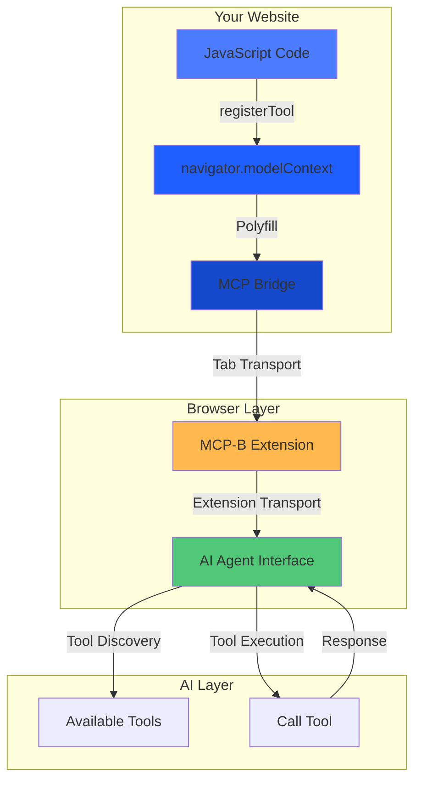
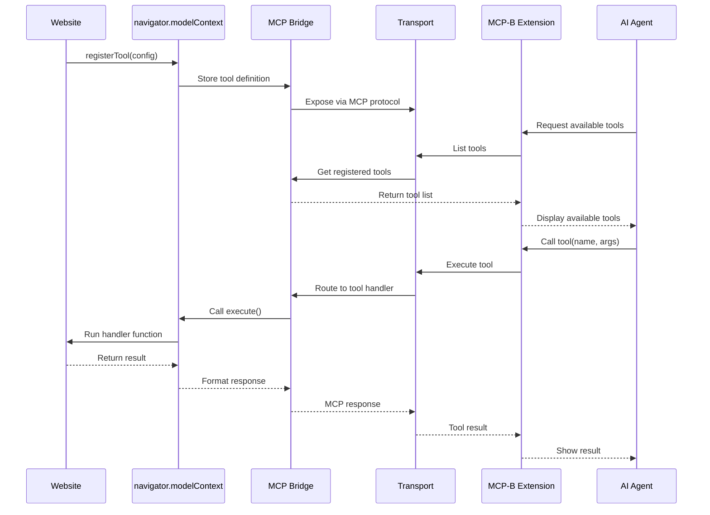
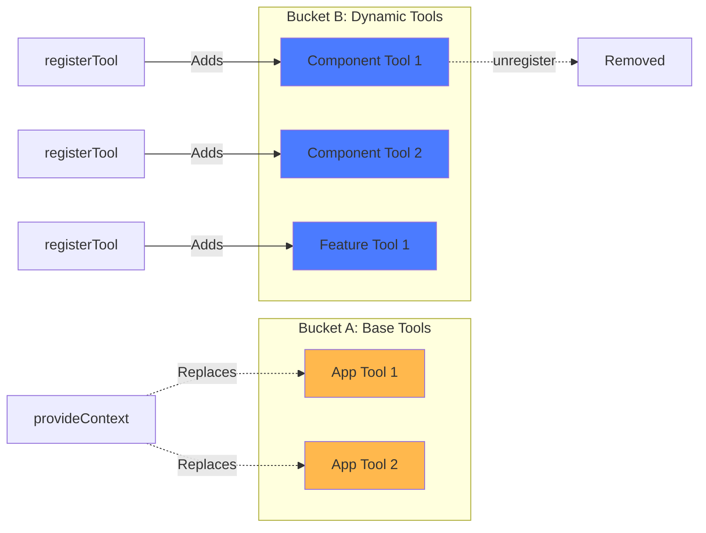
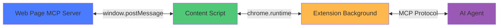
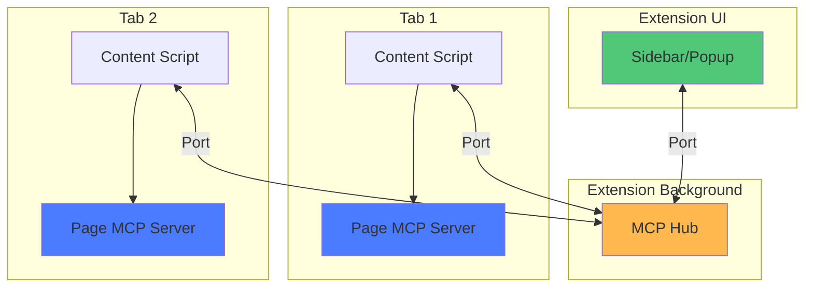
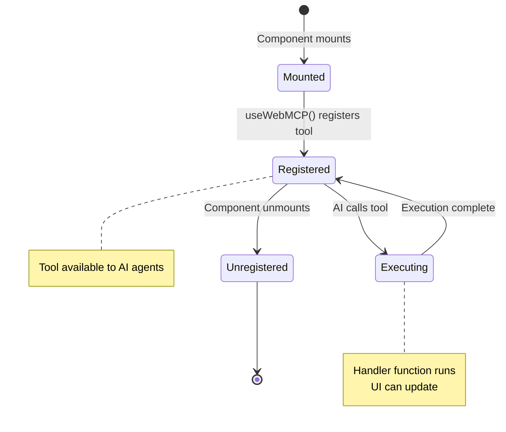
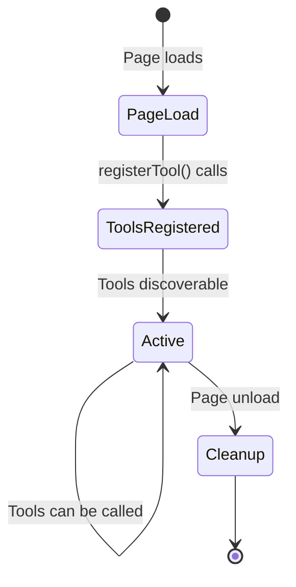
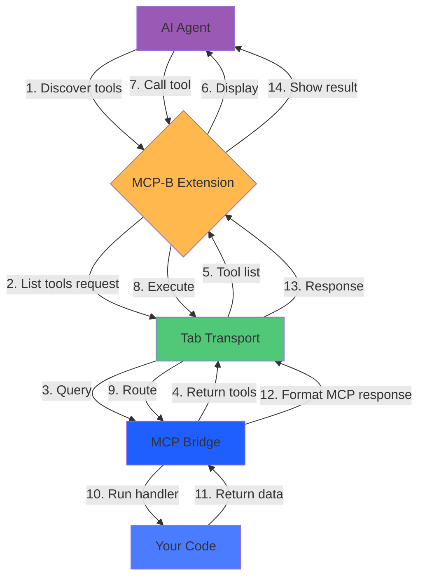
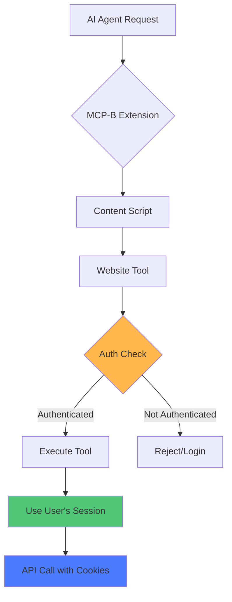
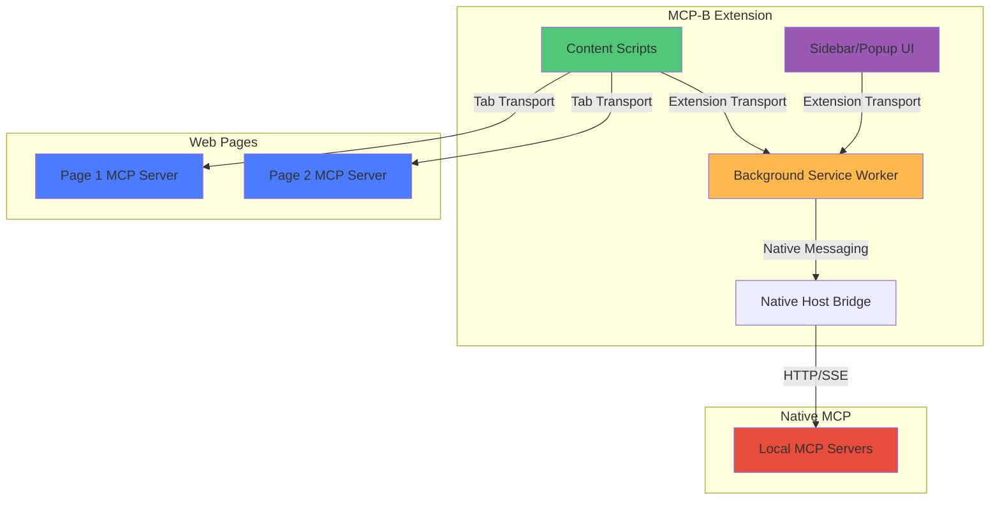

## What is WebMCP?

WebMCP is a **polyfill for the W3C Web Model Context API** that brings the Model Context Protocol (MCP) to web browsers. It allows websites to expose their functionality as structured tools that AI agents can discover and use.

## Key Components

<CardGroup cols={2}>
  <Card title="W3C Web Model Context API" icon="globe">
    Standard browser API (`navigator.modelContext`) for registering tools
  </Card>

  <Card title="MCP Bridge" icon="arrows-left-right">
    Automatic bridging between Web API and MCP protocol
  </Card>

  <Card title="Transport Layer" icon="tower-broadcast">
    Communication between browser contexts (tabs, extensions, pages)
  </Card>

  <Card title="MCP-B Extension" icon="puzzle-piece">
    Browser extension that connects AI agents to website tools
  </Card>
</CardGroup>

## Architecture Overview

### High-Level Architecture



### Component Interaction Flow



## Tool Registration: Two Approaches

### Recommended: `registerTool()` (Dynamic Tools)

Use for component-scoped, dynamic, or lifecycle-managed tools:

```javascript
const registration = navigator.modelContext.registerTool({
  name: "my_tool",
  description: "Tool description",
  inputSchema: { type: "object", properties: {} },
  async execute(args) {
    return { content: [{ type: "text", text: "Result" }] };
  }
});

// Clean up later
registration.unregister();
```

**Benefits:**
- ✅ Component lifecycle integration
- ✅ Independent of base tools
- ✅ Can be unregistered
- ✅ Perfect for React/Vue

### Advanced: `provideContext()` (Base Tools)

Use sparingly for application-level base tools:

```javascript
navigator.modelContext.provideContext({
  tools: [/* array of tool definitions */]
});
```

**When to use:**
- Top-level application tools
- Tools that define core functionality
- Initial tool set at app startup

**Important:** Replaces all base tools each time called!

## Two-Bucket Tool Management

WebMCP uses a dual-bucket system for tool organization:



**Key behaviors:**
- Base tools (Bucket A) are replaced when `provideContext()` is called
- Dynamic tools (Bucket B) persist independently
- Each `registerTool()` returns an `unregister()` function
- Tool name collisions throw errors

## Transport Types

### Tab Transport (In-Page Communication)

For communication within the same browser tab:



**Use cases:**
- Website exposing tools to extension
- Same-origin communication
- Real-time tool updates

### Extension Transport (Cross-Context)

For communication between extension components:



**Use cases:**
- Multi-tab tool aggregation
- Extension-to-extension communication
- Centralized tool management

## Tool Lifecycle

### React Component Example



### Vanilla JavaScript Example



## Data Flow

Understanding how data flows through WebMCP when AI agents interact with your website tools.

### Tool Execution Flow

The following diagram shows the complete request-response cycle when an AI agent discovers and calls a tool:



## Security Model

### Authentication & Authorization

Tools run in the user's browser context with their existing session:



**Security principles:**
- ✅ Tools inherit user authentication
- ✅ Same-origin policy enforced
- ✅ No credential sharing needed
- ✅ Tools respect existing permissions

### Origin Validation

Tab Transport validates origins:

```javascript
new TabServerTransport({
  allowedOrigins: ['https://myapp.com', 'https://api.myapp.com']
  // or ['*'] for development only
});
```

## Extension Architecture

### MCP-B Extension Components



## Tool Schema & Validation

### Input Schema (JSON Schema)

```javascript
{
  type: "object",
  properties: {
    userId: {
      type: "string",
      pattern: "^[a-zA-Z0-9]+$",
      description: "User identifier"
    },
    limit: {
      type: "number",
      minimum: 1,
      maximum: 100,
      default: 10
    }
  },
  required: ["userId"]
}
```

### Zod Schema (React)

```typescript
import { z } from 'zod';

const schema = {
  userId: z.string().regex(/^[a-zA-Z0-9]+$/),
  limit: z.number().min(1).max(100).default(10)
};
```

## Best Practices

### Tool Design

<AccordionGroup>
  <Accordion title="Use descriptive names">
    Follow `verb_noun` pattern with domain prefix:
    - ✅ `posts_create`, `graph_navigate`, `db_query`
    - ❌ `doStuff`, `action1`, `helper`
  </Accordion>

  <Accordion title="Provide detailed descriptions">
    Help AI understand when and how to use your tools:
    ```javascript
    description: "Search products by name, category, or SKU. Returns paginated results with stock status."
    ```
  </Accordion>

  <Accordion title="Validate all inputs">
    Use JSON Schema or Zod to enforce types and constraints:
    ```javascript
    inputSchema: {
      productId: z.string().uuid(),
      quantity: z.number().positive().int()
    }
    ```
  </Accordion>

  <Accordion title="Return structured data">
    Use consistent response format:
    ```javascript
    return {
      content: [{ type: "text", text: JSON.stringify(result) }]
    };
    ```
  </Accordion>

  <Accordion title="Handle errors gracefully">
    Provide clear error messages:
    ```javascript
    return {
      content: [{ type: "text", text: "Product not found" }],
      isError: true
    };
    ```
  </Accordion>
</AccordionGroup>

## Performance Considerations

### Tool Registration

- ✅ Register tools once per component lifecycle
- ✅ Unregister when components unmount
- ❌ Don't register/unregister repeatedly
- ❌ Avoid creating too many tools (>50 per page)

### Tool Execution

- ✅ Use async/await for all operations
- ✅ Implement proper error handling
- ✅ Show loading states in UI
- ❌ Don't block the main thread
- ❌ Avoid heavy computations in handlers

## Related Resources

<CardGroup cols={2}>
  <Card title="Glossary" icon="book" href="/glossary">
    Key terminology and definitions
  </Card>

  <Card title="Quick Start" icon="rocket" href="/quickstart">
    Get started in minutes
  </Card>

  <Card title="API Reference" icon="code" href="/packages/global">
    Detailed API documentation
  </Card>

  <Card title="Security Guide" icon="shield" href="/security">
    Security best practices
  </Card>
</CardGroup>

## Next Steps

<Steps>
  <Step title="Understand the glossary">
    Review [key terminology](/glossary) used throughout the documentation
  </Step>

  <Step title="Follow the quickstart">
    Build your first WebMCP integration in [Quick Start](/quickstart)
  </Step>

  <Step title="Explore examples">
    See real-world implementations in [Examples](/examples)
  </Step>

  <Step title="Deep dive into packages">
    Learn about specific packages in the [NPM Packages](/packages/global) section
  </Step>
</Steps>
