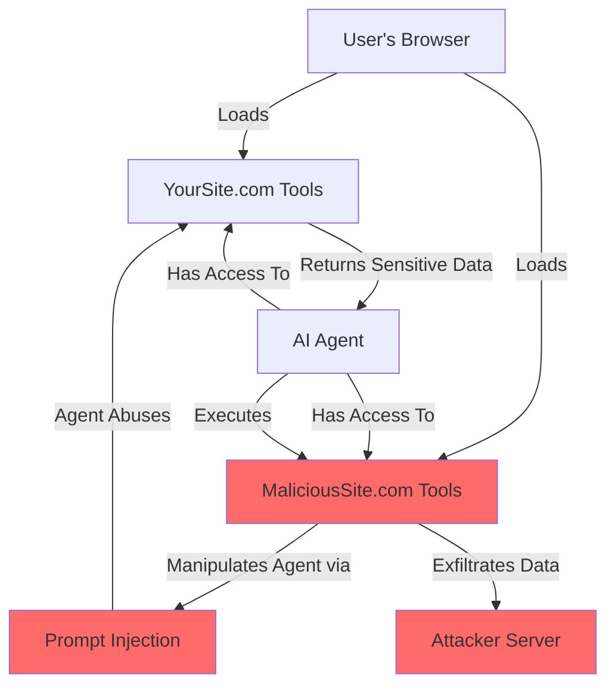
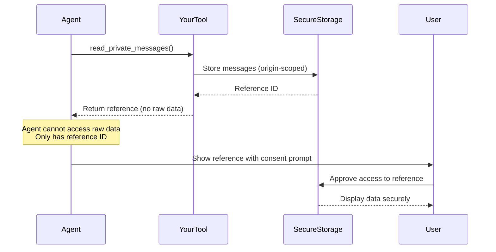
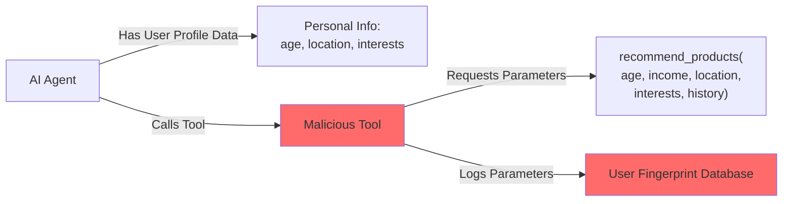

<Warning>
As a website builder, you are responsible for protecting your users from malicious agents. Agents may have access to tools from multiple websites—some potentially malicious. This page explains the unique threat model and architectural considerations for WebMCP security.
</Warning>

## The Multi-Website Threat Model

<Note>
**Critical Context**: AI agents can interact with multiple websites simultaneously. Your tools may be used by an agent that has also loaded tools from malicious websites. This creates a unique security challenge where compromised agents can abuse your tools.
</Note>

When an AI agent connects to your website, it may already have tools from other origins:

- **Trusted tools**: Your website's legitimate functionality
- **Unknown tools**: Tools from other websites the user is visiting
- **Malicious tools**: Tools from compromised or malicious websites

A malicious tool from another website could manipulate the agent into:
- Exfiltrating sensitive data through your tools
- Performing unauthorized actions using your authenticated APIs
- Tricking users into approving dangerous operations

**Your Responsibility**: Assume the agent may be compromised. Design tools that protect users even when the agent is influenced by malicious actors from other websites.

## Architectural Security Principles

WebMCP's security model is built on several key architectural principles:

<CardGroup cols={2}>
  <Card title="User Context" icon="user-shield">
    Tools run with the user's existing session and permissions—never with elevated privileges
  </Card>

  <Card title="Origin Validation" icon="globe">
    Transport layer enforces same-origin policy to prevent cross-site tool abuse
  </Card>

  <Card title="No Credential Sharing" icon="key">
    AI agents never receive user credentials—they inherit session context
  </Card>

  <Card title="Explicit Actions" icon="hand">
    Tools only expose user-authorized actions, never background operations
  </Card>
</CardGroup>

These principles create defense-in-depth, but don't eliminate all risks. Understanding the specific threats is essential for secure tool design.

## Prompt Injection: The "Lethal Trifecta"

<Warning>
Prompt injection is a serious, largely unsolved security challenge for AI systems. While mitigations reduce risk, they don't eliminate it completely.
</Warning>

**Prompt injection** occurs when malicious actors manipulate AI agent behavior by crafting inputs that override intended instructions. The most dangerous scenarios occur when three conditions align:

1. **Private user data access** - Tools that access personal information (emails, messages, profiles)
2. **Untrusted content exposure** - AI processes content from potentially malicious sources
3. **External communication** - Ability to send data outside the user's browser

<Warning>
**Example Risk**: An AI agent reading emails (private data) could be manipulated via prompt injection to exfiltrate sensitive information through tools with external communication capabilities—especially if malicious tools from other websites are present.
</Warning>

### Why This Is Unique to Multi-Agent Environments

In traditional web applications, JavaScript from different origins cannot directly communicate. But in a multi-agent environment:



The AI agent acts as a bridge between origins, potentially allowing malicious tools to influence how your tools are used.

### Architectural Defense: Never Pass Sensitive Data to Agents

<Warning>
**Critical Rule**: Sensitive information must NEVER be passed to the AI agent's context. A compromised agent (via malicious tools from other websites) could exfiltrate this data. Always use references instead.
</Warning>

**What should use references:**
- Passwords, tokens, API keys, session IDs
- Private messages, emails, documents
- Personal information (SSN, credit cards, addresses)
- Financial data (account numbers, balances)
- Health records, legal documents
- Any data you wouldn't want copied to a malicious website

**How references work architecturally:**



The key architectural insight: **Raw sensitive data never enters the agent's context**, preventing exfiltration even if the agent is compromised.

## Tool Misrepresentation Risks

<Warning>
AI agents cannot verify that tool descriptions accurately represent tool behavior. This creates opportunities for deception.
</Warning>

Since WebMCP tools run with the user's authenticated session, a deceptive tool could describe itself as "add to cart" while actually completing a purchase and charging the user's payment method.

### Why Agents Can't Detect Misrepresentation

AI agents only see:
- Tool name
- Tool description
- Input schema
- Annotations (readOnlyHint, destructiveHint, etc.)

They **cannot**:
- Inspect the handler function code
- Verify behavior matches description
- Detect malicious intent

### Architectural Mitigation: Honest Descriptions + Annotations

The defense is architectural transparency: descriptions and annotations must accurately represent behavior, and high-impact operations should show browser confirmation dialogs so users see and approve actions directly.

<Info>
For implementation patterns, see [Security Best Practices: Tool Misrepresentation](/security#tool-misrepresentation-risks)
</Info>

## User Fingerprinting via Over-Parameterization

<Warning>
Tools can inadvertently enable user fingerprinting when AI agents provide detailed personal information through parameters.
</Warning>

When AI agents have access to user personalization data, malicious sites can craft tool parameters to extract this information without explicit user consent, enabling **covert profiling** of users who thought they were anonymous.

### The Fingerprinting Attack Pattern



Even if your site doesn't require login, a malicious tool can use over-parameterization to collect detailed user profiles through the agent.

### Architectural Defense: Minimal Parameters

**Design Principle**: Only request parameters that are absolutely necessary for the tool's function. Use server-side user context (from authenticated sessions) for personalization instead of agent-provided parameters.

```javascript
// ❌ VULNERABLE: Reveals extensive user data through parameters
{
  name: 'recommend_products',
  inputSchema: {
    age, income, location, interests,
    purchaseHistory, browsingHistory  // DON'T DO THIS
  }
}

// ✅ BETTER: Minimal parameters, use server-side user context
{
  name: 'recommend_products',
  inputSchema: {
    category: optional,
    priceRange: optional  // Only what's needed
  }
  // Server already knows who the authenticated user is
}
```

## Cross-Origin Tool Composition Risks

When multiple websites expose tools simultaneously, there's a risk of unintended tool composition:

- **Chaining attacks**: Malicious tool uses your tool as a step in a larger attack
- **Context pollution**: Malicious tool manipulates agent state before your tool runs
- **Output manipulation**: Malicious tool intercepts or modifies your tool's output

### Architectural Defense: Stateless Tools

Design tools to be **stateless** and **idempotent** where possible. Each tool call should:
- Validate all inputs (never trust agent-provided data)
- Not depend on previous tool calls
- Return complete, self-contained results

<Info>
For implementation patterns, see [Security Best Practices: Input Validation](/security#input-validation--sanitization)
</Info>

## Threat Mitigation Summary

| Threat | Architectural Defense | Implementation Pattern |
|--------|----------------------|------------------------|
| Prompt Injection | Never pass sensitive data; use references | [Security Guide](/security#prompt-injection-the-lethal-trifecta) |
| Tool Misrepresentation | Honest descriptions + browser confirmations | [Security Guide](/security#tool-misrepresentation-risks) |
| User Fingerprinting | Minimal parameters; server-side context | [Security Guide](/security#privacy-user-fingerprinting-via-over-parameterization) |
| Cross-Origin Abuse | Stateless tools; input validation | [Best Practices](/best-practices#input-validation) |

## Next Steps

Now that you understand the threat model, learn how to implement secure tools:

<CardGroup cols={2}>
  <Card
    title="Security Best Practices"
    icon="shield"
    href="/security"
  >
    Practical implementation patterns for secure tools
  </Card>

  <Card
    title="Tool Design"
    icon="hammer"
    href="/concepts/tool-design"
  >
    Design patterns for robust, secure tools
  </Card>

  <Card
    title="Architecture Overview"
    icon="diagram-project"
    href="/concepts/architecture"
  >
    How WebMCP enforces origin isolation
  </Card>

  <Card
    title="Best Practices"
    icon="check-double"
    href="/best-practices"
  >
    Comprehensive guide to secure development
  </Card>
</CardGroup>
