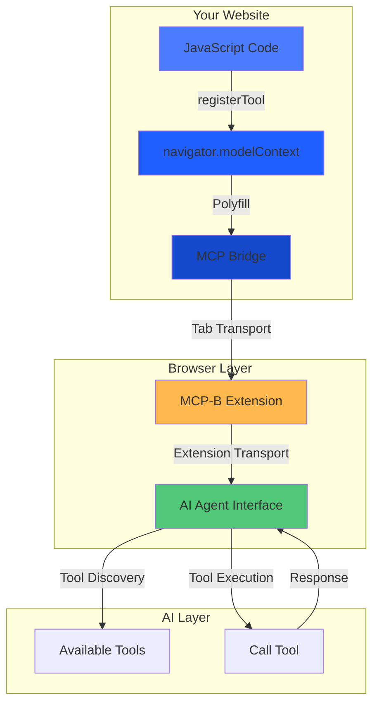
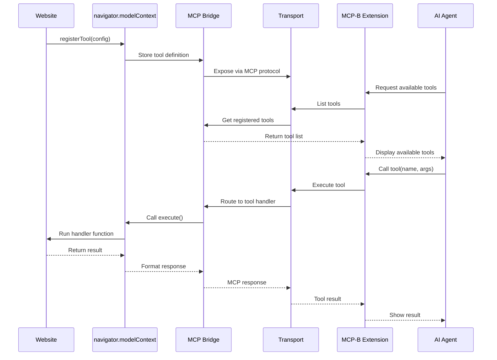
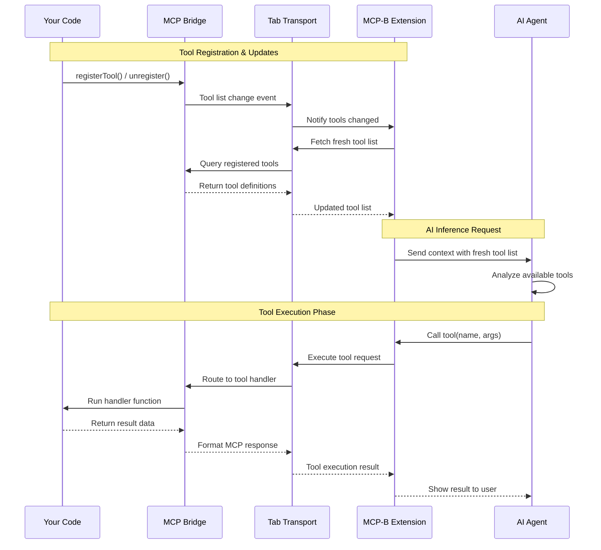

## Key Components

<CardGroup cols={2}>
  <Card title="W3C Web Model Context API" icon="globe">
    Standard browser API (`navigator.modelContext`) for registering tools - the WebMCP specification
  </Card>

  <Card title="MCP-B Polyfill & Bridge" icon="arrows-left-right">
    Implements navigator.modelContext for current browsers and translates between WebMCP and MCP protocols
  </Card>

  <Card title="Transport Layer" icon="tower-broadcast">
    Communication between browser contexts (tabs, extensions, pages)
  </Card>

  <Card title="MCP-B Extension" icon="puzzle-piece">
    Development and testing tool that collects WebMCP servers from tabs and supports userscript injection
  </Card>
</CardGroup>

## High-Level Architecture

## Component Interaction Flow

## Data Flow

Understanding how data flows through WebMCP when AI agents interact with your website tools.

### Tool Execution Flow

The following diagram shows how the extension maintains a fresh tool list and handles AI requests:

## How It All Works Together

1. **Your website** registers tools using `navigator.modelContext.registerTool()`
2. **The MCP-B polyfill** implements the WebMCP API and translates to MCP protocol
3. **Transport layers** handle communication between different browser contexts
4. **The MCP-B extension** aggregates tools from all tabs and exposes them to AI agents
5. **AI agents** discover available tools and execute them on behalf of users

## Related Topics

<CardGroup cols={2}>
  <Card title="Tool Registration" icon="screwdriver-wrench" href="/concepts/tool-registration">
    Learn how to register and manage tools
  </Card>

  <Card title="Transports" icon="tower-broadcast" href="/concepts/transports">
    Understanding transport layers and communication
  </Card>

  <Card title="Extension Architecture" icon="puzzle-piece" href="/concepts/extension">
    Deep dive into the MCP-B extension
  </Card>

  <Card title="Security Model" icon="shield" href="/security">
    How WebMCP maintains security
  </Card>
</CardGroup>
