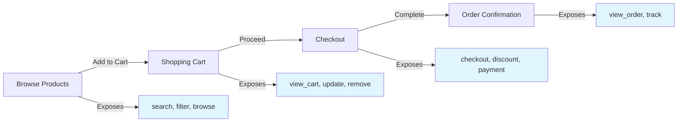
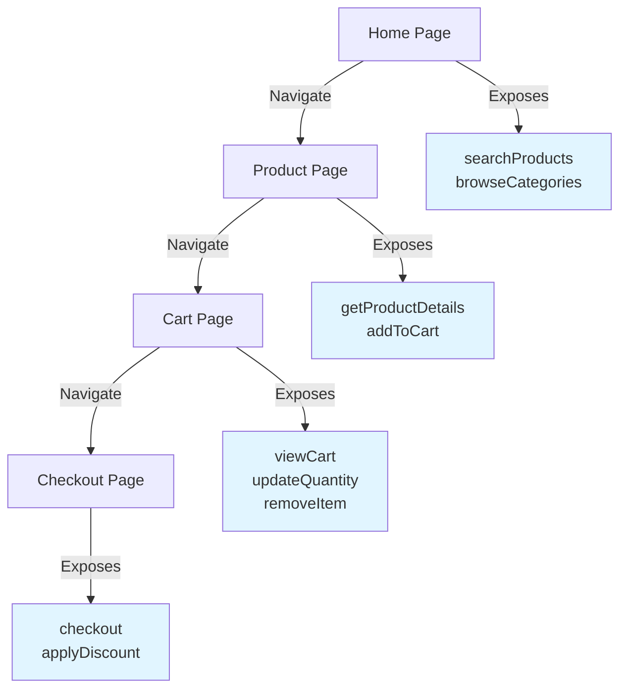

<Info>
**This is an Explanation page** - it explores *why* limiting tool context improves AI performance and shows patterns for implementing it. For implementation details, see [Advanced Patterns](/advanced).
</Info>

Context engineering is the practice of giving AI models only the tools and information relevant to their current task. Just as good UI design doesn't overwhelm users with every possible option, good WebMCP design limits tool availability based on context.

<Note>
**The principle**: If you give a model 100 tools when only 5 are relevant, performance suffers. Think of it like giving someone an entire Home Depot when they just need a saw, hammer, and nails.
</Note>

## Why Context Matters

When AI agents have access to many tools:

- **Decision quality decreases** - More options means more potential for wrong choices
- **Token usage increases** - Tool definitions consume context window
- **Response latency grows** - More tools to evaluate before acting
- **Error rates climb** - Irrelevant tools create confusion

WebMCP solves this by letting you **dynamically scope tools** based on application state.

## URL-Based Tool Scoping

Expose different tools based on the current URL path:

```tsx
function ToolProvider() {
  const { pathname } = useLocation();

  if (pathname === '/') {
    useWebMCP({
      name: 'search_products',
      inputSchema: { query: z.string(), category: z.string().optional() },
      handler: async ({ query, category }) => await searchAPI.search({ query, category })
    });
  }

  if (pathname.startsWith('/product/')) {
    useWebMCP({
      name: 'add_to_cart',
      inputSchema: { quantity: z.number().min(1).default(1) },
      handler: async ({ quantity }) => await cartAPI.add(productId, quantity)
    });
  }

  if (pathname === '/checkout') {
    useWebMCP({
      name: 'complete_checkout',
      inputSchema: { paymentMethod: z.enum(['credit', 'debit', 'paypal']) },
      handler: async ({ paymentMethod }) => await checkoutAPI.complete(paymentMethod)
    });
  }

  return null;
}
```

## Progressive Tool Disclosure

Reveal tools as the user progresses through a workflow:



Each stage only shows tools relevant to that step, reducing cognitive load on the AI model.

## Role-Based Tool Exposure

Different tools for different user roles:

```tsx
function RoleBasedTools({ user }) {
  // Customer tools (available to everyone)
  useWebMCP({
    name: 'view_products',
    description: 'View product catalog',
    handler: async () => await productAPI.list()
  });

  // Moderator tools
  if (user?.role === 'moderator' || user?.role === 'admin') {
    useWebMCP({
      name: 'hide_comment',
      description: 'Hide inappropriate comments',
      inputSchema: {
        commentId: z.string()
      },
      handler: async ({ commentId }) => {
        return await moderationAPI.hideComment(commentId);
      }
    });
  }

  // Admin-only tools
  if (user?.role === 'admin') {
    useWebMCP({
      name: 'delete_user',
      description: 'Permanently delete a user account',
      inputSchema: {
        userId: z.string()
      },
      handler: async ({ userId }) => {
        return await adminAPI.deleteUser(userId);
      }
    });

    useWebMCP({
      name: 'update_product_price',
      description: 'Update product pricing',
      inputSchema: {
        productId: z.string(),
        newPrice: z.number().positive()
      },
      handler: async ({ productId, newPrice }) => {
        return await adminAPI.updatePrice(productId, newPrice);
      }
    });
  }

  return null;
}
```

## Feature Flag-Based Tools

Control tool availability with feature flags:

```tsx
import { useFeatureFlag } from './feature-flags';

function FeatureGatedTools() {
  const hasAIRecommendations = useFeatureFlag('ai-recommendations');
  const hasBetaCheckout = useFeatureFlag('beta-checkout');

  useWebMCP({
    name: 'get_ai_recommendations',
    description: 'Get AI-powered product recommendations',
    handler: async () => {
      return await recommendationAPI.get();
    },
    enabled: hasAIRecommendations
  });

  useWebMCP({
    name: 'beta_one_click_checkout',
    description: 'Complete purchase with one click (beta)',
    handler: async () => {
      return await betaCheckoutAPI.oneClick();
    },
    enabled: hasBetaCheckout
  });

  return null;
}
```

## Component Lifecycle Scoping

Tools automatically register when components mount and unregister when they unmount:

```tsx
function CartTools({ cartId, items }) {
  useWebMCP({
    name: 'checkout',
    description: 'Proceed to checkout',
    inputSchema: { paymentMethod: z.enum(['credit', 'debit', 'paypal']) },
    handler: async ({ paymentMethod }) => {
      const order = await checkoutService.processCart(cartId, paymentMethod);
      return { orderId: order.id };
    },
    enabled: items.length > 0 // Only available when cart has items
  });

  return null;
}
```

This creates a **UI for LLMs** - instead of showing all tools at once, you progressively reveal capabilities based on context.

## The WebMCP Advantage

Unlike browser automation approaches, WebMCP lets you design context-aware tool exposure:



Just as websites don't put all content on one page, you can scope tools to different pages in your app, creating a natural **progressive disclosure** pattern for AI.

## Best Practices

<AccordionGroup>
  <Accordion title="Start with minimal tools">
    Begin with the smallest set of tools needed for the current context. Add more only as the workflow progresses.
  </Accordion>

  <Accordion title="Use the enabled prop">
    The `enabled` prop on `useWebMCP` lets you conditionally register tools based on state without conditional hooks.
  </Accordion>

  <Accordion title="Group related tools">
    Tools that work together should appear together. If a tool requires another tool's output, they should be available in the same context.
  </Accordion>

  <Accordion title="Consider multi-tab scenarios">
    When users have multiple tabs open, the extension aggregates tools from all tabs. Use clear naming to avoid confusion.
  </Accordion>
</AccordionGroup>

## Related Topics

<CardGroup cols={2}>
  <Card title="Dynamic Tool Registration" icon="arrows-rotate" href="/advanced#dynamic-tool-registration">
    Implementation patterns for dynamic tools
  </Card>

  <Card title="Multi-Tab Tool Collection" icon="browser" href="/advanced#multi-tab-tool-collection">
    How tools work across browser tabs
  </Card>

  <Card title="Why WebMCP?" icon="lightbulb" href="/concepts/why-webmcp">
    Understanding the WebMCP approach
  </Card>

  <Card title="Best Practices" icon="star" href="/best-practices">
    Complete tool development guide
  </Card>
</CardGroup>
