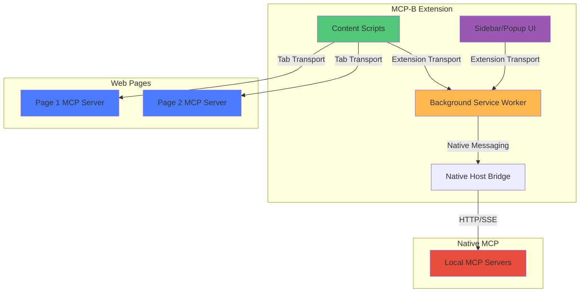
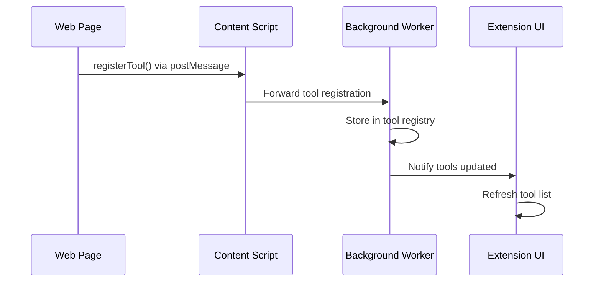
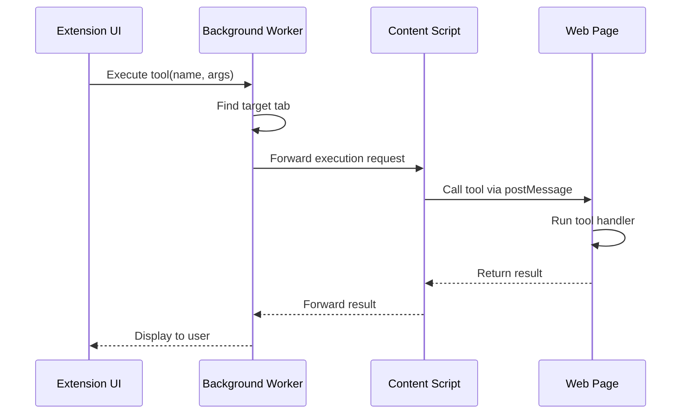
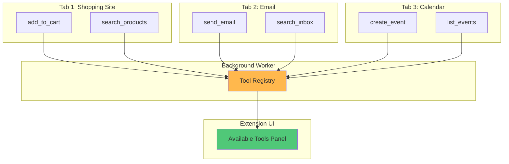

<Info>
**This is an Explanation page** (Advanced Topic) - it explains how the MCP-B Extension works internally. For usage instructions, start with the [Extension Overview](/extension/index).
</Info>

The MCP-B browser extension serves as a development and testing tool that collects WebMCP servers from browser tabs and provides an interface for AI agents to interact with registered tools.

## MCP-B Extension Components



## Component Breakdown

### Background Service Worker

The background service worker is the central hub that:

- **Aggregates tools** from all open tabs
- **Manages connections** to content scripts and UI components
- **Routes tool calls** to the appropriate tab/context
- **Maintains state** across page navigation
- **Bridges to native** MCP servers via native messaging

### Content Scripts

Content scripts are injected into web pages to:

- **Establish communication** with page MCP servers via Tab Transport
- **Forward tool registrations** to the background worker
- **Execute tool calls** in the page context
- **Inject userscripts** for development/testing
- **Monitor page lifecycle** and tool availability

### Sidebar/Popup UI

The extension UI provides:

- **Tool browser** - View all available tools across tabs
- **Agent interface** - Chat with AI agents using WebMCP tools
- **Debugging tools** - Inspect tool calls and responses
- **Settings** - Configure extension behavior and permissions
- **Userscript management** - Install and manage userscripts

### Native Host Bridge

The native host bridge enables:

- **Local MCP servers** - Connect to filesystem, database, and system tools
- **Desktop integration** - Access local applications and resources
- **Performance** - Run compute-intensive operations locally
- **Privacy** - Keep sensitive data on the local machine

See [Native Host Setup](/native-host-setup) for configuration instructions.

## Communication Flow

### Tool Discovery



### Tool Execution



## Multi-Tab Tool Aggregation

One of the extension's key features is aggregating tools from multiple tabs:



All tools from all tabs are available to AI agents simultaneously, enabling cross-site workflows.

## Userscript Support

The extension can inject userscripts into web pages to add WebMCP functionality to sites that don't natively support it:

### Userscript Capabilities

- **Add tools to any website** - Expose website functionality as MCP tools
- **DOM manipulation** - Interact with page elements
- **API integration** - Make authenticated requests using page session
- **Custom workflows** - Automate multi-step processes

### Example Userscript

```javascript
// ==UserScript==
// @name         GitHub WebMCP Tools
// @match        https://github.com/*
// @grant        none
// ==/UserScript==

if (navigator.modelContext) {
  navigator.modelContext.registerTool({
    name: "github_create_issue",
    description: "Create a new GitHub issue in the current repository",
    inputSchema: {
      type: "object",
      properties: {
        title: { type: "string" },
        body: { type: "string" }
      },
      required: ["title"]
    },
    async execute({ title, body }) {
      // Use GitHub's existing UI/API to create issue
      // Implementation details...
      return {
        content: [{ type: "text", text: `Issue created: ${title}` }]
      };
    }
  });
}
```

See [Managing Userscripts](/extension/managing-userscripts) for more details.

## Extension Permissions

The MCP-B extension requests minimal permissions:

- **`activeTab`** - Access the current tab's page content
- **`storage`** - Store user preferences and settings
- **`nativeMessaging`** - Connect to local MCP servers (optional)
- **`webRequest`** (optional) - Debug network requests

The extension follows the principle of least privilege and only requests permissions necessary for its core functionality.

## Development Mode

The extension includes features specifically for developers:

- **Tool inspection** - View tool schemas and test executions
- **Console logging** - Debug tool calls and responses
- **Hot reload** - Automatically refresh when page tools change
- **Error reporting** - Detailed error messages for failed tool calls

## Related Topics

<CardGroup cols={2}>
  <Card title="Extension Guide" icon="puzzle-piece" href="/extension/index">
    Complete extension user guide
  </Card>

  <Card title="Userscript Management" icon="code" href="/extension/managing-userscripts">
    Installing and managing userscripts
  </Card>

  <Card title="Native Host Setup" icon="server" href="/native-host-setup">
    Configure native MCP server bridge
  </Card>

  <Card title="Transports" icon="tower-broadcast" href="/concepts/transports">
    Understanding extension transport
  </Card>
</CardGroup>
