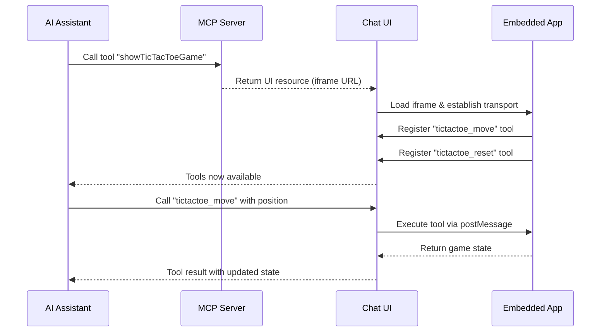
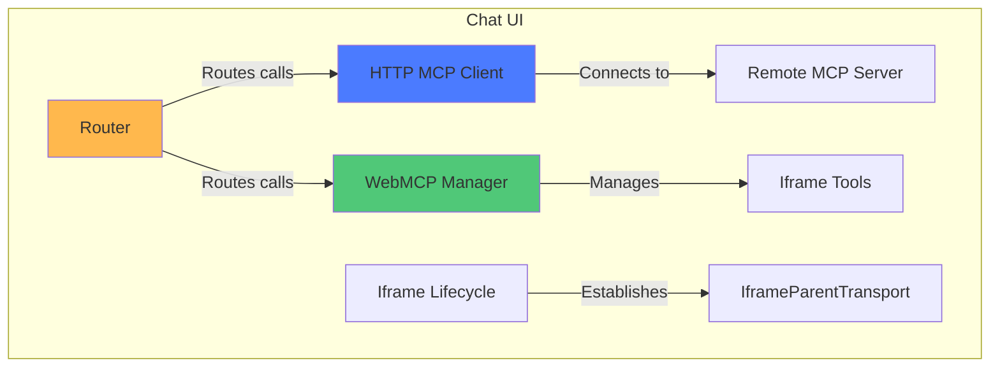
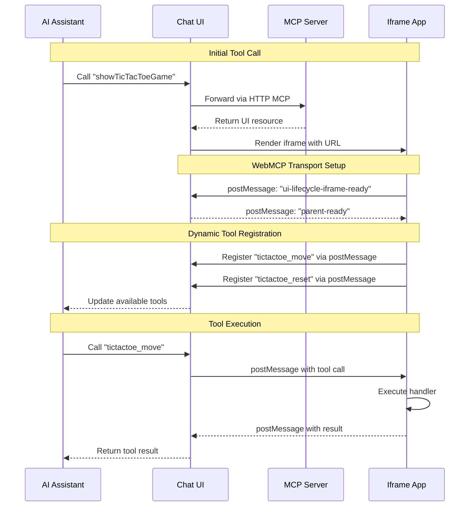

## Overview

MCP UI + WebMCP creates **bidirectional AI integration**: AI agents invoke tools that render interactive web applications, and those embedded apps dynamically register new tools back to the AI.

This combines:
- **MCP UI**: Tools that return visual interfaces (UI resources)
- **WebMCP**: Apps registering tools via `navigator.modelContext`

<CardGroup cols={2}>
  <Card title="Build Your First App" icon="rocket" href="/building-mcp-ui-apps">
    Implementation guide with code examples
  </Card>
  <Card title="Live Demo" icon="globe" href="https://beattheclankers.com">
    Try the TicTacToe example
  </Card>
</CardGroup>

## The Core Workflow



## Architecture Components

This pattern involves three main components working together:

### 1. Chat UI (Parent Context)

The parent application that hosts the AI conversation and manages embedded apps:



**Responsibilities:**
- Connects to remote MCP servers via HTTP/SSE
- Manages iframe lifecycle and transport channels
- Routes tool calls to appropriate clients (HTTP MCP or WebMCP)
- Displays AI conversation and embedded apps

### 2. Embedded Apps (Iframe Context)

Mini-applications that run in iframes and register tools dynamically:

```mermaid
graph TB
    subgraph "Embedded App (Iframe)"
        A[React Component] -->|Uses| B[useWebMCP Hook]
        B -->|Registers via| C[navigator.modelContext]
        C -->|Polyfilled by| D[@mcp-b/global]
        D -->|Communicates via| E[IframeChildTransport]
        E <-->|postMessage| F[Parent Window]
    end

    style A fill:#4B7BFF
    style B fill:#50C878
    style D fill:#FFB84D
```

Apps register tools via `navigator.modelContext.provideContext()`, which is polyfilled by `@mcp-b/global` until native browser support is available.

### 3. MCP Server

Remote server that exposes initial tools returning UI resources with `createUIResource()` from `@mcp-ui/server`.

## Communication Flow



## MCP UI Resource Types

UI resources can be rendered three ways:
- **externalUrl**: Load a complete web app in iframe (most common for interactive apps)
- **rawHtml**: Inject sanitized HTML directly (simple widgets)
- **remoteDom**: Stream dynamic DOM updates (real-time data)

## WebMCP vs MCP-B

- **WebMCP**: W3C standard specification defining `navigator.modelContext` API
- **MCP-B**: Reference implementation (`@mcp-b/*` packages) providing polyfills before native browser support

## Why This Pattern?

**Dynamic Tool Discovery**: AI automatically discovers tools as they become available based on app state.

**Separation of Concerns**: UI logic stays in embedded app, parent manages conversation flow.

**Security Isolation**: Iframes provide security boundaries with controlled postMessage communication.

**Progressive Enhancement**: Apps work standalone and gain AI capabilities when embedded.

## Common Use Cases

- **Interactive Games**: AI plays games via dynamically registered move tools
- **Data Visualization**: Charts with filtering/manipulation tools
- **Form Builders**: Forms with validation and submission tools
- **Configuration UIs**: Settings panels with AI-controlled configuration
- **Real-time Dashboards**: Live data with AI-controlled filters

## Learn More

<CardGroup cols={2}>
  <Card title="Build Your First App" icon="hammer" href="/building-mcp-ui-apps">
    Step-by-step implementation guide
  </Card>

  <Card title="Architecture" icon="diagram-project" href="/concepts/architecture">
    Overall WebMCP architecture
  </Card>

  <Card title="Transports" icon="tower-broadcast" href="/concepts/transports">
    Understanding transport layers
  </Card>

  <Card title="GitHub Repository" icon="github" href="https://github.com/WebMCP-org/mcp-ui-webmcp">
    Source code and examples
  </Card>
</CardGroup>
