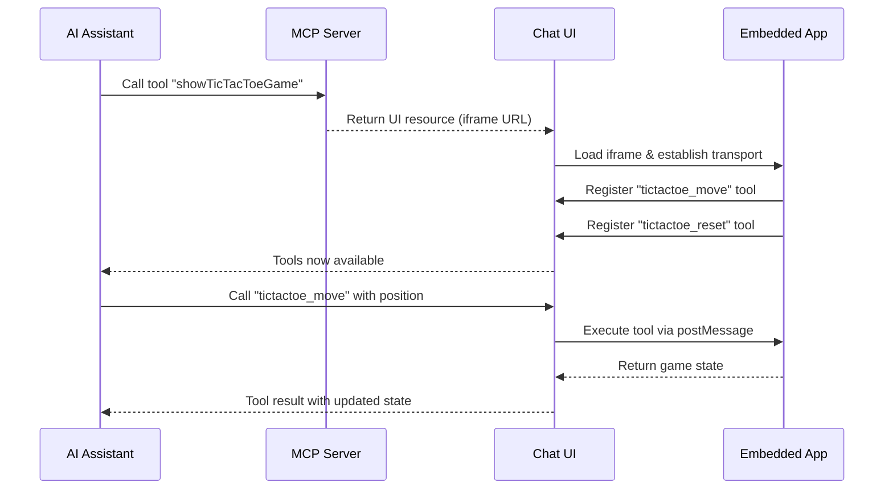
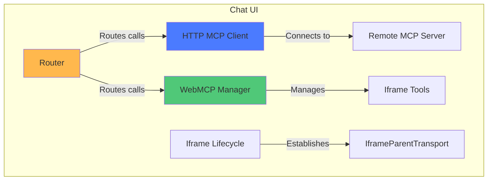
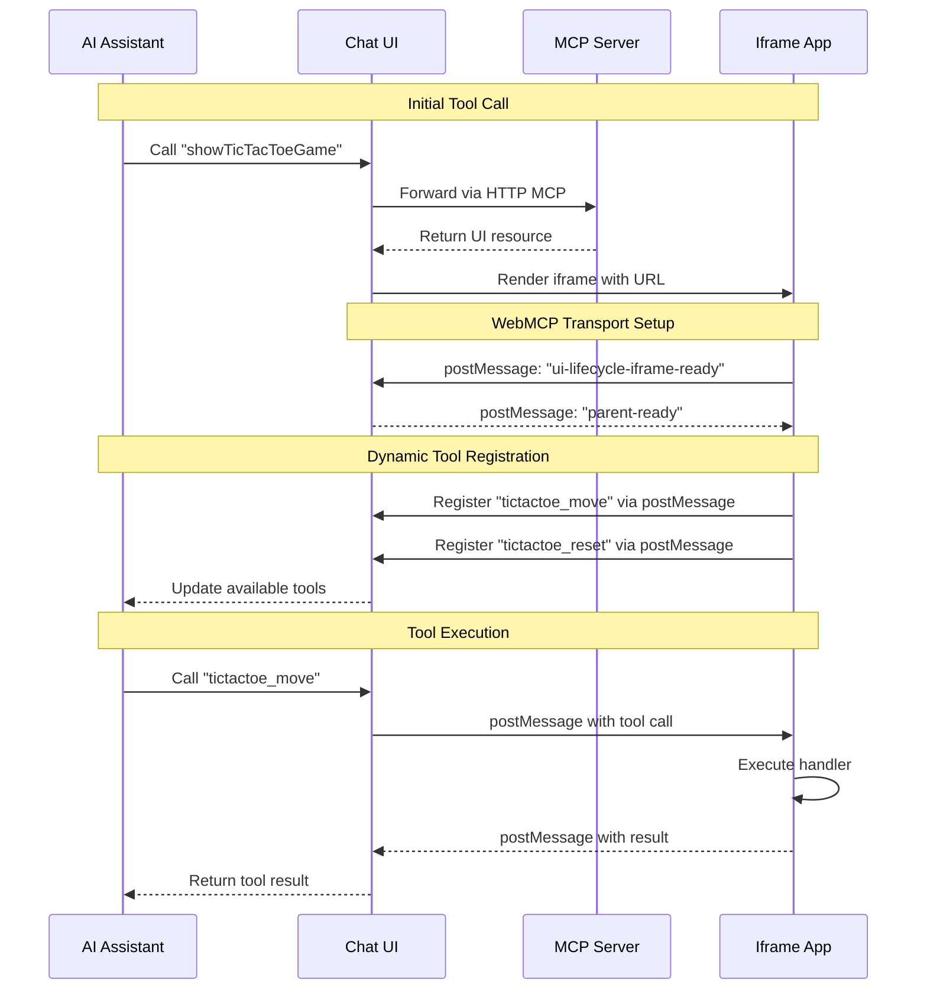

## Overview

**MCP UI + WebMCP** enables a powerful pattern where AI assistants invoke tools that render interactive web applications, and those embedded apps can dynamically register new tools back to the AI in real-time. This creates a bidirectional feedback loop between conversational interfaces and embedded applications.

<Note>
This pattern combines **MCP UI resources** (tools that return visual interfaces) with **WebMCP tool registration** (apps registering new tools via `navigator.modelContext`).
</Note>

## Quick Navigation

<CardGroup cols={2}>
  <Card title="Getting Started" icon="rocket" href="/building-mcp-ui-apps">
    Build your first MCP-UI app
  </Card>
  <Card title="Integration Guide" icon="heart" href="/mcpui-webmcp-integration">
    Complete integration patterns
  </Card>
  <Card title="Architecture" icon="diagram-project" href="#architecture-components">
    Understand the system design
  </Card>
  <Card title="Live Examples" icon="globe" href="https://beattheclankers.com">
    Try the TicTacToe demo
  </Card>
</CardGroup>

## The Core Workflow



## Architecture Components

This pattern involves three main components working together:

### 1. Chat UI (Parent Context)

The parent application that hosts the AI conversation and manages embedded apps:



**Responsibilities:**
- Connects to remote MCP servers via HTTP/SSE
- Manages iframe lifecycle and transport channels
- Routes tool calls to appropriate clients (HTTP MCP or WebMCP)
- Displays AI conversation and embedded apps

### 2. Embedded Apps (Iframe Context)

Mini-applications that run in iframes and register tools dynamically:

```mermaid
graph TB
    subgraph "Embedded App (Iframe)"
        A[React Component] -->|Uses| B[useWebMCP Hook]
        B -->|Registers via| C[navigator.modelContext]
        C -->|Polyfilled by| D[@mcp-b/global]
        D -->|Communicates via| E[IframeChildTransport]
        E <-->|postMessage| F[Parent Window]
    end

    style A fill:#4B7BFF
    style B fill:#50C878
    style D fill:#FFB84D
```

**Example tool registration:**

```typescript
import { useWebMCP } from '@mcp-b/react-webmcp';
import { z } from 'zod';

function TicTacToeGame() {
  const [gameState, setGameState] = useState(/* ... */);

  // Register a tool that AI can call
  useWebMCP({
    name: "tictactoe_ai_move",
    description: "Make a move at the specified position (0-8)",
    inputSchema: {
      position: z.number().int().min(0).max(8)
        .describe('Cell position in row-major order')
    },
    annotations: {
      idempotentHint: false,
    },
    handler: async ({ position }) => {
      // Update game state
      const newState = makeMove(gameState, position);
      setGameState(newState);

      return {
        content: [{
          type: "text",
          text: JSON.stringify({
            success: true,
            board: newState.board,
            winner: newState.winner
          })
        }]
      };
    }
  });

  return <div>{/* Game UI */}</div>;
}
```

### 3. MCP Server

Remote server that exposes initial tools returning UI resources:

```typescript
import { McpAgent } from 'agents';
import { createUIResource } from '@mcp-ui/server';

class MyMCP extends McpAgent {
  async init() {
    // Register a tool that returns a UI resource
    this.server.tool(
      'showTicTacToeGame',
      'Display an interactive TicTacToe game',
      {},
      async () => {
        const uiResource = createUIResource({
          uri: 'ui://tictactoe',
          content: {
            type: 'externalUrl',
            iframeUrl: `${this.env.APP_URL}/`
          },
          encoding: 'text'
        });

        return {
          content: [uiResource]
        };
      }
    );
  }
}
```

## Communication Flow



## MCP UI Resource Types

<Info>
MCP servers can return three types of UI resources, each optimized for different use cases.
</Info>

<Tabs>
  <Tab title="externalUrl" icon="window">
    **Iframe Embedding**

    Load a complete web application in an iframe:

    ```typescript
    createUIResource({
      uri: 'ui://myapp',
      content: {
        type: 'externalUrl',
        iframeUrl: 'https://example.com/app'
      },
      encoding: 'text'
    })
    ```

    **Best for:**
    - Full-featured applications
    - Existing web apps
    - Complex interactions
    - Production apps with build processes

    <Tip>
    This is the most common type for MCP-UI + WebMCP integration.
    </Tip>
  </Tab>

  <Tab title="rawHtml" icon="code">
    **Sanitized Markup**

    Inject sanitized HTML directly into the page:

    ```typescript
    createUIResource({
      uri: 'ui://widget',
      content: {
        type: 'rawHtml',
        htmlString: '<div class="widget">Content</div>'
      },
      encoding: 'text'
    })
    ```

    **Best for:**
    - Simple widgets
    - Static content
    - Lightweight components
    - Quick prototypes
  </Tab>

  <Tab title="remoteDom" icon="satellite-dish">
    **Dynamic Content**

    Stream dynamic DOM updates to the parent:

    ```typescript
    createUIResource({
      uri: 'ui://dynamic',
      content: {
        type: 'remoteDom',
        script: 'console.log("Dynamic content")',
        framework: 'vanilla'
      },
      encoding: 'text'
    })
    ```

    **Best for:**
    - Real-time updates
    - Streaming data
    - Live visualizations
    - Server-driven UI
  </Tab>
</Tabs>

## WebMCP vs MCP-B

It's important to understand the distinction:

- **WebMCP**: The W3C standard specification defining `navigator.modelContext` API
- **MCP-B**: Reference implementation providing polyfills and npm packages before native browser support

The MCP-B packages (`@mcp-b/react-webmcp`, `@mcp-b/transports`, `@mcp-b/global`) enable WebMCP functionality today by:
1. Polyfilling `navigator.modelContext` for current browsers
2. Providing transport layers (iframe, tab, extension)
3. Bridging between WebMCP and MCP protocols

<Warning>
  **Critical Implementation Detail**: When using `@mcp-b/global`, you must call `initializeWebModelContext()` BEFORE React renders. This initialization must happen at module scope in your main.tsx entry point:

  ```typescript
  import { initializeWebModelContext } from '@mcp-b/global';

  // MUST run before React
  initializeWebModelContext({
    transport: {
      tabServer: {
        allowedOrigins: ['*'], // Restrict in production
      },
    },
  });

  // Then render React
  createRoot(document.getElementById('root')!).render(<App />);
  ```
</Warning>

## Getting Started

<Info>
The fastest way to start building is with the `create-webmcp-app` CLI tool, which scaffolds a complete project with all necessary configuration.
</Info>

<Steps>
  <Step title="Create Project">
    Run the interactive CLI:

    ```bash
    npx create-webmcp-app
    ```

    Choose between:
    - **Vanilla template**: HTML/CSS/JS with no build step
    - **React template**: TypeScript + Vite + React 19
  </Step>

  <Step title="Install Dependencies">
    ```bash
    cd your-project
    pnpm install
    ```
  </Step>

  <Step title="Start Development Server">
    ```bash
    pnpm dev
    ```

    Your MCP server and embedded app are now running locally!
  </Step>

  <Step title="Explore the Code">
    Check out:
    - `worker/mcpServer.ts` - MCP server implementation
    - `public/` or `src/` - Embedded app code
    - `.dev.vars` - Environment configuration

    <Tip>
    Modify the template to add your own tools and UI features.
    </Tip>
  </Step>
</Steps>

### Repository & Examples

<CardGroup cols={2}>
  <Card title="MCP UI WebMCP Repository" icon="github" href="https://github.com/WebMCP-org/mcp-ui-webmcp">
    Source code, templates, and comprehensive examples
  </Card>

  <Card title="Live Demo: Chat UI" icon="globe" href="https://mcp-ui.mcp-b.ai">
    Interactive chat interface with embedded MCP UI apps
  </Card>

  <Card title="Live Demo: Full App" icon="rocket" href="https://beattheclankers.com">
    Complete example showcasing bidirectional integration
  </Card>

  <Card title="Create WebMCP App" icon="terminal" href="https://www.npmjs.com/package/create-webmcp-app">
    CLI tool for scaffolding new projects
  </Card>
</CardGroup>

## Use Cases

<Note>
This bidirectional pattern unlocks powerful use cases where AI agents can both see and interact with complex interfaces.
</Note>

**Ideal applications include:**

<CardGroup cols={2}>
  <Card title="Interactive Games" icon="gamepad">
    AI plays games by calling dynamically registered moves (see TicTacToe demo)
  </Card>
  <Card title="Data Visualization" icon="chart-line">
    Charts and graphs that expose filtering/manipulation tools
  </Card>
  <Card title="Form Builders" icon="list-check">
    Dynamic forms that register validation and submission tools
  </Card>
  <Card title="Collaboration Tools" icon="users">
    Whiteboards, document editors with AI-accessible operations
  </Card>
  <Card title="Configuration UIs" icon="sliders">
    Settings panels that expose configuration tools to AI
  </Card>
  <Card title="Real-time Dashboards" icon="dashboard">
    Live data displays with AI-controlled filters and actions
  </Card>
</CardGroup>

## Key Benefits

<AccordionGroup>
  <Accordion title="Dynamic Tool Discovery">
    Tools are registered based on app state, user context, or loaded features. The AI automatically discovers new capabilities as they become available.
  </Accordion>

  <Accordion title="Separation of Concerns">
    UI logic stays in the embedded app, while the parent manages the conversation. Each component has clear responsibilities.
  </Accordion>

  <Accordion title="Reusable Components">
    Apps can be embedded in multiple contexts (chat UIs, extensions, native apps) without modification.
  </Accordion>

  <Accordion title="Security Isolation">
    Iframes provide security boundaries while postMessage enables controlled communication.
  </Accordion>

  <Accordion title="Progressive Enhancement">
    Apps work as standalone web pages and gain AI capabilities when embedded in supporting contexts.
  </Accordion>
</AccordionGroup>

## Best Practices

When building MCP UI + WebMCP applications:

<AccordionGroup>
  <Accordion title="Keep iframes lightweight">
    - Minimize bundle size for fast loading
    - Use code splitting for large applications
    - Lazy load features as needed
  </Accordion>

  <Accordion title="Handle transport failures gracefully">
    - Detect when MCP-B transport is unavailable
    - Provide fallback UI for standalone usage
    - Show connection status to users
  </Accordion>

  <Accordion title="Design tools for AI consumption">
    - Use clear, descriptive tool names and descriptions
    - Return structured data (JSON) in tool results
    - Include success/error states in responses
    - Use annotations to provide hints: `idempotentHint`, `readOnlyHint`, `destructiveHint`
  </Accordion>

  <Accordion title="Manage tool lifecycle carefully">
    - Register tools when features are available
    - Unregister tools when features are removed
    - Use React hooks (useWebMCP) for automatic cleanup
  </Accordion>

  <Accordion title="Test both standalone and embedded modes">
    - Ensure apps work without MCP-B polyfill
    - Test iframe communication in different browsers
    - Verify tool calls work end-to-end
  </Accordion>
</AccordionGroup>

## Technical Requirements

**Minimum versions:**
- Node.js 24.3.0+
- pnpm 10.14.0+

**Key dependencies:**
- `@mcp-b/react-webmcp` - React hooks for WebMCP
- `@mcp-b/transports` - Iframe transport implementation
- `@mcp-b/global` - Core WebMCP polyfill (navigator.modelContext)
- `@modelcontextprotocol/sdk` - MCP protocol implementation
- `@mcp-ui/server` - MCP UI resource creation utilities

**Deployment targets:**
- Cloudflare Workers (MCP server)
- Cloudflare Pages (Chat UI)
- Any static hosting (embedded apps)

## Related Topics

<CardGroup cols={2}>
  <Card title="Building MCP-UI Apps" icon="hammer" href="/building-mcp-ui-apps">
    Comprehensive guide to building MCP UI applications
  </Card>

  <Card title="MCP UI WebMCP Integration" icon="link" href="/mcpui-webmcp-integration">
    Detailed integration guide
  </Card>

  <Card title="Architecture" icon="diagram-project" href="/concepts/architecture">
    Overall WebMCP architecture
  </Card>

  <Card title="Transports" icon="tower-broadcast" href="/concepts/transports">
    Understanding transport layers
  </Card>
</CardGroup>
