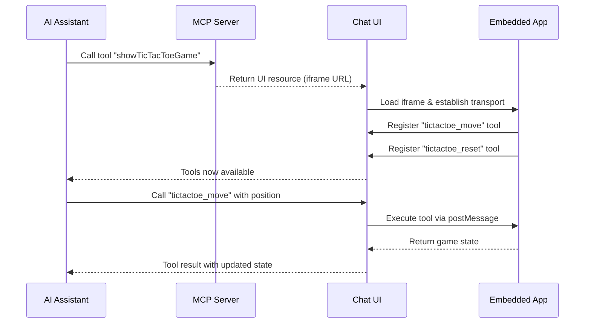
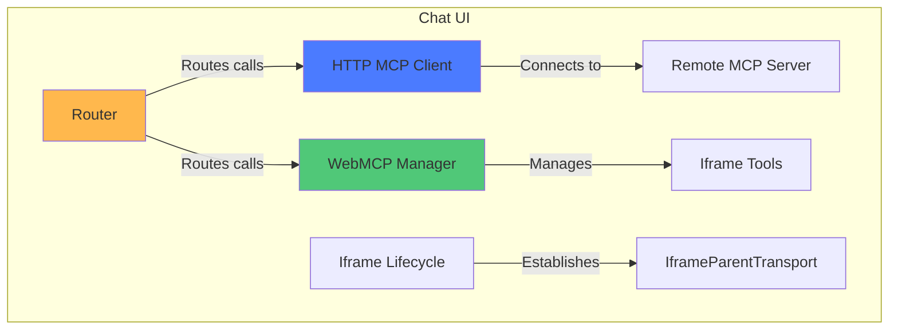
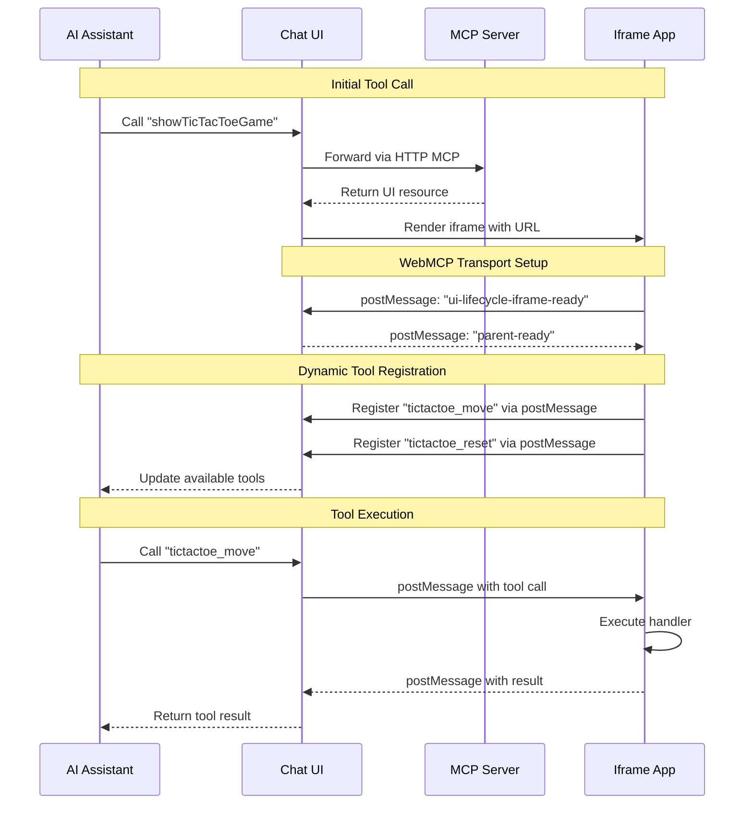

## Overview

MCP UI + WebMCP enables AI assistants to invoke tools that render interactive web applications. These embedded apps can dynamically register new tools back to the AI, creating bidirectional interaction between conversational interfaces and embedded applications.

<Note>
Combines MCP UI resources (tools that return visual interfaces) with WebMCP tool registration (apps registering tools via `navigator.modelContext`).
</Note>

## Quick Navigation

<CardGroup cols={2}>
  <Card title="Getting Started" icon="rocket" href="/building-mcp-ui-apps">
    Build your first MCP-UI app
  </Card>
  <Card title="Integration Guide" icon="heart" href="/mcpui-webmcp-integration">
    Complete integration patterns
  </Card>
  <Card title="Architecture" icon="diagram-project" href="#architecture-components">
    Understand the system design
  </Card>
  <Card title="Live Examples" icon="globe" href="https://beattheclankers.com">
    Try the TicTacToe demo
  </Card>
</CardGroup>

## The Core Workflow



## Architecture Components

This pattern involves three main components working together:

### 1. Chat UI (Parent Context)

The parent application that hosts the AI conversation and manages embedded apps:



**Responsibilities:**
- Connects to remote MCP servers via HTTP/SSE
- Manages iframe lifecycle and transport channels
- Routes tool calls to appropriate clients (HTTP MCP or WebMCP)
- Displays AI conversation and embedded apps

### 2. Embedded Apps (Iframe Context)

Mini-applications that run in iframes and register tools dynamically:

```mermaid
graph TB
    subgraph "Embedded App (Iframe)"
        A[React Component] -->|Uses| B[useWebMCP Hook]
        B -->|Registers via| C[navigator.modelContext]
        C -->|Polyfilled by| D[@mcp-b/global]
        D -->|Communicates via| E[IframeChildTransport]
        E <-->|postMessage| F[Parent Window]
    end

    style A fill:#4B7BFF
    style B fill:#50C878
    style D fill:#FFB84D
```

**Example tool registration:**

```typescript
import { useWebMCP } from '@mcp-b/react-webmcp';
import { z } from 'zod';

function TicTacToeGame() {
  const [gameState, setGameState] = useState(/* ... */);

  // Register a tool that AI can call
  useWebMCP({
    name: "tictactoe_ai_move",
    description: "Make a move at the specified position (0-8)",
    inputSchema: {
      position: z.number().int().min(0).max(8)
        .describe('Cell position in row-major order')
    },
    annotations: {
      idempotentHint: false,
    },
    handler: async ({ position }) => {
      // Update game state
      const newState = makeMove(gameState, position);
      setGameState(newState);

      return {
        content: [{
          type: "text",
          text: JSON.stringify({
            success: true,
            board: newState.board,
            winner: newState.winner
          })
        }]
      };
    }
  });

  return <div>{/* Game UI */}</div>;
}
```

### 3. MCP Server

Remote server that exposes initial tools returning UI resources:

```typescript
import { McpAgent } from 'agents';
import { createUIResource } from '@mcp-ui/server';

class MyMCP extends McpAgent {
  async init() {
    // Register a tool that returns a UI resource
    this.server.tool(
      'showTicTacToeGame',
      'Display an interactive TicTacToe game',
      {},
      async () => {
        const uiResource = createUIResource({
          uri: 'ui://tictactoe',
          content: {
            type: 'externalUrl',
            iframeUrl: `${this.env.APP_URL}/`
          },
          encoding: 'text'
        });

        return {
          content: [uiResource]
        };
      }
    );
  }
}
```

## Communication Flow



## MCP UI Resource Types

<Tabs>
  <Tab title="externalUrl" icon="window">
    Load a complete web application in an iframe (most common):

    ```typescript
    createUIResource({
      uri: 'ui://myapp',
      content: {
        type: 'externalUrl',
        iframeUrl: 'https://example.com/app'
      },
      encoding: 'text'
    })
    ```

    Use for full-featured applications and complex interactions.
  </Tab>

  <Tab title="rawHtml" icon="code">
    Inject sanitized HTML directly:

    ```typescript
    createUIResource({
      uri: 'ui://widget',
      content: {
        type: 'rawHtml',
        htmlString: '<div class="widget">Content</div>'
      },
      encoding: 'text'
    })
    ```

    Use for simple widgets and static content.
  </Tab>

  <Tab title="remoteDom" icon="satellite-dish">
    Stream dynamic DOM updates:

    ```typescript
    createUIResource({
      uri: 'ui://dynamic',
      content: {
        type: 'remoteDom',
        script: 'console.log("Dynamic content")',
        framework: 'vanilla'
      },
      encoding: 'text'
    })
    ```

    Use for real-time updates and streaming data.
  </Tab>
</Tabs>

## WebMCP vs MCP-B

- **WebMCP**: W3C standard specification defining `navigator.modelContext` API
- **MCP-B**: Reference implementation providing polyfills before native browser support

<Warning>
When using `@mcp-b/global`, call `initializeWebModelContext()` before React renders:

```typescript
import { initializeWebModelContext } from '@mcp-b/global';

initializeWebModelContext();
createRoot(document.getElementById('root')!).render(<App />);
```
</Warning>

## Getting Started

<Steps>
  <Step title="Create Project">
    ```bash
    npx create-webmcp-app
    ```

    Choose Vanilla (HTML/CSS/JS) or React (TypeScript + Vite) template.
  </Step>

  <Step title="Install Dependencies">
    ```bash
    cd your-project
    pnpm install
    ```
  </Step>

  <Step title="Start Development Server">
    ```bash
    pnpm dev
    ```
  </Step>

  <Step title="Explore the Code">
    - `worker/mcpServer.ts` - MCP server implementation
    - `public/` or `src/` - Embedded app code
    - `.dev.vars` - Environment configuration
  </Step>
</Steps>

### Repository & Examples

<CardGroup cols={2}>
  <Card title="MCP UI WebMCP Repository" icon="github" href="https://github.com/WebMCP-org/mcp-ui-webmcp">
    Source code, templates, and comprehensive examples
  </Card>

  <Card title="Live Demo: Chat UI" icon="globe" href="https://mcp-ui.mcp-b.ai">
    Interactive chat interface with embedded MCP UI apps
  </Card>

  <Card title="Live Demo: Full App" icon="rocket" href="https://beattheclankers.com">
    Complete example showcasing bidirectional integration
  </Card>

  <Card title="Create WebMCP App" icon="terminal" href="https://www.npmjs.com/package/create-webmcp-app">
    CLI tool for scaffolding new projects
  </Card>
</CardGroup>

## Use Cases

<CardGroup cols={2}>
  <Card title="Interactive Games" icon="gamepad">
    AI plays games via dynamically registered moves
  </Card>
  <Card title="Data Visualization" icon="chart-line">
    Charts with filtering/manipulation tools
  </Card>
  <Card title="Form Builders" icon="list-check">
    Forms with validation and submission tools
  </Card>
  <Card title="Collaboration Tools" icon="users">
    Whiteboards and editors with AI operations
  </Card>
  <Card title="Configuration UIs" icon="sliders">
    Settings panels with configuration tools
  </Card>
  <Card title="Real-time Dashboards" icon="dashboard">
    Live data with AI-controlled filters
  </Card>
</CardGroup>

## Key Benefits

<AccordionGroup>
  <Accordion title="Dynamic Tool Discovery">
    AI automatically discovers tools as they become available based on app state.
  </Accordion>

  <Accordion title="Separation of Concerns">
    UI logic stays in embedded app, parent manages conversation.
  </Accordion>

  <Accordion title="Reusable Components">
    Embed apps in multiple contexts without modification.
  </Accordion>

  <Accordion title="Security Isolation">
    Iframes provide security boundaries with controlled postMessage communication.
  </Accordion>

  <Accordion title="Progressive Enhancement">
    Apps work standalone and gain AI capabilities when embedded.
  </Accordion>
</AccordionGroup>

## Best Practices

<AccordionGroup>
  <Accordion title="Keep iframes lightweight">
    Minimize bundle size, use code splitting, lazy load features.
  </Accordion>

  <Accordion title="Handle transport failures gracefully">
    Detect unavailable transport, provide fallback UI, show connection status.
  </Accordion>

  <Accordion title="Design tools for AI consumption">
    Use clear names, return structured data, include success/error states, use annotations (`idempotentHint`, `readOnlyHint`, `destructiveHint`).
  </Accordion>

  <Accordion title="Manage tool lifecycle carefully">
    Register tools when available, unregister when removed, use `useWebMCP` for automatic cleanup.
  </Accordion>

  <Accordion title="Test both modes">
    Test standalone and embedded modes, verify iframe communication, ensure tool calls work end-to-end.
  </Accordion>
</AccordionGroup>

## Technical Requirements

- Node.js 24.3.0+
- pnpm 10.14.0+

**Key packages:**
- `@mcp-b/react-webmcp`, `@mcp-b/transports`, `@mcp-b/global`
- `@modelcontextprotocol/sdk`
- `@mcp-ui/server`

## Related Topics

<CardGroup cols={2}>
  <Card title="Building MCP-UI Apps" icon="hammer" href="/building-mcp-ui-apps">
    Comprehensive guide to building MCP UI applications
  </Card>

  <Card title="MCP UI WebMCP Integration" icon="link" href="/mcpui-webmcp-integration">
    Detailed integration guide
  </Card>

  <Card title="Architecture" icon="diagram-project" href="/concepts/architecture">
    Overall WebMCP architecture
  </Card>

  <Card title="Transports" icon="tower-broadcast" href="/concepts/transports">
    Understanding transport layers
  </Card>
</CardGroup>
