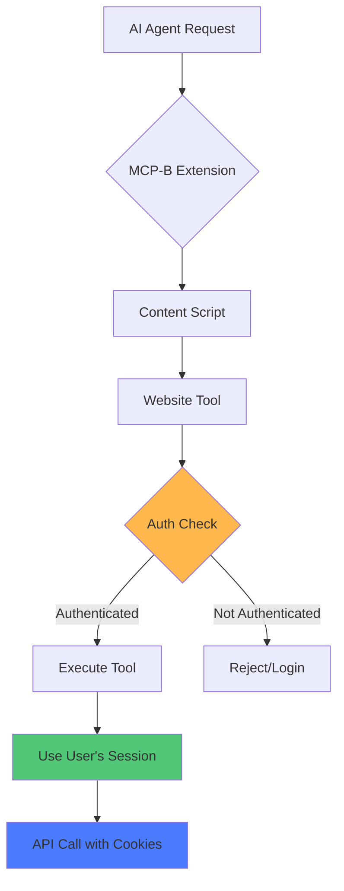

WebMCP's security model is built on web platform security primitives, ensuring that tools execute with appropriate permissions and in the correct security context.

## Authentication & Authorization

Tools run in the user's browser context with their existing session:



### Security Principles

WebMCP follows these core security principles:

- ✅ **Tools inherit user authentication** - No separate credential management needed
- ✅ **Same-origin policy enforced** - Tools can only access their own domain's resources
- ✅ **No credential sharing** - API keys and tokens stay within the website context
- ✅ **Tools respect existing permissions** - Users' access levels apply to tool actions
- ✅ **User visibility** - All tool actions happen in the user's browser where they can see them

### Example: Authenticated Tool

```javascript
navigator.modelContext.registerTool({
  name: "user_profile_update",
  description: "Update the logged-in user's profile information",
  inputSchema: {
    type: "object",
    properties: {
      name: { type: "string" },
      email: { type: "string", format: "email" }
    }
  },
  async execute({ name, email }) {
    // This call uses the user's existing session cookies
    const response = await fetch('/api/user/profile', {
      method: 'PATCH',
      credentials: 'include', // Uses session cookies
      headers: { 'Content-Type': 'application/json' },
      body: JSON.stringify({ name, email })
    });

    if (!response.ok) {
      if (response.status === 401) {
        return {
          content: [{ type: "text", text: "User not authenticated" }],
          isError: true
        };
      }
      throw new Error('Update failed');
    }

    return {
      content: [{ type: "text", text: "Profile updated successfully" }]
    };
  }
});
```

## Origin Validation

The Tab Transport validates origins to prevent unauthorized access:

```javascript
import { initializeWebModelContext } from '@mcp-b/global';

initializeWebModelContext({
  transport: {
    tabServer: {
      allowedOrigins: [
        'https://myapp.com',
        'https://api.myapp.com',
        'https://staging.myapp.com'
      ]
    }
  }
});
```

### Origin Validation Rules

<AccordionGroup>
  <Accordion title="Production: Explicit allowlist">
    **Always** specify exact origins in production:

    ```javascript
    allowedOrigins: [
      'https://myapp.com',
      'https://api.myapp.com'
    ]
    ```

    **Never** use wildcards in production:
    ```javascript
    // ❌ DANGEROUS - Do not use in production
    allowedOrigins: ['*']
    ```
  </Accordion>

  <Accordion title="Development: Localhost and wildcards">
    For local development, you can use wildcards:

    ```javascript
    allowedOrigins: process.env.NODE_ENV === 'development'
      ? ['*']
      : ['https://myapp.com']
    ```
  </Accordion>

  <Accordion title="Subdomains: Explicit listing">
    List each subdomain explicitly:

    ```javascript
    allowedOrigins: [
      'https://app.myapp.com',
      'https://admin.myapp.com',
      'https://api.myapp.com'
    ]
    ```

    Note: There's no wildcard subdomain support (e.g., `https://*.myapp.com` is not supported).
  </Accordion>
</AccordionGroup>

## Content Security Policy (CSP)

WebMCP respects and works within Content Security Policy restrictions:

```html
<!-- Example CSP that allows WebMCP -->
<meta http-equiv="Content-Security-Policy"
      content="
        default-src 'self';
        script-src 'self' 'unsafe-inline';
        connect-src 'self' https://api.myapp.com;
      ">
```

### CSP Considerations

- **script-src**: WebMCP polyfill needs to execute JavaScript
- **connect-src**: Tools may need to make API calls
- **frame-ancestors**: For iframe-based MCP UI integration
- **worker-src**: If using web workers for tool execution

## Tool Security Best Practices

<AccordionGroup>
  <Accordion title="Validate all inputs">
    Always validate and sanitize tool inputs before processing:

    ```javascript
    inputSchema: {
      type: "object",
      properties: {
        userId: {
          type: "string",
          pattern: "^[a-zA-Z0-9-]+$", // Only alphanumeric and hyphens
          maxLength: 50
        }
      },
      required: ["userId"]
    }
    ```
  </Accordion>

  <Accordion title="Check authorization in handlers">
    Verify the user has permission to perform the action:

    ```javascript
    async execute({ resourceId, action }) {
      // Check if user can perform this action
      const hasPermission = await checkUserPermission(
        getCurrentUserId(),
        resourceId,
        action
      );

      if (!hasPermission) {
        return {
          content: [{ type: "text", text: "Permission denied" }],
          isError: true
        };
      }

      // Proceed with action
      return performAction(resourceId, action);
    }
    ```
  </Accordion>

  <Accordion title="Use HTTPS in production">
    Always serve your website over HTTPS in production:

    - Protects tool execution from man-in-the-middle attacks
    - Required for many browser APIs (geolocation, camera, etc.)
    - Ensures secure cookie transmission
  </Accordion>

  <Accordion title="Rate limit tool executions">
    Implement rate limiting to prevent abuse:

    ```javascript
    const rateLimiter = new Map();

    async execute({ action }) {
      const userId = getCurrentUserId();
      const now = Date.now();
      const lastCall = rateLimiter.get(userId) || 0;

      if (now - lastCall < 1000) { // 1 second cooldown
        return {
          content: [{ type: "text", text: "Too many requests. Please wait." }],
          isError: true
        };
      }

      rateLimiter.set(userId, now);
      return performAction(action);
    }
    ```
  </Accordion>

  <Accordion title="Use annotations for destructive operations">
    Mark destructive operations with annotations:

    ```javascript
    navigator.modelContext.registerTool({
      name: "delete_user_data",
      description: "Permanently delete user data",
      annotations: {
        destructiveHint: true  // Warns AI this is destructive
      },
      async execute() {
        // Destructive operation
      }
    });
    ```
  </Accordion>
</AccordionGroup>

## Extension Security

The MCP-B extension follows browser extension security best practices:

- **Minimal permissions** - Only requests necessary browser permissions
- **Content script isolation** - Content scripts run in isolated contexts
- **Message validation** - All cross-context messages are validated
- **No remote code execution** - Extension doesn't execute arbitrary remote code

## Common Security Pitfalls

<Warning>
  **Avoid these common mistakes:**

  1. **Using `allowedOrigins: ['*']` in production** - Always whitelist specific origins
  2. **Exposing sensitive operations without auth checks** - Always verify permissions
  3. **Trusting tool input without validation** - Use JSON Schema validation
  4. **Storing secrets in tool code** - Keep API keys server-side
  5. **Ignoring rate limiting** - Implement throttling for all tools
</Warning>

## Related Topics

<CardGroup cols={2}>
  <Card title="Transports" icon="tower-broadcast" href="/concepts/transports">
    Understanding transport-level security
  </Card>

  <Card title="Security Guide" icon="shield-check" href="/security">
    Comprehensive security best practices
  </Card>

  <Card title="Tool Registration" icon="screwdriver-wrench" href="/concepts/tool-registration">
    How to register secure tools
  </Card>

  <Card title="Best Practices" icon="star" href="/best-practices">
    General WebMCP best practices
  </Card>
</CardGroup>
