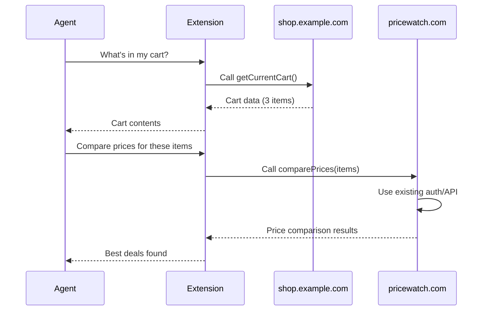
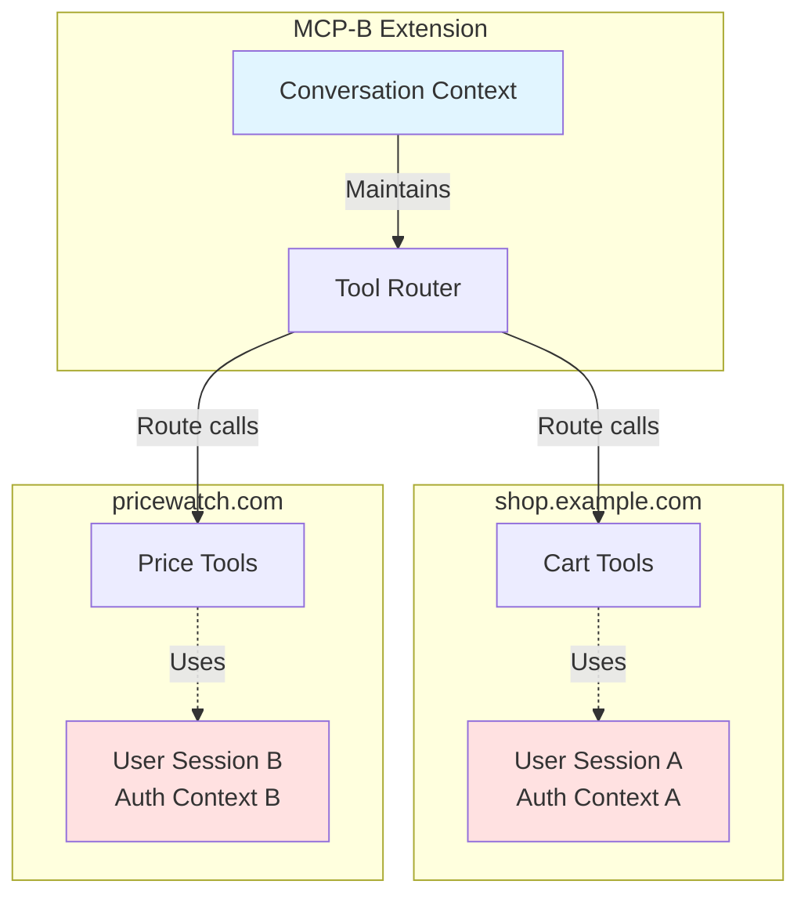
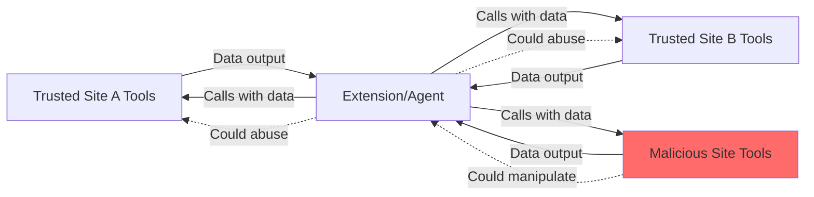

## Overview

One of the most powerful features of the MCP-B Extension is the ability to compose tools from different websites. Tools from one site can use data from another site, enabling complex multi-site workflows.

<Info>
**Key advantage**: Each site exposes its existing functionality as MCP tools, and the extension handles routing calls between them. The user maintains separate authentication contexts for each site.
</Info>

This creates a unique architecture where AI agents can orchestrate workflows across multiple websites without requiring special integration or shared authentication between sites.

## How Cross-Site Composition Works

### Architecture Overview

When an AI agent composes tools from multiple sites:



### Separation of Concerns

Each website operates independently:



**Key architectural principles**:
- Each tool executes in its own origin's context
- Tools inherit their site's authentication automatically
- Extension routes tool calls without exposing credentials
- Sites never share authentication or sessions

## Composition Patterns

### Pattern 1: Data Aggregation

Fetch data from one site and process it on another:

**Site A** (News site) exposes content:

```tsx
useWebMCP({
  name: 'news_get_top_stories',
  description: 'Get top news stories. Returns array of {title, url, summary}',
  handler: async () => {
    const stories = await fetch('/api/stories/top').then(r => r.json());
    return { stories };
  }
});
```

**Site B** (Social site) allows posting:

```tsx
useWebMCP({
  name: 'social_post_to_feed',
  description: 'Post a link to your social feed',
  inputSchema: {
    title: z.string(),
    url: z.string().url()
  },
  handler: async ({ title, url }) => {
    return await fetch('/api/posts', {
      method: 'POST',
      credentials: 'same-origin',  // Uses existing session
      body: JSON.stringify({ title, url })
    }).then(r => r.json());
  }
});
```

**Agent workflow**: "Get top news stories and share the most interesting one on social media"
- Calls `news_get_top_stories()` → gets data from news site
- Analyzes results
- Calls `social_post_to_feed()` → posts to social site

### Pattern 2: Cross-Site Comparison

Compare or enrich data across multiple sites:

**Site A** (Shopping site) exposes cart:

```tsx
useWebMCP({
  name: 'shop_get_current_cart',
  description: 'Get items in shopping cart. Returns {items: Array<{name, price, sku}>, total: number}',
  handler: async () => ({
    items: cart.items,
    total: cart.total
  })
});
```

**Site B** (Price comparison site) checks prices:

```tsx
useWebMCP({
  name: 'prices_compare_product',
  description: 'Compare prices for a product across multiple stores',
  inputSchema: {
    productName: z.string()
  },
  handler: async ({ productName }) => {
    const response = await fetch('/api/products/search', {
      method: 'POST',
      credentials: 'same-origin',
      body: JSON.stringify({ query: productName })
    });
    return await response.json();
  }
});
```

**Agent workflow**: "Check if items in my cart are available cheaper elsewhere"
- Calls `shop_get_current_cart()` → gets cart items
- For each item, calls `prices_compare_product()` → finds better prices
- Reports savings opportunities

### Pattern 3: Multi-Step Workflow Composition

Chain operations across sites:

```tsx
// Calendar site
useWebMCP({
  name: 'calendar_get_upcoming_meetings',
  description: 'Get upcoming calendar events',
  handler: async () => ({
    meetings: await calendar.getUpcoming()
  })
});

// Email site
useWebMCP({
  name: 'email_send_reminder',
  description: 'Send an email reminder',
  inputSchema: {
    to: z.string().email(),
    subject: z.string(),
    body: z.string()
  },
  handler: async ({ to, subject, body }) => {
    return await email.send({ to, subject, body });
  }
});

// Notes site
useWebMCP({
  name: 'notes_create',
  description: 'Create a new note',
  inputSchema: {
    title: z.string(),
    content: z.string()
  },
  handler: async ({ title, content }) => {
    return await notes.create({ title, content });
  }
});
```

**Agent workflow**: "Prepare for tomorrow's meetings"
- Calls `calendar_get_upcoming_meetings()` → gets meeting list
- For each meeting, calls `notes_create()` → creates meeting notes
- Calls `email_send_reminder()` → sends reminders to participants

## Security & Isolation

<Warning>
Cross-site tool composition introduces unique security considerations. Each site must protect against potential abuse from malicious tools on other sites.
</Warning>

### Origin Isolation

While tools can be composed, they remain **origin-isolated** at execution time:

- **Authentication**: Each tool uses its own site's session/cookies
- **Data access**: Tools can only access data within their origin
- **APIs**: Tools call their site's APIs with existing credentials
- **No shared state**: Sites cannot directly access each other's data

### Trust Boundaries



**Security principle**: Never trust data from the agent. Always validate inputs, even if they appear to come from another legitimate site's tool.

### Defense Strategies

<AccordionGroup>
  <Accordion title="1. Validate All Inputs">
    Treat all tool inputs as potentially malicious:

    ```tsx
    useWebMCP({
      name: 'process_data',
      inputSchema: {
        productId: z.string().regex(/^[A-Z0-9]{8}$/),  // Strict validation
        quantity: z.number().min(1).max(100)
      },
      handler: async ({ productId, quantity }) => {
        // Additional business logic validation
        if (!await productExists(productId)) {
          throw new Error('Invalid product ID');
        }
        // ...
      }
    });
    ```
  </Accordion>

  <Accordion title="2. Return Structured Data Only">
    Make tool outputs predictable and parseable:

    ```tsx
    // ✅ Good - structured, typed
    return {
      items: [{id: 'abc', name: 'Product', price: 99.99}],
      total: 99.99,
      currency: 'USD'
    };

    // ❌ Bad - unstructured, hard to validate
    return "You have 3 items totaling $99.99";
    ```
  </Accordion>

  <Accordion title="3. Avoid Sensitive Data in Responses">
    Never return sensitive data that could be exfiltrated:

    ```tsx
    // ❌ Dangerous
    return {
      userEmail: user.email,  // Don't expose
      apiKey: user.apiKey,    // Never expose
      password: user.password // Absolutely never
    };

    // ✅ Safe - use references or sanitized data
    return {
      userId: user.id,
      displayName: user.publicName
    };
    ```
  </Accordion>

  <Accordion title="4. Implement Rate Limiting">
    Prevent abuse of expensive operations:

    ```tsx
    const limiter = new RateLimiter({ maxCalls: 10, windowMs: 60000 });

    useWebMCP({
      name: 'expensive_operation',
      handler: async () => {
        if (!limiter.check()) {
          throw new Error('Rate limit exceeded');
        }
        // ...
      }
    });
    ```
  </Accordion>
</AccordionGroup>

## Best Practices for Composable Tools

### 1. Use Descriptive, Namespaced Names

Prevent collisions and provide context:

```tsx
// ✅ Good - clear origin and purpose
name: 'github_create_issue'
name: 'jira_create_ticket'
name: 'shop_example_add_to_cart'

// ❌ Bad - ambiguous
name: 'create_issue'  // Which site?
name: 'add_to_cart'   // Which shop?
```

### 2. Document Data Formats in Descriptions

Help other sites understand your output:

```tsx
useWebMCP({
  name: 'shop_get_cart',
  description: 'Get shopping cart contents. Returns {items: Array<{name: string, price: number, sku: string, quantity: number}>, total: number, currency: string}',
  handler: async () => { ... }
});
```

### 3. Keep Tools Focused and Atomic

Single-purpose tools compose better:

```tsx
// ✅ Good - focused, composable
useWebMCP({ name: 'get_cart', ... });
useWebMCP({ name: 'add_to_cart', ... });
useWebMCP({ name: 'remove_from_cart', ... });
useWebMCP({ name: 'checkout', ... });

// ❌ Bad - monolithic, hard to compose
useWebMCP({ name: 'cart_manager', ... });  // Does everything
```

### 4. Return Structured, Typed Data

Make outputs easy for other tools to consume:

```tsx
// ✅ Good - structured, predictable
return {
  success: true,
  data: {
    items: [...],
    total: 99.99
  },
  metadata: {
    currency: 'USD',
    timestamp: new Date().toISOString()
  }
};

// ❌ Bad - unstructured text
return "Added 3 items, your cart now has 5 items totaling $99.99";
```

## Implementation Examples

<Info>
For practical code examples of cross-site workflows, see [Advanced Guide: Cross-Site Tool Composition](/advanced#cross-site-tool-composition)
</Info>

## Next Steps

<CardGroup cols={2}>
  <Card
    title="Tool Routing"
    icon="network-wired"
    href="/concepts/tool-routing"
  >
    Learn how the extension routes tool calls across tabs
  </Card>

  <Card
    title="Agent Threat Model"
    icon="triangle-exclamation"
    href="/concepts/agent-threat-model"
  >
    Security considerations for multi-site environments
  </Card>

  <Card
    title="Security Guide"
    icon="shield"
    href="/security"
  >
    Comprehensive security best practices
  </Card>

  <Card
    title="Advanced Patterns"
    icon="wand-magic-sparkles"
    href="/advanced"
  >
    Implementation examples and techniques
  </Card>
</CardGroup>
