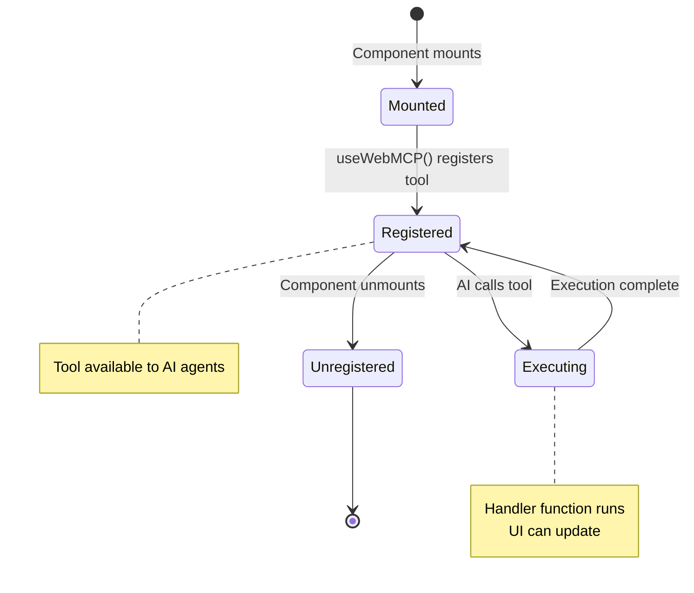
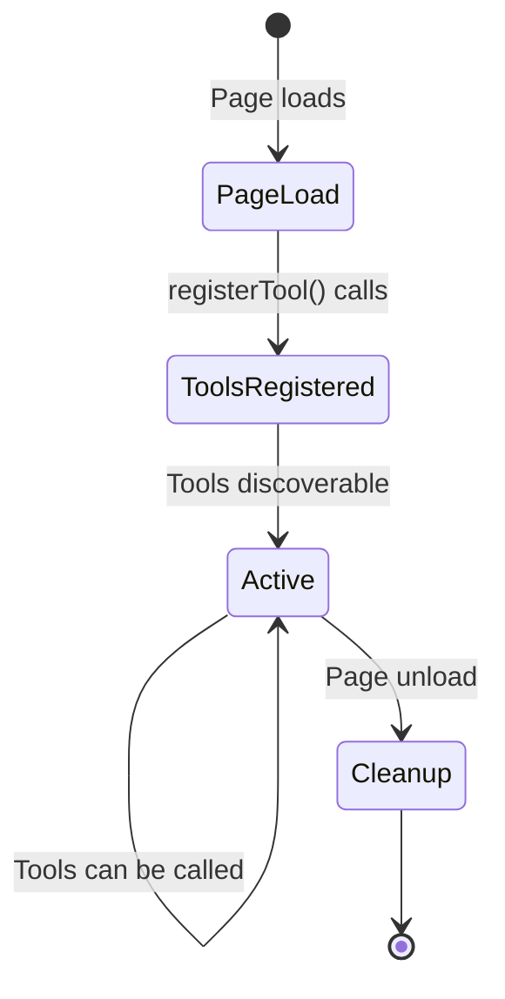

## The Simple Way: `registerTool()`

For most use cases, use `registerTool()` to add tools one at a time:

```javascript
const registration = navigator.modelContext.registerTool({
  name: "add_to_cart",
  description: "Add a product to the shopping cart",
  inputSchema: {
    type: "object",
    properties: {
      productId: { type: "string" },
      quantity: { type: "number" }
    }
  },
  async execute({ productId, quantity }) {
    await addToCart(productId, quantity);
    return {
      content: [{ type: "text", text: `Added ${quantity} items` }]
    };
  }
});

// Optional: Unregister later if needed
registration.unregister();
```

**Why `registerTool()` is the default:**
- ✅ Works everywhere (React, Vue, vanilla JS)
- ✅ Automatic cleanup when unregistered
- ✅ Perfect for component-scoped tools
- ✅ Simple and intuitive

<Accordion title="Advanced: provideContext() for base tools">
  Only use `provideContext()` when you need to set application-level base tools all at once:

  ```javascript
  navigator.modelContext.provideContext({
    tools: [/* array of tool definitions */]
  });
  ```

  **When to use:**
  - Defining core application tools at startup
  - Setting up a foundation tool set

  **Important:** This replaces all base tools each time it's called. For most use cases, stick with `registerTool()` instead.

  See [Advanced Patterns](/advanced) for detailed guidance.
</Accordion>

## Tool Lifecycle

### React Component Example



### Vanilla JavaScript Example



## Tool Definition Structure

A complete tool definition includes:

```typescript
interface ToolDefinition {
  name: string;              // Unique tool identifier (e.g., "add_to_cart")
  description: string;       // Clear description for AI understanding
  inputSchema: JSONSchema;   // JSON Schema for input validation
  execute: (args) => Promise<ToolResult>;  // Handler function
  annotations?: {            // Optional hints for AI
    idempotentHint?: boolean;
    readOnlyHint?: boolean;
    destructiveHint?: boolean;
  };
}
```

## Registration Best Practices

<AccordionGroup>
  <Accordion title="Register once per lifecycle">
    Don't repeatedly register and unregister tools. Register when the component/feature becomes available, unregister when it's removed.

    ```javascript
    // ✅ Good - register once in useEffect
    useEffect(() => {
      const reg = navigator.modelContext.registerTool({...});
      return () => reg.unregister();
    }, []);

    // ❌ Bad - registering on every render
    const reg = navigator.modelContext.registerTool({...});
    ```
  </Accordion>

  <Accordion title="Limit total tools per page">
    Avoid registering too many tools (>50) on a single page. This can overwhelm AI agents and slow down tool discovery.

    Consider:
    - Registering context-specific tools dynamically
    - Grouping related operations into single tools with parameters
    - Using tool annotations to guide AI selection
  </Accordion>

  <Accordion title="Clean up properly">
    Always unregister tools when they're no longer available:

    ```javascript
    // React - use cleanup function
    useEffect(() => {
      const reg = navigator.modelContext.registerTool({...});
      return () => reg.unregister();
    }, []);

    // Vanilla JS - cleanup on page unload
    const registration = navigator.modelContext.registerTool({...});
    window.addEventListener('beforeunload', () => {
      registration.unregister();
    });
    ```
  </Accordion>

  <Accordion title="Use descriptive names and descriptions">
    Help AI agents understand when and how to use your tools:

    ```javascript
    // ✅ Good
    {
      name: "shopping_cart_add_item",
      description: "Add a product to the user's shopping cart by product ID and quantity. Returns updated cart total."
    }

    // ❌ Bad
    {
      name: "addItem",
      description: "Adds item"
    }
    ```
  </Accordion>
</AccordionGroup>

## Related Topics

<CardGroup cols={2}>
  <Card title="Tool Schemas" icon="file-contract" href="/concepts/schemas">
    Learn about input validation and schema definition
  </Card>

  <Card title="Tool Design Patterns" icon="lightbulb" href="/concepts/tool-design">
    Best practices for designing effective tools
  </Card>

  <Card title="React WebMCP" icon="react" href="/packages/react-webmcp">
    React hooks for WebMCP tool registration
  </Card>

  <Card title="Performance" icon="gauge-high" href="/concepts/performance">
    Performance considerations for tool registration
  </Card>
</CardGroup>
