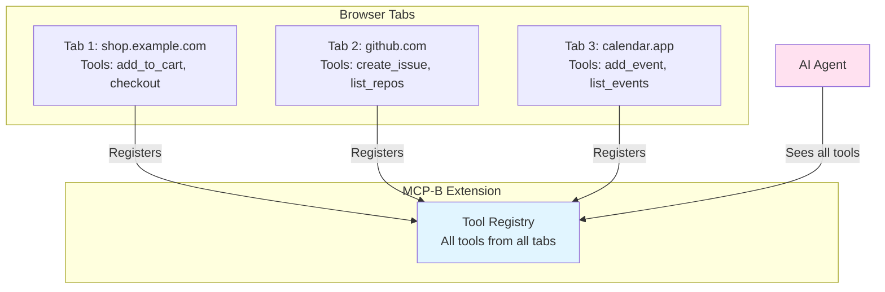
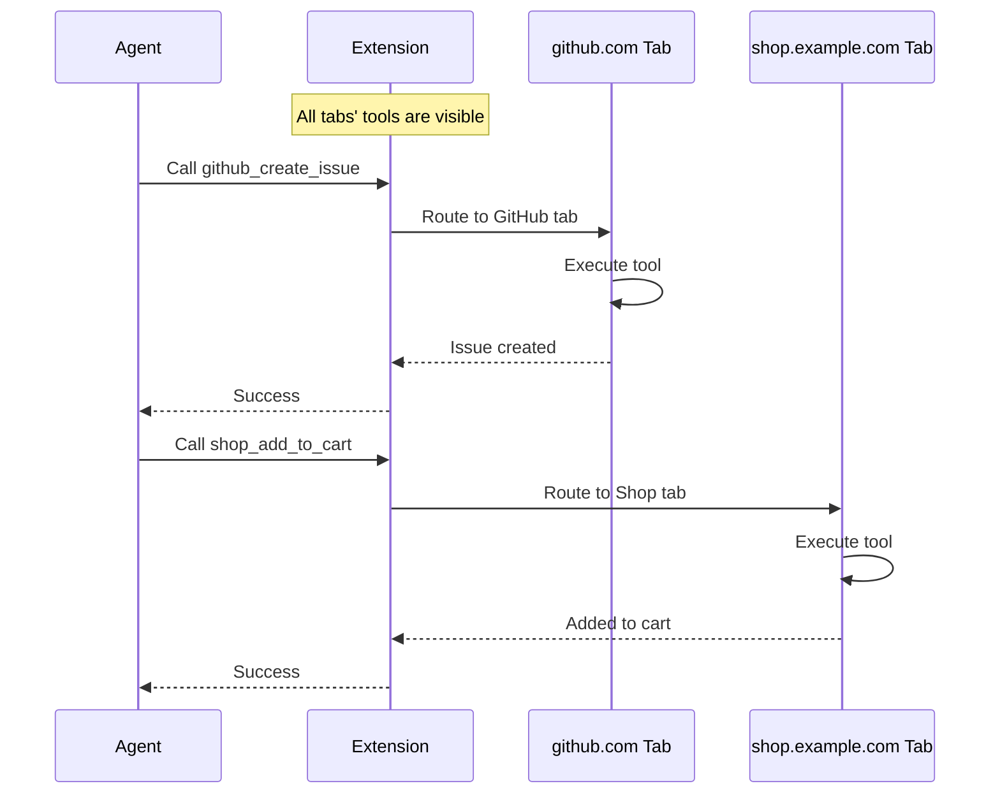
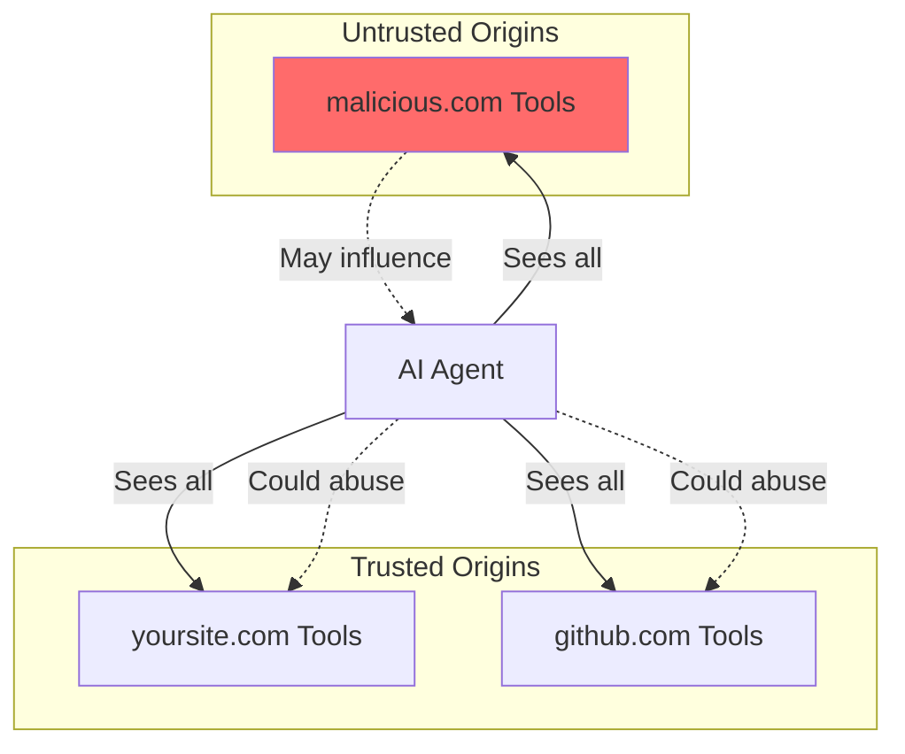

## Overview

The MCP-B Extension collects and maintains tools from **all open tabs simultaneously**, making them available to agents regardless of which tab is currently active.

<Info>
**Key behavior**: Unlike traditional tab-scoped approaches, the extension aggregates tools from every open tab, giving agents access to your entire browsing context at once.
</Info>

This architectural decision enables powerful cross-tab workflows while introducing unique design considerations for tool naming and organization.

## How Tool Collection Works

When you have multiple tabs open with WebMCP servers, the extension creates a unified tool registry:



### Registration Lifecycle

Each tab independently registers its tools with the extension:

<Steps>
  <Step title="Tab loads">
    User opens a website or navigates to a new page
  </Step>

  <Step title="Tools register">
    Website's WebMCP code calls `registerTool()` or uses `useWebMCP()` hooks
  </Step>

  <Step title="Extension receives">
    Extension adds tools to the global registry with origin metadata
  </Step>

  <Step title="Agent sees update">
    AI agent's tool list is updated to include new tools
  </Step>

  <Step title="Tab closes">
    When tab is closed, its tools are automatically unregistered
  </Step>
</Steps>

## Tool Routing Mechanism

When an agent calls a tool, the extension routes the call to the correct tab:



### Routing Algorithm

<Steps>
  <Step title="Agent requests tool">
    Agent calls a tool (e.g., `github_create_issue`)
  </Step>

  <Step title="Extension identifies source">
    Extension looks up which tab registered that tool name
  </Step>

  <Step title="Extension routes call">
    If the tab is still open, the tool is executed immediately. If the tab was closed, the tool call fails.
  </Step>

  <Step title="Results returned">
    Tool execution results are routed back through extension to agent
  </Step>
</Steps>

## Architectural Implications

### 1. Tool Naming Becomes Critical

Since all tools from all tabs are visible in a single namespace, naming conflicts can occur:

<Tabs>
  <Tab title="Good Naming">
    ```tsx
    // Clear origin and purpose
    useWebMCP({
      name: 'github_create_issue',
      description: 'Create a new GitHub issue in the current repository',
      // ...
    });

    useWebMCP({
      name: 'jira_create_issue',
      description: 'Create a new Jira issue in the current project',
      // ...
    });
    ```
  </Tab>

  <Tab title="Bad Naming">
    ```tsx
    // Ambiguous - which site? which feature?
    useWebMCP({
      name: 'create',  // ❌ Too generic
      description: 'Create something',
      // ...
    });

    useWebMCP({
      name: 'create_issue',  // ❌ Naming conflict likely
      description: 'Create an issue',
      // ...
    });
    ```
  </Tab>
</Tabs>

**Recommended pattern**: Prefix tool names with domain or feature identifier to avoid conflicts.

### 2. Descriptions Must Provide Context

Since agents see all tools at once without inherent context about which tab they came from, descriptions must be self-contained:

```tsx
// ✅ Good - describes what, where, and context
useWebMCP({
  name: 'shop_add_to_cart',
  description: 'Add the currently viewed product from shop.example.com to your shopping cart. Product must be on screen.',
  // ...
});

// ❌ Bad - lacks context
useWebMCP({
  name: 'add_to_cart',
  description: 'Add item to cart',  // Which site? What item?
  // ...
});
```

### 3. Tools Appear and Disappear Dynamically

Tool availability changes as users open and close tabs:

```tsx
// This tool is available only while the product page tab is open
function ProductPage() {
  useWebMCP({
    name: 'get_current_product',
    description: 'Get details about the currently viewed product',
    handler: async () => {
      return await fetchProductDetails(productId);
    }
  });

  return <div>Product Details</div>;
}

// When user closes this tab, get_current_product disappears from the toolkit
```

<Warning>
Agents must handle tools becoming unavailable mid-conversation. Always design tools to fail gracefully if the source tab is closed.
</Warning>

### 4. Cross-Tab Workflows Are Natural

Agents can compose tools from different tabs into complex workflows:

```tsx
// Tab 1: Calendar app (calendar.app)
useWebMCP({
  name: 'calendar_add_event',
  description: 'Add event to your calendar',
  inputSchema: {
    title: z.string(),
    date: z.string().datetime()
  },
  handler: async ({ title, date }) => {
    return await calendar.addEvent({ title, date });
  }
});

// Tab 2: Email app (mail.app)
useWebMCP({
  name: 'email_get_unread',
  description: 'Get your unread emails',
  handler: async () => {
    return await email.getUnread();
  }
});

// Agent can naturally execute:
// "Get my unread emails and add any meeting invites to my calendar"
// It sees and can use tools from both tabs
```

## Managing Tool Overload

When many tabs are open, agents may see dozens or hundreds of tools. Use these patterns to manage complexity:

### Pattern 1: Conditional Registration

Only register tools when they're relevant:

```tsx
function CartPage() {
  const { items } = useCart();

  // Only show checkout tool when cart has items
  useWebMCP({
    name: 'shop_checkout',
    description: 'Complete the checkout process',
    handler: async () => {
      return await processCheckout();
    },
    enabled: items.length > 0  // Conditional registration
  });

  return <div>Cart ({items.length} items)</div>;
}
```

### Pattern 2: Context-Rich Descriptions

Help agents understand when to use tools:

```tsx
useWebMCP({
  name: 'shop_checkout',
  description: 'Complete checkout on shop.example.com. Only use this after items have been added to cart and user has confirmed the order. Requires payment information to be on file.',
  handler: async () => {
    return await processCheckout();
  }
});
```

### Pattern 3: Component Lifecycle Scoping

Use React component lifecycle to scope tool availability:

```tsx
function CheckoutFlow() {
  const [step, setStep] = useState('cart');

  // Cart step tools
  useWebMCP({
    name: 'cart_update_quantity',
    description: 'Update item quantity in cart',
    enabled: step === 'cart',  // Only available on cart step
    // ...
  });

  // Shipping step tools
  useWebMCP({
    name: 'shipping_select_address',
    description: 'Select shipping address',
    enabled: step === 'shipping',  // Only available on shipping step
    // ...
  });

  // Payment step tools
  useWebMCP({
    name: 'payment_submit',
    description: 'Submit payment and complete order',
    enabled: step === 'payment',  // Only available on payment step
    // ...
  });

  return <div>Step: {step}</div>;
}
```

## Security Considerations

Multi-tab tool collection creates unique security implications:

<Warning>
Tools from malicious websites can influence agent behavior, potentially causing the agent to abuse tools from legitimate websites. See [Agent Threat Model](/concepts/agent-threat-model) for detailed security considerations.
</Warning>

### Origin Isolation

While tools are collected from all tabs, the **execution context remains origin-isolated**:

- Each tool executes in its originating tab's context
- Tools inherit their tab's session, cookies, and authentication
- Same-origin policy prevents cross-tab data leakage
- Extension enforces origin validation on all tool calls

### Trust Boundary



**Defense**: Design tools to validate all inputs and never trust agent-provided data, even if it seems to come from the agent's current task context.

## Implementation Patterns

<Info>
For practical implementation examples of multi-tab patterns, see [Advanced Guide: Multi-Tab Tool Collection](/advanced#multi-tab-tool-collection)
</Info>

## Next Steps

<CardGroup cols={2}>
  <Card
    title="Tool Composition"
    icon="link"
    href="/concepts/tool-composition"
  >
    Learn about cross-site tool composition patterns
  </Card>

  <Card
    title="Architecture"
    icon="diagram-project"
    href="/concepts/architecture"
  >
    Understand WebMCP's overall architecture
  </Card>

  <Card
    title="Agent Threat Model"
    icon="triangle-exclamation"
    href="/concepts/agent-threat-model"
  >
    Security considerations for multi-agent environments
  </Card>

  <Card
    title="Advanced Patterns"
    icon="wand-magic-sparkles"
    href="/advanced"
  >
    Implementation examples and advanced techniques
  </Card>
</CardGroup>
