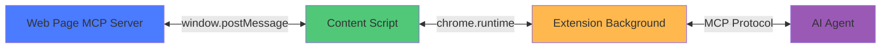
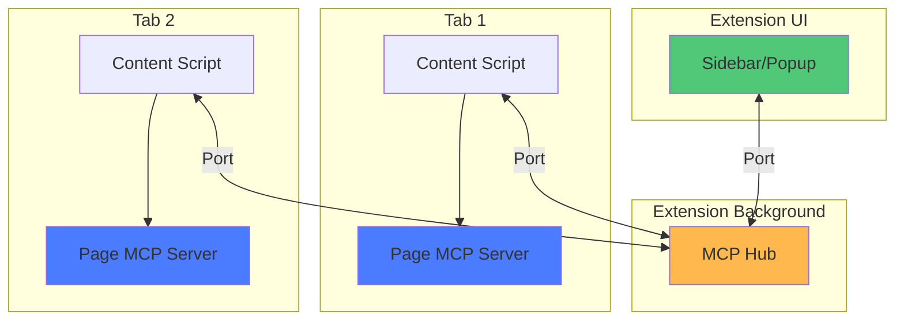

WebMCP uses transport layers to enable communication between different browser contexts (tabs, extensions, pages). The transport layer abstracts the underlying communication mechanism while maintaining the MCP protocol.

## Tab Transport (In-Page Communication)

For communication within the same browser tab:



**Use cases:**
- Website exposing tools to extension
- Same-origin communication
- Real-time tool updates

### Setting Up Tab Transport

```javascript
import { TabServerTransport } from '@mcp-b/transports';
import { initializeWebModelContext } from '@mcp-b/global';

initializeWebModelContext({
  transport: {
    tabServer: {
      allowedOrigins: ['https://myapp.com', 'https://api.myapp.com']
      // or ['*'] for development only
    }
  }
});
```

<Warning>
  **Security:** Always restrict `allowedOrigins` in production. Using `['*']` allows any origin to communicate with your MCP server, which can be a security risk.
</Warning>

## Extension Transport (Cross-Context)

For communication between extension components:



**Use cases:**
- Multi-tab tool aggregation
- Extension-to-extension communication
- Centralized tool management

### Extension Transport Features

The extension transport enables:

- **Tool Aggregation** - Collect tools from multiple tabs into a single interface
- **Persistent Connection** - Maintain stable communication channels across page navigation
- **Background Processing** - Execute tool calls in the background service worker
- **Cross-Tab Coordination** - Coordinate actions across multiple browser tabs

## Transport Comparison

| Feature | Tab Transport | Extension Transport |
|---------|--------------|-------------------|
| **Scope** | Single tab | Multiple tabs/extension |
| **Setup Complexity** | Simple | Moderate |
| **Use Case** | Website tools | Extension features |
| **Security** | Origin-based | Extension permissions |
| **Performance** | Fast (same context) | Moderate (cross-context) |
| **Tool Persistence** | Page lifetime | Extension lifetime |

## Choosing the Right Transport

<AccordionGroup>
  <Accordion title="Use Tab Transport when...">
    - You're building a website that exposes tools to AI agents
    - Your tools are specific to a single page/domain
    - You want simple setup with minimal configuration
    - You need real-time updates as page state changes
    - Your website is the primary MCP server
  </Accordion>

  <Accordion title="Use Extension Transport when...">
    - You're building browser extension features
    - You need to aggregate tools from multiple tabs
    - You want tools to persist across page navigation
    - You need background processing capabilities
    - You're building cross-tab coordination features
  </Accordion>
</AccordionGroup>

## How Transports Work

### Message Flow

1. **Tool Registration**
   - Your code calls `navigator.modelContext.registerTool()`
   - The polyfill stores the tool definition
   - The transport layer announces the new tool to connected clients

2. **Tool Discovery**
   - AI agent requests available tools
   - Extension queries transport for tool list
   - Transport returns all registered tools with schemas

3. **Tool Execution**
   - AI agent calls a tool with arguments
   - Extension sends execution request via transport
   - Transport routes to the correct tool handler
   - Handler executes and returns result
   - Transport forwards result back to AI agent

## Advanced: Custom Transports

You can implement custom transports for specialized use cases:

```typescript
import { Transport } from '@mcp-b/transports';

class CustomTransport implements Transport {
  async send(message: MCPMessage): Promise<void> {
    // Your custom sending logic
  }

  onMessage(handler: (message: MCPMessage) => void): void {
    // Your custom message receiving logic
  }

  async close(): Promise<void> {
    // Cleanup logic
  }
}
```

See [@mcp-b/transports documentation](/packages/transports) for details on implementing custom transports.

## Related Topics

<CardGroup cols={2}>
  <Card title="Architecture" icon="diagram-project" href="/concepts/architecture">
    See how transports fit into the overall architecture
  </Card>

  <Card title="Security" icon="shield" href="/concepts/security">
    Understanding transport security and origin validation
  </Card>

  <Card title="Extension Architecture" icon="puzzle-piece" href="/concepts/extension">
    Deep dive into extension transport implementation
  </Card>

  <Card title="@mcp-b/transports" icon="npm" href="/packages/transports">
    Transport package API reference
  </Card>
</CardGroup>
