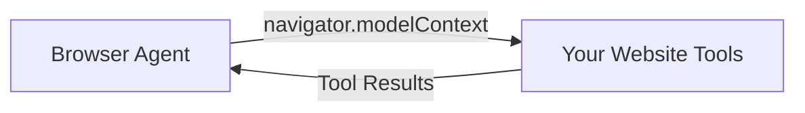
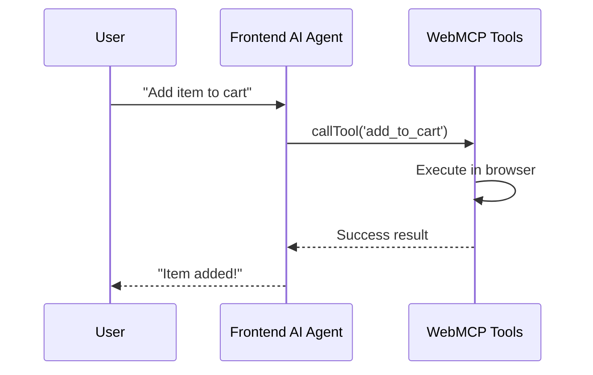
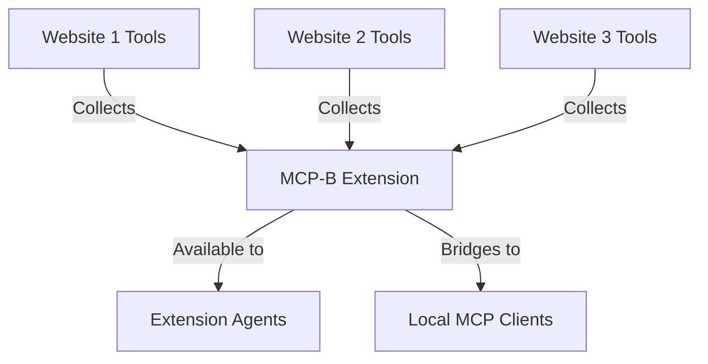
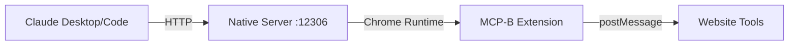
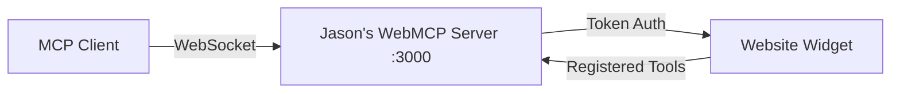
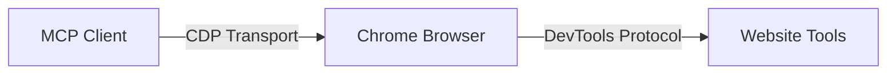

## Overview

WebMCP tools can be connected to AI agents in multiple ways, giving you flexibility to integrate with any agent architecture. Whether you're using a browser-based agent, a local desktop client, or building your own AI application, WebMCP has a connection method that fits your needs.

## Connection Methods

There are four primary ways to connect agents to WebMCP tools:

<CardGroup cols={2}>
  <Card title="Browser Agents" icon="browser">
    Native browser support (coming soon)
  </Card>

  <Card title="Frontend AI Frameworks" icon="wand-magic-sparkles">
    Direct integration with your website's AI
  </Card>

  <Card title="MCP-B Extension" icon="puzzle-piece">
    Browser extension for any website
  </Card>

  <Card title="Local MCP Clients" icon="desktop">
    Claude Desktop, VSCode, and more
  </Card>
</CardGroup>

## 1. Browser Agents (Native Support)

### What Are Browser Agents?

Browser agents are AI assistants built directly into web browsers. These agents have native access to the web platform APIs, including WebMCP's `navigator.modelContext`.

### Current Status

<Info>
**Chrome** and **Edge** are both planning native implementations of browser agents that will support WebMCP tools out of the box.
</Info>

When these implementations ship, any website using WebMCP will automatically work with the browser's built-in AI assistant - no extension or additional setup required.

### How It Works



Browser agents will be able to:
- Discover tools registered via `navigator.modelContext.registerTool()`
- Call tools with user permission
- Receive results directly
- Respect the same origin policies and authentication

### Getting Ready

To prepare for browser agent support:

<Steps>
  <Step title="Register your tools">
    Use the standard `navigator.modelContext` API to register tools
  </Step>

  <Step title="Follow security best practices">
    Review [security guidelines](/security) for tool validation and permissions
  </Step>

  <Step title="Test with MCP-B Extension">
    Use the [MCP-B Extension](/extension/index) to test how agents will interact with your tools
  </Step>
</Steps>

## 2. Frontend AI Frameworks

### What Are Frontend AI Frameworks?

Frontend AI frameworks let you build AI-powered features directly into your website or web application. These frameworks can call WebMCP tools from your site's own AI agent.

<Card title="Frontend Tool Calling Guide" icon="wand-magic-sparkles" href="/ai-frameworks/index">
  Complete guide to integrating WebMCP with frontend AI frameworks
</Card>

### Supported Frameworks

<CardGroup cols={2}>
  <Card title="Assistant-UI" icon="robot" href="https://www.assistant-ui.com/docs/copilots/model-context">
    React framework for building AI assistants
  </Card>

  <Card title="AG-UI" icon="sparkles" href="https://docs.ag-ui.com/concepts/tools#frontend-defined-tools">
    Agentic UI framework with tool support
  </Card>
</CardGroup>

### How It Works

Your website's AI agent calls WebMCP tools directly in the browser:



### Quick Example

```tsx
import { useWebMCP } from '@mcp-b/react-webmcp';
import { z } from 'zod';

// Register a tool
useWebMCP({
  name: 'add_to_cart',
  description: 'Add product to cart',
  inputSchema: {
    productId: z.string(),
    quantity: z.number().min(1)
  },
  handler: async (input) => {
    await addToCart(input.productId, input.quantity);
    return { success: true };
  }
});
```

Your frontend AI can then discover and call this tool automatically.

## 3. MCP-B Extension

### What Is the MCP-B Extension?

The [MCP-B Extension](https://chromewebstore.google.com/detail/mcp-b-extension/daohopfhkdelnpemnhlekblhnikhdhfa) is a browser extension that:
- Collects WebMCP tools from all open tabs
- Provides AI agents specialized for different tasks
- Lets you create custom tools via userscripts
- Bridges tools to local MCP clients

<Card title="Extension Guide" icon="puzzle-piece" href="/extension/index">
  Complete guide to the MCP-B browser extension
</Card>

### Built-in Agents

The extension includes four specialized agents:

<CardGroup cols={2}>
  <Card title="Userscript Engineer" icon="code">
    Build custom scripts to enhance websites
  </Card>

  <Card title="WebMCP Server" icon="server">
    Turn websites into AI-accessible tools
  </Card>

  <Card title="Browsing Agent" icon="browser">
    Navigate and inspect web pages
  </Card>

  <Card title="Chat Companion" icon="message">
    Ask questions without automation
  </Card>
</CardGroup>

<Card title="Understanding Agents" icon="robot" href="/extension/agents">
  Learn about each agent and when to use them
</Card>

### How It Works



The extension aggregates tools from all your open tabs and makes them available to:
- The extension's built-in agents
- Local MCP clients via the native server bridge

## 4. Local MCP Clients

### What Are Local MCP Clients?

Local MCP clients are AI assistants that run on your desktop, such as:
- **Claude Desktop** - Anthropic's desktop app
- **Claude Code** - AI coding assistant
- **VSCode with Cline** - Code editor with AI
- **Cursor** - AI-powered code editor
- **Windsurf** - AI development environment

### Connection Methods

There are three ways to connect local MCP clients to your browser's WebMCP tools:

#### Method 1: Native Server Bridge (via MCP-B)

The official MCP-B native server provides the most seamless integration.

<Card title="Native Host Setup" icon="server" href="/native-host-setup">
  Complete setup guide for the MCP-B native server
</Card>

**How it works:**


**Quick setup:**

<Steps>
  <Step title="Install native server">
    ```bash
    npm install -g @mcp-b/native-server
    ```
  </Step>

  <Step title="Start the server">
    ```bash
    @mcp-b/native-server
    ```
  </Step>

  <Step title="Configure your MCP client">
    Add to your MCP client config (e.g., `~/.config/claude/mcp.json`):
    ```json
    {
      "mcpServers": {
        "webmcp": {
          "type": "streamable-http",
          "url": "http://127.0.0.1:12306/mcp"
        }
      }
    }
    ```
  </Step>
</Steps>

**Best for:**
- Using MCP-B extension's built-in agents
- Accessing tools from multiple tabs simultaneously
- Most streamlined setup

#### Method 2: Jason's WebMCP Library

An alternative local server implementation by Jason McGhee that creates a direct bridge between MCP clients and websites. This is a separate implementation from the MCP-B packages.

<Card
  title="Jason's WebMCP Library"
  icon="github"
  href="https://github.com/jasonjmcghee/WebMCP"
>
  View Jason's WebMCP library on GitHub (separate from MCP-B)
</Card>

**How it works:**


**Quick setup:**

<Steps>
  <Step title="Install and configure">
    Run the auto-configuration script:
    ```bash
    npx -y @jason.today/webmcp@latest --config claude
    ```

    Supports: `claude`, `cursor`, `cline`, `windsurf`, or a custom path
  </Step>

  <Step title="Add widget to your website">
    Include Jason's WebMCP script on your site:
    ```html
    <script src="webmcp.js"></script>
    ```

    A widget will appear in the bottom-right corner
  </Step>

  <Step title="Connect to your site">
    Ask your MCP client to generate a connection token, then paste it into the widget on your website
  </Step>
</Steps>

**Features:**
- Widget-based UI for connection management
- Token-based authentication
- Supports multiple websites simultaneously
- Tools scoped by domain
- Built-in MCP tool definer

<Note>
Jason's WebMCP is an independent implementation, separate from the MCP-B project. Both provide WebMCP functionality but with different architectures and use cases.
</Note>

**Best for:**
- Direct website-to-MCP-client connections
- Website owners who want to provide WebMCP access
- Users who prefer not to use browser extensions
- Custom MCP client integrations

#### Method 3: Chrome DevTools Protocol (Coming Soon)

The MCP-B team is developing a custom Chrome DevTools Protocol (CDP) transport for connecting MCP clients directly to the browser.

<Warning>
**Status:** In development, not yet available for production use
</Warning>

**How it will work:**


**Advantages when available:**
- Direct browser connection without extension
- Access to browser debugging APIs
- Lower latency than HTTP bridge
- More granular control over browser state

**Use cases:**
- Advanced automation scenarios
- Testing and debugging workflows
- Direct browser control from MCP clients

<Info>
Watch the [WebMCP GitHub repository](https://github.com/WebMCP-org/npm-packages) for updates on CDP transport availability.
</Info>

## Choosing the Right Method

Use this guide to select the best connection method for your use case:

<Tabs>
  <Tab title="For Website Developers">
    **Building AI features into your site:**
    - Use [Frontend AI Frameworks](/ai-frameworks/index) (Assistant-UI, AG-UI)
    - Integrate WebMCP tools directly with your site's AI
    - Full control over user experience

    **Enabling MCP client access:**
    - Add [Jason's WebMCP widget](https://github.com/jasonjmcghee/WebMCP) to your site
    - Users can connect their local MCP clients
    - Provide structured tool access to visitors
  </Tab>

  <Tab title="For Extension Users">
    **Want to customize any website:**
    - Install [MCP-B Extension](/extension/index)
    - Use built-in agents to create tools and userscripts
    - No coding required for basic use

    **Connect to desktop AI:**
    - Install [MCP-B Extension](/extension/index)
    - Set up [Native Server Bridge](/native-host-setup)
    - Access browser tools from Claude Desktop/Code
  </Tab>

  <Tab title="For AI App Builders">
    **Building browser-based AI:**
    - Use [Frontend AI Frameworks](/ai-frameworks/index)
    - Integrate `@mcp-b/react-webmcp` hooks
    - Call WebMCP tools from your AI runtime

    **Building desktop AI:**
    - Use MCP SDK to connect via [Native Server](/native-host-setup)
    - Or use [Jason's WebMCP library](https://github.com/jasonjmcghee/WebMCP)
    - Support user's browser tools in your AI app
  </Tab>

  <Tab title="For End Users">
    **Using existing websites:**
    - If site has Jason's WebMCP widget: Use [Jason's WebMCP library](https://github.com/jasonjmcghee/WebMCP)
    - If you want to add tools: Install [MCP-B Extension](/extension/index)

    **Connecting to Claude Desktop:**
    1. Install [MCP-B Extension](/extension/index)
    2. Install and start [Native Server](/native-host-setup)
    3. Configure Claude Desktop
    4. Tools from open tabs appear in Claude
  </Tab>
</Tabs>

## Comparison Matrix

| Method | Setup Complexity | Best For | Browser Extension Required | Website Changes Required |
|--------|------------------|----------|----------------------------|--------------------------|
| **Browser Agents** | None (when available) | Future-proof integration | No | No |
| **Frontend Frameworks** | Medium | Site-integrated AI | No | Yes (code integration) |
| **MCP-B Extension** | Low | Any website + built-in agents | Yes | No |
| **Native Server (MCP-B)** | Low | Multiple tabs + extension agents | Yes (MCP-B) | No |
| **Jason's WebMCP** | Medium | Direct site-to-client | No | Yes (widget script) |
| **CDP Transport** | TBD | Advanced automation | TBD | No |

## Security Considerations

<Warning>
All connection methods execute tools with the same permissions as your browser session. Only use tools you trust and understand.
</Warning>

<AccordionGroup>
  <Accordion title="Browser Agents">
    - Tools inherit user's browser permissions
    - Origin-based security policies apply
    - User consent required for sensitive operations
  </Accordion>

  <Accordion title="Frontend Frameworks">
    - Tools run in your website's context
    - Same-origin policy applies
    - You control tool registration and execution
    - Validate all inputs with Zod schemas
  </Accordion>

  <Accordion title="MCP-B Extension">
    - Extension has access to all open tabs
    - Tools scoped by domain
    - Native server listens on localhost only
    - Review [extension security](/extension/index#privacy--security)
  </Accordion>

  <Accordion title="Jason's WebMCP">
    - Token-based authentication
    - Localhost-only WebSocket server
    - Single-use registration tokens
    - Website receives session token after registration
    - Review [Jason's WebMCP security documentation](https://github.com/jasonjmcghee/WebMCP#security)
  </Accordion>
</AccordionGroup>

<Card title="Security Best Practices" icon="shield-halved" href="/security">
  Comprehensive security guide for WebMCP implementations
</Card>

## Getting Started

Ready to connect your agent? Follow these quick start guides:

<CardGroup cols={2}>
  <Card
    title="Frontend Integration"
    icon="wand-magic-sparkles"
    href="/ai-frameworks/index"
  >
    Add WebMCP to your website's AI features
  </Card>

  <Card
    title="MCP-B Extension"
    icon="puzzle-piece"
    href="/extension/index"
  >
    Install and use the browser extension
  </Card>

  <Card
    title="Native Server Setup"
    icon="server"
    href="/native-host-setup"
  >
    Connect Claude Desktop and other MCP clients
  </Card>

  <Card
    title="Claude Code Integration"
    icon="terminal"
    href="/tools/claude-code"
  >
    Use WebMCP tools with Claude Code
  </Card>
</CardGroup>

## Next Steps

<Steps>
  <Step title="Understand the architecture">
    Read [Core Concepts](/concepts/overview) to learn how WebMCP works
  </Step>

  <Step title="Review security">
    Check [Security Best Practices](/security) before deploying
  </Step>

  <Step title="Explore examples">
    See working implementations in [Examples](/examples)
  </Step>

  <Step title="Join the community">
    Get help on [Discord](https://discord.gg/ZnHG4csJRB)
  </Step>
</Steps>

## Troubleshooting

<AccordionGroup>
  <Accordion title="Tools not appearing in my MCP client">
    **Checklist:**
    1. Verify native server is running: `curl http://127.0.0.1:12306/health`
    2. Check MCP-B extension is connected
    3. Ensure website tabs with tools are open
    4. Restart your MCP client if needed
    5. Review [troubleshooting guide](/troubleshooting)
  </Accordion>

  <Accordion title="Jason's WebMCP widget not connecting">
    **For Jason's WebMCP library users:**
    1. Ensure WebSocket server is running
    2. Check token was entered correctly
    3. Verify no firewall blocking localhost
    4. Review browser console for errors
    5. See [Jason's WebMCP issues](https://github.com/jasonjmcghee/WebMCP/issues)
  </Accordion>

  <Accordion title="Frontend tools not being called">
    **For frontend framework users:**
    1. Verify tools are registered: Check `navigator.modelContext`
    2. Confirm MCP client is connected
    3. Check tool schema validation
    4. Review [frontend tools guide](/ai-frameworks/index)
    5. Enable verbose logging in your transport
  </Accordion>
</AccordionGroup>

## Resources

<CardGroup cols={3}>
  <Card
    title="Core Concepts"
    icon="diagram-project"
    href="/concepts/overview"
  >
    Understanding WebMCP architecture
  </Card>

  <Card
    title="Development Guide"
    icon="code"
    href="/development"
  >
    Building WebMCP tools
  </Card>

  <Card
    title="API Reference"
    icon="book"
    href="/packages/global"
  >
    navigator.modelContext API docs
  </Card>

  <Card
    title="MCP Specification"
    icon="file-lines"
    href="https://modelcontextprotocol.io"
  >
    Model Context Protocol docs
  </Card>

  <Card
    title="WebMCP GitHub"
    icon="github"
    href="https://github.com/WebMCP-org"
  >
    Source code and examples
  </Card>

  <Card
    title="Discord Community"
    icon="discord"
    href="https://discord.gg/ZnHG4csJRB"
  >
    Get help and share ideas
  </Card>
</CardGroup>
