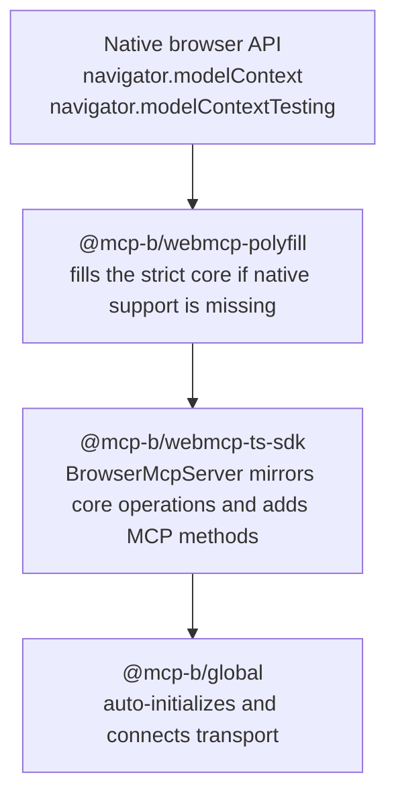
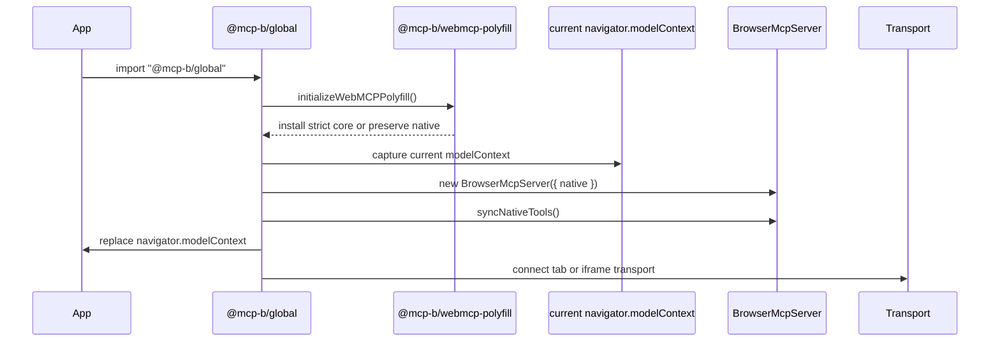

The MCP-B runtime is a stack of layers. Each layer wraps the one below it, adding capabilities while preserving the lower layer's behavior. Understanding this stack clarifies why tools registered through `@mcp-b/global` remain visible to the browser testing API, and why cleanup can restore the original state.

## The stack

The bottom layer is whatever `navigator.modelContext` the browser provides. In Chromium with the experimental flag, this is the native implementation. In all other browsers, that slot is empty.

The polyfill layer fills the slot when it is empty. If native support exists, the polyfill does nothing.

The `BrowserMcpServer` wraps whichever implementation occupies the slot, native or polyfill, and adds MCP-B methods. `@mcp-b/global` is the entry point that constructs that stack and connects transport.

## Initialization sequence

When you import `@mcp-b/global`, the following sequence runs:

That sequence matters because it explains two otherwise surprising behaviors:

- code using the full MCP-B runtime can still be visible to browser-side inspection tools
- cleanup can restore the exact core context that existed before wrapping

## The mirroring pattern

The most important architectural detail is mirroring. `BrowserMcpServer` does not invent a separate isolated tool universe. Core operations such as `registerTool` and `unregisterTool` are mirrored down to the underlying native or polyfill context.

That is what keeps `navigator.modelContextTesting`, the Chrome inspector, and other browser-facing consumers in sync with the tools you registered through MCP-B.

Extension-only operations such as prompts, resources, sampling, and elicitation do not mirror downward because the native core has no concept of them. Those live only on the MCP-B layer. For that boundary, see [Strict Core vs MCP-B Extensions](/explanation/strict-core-vs-mcp-b-extensions).

## Cleanup and restoration

`@mcp-b/global` exports `cleanupWebModelContext()`. Calling it closes transport and restores `navigator.modelContext` to the captured core context. If the original value was native, you get native back. If it was the polyfill, you get the polyfill back.

This makes the runtime safe for tests, re-initialization, and hot-reload scenarios.

## Why not a simpler design?

The answer is interoperability. Browser extensions, the Chrome Model Context Tool Inspector, and future browser UIs all need a coherent view of the core tool registry. If `@mcp-b/global` stored tools only on its own server object, those consumers would see an empty tool list.

The layering also means that if Chromium ships native `navigator.modelContext` without flags in the future, `@mcp-b/global` picks it up automatically. The polyfill becomes a no-op, the wrapper stays in place, and application code does not need to change.

For how this layering relates to runtime choice, see [Native vs Polyfill vs Global](/explanation/native-vs-polyfill-vs-global). For a practical decision guide, see [Choose Your Runtime](/how-to/choose-runtime).
