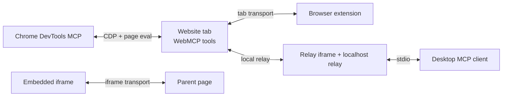
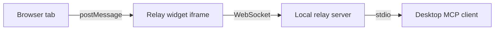

A WebMCP tool runs inside a browser tab. Its `execute` callback has access to the page's DOM, state, and JavaScript context. But the consumer that wants to call that tool often lives somewhere else: in an extension, in a parent page, or on the desktop.

Transports solve that problem. They carry MCP messages between environments that cannot share memory. In MCP-B, those transports are part of the runtime layer, not part of the WebMCP standard itself.

## Tab transport

The tab transport is the default. When `@mcp-b/global` initializes in a main-window context, it starts a `TabServerTransport`. That transport listens for `postMessage`, validates the message origin, and responds with MCP messages.

This is the path that powers extension-side discovery and inspection. A page registers tools. An extension-side client transport discovers those tools and presents them to an agent or a user. For debugging from the browser side, compare this with [Try the Native Chrome Preview](/tutorials/first-native-preview).

## Iframe transport

When a page embeds another page in an iframe, and the embedded page has WebMCP tools, those tools do not automatically become visible to the parent. The iframe transport pair handles that boundary.

The parent uses an `IframeParentTransport`. The child uses an `IframeChildTransport`. The [`@mcp-b/mcp-iframe`](/packages/mcp-iframe/reference) package wraps that setup in a custom element and namespaces the forwarded tools to prevent collisions.

This is why iframe bridging belongs in MCP-B documentation, not in the standard pages. It is transport and composition policy, not the browser API itself.

## Extension transport

Browser extensions span several contexts: content scripts, background workers, and UI surfaces such as side panels or popups. MCP-B extension transports connect those contexts and aggregate tool access across tabs.

That architecture is what lets a browser-side tool inspector or agent surface discover tools from the current page, display them in extension UI, and invoke them safely. For the browser-native inspection path, the Chrome team also maintains the [Model Context Tool Inspector](https://chromewebstore.google.com/detail/model-context-tool-inspec/gbpdfapgefenggkahomfgkhfehlcenpd).

## Local relay

The local relay bridges browser tools to desktop MCP clients such as Claude Desktop, Cursor, and Claude Code.

From the desktop client's perspective, the relay looks like a normal MCP server. From the browser's perspective, the page still runs ordinary WebMCP tools. The bridge translates between the two worlds.

## Chrome DevTools bridge

[`@mcp-b/chrome-devtools-mcp`](/packages/chrome-devtools-mcp/reference) takes a different route. Instead of using `postMessage`, it reaches the page through the Chrome DevTools Protocol. That is why it fits especially well in coding-agent workflows where the same agent also wants screenshots, traces, console messages, and DOM access.

## Choosing a bridge

The question is not only where the tool lives. The question is where the caller lives.

If the caller is an extension in the same browser, use the tab or extension transport. If the caller is a parent page, use iframe transport. If the caller is a desktop MCP client, use the local relay or the DevTools bridge.

For API details, see [@mcp-b/transports](/packages/transports/reference), [@mcp-b/mcp-iframe](/packages/mcp-iframe/reference), [@mcp-b/webmcp-local-relay](/packages/webmcp-local-relay/reference), and [@mcp-b/chrome-devtools-mcp](/packages/chrome-devtools-mcp/reference).
