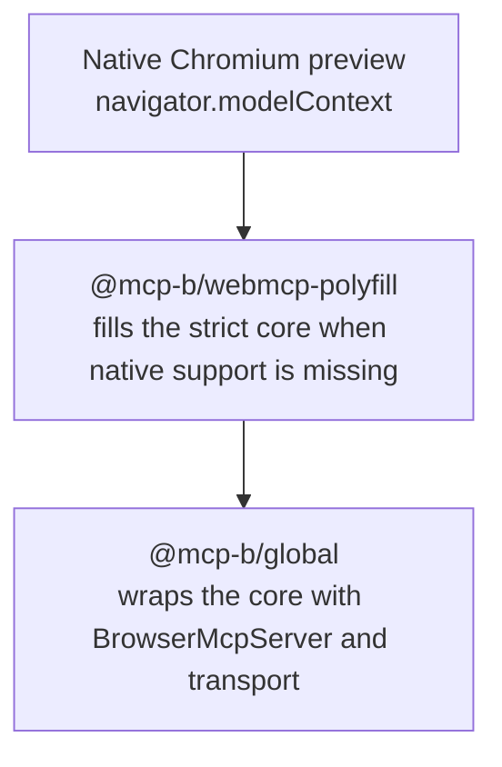
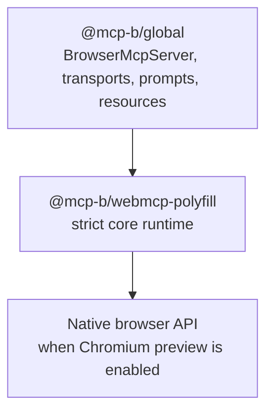

When you register a tool on `navigator.modelContext`, something has to implement that API. There are three options, and they correspond to three packages in the MCP-B ecosystem. Understanding why all three exist, and when each applies, helps you choose the right one for your project.

## The native browser API

Chrome 146 and later ship a native implementation of `navigator.modelContext` behind an experimental flag. When enabled, the browser itself provides the API surface and the preview testing companion `navigator.modelContextTesting`.

The native API is the ground truth. It is what the W3C specification describes and what browsers may eventually ship without flags. The Chrome team's [early preview post](https://developer.chrome.com/blog/webmcp-epp) and [AI on Chrome overview](https://developer.chrome.com/docs/ai) are the right places to track that work.

The catch is availability. Most users do not browse with that flag enabled, and non-Chromium browsers do not provide the preview.

## The strict polyfill: `@mcp-b/webmcp-polyfill`

[`@mcp-b/webmcp-polyfill`](/reference/runtime/webmcp-polyfill) provides a JavaScript implementation of the WebMCP surface. It installs `navigator.modelContext` without adding MCP-B-only methods.

The polyfill is strict by design. It does not add prompts, resources, transport, relay, `listTools()`, or `callTool()` to `navigator.modelContext`. If you write code against the polyfill, that code is meant to stay close to code written against the native browser surface.

Use the polyfill when you want the standard surface and nothing more, or when you are building a reusable library that should not depend on the full MCP-B runtime.

## The full runtime: `@mcp-b/global`

[`@mcp-b/global`](/reference/runtime/global) is the MCP-B runtime layer. It calls the polyfill when needed, captures the current core context, creates a `BrowserMcpServer`, and then replaces `navigator.modelContext` with that server.

After that replacement, `navigator.modelContext` still supports the core methods, but it also gains MCP-B-only capabilities:

| Added by `@mcp-b/global` | Purpose |
| --- | --- |
| `listTools()` | List registered tools |
| `callTool()` | Execute a tool by name |
| `registerPrompt()` | Register an MCP prompt template |
| `registerResource()` | Register an MCP resource |
| `createMessage()` | Request LLM sampling |
| `elicitInput()` | Request structured user input |

These additions are what make browser extensions, iframe bridges, prompts, resources, and desktop-agent relay flows possible.

## How they relate

The three strategies form a stack:

Each layer is optional from the one above. `@mcp-b/global` calls the polyfill internally. The polyfill defers to the native API when present. Your tools still end up visible to the core browser-facing surfaces because the runtime mirrors core operations downward.

## Choosing a strategy

If you are building a **reusable library**, depend on the strict core. Use [`@mcp-b/webmcp-types`](/reference/runtime/webmcp-types) for types and [`@mcp-b/webmcp-polyfill`](/reference/runtime/webmcp-polyfill) for runtime behavior.

If you are building a **web application** and only need site-exposed tools, start with [`@mcp-b/webmcp-polyfill`](/reference/runtime/webmcp-polyfill). If you need browser MCP features beyond that, use [`@mcp-b/global`](/reference/runtime/global).

If you are **testing Chromium's native preview**, use neither package and work directly with the browser implementation. The guided path for that is [Try the Native Chrome Preview](/tutorials/first-native-preview).

For a more practical decision guide, see [Choose Your Runtime](/how-to/choose-runtime). For the architectural boundary between the core and the extension layer, see [Strict Core vs MCP-B Extensions](/explanation/strict-core-vs-mcp-b-extensions).
