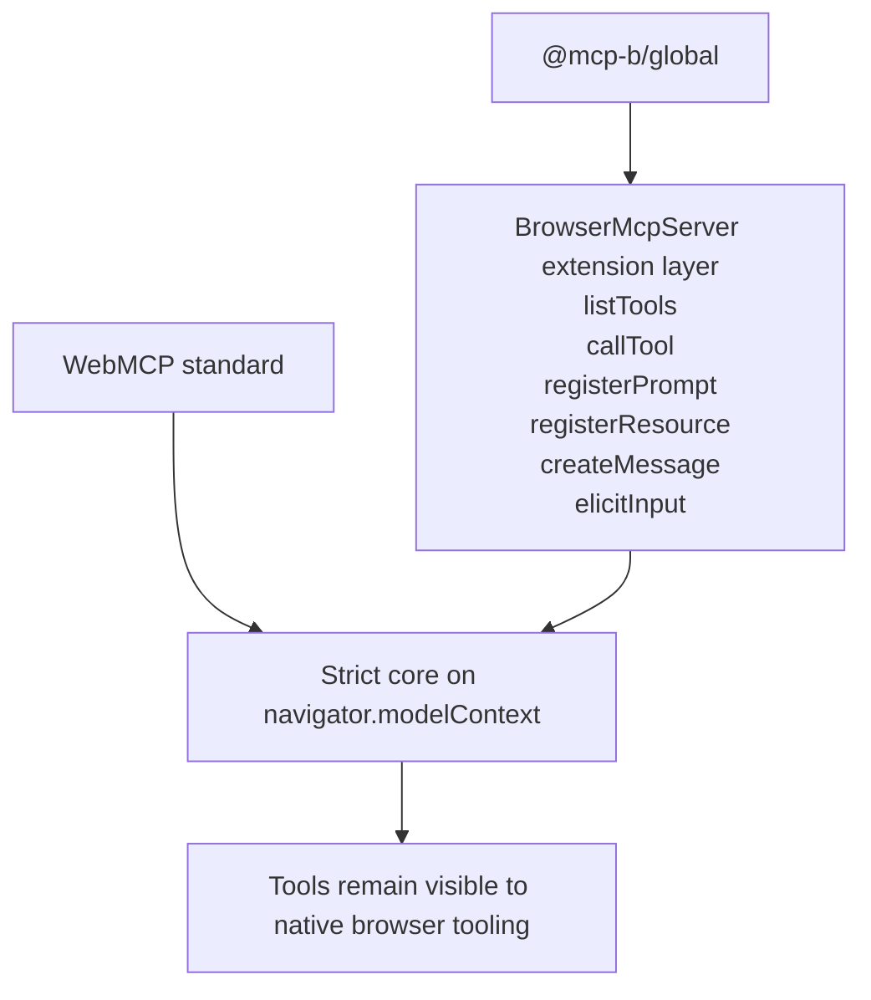

WebMCP defines a small API surface. The MCP-B packages extend that surface with capabilities drawn from the broader Model Context Protocol. This page explains where the boundary is, why it exists, and how the type system enforces it.

## The core: what the web standard defines

The formal WebMCP spec currently centers on `registerTool()` and `unregisterTool()` as the stable write surface on `navigator.modelContext`.

| Method | What it does |
| --- | --- |
| `registerTool(tool)` | Add a single tool to the registry |
| `unregisterTool(name)` | Remove a tool by name |

The polyfill and type layer also include `provideContext()` and `clearContext()` for batch registration and full reset, matching the `ModelContextCore` interface. These methods appear in the Chromium prototype but are not yet anchored in the formal W3C spec text the way `registerTool` and `unregisterTool` are.

For read and test operations, Chromium currently exposes a separate [navigator.modelContextTesting](/reference/webmcp/standard-api) interface. For the ongoing spec questions around that split, see [Spec Status and Limitations](/explanation/design/spec-status-and-limitations).

## The extensions: what MCP-B adds

The Model Context Protocol includes more than tools. It also includes prompts, resources, sampling, and elicitation. These are useful capabilities for browser-based agent workflows, but they are not part of the WebMCP standard.

When [`@mcp-b/global`](/reference/runtime/global) initializes, it installs a `BrowserMcpServer` that keeps the core behavior and adds a separate extension layer:

| Extension method | MCP concept | In WebMCP core? |
| --- | --- | --- |
| `listTools()` | tools/list | No |
| `callTool(params)` | tools/call | No |
| `registerPrompt(prompt)` | prompts | No |
| `registerResource(resource)` | resources | No |
| `createMessage(params)` | sampling | No |
| `elicitInput(params)` | elicitation | No |

The core methods are mirrored down to the underlying native or polyfill context. That is what keeps tools visible to browser-side tooling such as the testing API and the Chrome team's inspector.

## Why the separation exists

The separation is not accidental.

1. **Stability.** Code written against the strict core surface tracks the browser standard more closely.
2. **Portability.** Libraries that depend only on the core can work with native implementations, the polyfill, MCP-B, or future runtimes.
3. **Layering clarity.** Prompts, resources, and transports are useful, but they are not the same thing as the web platform surface.

This also leads to a documentation rule. When a page is about the WebMCP standard, it should summarize and link to Chrome and W3C material. When a page is about prompts, resources, bridge transport, or React hooks, it should document MCP-B in full.

## How the type system enforces it

The [`@mcp-b/webmcp-types`](/reference/runtime/webmcp-types) package defines two important interfaces:

- `ModelContextCore` contains the strict core methods.
- `ModelContextExtensions` contains MCP-B additions.

`ModelContext` is the core type. `ModelContextWithExtensions` is the intersection of core plus extensions. This means a library can type against the core and remain compatible with a fuller runtime later.

## When the boundary matters

For most application developers, the boundary is practical only when making runtime choices.

**If you are building a library or adapter**, stay on the core side. Use [`@mcp-b/webmcp-types`](/reference/runtime/webmcp-types) and [`@mcp-b/webmcp-polyfill`](/reference/runtime/webmcp-polyfill).

**If you are building an application**, start by asking whether you need only site-exposed tools. If yes, stay on the strict path with [`@mcp-b/webmcp-polyfill`](/reference/runtime/webmcp-polyfill). If you also need prompts, resources, transport, or desktop-agent connectivity, move up to [`@mcp-b/global`](/reference/runtime/global) and the [MCP-B Extension API](/reference/runtime/mcp-b-extension-api).

For the package-level rationale behind that split, see the [MCP-B Package Philosophy](https://github.com/WebMCP-org/npm-packages/blob/main/docs/MCPB_PACKAGE_PHILOSOPHY.md). For how the runtime layers stack at initialization time, see [Runtime Layering](/explanation/architecture/runtime-layering).
