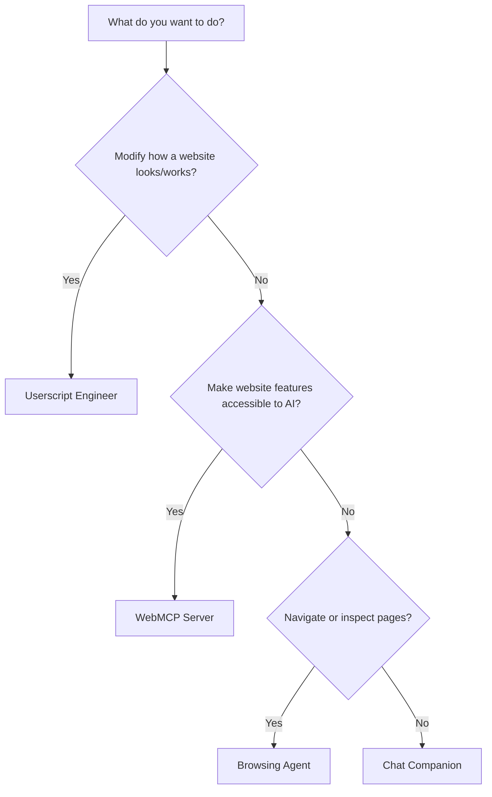

# Understanding Agents

The MCP-B extension includes four specialized AI agents, each designed for specific types of tasks. Choosing the right agent helps you work more effectively with web automation and MCP integration.

## Available Agents

<CardGroup cols={2}>
  <Card
    title="Userscript Engineer"
    icon="code"
  >
    Build custom scripts to enhance any website
  </Card>
  <Card
    title="WebMCP Server"
    icon="server"
  >
    Turn websites into AI-accessible tools
  </Card>
  <Card
    title="Browsing Agent"
    icon="browser"
  >
    Navigate and inspect web pages
  </Card>
  <Card
    title="Chat Companion"
    icon="message"
  >
    Ask questions without automation
  </Card>
</CardGroup>

## Switching Between Agents

You can switch agents at any time in the MCP-B extension:

<Steps>
  <Step title="Open the extension">
    Click the MCP-B icon in your browser toolbar
  </Step>
  <Step title="Access agent selector">
    Look for the agent dropdown menu at the top of the chat interface
  </Step>
  <Step title="Select your agent">
    Choose the agent that matches your current task
  </Step>
  <Step title="Start chatting">
    Describe what you want to accomplish
  </Step>
</Steps>

<Info>
Your conversation history is preserved when switching agents, but each agent has different capabilities and tool access.
</Info>

## Userscript Engineer

**Best for:** Customizing websites, adding features, automating repetitive tasks

### What it Does

The Userscript Engineer helps you create custom scripts that run on websites to modify their appearance or add new functionality. Think of it as having a personal developer who can customize any website for you.

### Example Uses

<CardGroup cols={2}>
  <Card title="Add Features" icon="plus">
    Add a dark mode toggle, custom shortcuts, or missing features to any site
  </Card>
  <Card title="Remove Clutter" icon="trash">
    Hide ads, banners, or distracting elements from your favorite sites
  </Card>
  <Card title="Automate Tasks" icon="bolt">
    Auto-fill forms, extract data, or streamline repetitive workflows
  </Card>
  <Card title="Customize Style" icon="paintbrush">
    Change fonts, colors, layouts to match your preferences
  </Card>
</CardGroup>

### Sample Requests

<AccordionGroup>
  <Accordion title="Add a dark mode to GitHub">
    "Create a dark mode toggle button for GitHub that changes the background to dark and text to light colors"
  </Accordion>

  <Accordion title="Hide Twitter sidebar">
    "Remove the 'Who to follow' and 'Trends' sections from Twitter's sidebar"
  </Accordion>

  <Accordion title="Auto-fill forms">
    "Create a script that auto-fills my shipping address on checkout pages"
  </Accordion>
</AccordionGroup>

<Warning>
Userscripts modify how websites look and behave in your browser. They only affect your view - they don't change the website for anyone else.
</Warning>

## WebMCP Server Agent

**Best for:** Making websites work with AI agents, creating structured tools from web functionality

### What it Does

The WebMCP Server agent builds special userscripts that expose website features as "tools" that AI assistants can use. Instead of just modifying a page, these scripts make website functionality programmatically accessible.

### Example Uses

<CardGroup cols={2}>
  <Card title="Search Integration" icon="magnifying-glass">
    Let AI search a site and retrieve results automatically
  </Card>
  <Card title="Data Extraction" icon="database">
    Pull structured data from websites for AI analysis
  </Card>
  <Card title="Action Automation" icon="play">
    Enable AI to click buttons, submit forms, or navigate sites
  </Card>
  <Card title="Workflow Chains" icon="link">
    Chain multiple website actions together for complex tasks
  </Card>
</CardGroup>

### How it's Different from Userscripts

| Userscript Engineer | WebMCP Server |
|---------------------|---------------|
| Changes what you see | Makes features accessible to AI |
| Adds buttons/styling | Adds invisible tools |
| For human interaction | For AI agent interaction |
| Visual modifications | Programmatic access |

### Sample Requests

<AccordionGroup>
  <Accordion title="Make Amazon searchable by AI">
    "Create MCP tools so AI can search Amazon products and get price information"
  </Accordion>

  <Accordion title="Extract LinkedIn profiles">
    "Build tools that let AI extract profile data from LinkedIn search results"
  </Accordion>

  <Accordion title="Automate social media posting">
    "Create MCP tools so AI can post tweets on my behalf when I ask"
  </Accordion>
</AccordionGroup>

<Info>
After the WebMCP Server agent creates tools, they automatically appear in your agent's available tools list. You can then ask any agent to use those tools.
</Info>

<Note>
**Web Standard APIs**: The WebMCP Server agent uses `navigator.modelContext.registerTool()` - the W3C Web Model Context API standard. All userscripts are moving to this standard API, which accepts **Zod schemas** (preferred) directly in the `inputSchema` object (e.g., `{ param: z.string() }`) as well as JSON Schema for input validation.
</Note>

## Browsing Agent

**Best for:** Investigating pages, gathering information, navigating websites

### What it Does

The Browsing Agent helps you explore websites, extract information, and navigate between pages. It's less about building scripts and more about using the browser effectively.

### Example Uses

<CardGroup cols={2}>
  <Card title="Research" icon="book">
    Extract content from multiple pages for analysis
  </Card>
  <Card title="Monitoring" icon="eye">
    Check page status or content changes
  </Card>
  <Card title="Navigation" icon="map">
    Help navigate complex websites
  </Card>
  <Card title="Screenshots" icon="camera">
    Capture and analyze page visuals
  </Card>
</CardGroup>

### Sample Requests

<AccordionGroup>
  <Accordion title="Compare products">
    "Go to these three product pages and compare their features and prices"
  </Accordion>

  <Accordion title="Monitor page changes">
    "Check this page every hour and let me know if the price changes"
  </Accordion>

  <Accordion title="Navigate site structure">
    "Help me find the contact page on this company's website"
  </Accordion>
</AccordionGroup>

## Chat Companion

**Best for:** Asking questions, brainstorming, explanations without automation

### What it Does

The Chat Companion is a general conversational assistant with minimal automation. It's designed for questions, explanations, and planning - not for browser actions.

### When to Use It

Choose Chat Companion when you:
- Want to ask questions about web development or MCP
- Need explanations without triggering browser actions
- Want to plan before taking action
- Prefer conversation over automation

### Sample Requests

<AccordionGroup>
  <Accordion title="Ask about MCP">
    "What's the difference between an MCP server and a userscript?"
  </Accordion>

  <Accordion title="Plan a project">
    "Help me plan out what features I should add to my website"
  </Accordion>

  <Accordion title="Learn concepts">
    "Explain how the Model Context Protocol works"
  </Accordion>
</AccordionGroup>

<Note>
If you need browser actions while chatting, the Chat Companion will suggest switching to a more appropriate agent.
</Note>

## Choosing the Right Agent

Use this guide to pick the best agent for your task:

## Quick Comparison

<Tabs>
  <Tab title="Userscript Engineer">
    **Purpose:** Customize and enhance websites

    **Creates:** Scripts that modify pages

    **Output:** Visual changes you can see

    **Best for:** Adding features, removing elements, styling

    **Tool Access:** Full access to all extension tools
  </Tab>

  <Tab title="WebMCP Server">
    **Purpose:** Expose website functionality to AI

    **Creates:** Scripts that register MCP tools

    **Output:** Tools AI agents can call

    **Best for:** Making sites AI-accessible, automation

    **Tool Access:** Full access to all extension tools
  </Tab>

  <Tab title="Browsing Agent">
    **Purpose:** Navigate and inspect pages

    **Creates:** Nothing (uses existing tools)

    **Output:** Information and screenshots

    **Best for:** Research, monitoring, exploration

    **Tool Access:** Extension and website tools only
  </Tab>

  <Tab title="Chat Companion">
    **Purpose:** General conversation

    **Creates:** Nothing

    **Output:** Text responses

    **Best for:** Questions, planning, explanations

    **Tool Access:** Minimal (none by default)
  </Tab>
</Tabs>

## Working with Agents

### Tips for Success

<AccordionGroup>
  <Accordion title="Be specific about your goal">
    Instead of "make this page better," try "add a dark mode toggle button that changes the background to #1a1a1a"
  </Accordion>

  <Accordion title="Start with the URL">
    Tell the agent which website you want to work with: "Go to example.com and..."
  </Accordion>

  <Accordion title="Test incrementally">
    For complex scripts, build and test one feature at a time
  </Accordion>

  <Accordion title="Switch agents when needed">
    If a task requires different capabilities, don't hesitate to switch agents mid-conversation
  </Accordion>
</AccordionGroup>

### Common Workflows

<Steps>
  <Step title="Userscript workflow">
    Request feature → Agent inspects page → Writes script → Tests on page → You approve → Script is saved
  </Step>

  <Step title="WebMCP Server workflow">
    Request tools → Agent analyzes site → Builds tools one by one → Tests each tool → Tools become available → You can use them
  </Step>

  <Step title="Browsing workflow">
    Ask question → Agent navigates to page → Extracts information → Provides answer with screenshots
  </Step>
</Steps>

## Managing Your Scripts

Once an agent creates a userscript or WebMCP server, you can manage it through the extension:

- **View:** See all your scripts in the extension's userscript manager
- **Edit:** Request modifications by starting a new conversation
- **Delete:** Remove scripts you no longer need
- **Export:** Download scripts to share or back up
- **Import:** Upload scripts from others or from backups

<Card title="Managing Userscripts" icon="gear" href="/extension/managing-userscripts">
  Learn how to download, upload, and manage your userscripts
</Card>

## Troubleshooting

<AccordionGroup>
  <Accordion title="Agent can't find elements on the page">
    The page structure may have changed. Ask the agent to inspect the page again and update the selectors.
  </Accordion>

  <Accordion title="Script works once but fails on reload">
    Selectors may not be stable. Ask the agent to use more reliable selectors like IDs or data attributes instead of generated class names.
  </Accordion>

  <Accordion title="WebMCP tools don't appear">
    Wait a few seconds after the script runs. If they still don't appear, check the browser console for errors and report them to the agent.
  </Accordion>

  <Accordion title="Wrong agent for the task">
    You can switch agents at any time. The new agent will have access to your conversation history.
  </Accordion>
</AccordionGroup>

## Resources

<CardGroup cols={2}>
  <Card
    title="Managing Userscripts"
    icon="gear"
    href="/extension/managing-userscripts"
  >
    Download, upload, and organize your scripts
  </Card>

  <Card
    title="Extension Overview"
    icon="puzzle-piece"
    href="/extension/index"
  >
    Learn about all extension features
  </Card>

  <Card
    title="Examples"
    icon="code"
    href="/examples"
  >
    See example userscripts and MCP servers
  </Card>

  <Card
    title="Discord Community"
    icon="discord"
    href="https://discord.gg/ZnHG4csJRB"
  >
    Get help from other users
  </Card>
</CardGroup>
