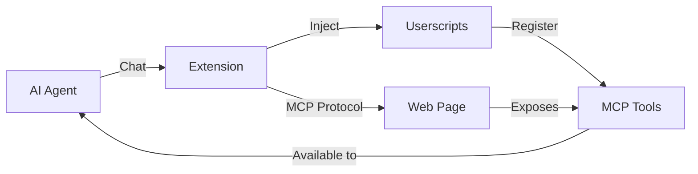

# MCP-B Extension

The MCP-B browser extension is a development and testing tool for WebMCP servers. It collects WebMCP tools from all your open tabs, lets you inject custom servers via userscript, and includes specialized AI agents to help you build and test web-based tools.

<Card
  title="Install MCP-B Extension"
  icon="download"
  href="https://chromewebstore.google.com/detail/mcp-b-extension/daohopfhkdelnpemnhlekblhnikhdhfa"
>
  Get the extension from the Chrome Web Store
</Card>

## Connect to Desktop AI with Native Host

<Info>
**Unlock the full power of WebMCP**: The native host bridges your browser tools to desktop AI assistants like Claude Code and Claude Desktop. This means you can use browser-based tools from your command line or desktop apps!
</Info>

<CardGroup cols={2}>
  <Card
    title="Setup Native Host"
    icon="server"
    href="/native-host-setup"
    color="#1F5EFF"
  >
    **Start here** - Connect browser tools to Claude Code, Claude Desktop, and other MCP clients
  </Card>
  <Card
    title="How It Works"
    icon="diagram-project"
    href="/concepts/extension"
  >
    Learn about the architecture behind browser-to-desktop integration
  </Card>
</CardGroup>

## Quick Navigation

Jump to the section that best matches your needs:

<CardGroup cols={2}>
  <Card
    title="Understanding Agents"
    icon="robot"
    href="/extension/agents"
  >
    Learn about the 4 specialized agents and when to use each one
  </Card>
  <Card
    title="Managing Userscripts"
    icon="gear"
    href="/extension/managing-userscripts"
  >
    Create, download, upload, and organize custom scripts
  </Card>
</CardGroup>

## What Can You Do?

<CardGroup cols={2}>
  <Card
    title="Connect Desktop AI"
    icon="desktop"
  >
    Use browser tools from Claude Code, Claude Desktop, and other desktop MCP clients
  </Card>
  <Card
    title="AI-Powered Development"
    icon="robot"
  >
    Work with specialized AI agents that understand web development and can build scripts for you
  </Card>
  <Card
    title="Customize Websites"
    icon="paintbrush"
  >
    Add dark modes, remove ads, change layouts, and enhance any website with custom userscripts
  </Card>
  <Card
    title="Automate Tasks"
    icon="bolt"
  >
    Auto-fill forms, extract data, and streamline repetitive workflows with intelligent scripts
  </Card>
  <Card
    title="Build MCP Tools"
    icon="tools"
  >
    Expose website functionality as tools that AI agents can discover and use
  </Card>
  <Card
    title="Cross-Site Workflows"
    icon="diagram-project"
  >
    Chain actions across multiple tabs and sites for complex automation
  </Card>
</CardGroup>

## Quick Start

<Steps>
  <Step title="Install the extension">
    Download from the [Chrome Web Store](https://chromewebstore.google.com/detail/mcp-b-extension/daohopfhkdelnpemnhlekblhnikhdhfa)
  </Step>

  <Step title="Open the extension">
    Click the MCP-B icon in your browser toolbar
  </Step>

  <Step title="Choose an agent">
    Select from Userscript Engineer, WebMCP Server, Browsing Agent, or Chat Companion
  </Step>

  <Step title="Start creating">
    Describe what you want to build and let the AI agent help you create it
  </Step>
</Steps>

## Core Features

### AI Agents

Four specialized agents help you accomplish different tasks:

<Tabs>
  <Tab title="Userscript Engineer">
    **Build custom scripts to enhance websites**

    Perfect for adding features, removing clutter, or automating repetitive tasks. The Userscript Engineer helps you create production-grade userscripts through conversation.

    <Card title="Learn About Agents" icon="robot" href="/extension/agents">
      Understand when to use each agent
    </Card>
  </Tab>

  <Tab title="WebMCP Server">
    **Turn websites into AI-accessible tools**

    Create userscripts that register MCP tools, making website functionality available to AI assistants. The WebMCP Server agent builds these specialized scripts for you.

    <Card title="Learn About Agents" icon="robot" href="/extension/agents">
      Understand when to use each agent
    </Card>
  </Tab>

  <Tab title="Browsing Agent">
    **Navigate and inspect web pages**

    Use the Browsing Agent to explore websites, extract information, and gather context. Ideal for research and monitoring tasks.

    <Card title="Learn About Agents" icon="robot" href="/extension/agents">
      Understand when to use each agent
    </Card>
  </Tab>

  <Tab title="Chat Companion">
    **Ask questions without automation**

    Have conversations, get explanations, and plan your approach before taking action. The Chat Companion focuses on conversation over automation.

    <Card title="Learn About Agents" icon="robot" href="/extension/agents">
      Understand when to use each agent
    </Card>
  </Tab>
</Tabs>

### Userscript Management

Create, organize, and share custom scripts:

<CardGroup cols={2}>
  <Card title="Create with AI" icon="wand-magic-sparkles">
    Describe what you want in plain language - the agents build it for you
  </Card>

  <Card title="Download & Upload" icon="arrow-up-arrow-down">
    Export scripts to share with others or back up your library
  </Card>

  <Card title="Enable/Disable" icon="toggle-on">
    Turn scripts on and off without deleting them
  </Card>

  <Card title="Edit & Update" icon="pen">
    Modify existing scripts through conversation or manual editing
  </Card>
</CardGroup>

<Card title="Managing Userscripts" icon="gear" href="/extension/managing-userscripts">
  Complete guide to downloading, uploading, and organizing scripts
</Card>

### MCP Tool Integration

The extension implements the Model Context Protocol, enabling:

- **Tool Discovery:** Automatically detect MCP tools on websites
- **Tool Execution:** Call website tools from AI agents
- **Tool Creation:** Build your own MCP servers as userscripts
- **Native MCP Support:** Connect to traditional MCP servers via native host

<Info>
WebMCP is a polyfill for the **W3C Web Model Context API** (`navigator.modelContext`) - a standards-track proposal for exposing website functionality to AI agents. The API supports **Zod schemas** (preferred) as well as JSON Schema for type-safe tool definitions.
</Info>

## How It Works

### Architecture

### Extension Components

<AccordionGroup>
  <Accordion title="Agent Interface">
    Chat interface with specialized AI agents that understand web automation and MCP. Switch between agents based on your current task.
  </Accordion>

  <Accordion title="Userscript Manager">
    Built-in manager for creating, editing, enabling, and organizing userscripts. Export and import scripts to share with others.
  </Accordion>

  <Accordion title="MCP Transport">
    Browser-specific implementation of the Model Context Protocol that works entirely in the browser without backend servers.
  </Accordion>

  <Accordion title="Extension Tools">
    Suite of MCP tools for DOM inspection, tab management, userscript execution, and browser automation.
  </Accordion>

  <Accordion title="Native Host Bridge">
    Optional component that connects browser MCP to traditional filesystem-based MCP servers.
  </Accordion>
</AccordionGroup>

## Use Cases

### Website Customization

<CardGroup cols={2}>
  <Card title="Dark Modes" icon="moon">
    Add custom dark themes to any website
  </Card>

  <Card title="Remove Ads" icon="ban">
    Hide unwanted ads, banners, and distracting elements
  </Card>

  <Card title="Custom Layouts" icon="table-columns">
    Rearrange page elements to match your preferences
  </Card>

  <Card title="Keyboard Shortcuts" icon="keyboard">
    Add custom hotkeys for common actions
  </Card>
</CardGroup>

### Automation

<CardGroup cols={2}>
  <Card title="Form Filling" icon="file-pen">
    Auto-populate forms with saved information
  </Card>

  <Card title="Data Extraction" icon="database">
    Pull structured data from websites automatically
  </Card>

  <Card title="Monitoring" icon="chart-line">
    Track price changes, content updates, or availability
  </Card>

  <Card title="Batch Actions" icon="list-check">
    Process multiple items or pages in sequence
  </Card>
</CardGroup>

### AI Integration

<CardGroup cols={2}>
  <Card title="Search Tools" icon="magnifying-glass">
    Let AI search websites and retrieve results
  </Card>

  <Card title="Action Tools" icon="play">
    Enable AI to click buttons, submit forms, or navigate
  </Card>

  <Card title="Data Tools" icon="table">
    Give AI access to structured website data
  </Card>

  <Card title="Workflow Tools" icon="diagram-project">
    Chain multiple website actions into complex workflows
  </Card>
</CardGroup>

## Example: Building a Dark Mode

Here's how you'd use the extension to add dark mode to a website:

<Steps>
  <Step title="Select Userscript Engineer">
    Open the extension and choose "Userscript Engineer" from the agent dropdown
  </Step>

  <Step title="Navigate to the site">
    Go to the website you want to customize
  </Step>

  <Step title="Request the feature">
    Type: "Add a dark mode toggle button that changes the background to #1a1a1a and text to #e0e0e0"
  </Step>

  <Step title="Agent builds and tests">
    The agent inspects the page, writes TypeScript code, and tests it
  </Step>

  <Step title="Review and refine">
    See the changes live. Request adjustments if needed
  </Step>

  <Step title="Save the script">
    The agent commits the script. It will now run automatically on that site
  </Step>
</Steps>

## Example: Creating MCP Tools

Here's how to expose a website's search as an MCP tool:

<Steps>
  <Step title="Select WebMCP Server">
    Open the extension and choose "WebMCP Server" from the agent dropdown
  </Step>

  <Step title="Navigate to the site">
    Go to the website with the functionality you want to expose
  </Step>

  <Step title="Request the tools">
    Type: "Create MCP tools for searching this site and returning results"
  </Step>

  <Step title="Agent analyzes and builds">
    The agent inspects the search form, writes tool registration code, and tests it
  </Step>

  <Step title="Tools become available">
    After testing, the tools appear in your MCP tool list
  </Step>

  <Step title="Use from any agent">
    Any AI agent can now search that website on your behalf
  </Step>
</Steps>

## Browser Compatibility

<Tabs>
  <Tab title="Chrome">
    ✅ Fully supported

    Install from the [Chrome Web Store](https://chromewebstore.google.com/detail/mcp-b-extension/daohopfhkdelnpemnhlekblhnikhdhfa)
  </Tab>

  <Tab title="Edge">
    ✅ Compatible

    Install from Chrome Web Store (Edge supports Chrome extensions)
  </Tab>

  <Tab title="Brave">
    ✅ Compatible

    Install from Chrome Web Store (Brave supports Chrome extensions)
  </Tab>

  <Tab title="Firefox">
    ⚠️ Not yet supported

    Firefox version planned for future release
  </Tab>

  <Tab title="Safari">
    ⚠️ Not yet supported

    Safari version under consideration
  </Tab>
</Tabs>

## Privacy & Security

<AccordionGroup>
  <Accordion title="Local-first architecture">
    Userscripts run entirely in your browser. No data is sent to external servers except when you explicitly request AI agent interactions.
  </Accordion>

  <Accordion title="Script review">
    Always review userscripts before enabling them, especially from untrusted sources. Scripts have access to the websites they run on.
  </Accordion>

  <Accordion title="Permission model">
    The extension only runs scripts on sites you specify. You control which websites each script can access.
  </Accordion>

  <Accordion title="Open source">
    Core MCP libraries are open source and available on GitHub for audit and contribution.
  </Accordion>
</AccordionGroup>

<Warning>
Userscripts can access and modify website content. Only install scripts from trusted sources and review code before importing.
</Warning>

## Get Help

<CardGroup cols={2}>
  <Card
    title="Understanding Agents"
    icon="robot"
    href="/extension/agents"
  >
    Learn which agent to use for each task
  </Card>

  <Card
    title="Managing Userscripts"
    icon="gear"
    href="/extension/managing-userscripts"
  >
    Download, upload, and organize your scripts
  </Card>

  <Card
    title="Discord Community"
    icon="discord"
    href="https://discord.gg/ZnHG4csJRB"
  >
    Get help from other users and developers
  </Card>

  <Card
    title="GitHub Issues"
    icon="github"
    href="https://github.com/WebMCP-org/npm-packages/issues"
  >
    Report bugs or request features
  </Card>
</CardGroup>

## Architecture & Development

<AccordionGroup>
  <Accordion title="Extension Architecture" icon="sitemap">
    Dive deep into how the extension works internally, including background workers, content scripts, and the MCP transport layer.

    <Card title="View Extension Architecture" icon="arrow-right" href="/concepts/extension">
      Technical architecture documentation
    </Card>
  </Accordion>

  <Accordion title="Extension Tools API" icon="code">
    Build your own Chrome extensions using MCP wrappers for Chrome Extension APIs.

    <Card title="View API Documentation" icon="arrow-right" href="/packages/extension-tools">
      @mcp-b/extension-tools package docs
    </Card>
  </Accordion>
</AccordionGroup>

## Next Steps

<Steps>
  <Step title="Install the extension">
    Get it from the [Chrome Web Store](https://chromewebstore.google.com/detail/mcp-b-extension/daohopfhkdelnpemnhlekblhnikhdhfa)
  </Step>

  <Step title="Set up Native Host (Recommended)">
    Connect browser tools to desktop AI with the [Native Host Setup](/native-host-setup) guide - use WebMCP from Claude Code, Claude Desktop, and more!
  </Step>

  <Step title="Learn about agents">
    Read [Understanding Agents](/extension/agents) to choose the right agent for your task
  </Step>

  <Step title="Create your first script">
    Try asking the Userscript Engineer to add a simple feature to your favorite website
  </Step>

  <Step title="Explore examples">
    Check out the [Examples Repository](https://github.com/WebMCP-org/examples) for inspiration
  </Step>

  <Step title="Join the community">
    Share your creations on [Discord](https://discord.gg/ZnHG4csJRB)
  </Step>
</Steps>
