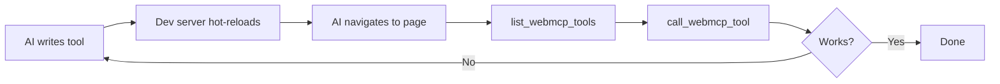

WebMCP works with any framework. Use Chrome DevTools MCP for the best development experience, then explore our production-ready examples.

## Development workflow

Use [Chrome DevTools MCP](/packages/chrome-devtools-mcp) for a powerful AI-driven development loop:



<Steps>
  <Step title="Install Chrome DevTools MCP">
    ```bash
    claude mcp add chrome-devtools npx @mcp-b/chrome-devtools-mcp@latest
    ```
  </Step>

  <Step title="Start your dev server">
    ```bash
    pnpm dev
    ```
  </Step>

  <Step title="Ask your AI to build and test tools">
    The AI can write tool code, navigate to your page, discover tools via `list_webmcp_tools`, and test them with `call_webmcp_tool` - all in a tight feedback loop.
  </Step>
</Steps>

<Info>
This is **TDD for AI** - agents build and verify their own tools in real-time.
</Info>

## Production examples

Clone any example to get started immediately:

```bash
git clone https://github.com/WebMCP-org/examples.git
cd examples/<framework>
pnpm install && pnpm dev
```

<CardGroup cols={2}>
  <Card title="Vanilla JavaScript" icon="js" href="https://github.com/WebMCP-org/examples/tree/main/vanilla">
    Shopping cart with core WebMCP functionality
  </Card>

  <Card title="React" icon="react" href="https://github.com/WebMCP-org/examples/tree/main/react">
    Task manager with `useWebMCP()` hook
  </Card>

  <Card title="Svelte" icon="code" href="https://github.com/WebMCP-org/examples/tree/main/svelte">
    Svelte 5 with runes and actions
  </Card>

  <Card title="Angular" icon="angular" href="https://github.com/WebMCP-org/examples/tree/main/angular">
    Note-taking app with Angular signals
  </Card>

  <Card title="Rails" icon="gem" href="https://github.com/WebMCP-org/examples/tree/main/rails">
    Bookmarks manager with Stimulus controllers
  </Card>

  <Card title="Phoenix LiveView" icon="fire" href="https://github.com/WebMCP-org/examples/tree/main/phoenix-liveview">
    Real-time sync with server-side state
  </Card>
</CardGroup>

## The pattern

All frameworks follow the same approach:

1. Import `@mcp-b/global` to add `navigator.modelContext`
2. Call `registerTool()` in your mount lifecycle
3. Call `unregister()` in your unmount lifecycle

| Framework | Mount | Unmount | Example |
|-----------|-------|---------|---------|
| [React](/frameworks/react) | `useWebMCP()` hook | automatic | [View](https://github.com/WebMCP-org/examples/tree/main/react) |
| [Vue 3](/frameworks/vue) | `onMounted` | `onUnmounted` | [Community](https://github.com/bestian/vue-MCP-B-demo) |
| [Nuxt 3](/frameworks/nuxt) | `onMounted` + `import.meta.client` | `onUnmounted` | [Community](https://github.com/mikechao/nuxt3-mcp-b-demo) |
| [Svelte](/frameworks/svelte) | `onMount` | `onDestroy` | [View](https://github.com/WebMCP-org/examples/tree/main/svelte) |
| [Angular](/frameworks/angular) | `ngOnInit` | `ngOnDestroy` | [View](https://github.com/WebMCP-org/examples/tree/main/angular) |
| [TanStack Start](/frameworks/tanstack-start) | `useEffect` or `useWebMCP` | cleanup function | - |
| [Remix](/frameworks/remix) | `useEffect` or `useWebMCP` | cleanup function | - |
| [Rails/Stimulus](/frameworks/rails) | `connect` | `disconnect` | [View](https://github.com/WebMCP-org/examples/tree/main/rails) |
| [Phoenix LiveView](/frameworks/phoenix-liveview) | `mounted` | `destroyed` | [View](https://github.com/WebMCP-org/examples/tree/main/phoenix-liveview) |

## React users

Use [`@mcp-b/react-webmcp`](/packages/react-webmcp) instead of `@mcp-b/global` - it handles lifecycle automatically and provides Zod validation.

## SPAs vs SSR frameworks

<Info>
**Using a plain SPA?** If you're building a client-side-only React, Vue, or Svelte app (without SSR), you don't need to worry about server/client boundaries. Just register tools in your component lifecycle and you're good to go.
</Info>

SSR frameworks like **Next.js**, **Nuxt**, **TanStack Start**, **Remix**, and **SvelteKit** require ensuring WebMCP code only runs on the client since `navigator` doesn't exist on the server. Each framework has its own pattern for this - see the guides below.

## Framework-specific guides

<CardGroup cols={2}>
  <Card title="React & Next.js" icon="react" href="/frameworks/react">
    SSR-safe patterns with App Router and Client Components
  </Card>

  <Card title="Vue.js" icon="vuejs" href="/frameworks/vue">
    Composition API patterns and SSR considerations
  </Card>

  <Card title="Nuxt" icon="n" href="/frameworks/nuxt">
    SSR-safe patterns with `import.meta.client`
  </Card>

  <Card title="Svelte" icon="code" href="/frameworks/svelte">
    Actions, runes, and SvelteKit patterns
  </Card>

  <Card title="Angular" icon="angular" href="/frameworks/angular">
    Services, DI, and Angular Universal
  </Card>

  <Card title="TanStack Start" icon="layer-group" href="/frameworks/tanstack-start">
    SSR-safe patterns with loader data
  </Card>

  <Card title="Remix" icon="rotate" href="/frameworks/remix">
    SSR-safe patterns with loader data
  </Card>

  <Card title="Rails" icon="gem" href="/frameworks/rails">
    Stimulus controllers and Turbo integration
  </Card>

  <Card title="Phoenix LiveView" icon="fire" href="/frameworks/phoenix-liveview">
    Server-side state with real-time sync
  </Card>
</CardGroup>
