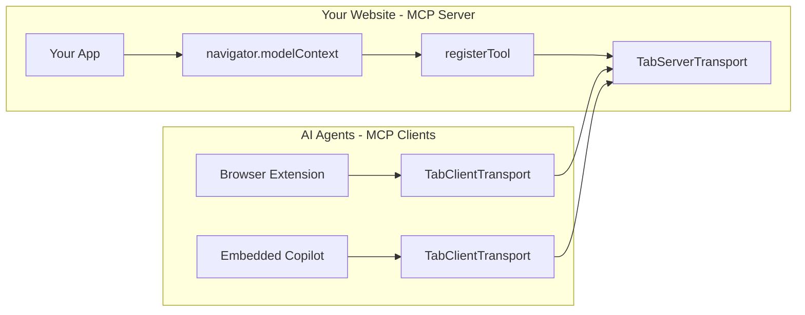

## Overview

WebMCP works with any JavaScript framework. While we provide first-class React support via [`@mcp-b/react-webmcp`](/packages/react-webmcp), you can integrate WebMCP into Vue, Svelte, Angular, Rails, and any other framework using the [vanilla JavaScript API](/packages/global).

This section covers framework-specific patterns and composables for popular web frameworks.

<Info>
  New to WebMCP? Start with the [Quickstart Guide](/quickstart) to understand the basics before diving into framework-specific patterns.
</Info>

## How It Works

When you import `@mcp-b/global`, your website starts an **MCP server**:



1. **Your website runs an MCP server** - When you import `@mcp-b/global`, it initializes `navigator.modelContext` and starts a server using `TabServerTransport`
2. **Tools are registered with the server** - Your components call `navigator.modelContext.registerTool()` to expose functionality
3. **AI agents connect as clients** - External AI agents (browser extensions, copilots) use `TabClientTransport` to discover and call your tools

## Framework Support

<CardGroup cols={2}>
  <Card title="Vue.js" icon="vuejs" href="/frameworks/vue">
    Vue 3 Composition API with reactive tool registration
  </Card>

  <Card title="Nuxt" icon="n" href="/frameworks/nuxt">
    Full-stack Vue framework with SSR support
  </Card>

  <Card title="Svelte" icon="code" href="/frameworks/svelte">
    Svelte and SvelteKit with stores integration
  </Card>

  <Card title="Rails" icon="gem" href="/frameworks/rails">
    Ruby on Rails with Stimulus and Hotwire
  </Card>

  <Card title="Angular" icon="angular" href="/frameworks/angular">
    Angular with services and dependency injection
  </Card>
</CardGroup>

## Integration Pattern

All non-React frameworks follow the same basic pattern using the [`@mcp-b/global`](/packages/global) package:

<Steps>
  <Step title="Install and import">
    ```bash
    npm install @mcp-b/global
    ```

    Import once at your app's entry point to start the MCP server:

    ```typescript
    import '@mcp-b/global'; // Starts MCP server on your page
    ```
  </Step>

  <Step title="Register tools">
    Use [`navigator.modelContext.registerTool()`](/concepts/tool-registration) in your framework's lifecycle hooks
  </Step>

  <Step title="Handle cleanup">
    Call `unregister()` when components unmount to prevent memory leaks
  </Step>
</Steps>

## How AI Agents Connect

AI agents (browser extensions, copilots, etc.) connect to your tools using `TabClientTransport`:

```typescript "BrowserExtension.ts"
import { Client } from '@modelcontextprotocol/sdk/client/index.js';
import { TabClientTransport } from '@mcp-b/transports';

// Create transport targeting your website
const transport = new TabClientTransport({
  targetOrigin: 'https://your-website.com', // Required for security
  channelId: 'mcp-default'
});

// Create MCP client
const client = new Client(
  { name: 'MyAIAgent', version: '1.0.0' },
  { capabilities: {} }
);

// Connect and discover tools
await client.connect(transport);
const { tools } = await client.listTools();

// Call a tool
const result = await client.callTool({
  name: 'add_to_cart',
  arguments: { productId: 'abc', quantity: 2 }
});
```

<Note>
  The `targetOrigin` parameter is **required** for security. It must match the origin of the website hosting the MCP server.
</Note>

## Framework Comparison

| Framework | Reactivity | Server Rendering | Tool Registration Hook |
|-----------|------------|------------------|------------------------|
| Vue 3 | `ref`/`reactive` | Via Nuxt | `onMounted`/`onUnmounted` |
| Nuxt 3 | Vue reactivity | Built-in SSR | Client-only plugins |
| Svelte | `$state`/stores | Via SvelteKit | `onMount`/`onDestroy` |
| SvelteKit | Svelte stores | Built-in SSR | Client-side only |
| Rails | Stimulus | Turbo/Hotwire | `connect`/`disconnect` |
| Angular | RxJS/Signals | Universal | `ngOnInit`/`ngOnDestroy` |

## Key Considerations

### Client-Side Only

WebMCP tools must be registered on the client side. The `@mcp-b/global` polyfill requires browser APIs (`window`, `navigator`). For SSR frameworks:

- **Nuxt**: Use `.client.ts` plugin suffix or `import.meta.client` check
- **SvelteKit**: Use `browser` from `$app/environment` or `onMount`
- **Angular Universal**: Use `isPlatformBrowser()` check

### Cleanup

Always unregister tools when components are destroyed to prevent memory leaks:

```typescript
const registration = navigator.modelContext.registerTool({ ... });

// On component destroy:
registration.unregister();
```

### Schema Validation

For input validation with Zod or JSON Schema, see the [Schemas Guide](/concepts/schemas).

## Next Steps

<CardGroup cols={2}>
  <Card title="Choose Your Framework" icon="arrow-right" href="/frameworks/vue">
    Start with Vue.js integration guide
  </Card>

  <Card title="React Users" icon="react" href="/packages/react-webmcp">
    Use our React hooks package instead
  </Card>

  <Card title="Transports" icon="plug" href="/packages/transports">
    Learn about TabClientTransport and TabServerTransport
  </Card>

  <Card title="AI Frameworks" icon="sparkles" href="/ai-frameworks">
    Integrate with Assistant-UI, AG-UI, or custom runtimes
  </Card>
</CardGroup>
