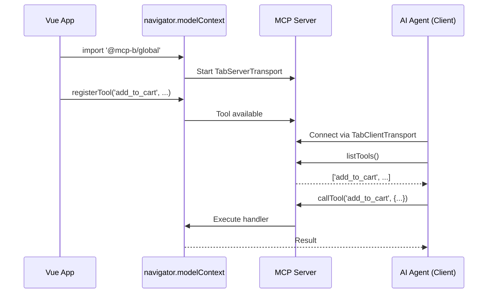

## Overview

Vue 3's Composition API provides an elegant way to integrate WebMCP tools. This guide shows how to create a reusable composable for tool registration that handles reactivity and cleanup automatically.

## How It Works

When you import `@mcp-b/global`, your Vue app starts an **MCP server**:



Your Vue components register tools with the MCP server. AI agents (browser extensions, copilots) connect as clients to discover and call those tools.

## Prerequisites

<Steps>
  <Step title="Install WebMCP">
    ```bash
    npm install @mcp-b/global
    ```
  </Step>

  <Step title="Initialize in main.ts">
    Import once at your app's entry point to start the MCP server:

    ```typescript "main.ts"
    import '@mcp-b/global'; // Starts MCP server
    import { createApp } from 'vue';
    import App from './App.vue';

    createApp(App).mount('#app');
    ```
  </Step>
</Steps>

<Info>
  For schema validation with Zod, see the [Schemas Guide](/concepts/schemas). For response formatting, see [Tool Registration](/concepts/tool-registration).
</Info>

## Creating a Vue Composable

The recommended approach is creating a `useWebMCP` composable:

```typescript "composables/useWebMCP.ts"
import { onMounted, onUnmounted } from 'vue';
import '@mcp-b/global';

interface ToolConfig {
  name: string;
  description: string;
  inputSchema?: Record<string, unknown>;
  handler: (args: Record<string, unknown>) => Promise<unknown>;
}

export function useWebMCP(config: ToolConfig): void {
  let registration: { unregister: () => void } | null = null;

  onMounted(() => {
    if (!('modelContext' in navigator)) return;

    registration = navigator.modelContext.registerTool({
      name: config.name,
      description: config.description,
      inputSchema: config.inputSchema ?? { type: 'object', properties: {} },
      async execute(args) {
        const result = await config.handler(args);
        return {
          content: [{
            type: 'text',
            text: typeof result === 'string' ? result : JSON.stringify(result)
          }]
        };
      }
    });
  });

  onUnmounted(() => {
    registration?.unregister();
  });
}
```

<Info>
  **How AI agents call your tools**: AI agents use `TabClientTransport` to connect to your page and call `client.listTools()` to discover available tools, then `client.callTool()` to execute them. See [Transports](/packages/transports) for details.
</Info>

### Using the Composable

```vue "CartTools.vue"
<script setup lang="ts">
import { ref } from 'vue';
import { useWebMCP } from '@/composables/useWebMCP';

const cartItems = ref<string[]>([]);

useWebMCP({
  name: 'add_to_cart',
  description: 'Add a product to the shopping cart',
  inputSchema: {
    type: 'object',
    properties: {
      productId: { type: 'string', description: 'Product ID to add' },
      quantity: { type: 'number', description: 'Quantity to add' }
    },
    required: ['productId']
  },
  handler: async ({ productId, quantity = 1 }) => {
    for (let i = 0; i < quantity; i++) {
      cartItems.value.push(productId as string);
    }
    return { success: true, cartSize: cartItems.value.length };
  }
});

useWebMCP({
  name: 'get_cart',
  description: 'Get current cart contents',
  handler: async () => {
    return { items: cartItems.value, count: cartItems.value.length };
  }
});
</script>

<template>
  <div>
    <p>Cart items: {{ cartItems.length }}</p>
  </div>
</template>
```

## Reactive State Integration

Vue's reactivity system works seamlessly with WebMCP tools:

```vue "ReactiveTools.vue"
<script setup lang="ts">
import { ref, computed } from 'vue';
import { useWebMCP } from '@/composables/useWebMCP';

const count = ref(0);
const doubleCount = computed(() => count.value * 2);

// Tool that reads reactive state
useWebMCP({
  name: 'get_counter',
  description: 'Get the current counter value',
  handler: async () => ({
    count: count.value,
    doubled: doubleCount.value
  })
});

// Tool that modifies reactive state
useWebMCP({
  name: 'increment_counter',
  description: 'Increment the counter',
  inputSchema: {
    type: 'object',
    properties: {
      amount: { type: 'number', description: 'Amount to increment by' }
    }
  },
  handler: async ({ amount = 1 }) => {
    count.value += amount as number;
    return { newValue: count.value };
  }
});
</script>

<template>
  <div>
    <p>Count: {{ count }}</p>
    <p>Double: {{ doubleCount }}</p>
    <button @click="count++">Increment</button>
  </div>
</template>
```

## Working with Pinia Stores

Integrate WebMCP with Pinia for state management:

```typescript "stores/cart.ts"
import { defineStore } from 'pinia';

export const useCartStore = defineStore('cart', {
  state: () => ({
    items: [] as { id: string; name: string; quantity: number }[]
  }),
  getters: {
    totalItems: (state) => state.items.reduce((sum, item) => sum + item.quantity, 0),
    cartSummary: (state) => state.items.map(i => `${i.name} x${i.quantity}`).join(', ')
  },
  actions: {
    addItem(id: string, name: string, quantity = 1) {
      const existing = this.items.find(i => i.id === id);
      if (existing) {
        existing.quantity += quantity;
      } else {
        this.items.push({ id, name, quantity });
      }
    },
    removeItem(id: string) {
      this.items = this.items.filter(i => i.id !== id);
    }
  }
});
```

```vue "CartTools.vue"
<script setup lang="ts">
import { useCartStore } from '@/stores/cart';
import { useWebMCP } from '@/composables/useWebMCP';

const cart = useCartStore();

useWebMCP({
  name: 'add_to_cart',
  description: 'Add a product to the cart',
  inputSchema: {
    type: 'object',
    properties: {
      productId: { type: 'string' },
      productName: { type: 'string' },
      quantity: { type: 'number' }
    },
    required: ['productId', 'productName']
  },
  handler: async ({ productId, productName, quantity = 1 }) => {
    cart.addItem(productId as string, productName as string, quantity as number);
    return { success: true, totalItems: cart.totalItems };
  }
});

useWebMCP({
  name: 'get_cart_summary',
  description: 'Get a summary of the cart contents',
  handler: async () => ({
    items: cart.items,
    total: cart.totalItems,
    summary: cart.cartSummary
  })
});
</script>

<template>
  <div>
    <p>Cart: {{ cart.cartSummary || 'Empty' }}</p>
  </div>
</template>
```

## Full Application Example

```vue "App.vue"
<script setup lang="ts">
import '@mcp-b/global';
import ProductTools from './components/ProductTools.vue';
import CartTools from './components/CartTools.vue';
</script>

<template>
  <div id="app">
    <header>
      <h1>My Vue Store</h1>
    </header>

    <!-- Tool registration components -->
    <ProductTools />
    <CartTools />

    <main>
      <RouterView />
    </main>
  </div>
</template>
```

## Common Gotchas

<AccordionGroup>
  <Accordion title="Tools not registering in SSR">
    If using SSR (like Nuxt), see the [Nuxt guide](/frameworks/nuxt) or [Framework Gotchas](/ai-frameworks/framework-gotchas) for SSR-specific patterns.
  </Accordion>

  <Accordion title="Stale state in tool handlers">
    Access the ref's `.value` directly in the handler to get current state:

    ```typescript
    // Good - accesses current value at execution time
    handler: async () => ({ count: count.value })
    ```
  </Accordion>

  <Accordion title="Memory leaks from missing cleanup">
    The composable handles cleanup automatically. For manual registration, see [Tool Lifecycle](/concepts/tool-registration#tool-lifecycle).
  </Accordion>
</AccordionGroup>

## Resources

<CardGroup cols={2}>
  <Card title="Vue 3 Docs" icon="vuejs" href="https://vuejs.org/guide/introduction.html">
    Official Vue 3 documentation
  </Card>

  <Card title="Nuxt Integration" icon="n" href="/frameworks/nuxt">
    SSR patterns with Nuxt
  </Card>

  <Card title="Transports" icon="plug" href="/packages/transports">
    TabClientTransport and TabServerTransport reference
  </Card>

  <Card title="AI Frameworks" icon="sparkles" href="/ai-frameworks">
    Integrate with Assistant-UI, AG-UI, or custom runtimes
  </Card>
</CardGroup>
