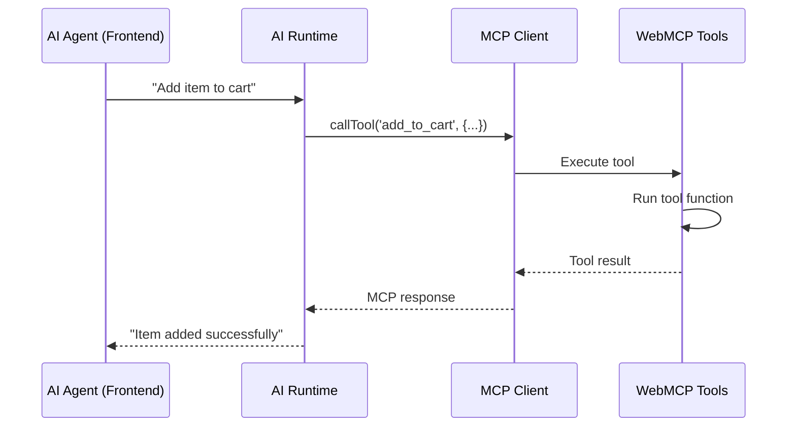

## Overview

WebMCP tools can be called directly by AI agents running in your frontend application. This allows you to build AI copilots and assistants that can interact with your website's functionality through registered MCP tools.

Frontend AI frameworks like [Assistant-UI](https://www.assistant-ui.com/docs/copilots/model-context) and [AG-UI](https://docs.ag-ui.com/concepts/tools#frontend-defined-tools) provide runtimes that support this pattern.

## How Frontend Tool Calling Works

<Steps>
  <Step title="Register tools on your website">
    Tools are defined and registered on your website using `navigator.modelContext`
  </Step>

  <Step title="Connect an MCP client">
    Your AI runtime connects to the website's tools using an MCP client
  </Step>

  <Step title="Register tools with AI runtime">
    The MCP tools are registered with your frontend AI framework (Assistant-UI, AG-UI, etc.)
  </Step>

  <Step title="AI calls tools">
    When the AI needs to use a tool, it calls through your runtime → MCP client → WebMCP
  </Step>

  <Step title="Tool executes on frontend">
    The tool runs in the browser, returns results to the AI
  </Step>
</Steps>



## Installation

Install the required packages:

<Tabs>
  <Tab title="npm">
```bash
npm install @mcp-b/react-webmcp @mcp-b/transports @modelcontextprotocol/sdk
```
  </Tab>
  <Tab title="yarn">
```bash
yarn add @mcp-b/react-webmcp @mcp-b/transports @modelcontextprotocol/sdk
```
  </Tab>
  <Tab title="pnpm">
```bash
pnpm add @mcp-b/react-webmcp @mcp-b/transports @modelcontextprotocol/sdk
```
  </Tab>
</Tabs>

## Basic Example

### 1. Register WebMCP Tools

First, register tools that your AI can call using the `useWebMCP` hook:

```tsx
import { useWebMCP } from '@mcp-b/react-webmcp';
import { z } from 'zod';

function ShoppingCart() {
  // Register a tool
  useWebMCP({
    name: 'add_to_cart',
    description: 'Add a product to the shopping cart',
    inputSchema: {
      productId: z.string(),
      quantity: z.number().min(1)
    },
    handler: async (input) => {
      // Add to cart logic
      const cart = await addToCart(input.productId, input.quantity);

      return {
        message: `Added ${input.quantity}x product ${input.productId} to cart`,
        cart
      };
    }
  });

  return <div>{/* Your cart UI */}</div>;
}
```

<Note>
  The `useWebMCP` hook automatically handles tool registration and cleanup when the component unmounts.
</Note>

### 2. Set Up MCP Client with React

Use the `McpClientProvider` to connect to your website's tools:

```tsx
import { McpClientProvider, useMcpClient } from '@mcp-b/react-webmcp';
import { Client } from '@modelcontextprotocol/sdk/client/index.js';
import { TabClientTransport } from '@mcp-b/transports';

// Create client and transport
const client = new Client({
  name: 'MyAIAssistant',
  version: '1.0.0'
});

const transport = new TabClientTransport('mcp', {
  clientInstanceId: 'my-ai-assistant'
});

// Wrap your app with the provider
function App() {
  return (
    <McpClientProvider client={client} transport={transport}>
      <AIAssistant />
    </McpClientProvider>
  );
}

// Use the client in your components
function AIAssistant() {
  const { client, tools, isConnected, isLoading } = useMcpClient();

  if (isLoading) return <div>Connecting...</div>;
  if (!isConnected) return <div>Not connected</div>;

  return (
    <div>
      <p>Available tools: {tools.length}</p>
      <ul>
        {tools.map(tool => (
          <li key={tool.name}>{tool.name} - {tool.description}</li>
        ))}
      </ul>
    </div>
  );
}
```

### 3. Register with AI Runtime

Register the MCP tools with your AI framework:

<Tabs>
  <Tab title="Assistant-UI">
```tsx
import { useEffect } from 'react';
import { useMcpClient } from '@mcp-b/react-webmcp';
import { tool, useAssistantRuntime } from '@assistant-ui/react';

function useWebMCPTools() {
  const { client, tools, isConnected } = useMcpClient();
  const runtime = useAssistantRuntime();

  useEffect(() => {
    if (!isConnected || tools.length === 0) return;

    // Convert MCP tools to Assistant-UI format
    const assistantTools = tools.map(mcpTool =>
      tool({
        type: 'frontend',
        description: mcpTool.description,
        parameters: mcpTool.inputSchema,
        execute: async (args) => {
          // Call through MCP client
          const result = await client.callTool({
            name: mcpTool.name,
            arguments: args
          });

          // Return text content
          return result.content
            .filter(c => c.type === 'text')
            .map(c => c.text)
            .join('\n');
        }
      })
    );

    // Register with Assistant-UI runtime
    const unregister = runtime.registerModelContextProvider({
      getModelContext: () => ({
        tools: Object.fromEntries(
          tools.map((t, i) => [t.name, assistantTools[i]])
        )
      })
    });

    return () => unregister();
  }, [client, tools, isConnected, runtime]);
}
```
  </Tab>

  <Tab title="AG-UI">
```tsx
import { useMemo } from 'react';
import { useMcpClient } from '@mcp-b/react-webmcp';
import { createAgent } from '@ag-ui/core';

function MyAGAssistant() {
  const { client, tools, isConnected } = useMcpClient();

  const agent = useMemo(() => {
    if (!isConnected || tools.length === 0) return null;

    return createAgent({
      tools: tools.map(mcpTool => ({
        name: mcpTool.name,
        description: mcpTool.description,
        parameters: mcpTool.inputSchema,
        execute: async (args) => {
          const result = await client.callTool({
            name: mcpTool.name,
            arguments: args
          });

          return result.content
            .filter(c => c.type === 'text')
            .map(c => c.text)
            .join('\n');
        }
      }))
    });
  }, [client, tools, isConnected]);

  return agent;
}
```
  </Tab>

  <Tab title="Custom Runtime">
```tsx
import { useMcpClient } from '@mcp-b/react-webmcp';

function MyCustomAssistant() {
  const { client, tools, isConnected } = useMcpClient();

  const callTool = async (toolName: string, args: any) => {
    if (!isConnected) {
      throw new Error('MCP client not connected');
    }

    const result = await client.callTool({
      name: toolName,
      arguments: args
    });

    // Extract text from MCP response
    return result.content
      .filter(c => c.type === 'text')
      .map(c => c.text)
      .join('\n');
  };

  const handleAddToCart = async () => {
    const response = await callTool('add_to_cart', {
      productId: 'ABC123',
      quantity: 2
    });
    console.log(response);
  };

  return (
    <button onClick={handleAddToCart} disabled={!isConnected}>
      Add to Cart
    </button>
  );
}
```
  </Tab>
</Tabs>

## Complete Example with React

Here's a full example showing tool registration, MCP client setup, and AI runtime integration:

```tsx
import { useEffect, useState } from 'react';
import { McpClientProvider, useMcpClient, useWebMCP } from '@mcp-b/react-webmcp';
import { Client } from '@modelcontextprotocol/sdk/client/index.js';
import { TabClientTransport } from '@mcp-b/transports';
import { tool, useAssistantRuntime } from '@assistant-ui/react';
import { z } from 'zod';

// Create client and transport outside component
const client = new Client({
  name: 'MyAssistant',
  version: '1.0.0'
});

const transport = new TabClientTransport('mcp', {
  clientInstanceId: 'my-assistant'
});

// Main app with provider
export function App() {
  return (
    <McpClientProvider client={client} transport={transport}>
      <MyAIAssistant />
    </McpClientProvider>
  );
}

// Tool provider component
function ToolProvider() {
  const [counter, setCounter] = useState(0);

  // Register a tool using useWebMCP hook
  useWebMCP({
    name: 'get_user_info',
    description: 'Get current user information',
    inputSchema: {},
    handler: async () => {
      const user = getCurrentUser(); // Your app logic
      return { user };
    }
  });

  // Register a counter tool
  useWebMCP({
    name: 'increment_counter',
    description: 'Increment the counter',
    inputSchema: {
      amount: z.number().min(1).default(1)
    },
    handler: async (input) => {
      setCounter(prev => prev + input.amount);
      return { counter: counter + input.amount };
    }
  });

  return null; // This component just registers tools
}

// AI Assistant component
function MyAIAssistant() {
  const { client, tools, isConnected, isLoading } = useMcpClient();
  const runtime = useAssistantRuntime();

  // Register MCP tools with Assistant-UI runtime
  useEffect(() => {
    if (!isConnected || tools.length === 0) return;

    const assistantTools = tools.map(mcpTool =>
      tool({
        type: 'frontend',
        description: mcpTool.description,
        parameters: mcpTool.inputSchema,
        execute: async (args) => {
          const result = await client.callTool({
            name: mcpTool.name,
            arguments: args
          });

          return result.content
            .filter(c => c.type === 'text')
            .map(c => c.text)
            .join('\n');
        }
      })
    );

    const unregister = runtime.registerModelContextProvider({
      getModelContext: () => ({
        tools: Object.fromEntries(
          tools.map((t, i) => [t.name, assistantTools[i]])
        )
      })
    });

    return () => unregister();
  }, [client, tools, isConnected, runtime]);

  if (isLoading) return <div>Connecting to WebMCP...</div>;
  if (!isConnected) return <div>Not connected</div>;

  return (
    <div>
      <ToolProvider />
      <p>Available tools: {tools.length}</p>
      {/* Your AI chat UI here */}
    </div>
  );
}
```

## Framework Support

WebMCP tools work with any frontend AI framework that supports tool calling:

<CardGroup cols={2}>
  <Card title="Assistant-UI" icon="robot" href="https://www.assistant-ui.com/docs/copilots/model-context">
    React framework for building AI assistants with built-in tool support
  </Card>

  <Card title="AG-UI" icon="sparkles" href="https://docs.ag-ui.com/concepts/tools#frontend-defined-tools">
    Agentic UI framework with frontend-defined tools
  </Card>
</CardGroup>

## Key Concepts

### Tool Execution Location

With WebMCP frontend tool calling, tools execute **in the browser**:

- ✅ Direct access to DOM, localStorage, app state
- ✅ No server roundtrip required
- ✅ Works offline
- ✅ Real-time UI updates

### MCP Client as Bridge

The MCP client acts as a bridge between your AI runtime and WebMCP:

```
AI Runtime → MCP Client → WebMCP → Tool Function → Result
```

### Dynamic Tool Updates

Tools can be registered/unregistered dynamically, and the AI runtime stays synchronized:

```typescript
// Register a new tool
const registration = navigator.modelContext.registerTool({
  name: 'new_feature',
  description: 'A new feature',
  inputSchema: { type: 'object', properties: {} },
  async execute() {
    return { content: [{ type: 'text', text: 'Done!' }] };
  }
});

// Tool is immediately available to the AI

// Later, remove it
registration.unregister();
```

## Best Practices

<AccordionGroup>
  <Accordion title="Keep tool execution fast">
    Frontend tools should execute quickly to maintain responsive UI:

    ```tsx
    // ✅ Good - fast operation
    useWebMCP({
      name: 'update_cart',
      description: 'Update cart',
      inputSchema: { /* ... */ },
      handler: async (input) => {
        updateCartUI(input);
        return { success: true };
      }
    });

    // ❌ Avoid - slow operation that blocks UI
    useWebMCP({
      name: 'slow_operation',
      description: 'Slow operation',
      inputSchema: { /* ... */ },
      handler: async (input) => {
        await longRunningTask(); // Blocks UI thread
        return { done: true };
      }
    });

    // ✅ Better - delegate heavy work
    useWebMCP({
      name: 'process_data',
      description: 'Process data',
      inputSchema: { /* ... */ },
      handler: async (input) => {
        // Queue heavy work, return immediately
        queueBackgroundJob(input);
        return { queued: true, jobId: '...' };
      }
    });
    ```
  </Accordion>

  <Accordion title="Handle errors gracefully">
    Use the `onError` callback to handle errors:

    ```tsx
    useWebMCP({
      name: 'delete_item',
      description: 'Delete an item',
      inputSchema: {
        itemId: z.string()
      },
      handler: async (input) => {
        // Errors thrown here are automatically caught
        const result = await performAction(input.itemId);
        return { success: true, itemId: input.itemId };
      },
      onError: (error, input) => {
        // Log or handle the error
        console.error('Tool failed:', error.message, 'for input:', input);

        // Optionally show UI notification
        showToast(`Failed to delete item: ${error.message}`);
      }
    });
    ```
  </Accordion>

  <Accordion title="Validate inputs">
    Use Zod schema validation in your inputSchema:

    ```tsx
    import { z } from 'zod';

    useWebMCP({
      name: 'add_to_cart',
      description: 'Add product to cart',
      inputSchema: {
        productId: z.string()
          .regex(/^[A-Z0-9]+$/, 'Invalid product ID format')
          .min(3, 'Product ID too short'),
        quantity: z.number()
          .min(1, 'Quantity must be at least 1')
          .max(99, 'Quantity cannot exceed 99')
      },
      handler: async (input) => {
        // input is fully typed and validated
        return { success: true };
      }
    });
    ```
  </Accordion>

  <Accordion title="Return structured content">
    The `useWebMCP` hook automatically formats your return value:

    ```tsx
    useWebMCP({
      name: 'get_cart',
      description: 'Get shopping cart',
      inputSchema: {},
      handler: async () => {
        const cart = await getCart();

        // Return structured data - automatically formatted
        return {
          items: cart.items,
          total: cart.total,
          itemCount: cart.items.length
        };
      },
      // Custom formatter for text representation
      formatOutput: (output) => {
        return `Cart has ${output.itemCount} items (total: $${output.total})`;
      }
    });
    ```
  </Accordion>
</AccordionGroup>

## Next Steps

<CardGroup cols={2}>
  <Card title="Core Concepts" icon="diagram-project" href="/concepts">
    Learn about WebMCP architecture and tool registration
  </Card>

  <Card title="Advanced Patterns" icon="rocket" href="/advanced">
    Explore dynamic tools, state management, and more
  </Card>

  <Card title="React Hooks" icon="react" href="/packages/react-webmcp">
    Use `@mcp-b/react-webmcp` for easier integration
  </Card>

  <Card title="Examples" icon="code" href="/examples">
    See complete working examples
  </Card>
</CardGroup>
