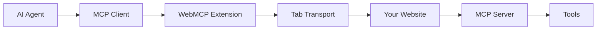

<Note>
  🚨 **Important**: Version 1.0.0 is now available on NPM with breaking changes! Make sure to update your dependencies.
</Note>

## Welcome to WebMCP

WebMCP extends the Model Context Protocol (MCP) with browser-specific transports, allowing your website to act as an MCP server. This enables AI agents to interact with your site deterministically, respecting user authentication and scoping tools to specific pages or user states.

<CardGroup cols={2}>
  <Card
    title="Quick Start"
    icon="rocket"
    href="/quickstart"
  >
    Get WebMCP running on your website in minutes
  </Card>
  <Card
    title="Live Demo"
    icon="play"
    href="https://mcp-b.ai"
  >
    See MCP-B in action with interactive examples
  </Card>
  <Card
    title="Examples"
    icon="code"
    href="/examples"
  >
    Explore ready-to-use examples for various frameworks
  </Card>
  <Card
    title="GitHub"
    icon="github"
    href="https://github.com/MiguelsPizza/WebMCP"
  >
    View source code and contribute
  </Card>
</CardGroup>

## What is WebMCP?

WebMCP is a protocol that exposes functions in your browser JavaScript to LLMs as MCP tools. Websites expose existing functionality (e.g., APIs, forms, or state) as structured tools that AI agents can call directly.

### Key Components

<CardGroup cols={2}>
  <Card
    title="Tab Transports"
    icon="window"
  >
    Use postMessage for communication between your website's MCP server and clients in the same tab
  </Card>
  <Card
    title="Extension Transports"
    icon="puzzle"
  >
    Use Chrome's runtime messaging for communication with browser extensions
  </Card>
</CardGroup>

## Why WebMCP?

- **Deterministic AI Interactions**: Let AI interact with your site through well-defined tools
- **Respects Authentication**: Works with existing session cookies and user authentication
- **Page-Scoped Tools**: Expose different tools based on page context or user state
- **No Backend Required**: Run entirely in the browser with client-side JavaScript
- **Framework Agnostic**: Works with vanilla JS, React, Vue, or any framework

## Architecture Overview



## Community

<CardGroup cols={3}>
  <Card
    title="Discord"
    icon="discord"
    href="https://discord.gg/ZnHG4csJRB"
  >
    Join our community for support and discussions
  </Card>
  <Card
    title="NPM"
    icon="npm"
    href="https://www.npmjs.com/package/@mcp-b/transports"
  >
    Install our packages from NPM
  </Card>
  <Card
    title="License"
    icon="scale-balanced"
    href="https://github.com/MiguelsPizza/WebMCP/blob/main/LICENSE"
  >
    AGPL-3.0 License
  </Card>
</CardGroup>

## Quick Example

Here's a simple example of exposing a tool on your website using the W3C Web Model Context API:

```html
<!DOCTYPE html>
<html>
<head>
  <script src="https://unpkg.com/@mcp-b/global@latest/dist/index.iife.js"></script>
</head>
<body>
  <h1>My Website</h1>

  <script>
    // Use the W3C Web Model Context API
    window.navigator.modelContext.provideContext({
      tools: [
        {
          name: "get-page-info",
          description: "Get current page information",
          inputSchema: {
            type: "object",
            properties: {}
          },
          async execute() {
            return {
              content: [{
                type: "text",
                text: JSON.stringify({
                  title: document.title,
                  url: window.location.href
                })
              }]
            };
          }
        }
      ]
    });
  </script>
</body>
</html>
```

For React applications, use the `@mcp-b/react-webmcp` package:

```tsx
import '@mcp-b/global';
import { useWebMCP } from '@mcp-b/react-webmcp';

function MyComponent() {
  useWebMCP({
    name: 'get_page_info',
    description: 'Get current page information',
    inputSchema: {},
    handler: async () => {
      return {
        title: document.title,
        url: window.location.href
      };
    }
  });

  return <div>My Component</div>;
}
```

## Next Steps

<Steps>
  <Step title="Install the Extension">
    Get the MCP-B Chrome Extension from the Chrome Web Store
  </Step>
  <Step title="Follow the Quickstart">
    Set up WebMCP on your website in minutes
  </Step>
  <Step title="Explore Examples">
    Check out working examples for different frameworks
  </Step>
  <Step title="Build Your Integration">
    Create custom tools for your specific use case
  </Step>
</Steps>