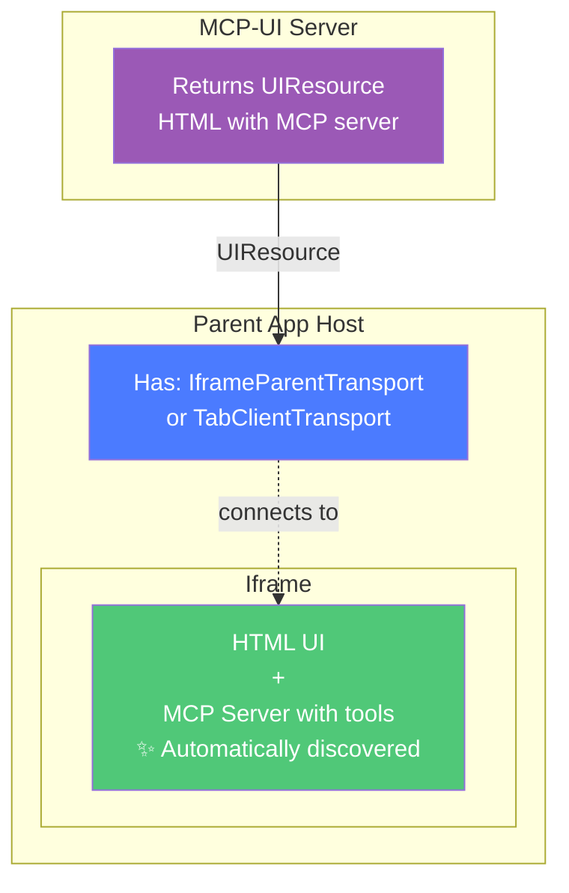

<Note>
**Novel Integration Pattern**: MCP-UI serves HTML/iframes that contain MCP servers. The parent page can connect using either **IframeParentTransport** (for cross-origin) or **TabClientTransport** (for same-origin), and it **automatically discovers** all tools inside the iframe - no manual bridging needed!
</Note>

## The Simple Idea

Here's the entire concept:



**That's it.** The parent transport (either `IframeParentTransport` for cross-origin or `TabClientTransport` for same-origin) automatically discovers and connects to the MCP server inside the iframe.

## How It Works

### Step 1: MCP-UI Server Returns HTML with WebMCP

```typescript
import { createUIResource } from '@mcp-ui/server';

// MCP server returns a UIResource
const uiResource = createUIResource({
  uri: 'ui://shopping/cart',
  content: {
    type: 'rawHtml',
    htmlString: `
      <!DOCTYPE html>
      <html>
        <head>
          <script src="https://unpkg.com/@mcp-b/global"></script>
        </head>
        <body>
          <h1>Shopping Cart</h1>
          <div id="cart-items">Cart is empty</div>

          <script>
            // Register WebMCP tools in the iframe
            navigator.modelContext.registerTool({
              name: "add_to_cart",
              description: "Add product to shopping cart",
              inputSchema: {
                type: "object",
                properties: {
                  productId: { type: "string" },
                  quantity: { type: "number" }
                }
              },
              async execute({ productId, quantity }) {
                // Add to cart logic
                const cart = JSON.parse(localStorage.getItem('cart') || '[]');
                cart.push({ productId, quantity });
                localStorage.setItem('cart', JSON.stringify(cart));

                // Update UI
                document.getElementById('cart-items').innerHTML =
                  cart.map(item => \`<div>\${item.productId} x\${item.quantity}</div>\`).join('');

                return {
                  content: [{
                    type: "text",
                    text: JSON.stringify({ success: true, cartSize: cart.length })
                  }]
                };
              }
            });

            navigator.modelContext.registerTool({
              name: "get_cart_contents",
              description: "Get current shopping cart contents",
              async execute() {
                const cart = JSON.parse(localStorage.getItem('cart') || '[]');
                return {
                  content: [{
                    type: "text",
                    text: JSON.stringify({ items: cart, total: cart.length })
                  }]
                };
              }
            });
          </script>
        </body>
      </html>
    `
  }
});

// Return in MCP response
return { content: [uiResource] };
```

### Step 2: Parent Uses Tab Transport

```typescript
import { Client } from '@modelcontextprotocol/sdk/client/index.js';
import { TabClientTransport } from '@mcp-b/transports';
import { UIResourceRenderer } from '@mcp-ui/client';

function ShoppingApp({ mcpResponse }) {
  const iframeRef = useRef<HTMLIFrameElement>(null);
  const [tools, setTools] = useState([]);

  useEffect(() => {
    async function connectToIframe() {
      // Create MCP client with tab transport
      const client = new Client(
        { name: 'host-app', version: '1.0.0' },
        { capabilities: {} }
      );

      const transport = new TabClientTransport({
        targetOrigin: window.location.origin
      });

      await client.connect(transport);

      // ✨ Automatically discover tools from iframe
      const { tools } = await client.listTools();
      setTools(tools);

      console.log('Found tools:', tools);
      // Output: [
      //   { name: 'add_to_cart', description: '...' },
      //   { name: 'get_cart_contents', description: '...' }
      // ]
    }

    if (iframeRef.current) {
      // Wait for iframe to load
      iframeRef.current.addEventListener('load', () => {
        setTimeout(connectToIframe, 300);
      });
    }
  }, []);

  return (
    <div>
      <h2>Shopping Cart</h2>
      <p>Discovered {tools.length} tools from iframe</p>

      <UIResourceRenderer
        ref={iframeRef}
        resource={mcpResponse.content[0].resource}
      />
    </div>
  );
}
```

### That's It!

The parent now has full access to all tools registered in the iframe via standard MCP calls:

```typescript
// Call tools from the iframe
const result = await client.callTool({
  name: 'add_to_cart',
  arguments: { productId: 'laptop-123', quantity: 1 }
});

console.log(result); // { success: true, cartSize: 1 }
```

## Why This Is Powerful

<CardGroup cols={2}>
  <Card title="Zero Manual Bridging" icon="magic-wand-sparkles">
    Tab transport handles all communication automatically
  </Card>

  <Card title="Standard MCP Protocol" icon="file-contract">
    Use `tools/list`, `tools/call` - everything just works
  </Card>

  <Card title="Visual + Functional" icon="window">
    Iframe provides UI while exposing callable tools
  </Card>

  <Card title="Auto-Discovery" icon="magnifying-glass">
    Parent instantly sees all tools registered in iframe
  </Card>
</CardGroup>

## The Magic: Tab Transport

The `@mcp-b/transports` package provides `TabClientTransport` and `TabServerTransport`.

**How it works:**
1. WebMCP's `@mcp-b/global` polyfill automatically creates an MCP server in any context with `navigator.modelContext`
2. When you register tools via `navigator.modelContext.registerTool()`, they're added to that MCP server
3. Tab transport bridges `window.postMessage` events to MCP protocol
4. Parent's MCP client can discover and call those tools

```
Parent: client.listTools()
   ↓ (Tab Transport)
Iframe: MCP server receives tools/list
   ↓ (Checks navigator.modelContext)
Iframe: Returns registered tools
   ↓ (Tab Transport)
Parent: Receives tool list
```

## Using Iframe Transports for Cross-Origin

When your MCP-UI iframe is hosted on a different origin than the parent page, use `IframeParentTransport` and `IframeChildTransport` instead of Tab transports. These provide proper cross-origin security and handle iframe loading timing automatically.

### Step 1: MCP-UI Server Returns HTML with IframeChildTransport

```typescript
import { createUIResource } from '@mcp-ui/server';

// MCP server returns a UIResource with iframe transport
const uiResource = createUIResource({
  uri: 'ui://shopping/cart',
  content: {
    type: 'rawHtml',
    htmlString: `
      <!DOCTYPE html>
      <html>
        <head>
          <script type="module">
            import { IframeChildTransport } from 'https://esm.sh/@mcp-b/transports';
            import { Server } from 'https://esm.sh/@modelcontextprotocol/sdk/server/index.js';

            // Create MCP server
            const server = new Server(
              { name: 'ShoppingCart', version: '1.0.0' },
              { capabilities: { tools: {} } }
            );

            // Register tool handlers
            server.setRequestHandler('tools/list', async () => {
              return {
                tools: [
                  {
                    name: 'add_to_cart',
                    description: 'Add product to shopping cart',
                    inputSchema: {
                      type: 'object',
                      properties: {
                        productId: { type: 'string' },
                        quantity: { type: 'number' }
                      },
                      required: ['productId', 'quantity']
                    }
                  },
                  {
                    name: 'get_cart_contents',
                    description: 'Get current shopping cart contents',
                    inputSchema: { type: 'object', properties: {} }
                  }
                ]
              };
            });

            server.setRequestHandler('tools/call', async (request) => {
              const { name, arguments: args } = request.params;

              if (name === 'add_to_cart') {
                const cart = JSON.parse(localStorage.getItem('cart') || '[]');
                cart.push({ productId: args.productId, quantity: args.quantity });
                localStorage.setItem('cart', JSON.stringify(cart));

                // Update UI
                document.getElementById('cart-items').innerHTML =
                  cart.map(item => \`<div>\${item.productId} x\${item.quantity}</div>\`).join('');

                return {
                  content: [{
                    type: 'text',
                    text: JSON.stringify({ success: true, cartSize: cart.length })
                  }]
                };
              }

              if (name === 'get_cart_contents') {
                const cart = JSON.parse(localStorage.getItem('cart') || '[]');
                return {
                  content: [{
                    type: 'text',
                    text: JSON.stringify({ items: cart, total: cart.length })
                  }]
                };
              }

              throw new Error(\`Unknown tool: \${name}\`);
            });

            // Connect with iframe child transport
            const transport = new IframeChildTransport({
              allowedOrigins: ['https://your-app.com'], // Parent origin
            });

            await server.connect(transport);
          </script>
        </head>
        <body>
          <h1>Shopping Cart</h1>
          <div id="cart-items">Cart is empty</div>
        </body>
      </html>
    `
  }
});
```

### Step 2: Parent Uses IframeParentTransport

```typescript
import { Client } from '@modelcontextprotocol/sdk/client/index.js';
import { IframeParentTransport } from '@mcp-b/transports';
import { UIResourceRenderer } from '@mcp-ui/client';

function ShoppingApp({ mcpResponse }) {
  const iframeRef = useRef<HTMLIFrameElement>(null);
  const [tools, setTools] = useState([]);
  const [client, setClient] = useState<Client | null>(null);

  useEffect(() => {
    async function connectToIframe() {
      if (!iframeRef.current) return;

      // Create MCP client with iframe parent transport
      const mcpClient = new Client(
        { name: 'host-app', version: '1.0.0' },
        { capabilities: {} }
      );

      const transport = new IframeParentTransport({
        iframe: iframeRef.current,
        targetOrigin: 'https://iframe-origin.com' // Iframe's origin
      });

      await mcpClient.connect(transport);

      // ✨ Automatically discover tools from iframe
      const { tools } = await mcpClient.listTools();
      setTools(tools);
      setClient(mcpClient);

      console.log('Found tools:', tools);
    }

    if (iframeRef.current) {
      // Wait for iframe to load
      iframeRef.current.addEventListener('load', () => {
        // Small delay to ensure iframe is fully initialized
        setTimeout(connectToIframe, 300);
      });
    }

    return () => {
      client?.close();
    };
  }, []);

  const handleAddToCart = async (productId: string) => {
    if (!client) return;

    const result = await client.callTool({
      name: 'add_to_cart',
      arguments: { productId, quantity: 1 }
    });

    console.log('Added to cart:', result);
  };

  return (
    <div>
      <h2>Shopping Cart</h2>
      <p>Discovered {tools.length} tools from iframe</p>

      <button onClick={() => handleAddToCart('laptop-123')}>
        Add Laptop to Cart
      </button>

      <UIResourceRenderer
        ref={iframeRef}
        resource={mcpResponse.content[0].resource}
      />
    </div>
  );
}
```

### Benefits of Iframe Transports

<CardGroup cols={2}>
  <Card title="Cross-Origin Security" icon="shield">
    Proper origin validation on both parent and child sides
  </Card>

  <Card title="Automatic Ready Handshake" icon="handshake">
    Built-in retry mechanism handles iframe loading timing
  </Card>

  <Card title="Isolated Communication" icon="diagram-project">
    Dedicated channel prevents interference with other postMessage usage
  </Card>

  <Card title="Production Ready" icon="check-circle">
    Designed specifically for parent-child iframe scenarios
  </Card>
</CardGroup>

## Choosing Between Tab and Iframe Transports

**Use Tab Transports when:**
- Parent and iframe are on the same origin
- You want automatic server discovery
- You're working with multiple servers in the same context

**Use Iframe Transports when:**
- Parent and iframe are on different origins
- You need explicit parent-child communication
- You want dedicated channel isolation
- You need robust iframe loading handling

## Real-World Example: TicTacToe Game with WebMCP

Here's a complete production example from the WebMCP e2e test suite showing how to build an interactive game that works with AI assistants.

### Architecture Overview

1. **MCP Server** returns a UIResource pointing to the game
2. **Game iframe** registers tools using `useWebMCP` hook
3. **Chat UI** connects to iframe with `IframeParentTransport`
4. **AI** can call game tools to play

### Part 1: MCP Server Returns the UI Resource

```typescript
import { createUIResource } from '@mcp-ui/server';
import { McpServer } from '@modelcontextprotocol/sdk/server/mcp.js';

export class MyMCP {
  server = new McpServer({
    name: 'mcp-ui-webmcp-server',
    version: '1.0.0',
  });

  async init() {
    // Register tool that shows the game
    this.server.tool(
      'showTicTacToeGame',
      `Displays an interactive Tic-Tac-Toe game where you (AI) can play as player O.

After calling this tool, the game UI will appear. The game registers WebMCP tools:
- tictactoe_get_state: Check current board state and whose turn it is
- tictactoe_ai_move: Make a move as player O (call this when it's your turn)
- tictactoe_reset: Start a new game`,
      {},
      async () => {
        const iframeUrl = `${this.env.APP_URL}/mini-apps/tictactoe/`;

        const uiResource = createUIResource({
          uri: 'ui://tictactoe-game',
          content: {
            type: 'externalUrl',
            iframeUrl: iframeUrl,
          },
          encoding: 'blob',
        });

        return {
          content: [uiResource],
        };
      }
    );
  }
}
```

### Part 2: Game Iframe Registers WebMCP Tools

**main.tsx** - Initialize WebMCP transport:

```typescript
import { initializeWebModelContext } from '@mcp-b/global';
import { createRoot } from 'react-dom/client';
import { TicTacToeWithWebMCP } from './TicTacToeWithWebMCP';

// CRITICAL: Initialize WebMCP BEFORE rendering React
initializeWebModelContext({
  transport: {
    tabServer: {
      allowedOrigins: ['*'], // Allow parent to connect
    },
  },
});

createRoot(document.getElementById('root')!).render(
  <TicTacToeWithWebMCP />
);
```

**TicTacToeWithWebMCP.tsx** - Register tools with `useWebMCP`:

```typescript
import { useWebMCP } from '@mcp-b/react-webmcp';
import { useState, useCallback } from 'react';
import { z } from 'zod';

export const TicTacToeWithWebMCP = () => {
  const [board, setBoard] = useState(Array(9).fill(null));
  const [currentPlayer, setCurrentPlayer] = useState<'X' | 'O'>('X');
  const [winner, setWinner] = useState<'X' | 'O' | 'Draw' | null>(null);

  // Tool 1: Get game state (read-only, idempotent)
  useWebMCP({
    name: 'tictactoe_get_state',
    description: 'Get the current Tic-Tac-Toe state including board layout and game status.',
    annotations: {
      readOnlyHint: true,
      idempotentHint: true,
    },
    handler: async () => {
      return formatGameStateMarkdown(board, currentPlayer, winner);
    },
  });

  // Tool 2: AI makes a move (NOT idempotent)
  useWebMCP({
    name: 'tictactoe_ai_move',
    description: 'Play as player O (AI). Provide a board position (0-8) to place your O.',
    inputSchema: {
      position: z
        .number()
        .int()
        .min(0)
        .max(8)
        .describe('Cell position (0-8) where AI should move.'),
    },
    annotations: {
      idempotentHint: false, // Making moves changes state!
    },
    handler: async ({ position }) => {
      if (board[position]) {
        throw new Error(`Cell ${position} is already occupied.`);
      }

      if (currentPlayer !== 'O') {
        throw new Error("It's not your turn!");
      }

      // Make the move
      const newBoard = [...board];
      newBoard[position] = 'O';
      setBoard(newBoard);

      // Evaluate and update state
      const gameStatus = evaluateBoard(newBoard);
      setWinner(gameStatus.winner);
      setCurrentPlayer('X');

      return formatMoveMarkdown('O', position, newBoard, gameStatus);
    },
  });

  // Tool 3: Reset game (destructive but idempotent)
  useWebMCP({
    name: 'tictactoe_reset',
    description: 'Reset the board and start a new game.',
    annotations: {
      destructiveHint: true,  // Warns: destroys data
      idempotentHint: true,   // Calling twice = same result
    },
    handler: async () => {
      setBoard(Array(9).fill(null));
      setWinner(null);
      setCurrentPlayer('X');
      return 'Game reset successfully!';
    },
  });

  return (
    <div>
      <h1>Tic-Tac-Toe</h1>
      {/* Game UI here */}
    </div>
  );
};
```

### Part 3: Chat UI Connects to Iframe

```typescript
import { IframeParentTransport } from '@mcp-b/transports';
import { UIResourceRenderer } from '@mcp-ui/client';
import { Client } from '@modelcontextprotocol/sdk/client/index.js';
import { useEffect, useRef } from 'react';

function UIResourcePanel({ resource }) {
  const iframeRef = useRef<HTMLIFrameElement>(null);

  useEffect(() => {
    const iframe = iframeRef.current;
    if (!iframe) return;

    // Unique ID for this iframe instance
    const sourceId = `webmcp-${resource.uri}`;

    // Wait for iframe to load
    const handleLoad = async () => {
      // Create MCP client
      const client = new Client({
        name: 'WebMCP Client',
        version: '1.0.0',
      });

      // Create iframe parent transport
      const transport = new IframeParentTransport({
        targetOrigin: new URL(serverUrl).origin,
        iframe: iframe,
      });

      try {
        // Connect to iframe's MCP server
        await client.connect(transport);

        // List and register tools from iframe
        const toolsResponse = await client.listTools();
        console.log('Discovered tools:', toolsResponse.tools);
        // Output: [
        //   { name: 'tictactoe_get_state', ... },
        //   { name: 'tictactoe_ai_move', ... },
        //   { name: 'tictactoe_reset', ... }
        // ]

        // Register with app so AI can call them
        registerWebMcpTools(toolsResponse.tools, sourceId);
        registerWebMcpClient(sourceId, client);

        // Listen for dynamic tool changes
        client.setNotificationHandler('notifications/tools/list_changed', async () => {
          const updated = await client.listTools();
          registerWebMcpTools(updated.tools, sourceId);
        });

        // Cleanup when component unmounts
        return () => {
          client.close();
          transport.close();
          unregisterWebMcpClient(sourceId);
        };
      } catch (error) {
        console.error('Failed to connect to iframe:', error);
      }
    };

    iframe.addEventListener('load', handleLoad);
    return () => iframe.removeEventListener('load', handleLoad);
  }, [resource, serverUrl]);

  return (
    <UIResourceRenderer
      ref={iframeRef}
      resource={resource}
    />
  );
}
```

### Key Implementation Details

**Tool Annotations** provide metadata for better AI interaction:
- `readOnlyHint`: Tool doesn't modify state (safe to call anytime)
- `idempotentHint`: Calling multiple times has same effect
- `destructiveHint`: Operation destroys or significantly modifies data

**Parent-Ready Protocol**: The TicTacToe implementation waits for parent to signal readiness before sending notifications:

```typescript
useEffect(() => {
  const handleMessage = (event) => {
    if (event.data.type === 'parent-ready') {
      setIsParentReady(true);
    }
  };

  window.addEventListener('message', handleMessage);
  window.parent.postMessage({ type: 'ui-lifecycle-iframe-ready' }, '*');

  return () => window.removeEventListener('message', handleMessage);
}, []);
```

**Notifications**: Games can send updates to the AI:

```typescript
// Notify parent of game events
window.parent.postMessage({
  type: 'notify',
  payload: {
    message: '# Move Complete\n\nPlayer O moved to position 4.'
  }
}, '*');
```

### Deployment Architecture

The production setup uses:
- **Cloudflare Workers** for MCP server (Durable Objects for state)
- **Vite** for building mini-apps
- **Static hosting** for game assets
- **SSE transport** for real-time MCP communication

See the [full example](https://github.com/WebMCP-org/npm-packages/tree/main/e2e/mcp-ui-with-webmcp) in the WebMCP repository.

## More Examples

### Analytics Dashboard

```typescript
const dashboardHTML = `
  <!DOCTYPE html>
  <html>
    <head>
      <script src="https://unpkg.com/@mcp-b/global"></script>
    </head>
    <body>
      <h2>Sales Dashboard</h2>
      <canvas id="chart"></canvas>

      <script>
        navigator.modelContext.registerTool({
          name: "get_sales_data",
          description: "Get sales data for date range",
          inputSchema: {
            type: "object",
            properties: {
              startDate: { type: "string" },
              endDate: { type: "string" }
            }
          },
          async execute({ startDate, endDate }) {
            const res = await fetch(\`/api/sales?start=\${startDate}&end=\${endDate}\`);
            const data = await res.json();
            updateChart(data); // Update the canvas chart
            return {
              content: [{ type: "text", text: JSON.stringify(data) }]
            };
          }
        });

        function updateChart(data) {
          // Chart.js or similar to render data
        }
      </script>
    </body>
  </html>
`;

const uiResource = createUIResource({
  uri: 'ui://analytics/dashboard',
  content: { type: 'rawHtml', htmlString: dashboardHTML }
});
```

### Form with Validation

```typescript
const formHTML = `
  <!DOCTYPE html>
  <html>
    <head>
      <script src="https://unpkg.com/@mcp-b/global"></script>
    </head>
    <body>
      <form id="checkout-form">
        <input name="address" placeholder="Address" />
        <input name="city" placeholder="City" />
        <button type="submit">Submit</button>
      </form>
      <div id="errors"></div>

      <script>
        navigator.modelContext.registerTool({
          name: "validate_address",
          description: "Validate shipping address",
          inputSchema: {
            type: "object",
            properties: {
              address: { type: "string" },
              city: { type: "string" }
            }
          },
          async execute({ address, city }) {
            const res = await fetch('/api/validate-address', {
              method: 'POST',
              body: JSON.stringify({ address, city })
            });
            const validation = await res.json();

            if (!validation.valid) {
              document.getElementById('errors').innerHTML =
                validation.errors.join('<br>');
            }

            return {
              content: [{ type: "text", text: JSON.stringify(validation) }]
            };
          }
        });

        document.getElementById('checkout-form').addEventListener('submit', async (e) => {
          e.preventDefault();
          const formData = new FormData(e.target);
          // Could call the tool internally or let parent call it
        });
      </script>
    </body>
  </html>
`;
```

## Use Cases

<AccordionGroup>
  <Accordion title="Interactive Dashboards">
    Serve analytics dashboards that expose data retrieval and export tools to the parent app
  </Accordion>

  <Accordion title="Form Widgets">
    Embed forms with validation tools that the parent can call programmatically
  </Accordion>

  <Accordion title="Mini Applications">
    Full mini-apps (shopping cart, calendar, task list) with both UI and API surface
  </Accordion>

  <Accordion title="Third-Party Widgets">
    Embed external widgets (Stripe checkout, calendar booking) that expose tools for integration
  </Accordion>
</AccordionGroup>

## Common Patterns

### Loading State

```typescript
const [isConnected, setIsConnected] = useState(false);

useEffect(() => {
  if (iframeRef.current) {
    const handleLoad = async () => {
      const transport = new TabClientTransport({
        targetOrigin: window.location.origin
      });
      await client.connect(transport);
      setIsConnected(true);
    };

    iframeRef.current.addEventListener('load', handleLoad);
  }
}, []);

return isConnected ? <div>Tools ready!</div> : <div>Loading...</div>;
```

### Error Handling

```typescript
async function connectToIframe() {
  try {
    const client = new Client({ name: 'host' }, { capabilities: {} });
    const transport = new TabClientTransport({
      targetOrigin: window.location.origin
    });
    await client.connect(transport);
  } catch (error) {
    console.error('Failed to connect:', error);
    // Show error UI
  }
}
```

### Tool Calling with Feedback

```typescript
const [status, setStatus] = useState('');

async function addToCart(productId) {
  setStatus('Adding to cart...');

  try {
    const result = await client.callTool({
      name: 'add_to_cart',
      arguments: { productId, quantity: 1 }
    });
    setStatus('Added successfully!');
  } catch (error) {
    setStatus(`Error: ${error.message}`);
  }
}
```

## Security Notes

<Warning>
**Important**:
- Use specific `targetOrigin` in production (never `'*'`)
- Configure `allowedOrigins` to whitelist only trusted domains
- Validate all tool inputs in both iframe and parent
- Be aware the iframe can register any tools it wants
- Don't expose sensitive operations without authentication checks
- For cross-origin scenarios, always use Iframe transports over Tab transports
</Warning>

**Tab Transport (same-origin):**
```typescript
// Good - specific origin
const transport = new TabClientTransport({
  targetOrigin: 'https://myapp.com'
});

// Bad - allows any origin (dev only!)
const transport = new TabClientTransport({
  targetOrigin: '*'
});
```

**Iframe Transport (cross-origin):**
```typescript
// Parent side - Good
const transport = new IframeParentTransport({
  iframe: iframeElement,
  targetOrigin: 'https://iframe-app.com' // Specific iframe origin
});

// Child side - Good
const transport = new IframeChildTransport({
  allowedOrigins: ['https://parent-app.com'] // Whitelist parent origins
});

// Bad - allows any origin (never use in production!)
const transport = new IframeChildTransport({
  allowedOrigins: ['*']
});
```

## FAQs

<AccordionGroup>
  <Accordion title="Do I need to use WebMCP in the iframe?">
    Yes! The iframe must use `navigator.modelContext.registerTool()` (via `@mcp-b/global`) for this pattern to work. That's what makes the tools discoverable via tab transport.
  </Accordion>

  <Accordion title="Can the iframe be on a different domain?">
    Yes, but you need to set `targetOrigin` correctly for security. Tab transport works cross-origin.
  </Accordion>

  <Accordion title="What if tools change dynamically?">
    The parent can call `client.listTools()` again to refresh. Or implement an event system where the iframe notifies the parent.
  </Accordion>

  <Accordion title="Can I use React/Vue inside the iframe?">
    Absolutely! The iframe is just HTML. Use any framework and register tools when your components mount.
  </Accordion>

  <Accordion title="Should I use Tab transports or Iframe transports?">
    Use **Iframe transports** (`IframeParentTransport`/`IframeChildTransport`) when your iframe is on a different origin than the parent page. Use **Tab transports** when they're on the same origin. Iframe transports provide better cross-origin security and handle iframe loading timing automatically.
  </Accordion>

  <Accordion title="How do Iframe transports differ from Tab transports?">
    Iframe transports are specifically designed for parent-child iframe communication with dedicated channels, ready handshake protocols, and explicit origin targeting. Tab transports work for same-context scenarios and support server discovery. Both use `postMessage` but with different messaging patterns.
  </Accordion>
</AccordionGroup>

## Related Documentation

<CardGroup cols={2}>
  <Card title="WebMCP Concepts" icon="book" href="/concepts">
    Learn about WebMCP's architecture and `navigator.modelContext`
  </Card>

  <Card title="MCP-UI Docs" icon="window" href="https://docs.mcp-ui.org">
    Complete MCP-UI documentation and UIResourceRenderer reference
  </Card>

  <Card title="Tab Transport" icon="arrow-right-arrow-left" href="/packages/transports">
    Deep dive into `@mcp-b/transports` and how tab transport works
  </Card>

  <Card title="Security Guide" icon="shield" href="/security">
    Security best practices for WebMCP integrations
  </Card>
</CardGroup>

## Next Steps

<Steps>
  <Step title="Set up MCP-UI">
    Install `@mcp-ui/server` and create your first UIResource
  </Step>

  <Step title="Add WebMCP to iframe">
    Include `@mcp-b/global` and register tools with `navigator.modelContext`
  </Step>

  <Step title="Connect from parent">
    Use `TabClientTransport` to discover and call iframe tools
  </Step>

  <Step title="Build something cool">
    Create interactive dashboards, forms, or mini-apps with this pattern!
  </Step>
</Steps>

<Tip>
Join the [WebMCP Discord](https://discord.gg/ZnHG4csJRB) to share what you build with this integration pattern!
</Tip>
