<Note>
**Novel Integration Pattern**: MCP-UI serves HTML/iframes that contain MCP servers. The parent page can connect using **IframeParentTransport** (for cross-origin) or **TabClientTransport** (for same-origin), and it **automatically discovers** all tools inside the iframe - no manual bridging needed!
</Note>

<Info>
**New to MCP-UI apps?** Check out the [Building MCP-UI Apps guide](/building-mcp-ui-apps) for a complete walkthrough from scaffolding to deployment. This page focuses on the integration patterns and architecture.
</Info>

## Try It Live

**Live Demos:**
- **Chat UI**: [mcp-ui.mcp-b.ai](https://mcp-ui.mcp-b.ai)
- **Full App**: [beattheclankers.com](https://beattheclankers.com/)
- **Source Code**: [mcp-ui-webmcp repository](https://github.com/WebMCP-org/mcp-ui-webmcp)

Test the tools yourself using the [MCP-B Chrome Extension](https://chromewebstore.google.com/detail/mcp-b/fkhbffeojcfadbkpldmbjlbfocgknjlj).

## The Simple Idea

Here's the entire concept:

```mermaid
graph TB
    subgraph "MCP-UI Server"
        A[Returns UIResource<br/>HTML with MCP server]
    end

    subgraph "Parent App Host"
        B[Has: IframeParentTransport<br/>or TabClientTransport]

        subgraph "Iframe"
            C[HTML UI<br/>+<br/>MCP Server with tools<br/>✨ Automatically discovered]
        end

        B -.->|connects to| C
    end

    A -->|UIResource| B

    style A fill:#9B59B6,color:#fff
    style B fill:#4B7BFF,color:#fff
    style C fill:#50C878,color:#fff
```



**That's it.** The parent transport (either `IframeParentTransport` for cross-origin or `TabClientTransport` for same-origin) automatically discovers and connects to the MCP server inside the iframe.

## Quick Start with create-webmcp-app

The fastest way to get started is using the interactive CLI:

```bash
npx create-webmcp-app
```

Choose between:
- **Vanilla** - Pure HTML/CSS/JavaScript (no build step!)
- **React** - React + TypeScript + Vite (full-featured)

Then:
```bash
cd your-project
pnpm dev
```

This scaffolds a complete MCP-UI + WebMCP application with:
- MCP server implementation (Cloudflare Workers)
- Interactive web app with WebMCP tools
- Development and deployment setup

## Real-World Example: TicTacToe Game

Here's the complete production implementation from the [mcp-ui-webmcp repository](https://github.com/WebMCP-org/mcp-ui-webmcp).

###System Architecture


**Flow:**
1. AI calls `showTicTacToeGame` tool
2. MCP server returns UI resource with iframe URL
3. Game loads and registers `tictactoe_move`, `tictactoe_reset`, etc.
4. AI can now play the game using dynamically registered tools

### Part 1: MCP Server Returns UI Resource

```typescript
import { createUIResource } from '@mcp-ui/server';
import { McpServer } from '@modelcontextprotocol/sdk/server/mcp.js';

export class MyMCP {
  server = new McpServer({
    name: 'mcp-ui-webmcp-cloudflare',
    version: '1.0.0',
  });

  async init() {
    // Tool that displays the TicTacToe game
    this.server.tool(
      'showTicTacToeGame',
      `Displays an interactive Tic-Tac-Toe game where you (AI) can play as player O.

After calling this tool, the game UI will appear. The game registers WebMCP tools:
- tictactoe_get_state: Check current board state and whose turn it is
- tictactoe_ai_move: Make a move as player O (call this when it's your turn)
- tictactoe_reset: Start a new game

Use this tool when the user wants to play Tic-Tac-Toe.`,
      {},
      async () => {
        const iframeUrl = `${this.env.APP_URL}/`;
        const uiResource = createUIResource({
          uri: 'ui://tictactoe-game',
          content: {
            type: 'externalUrl',
            iframeUrl: iframeUrl,
          },
          encoding: 'blob',
        });

        return {
          content: [
            {
              type: 'text',
              text: `# Tic-Tac-Toe Game Started

The game board is now displayed in the side panel.

**How to play:**
1. You are player **O** (AI)
2. Human player is **X** and goes first
3. After human makes their move, use \`tictactoe_get_state\` to see the board
4. Then use \`tictactoe_ai_move\` with a position (0-8) to make your move

**Available tools:**
- \`tictactoe_get_state\` - View current board and game status
- \`tictactoe_ai_move\` - Make your move as player O
- \`tictactoe_reset\` - Start a new game`,
            },
            uiResource,
          ],
        };
      }
    );
  }
}
```

### Part 2: Embedded App Registers WebMCP Tools

**main.tsx** - Initialize WebMCP with `@mcp-b/global`:

```typescript
import { initializeWebModelContext } from '@mcp-b/global';
import { createRoot } from 'react-dom/client';
import { StrictMode } from 'react';
import App from './App';
import ErrorBoundary from './ErrorBoundary';

// CRITICAL: Initialize WebMCP BEFORE rendering React
// This sets up the iframe child transport for bidirectional communication
initializeWebModelContext();

createRoot(document.getElementById('root')!).render(
  <StrictMode>
    <ErrorBoundary>
      <App />
    </ErrorBoundary>
  </StrictMode>
);
```

**App.tsx** - Register tools using `useWebMCP`:

```typescript
import { useWebMCP } from '@mcp-b/react-webmcp';
import { useCallback, useEffect, useState } from 'react';
import { z } from 'zod';
import { useGameState, useParentCommunication } from './hooks';
import {
  formatGameStateMarkdown,
  formatMoveMarkdown,
  formatResetMarkdown,
} from './lib/tictactoe/formatters';

export default function App() {
  const game = useGameState();
  const { isParentReady, postNotifyMarkdown } = useParentCommunication();
  const [showRoleModal, setShowRoleModal] = useState(true);
  const [isAIThinking, setIsAIThinking] = useState(false);

  /**
   * WebMCP Tool 1: Get Game State
   * Read-only tool that returns current board state, roles, and status.
   */
  useWebMCP({
    name: 'tictactoe_get_state',
    description:
      'Get the current Tic-Tac-Toe state including board layout, roles, and game status.',
    annotations: {
      readOnlyHint: true,
      idempotentHint: true,
    },
    handler: async () =>
      formatGameStateMarkdown(
        game.board,
        game.currentPlayer,
        game.winner,
        game.humanPlayer,
        game.aiPlayer
      ),
  });

  /**
   * WebMCP Tool 2: Make AI Move
   * Allows AI to make a move, using the same game.makeMove() logic as UI!
   */
  useWebMCP({
    name: 'tictactoe_ai_move',
    description: `Play as Player ${game.aiPlayer} (Clankers 🤖). Provide a board position (0-8) to place your ${game.aiPlayer}.`,
    inputSchema: {
      position: z
        .number()
        .int()
        .min(0)
        .max(8)
        .describe('Cell position (0-8) where Clankers 🤖 should move.'),
    },
    annotations: {
      idempotentHint: false,
    },
    handler: async ({ position }) => {
      if (showRoleModal) {
        throw new Error('Cannot move yet: waiting for the human to start a new game.');
      }

      const result = game.makeMove(position, game.aiPlayer);
      if (!result.success) {
        throw new Error(result.error);
      }

      setIsAIThinking(false);

      return formatMoveMarkdown(
        game.aiPlayer,
        position,
        result.board,
        result.status,
        result.nextPlayer,
        game.humanPlayer,
        game.aiPlayer
      );
    },
  });

  /**
   * WebMCP Tool 3: Reset Game
   * Resets the board using the same game.reset() logic as UI!
   */
  useWebMCP({
    name: 'tictactoe_reset',
    description: 'Reset the board and keep the current human/AI role assignments.',
    annotations: {
      destructiveHint: true,
      idempotentHint: true,
    },
    handler: async () => {
      game.reset();
      setIsAIThinking(false);
      setShowRoleModal(true);
      return formatResetMarkdown(game.board, game.humanPlayer, game.aiPlayer);
    },
  });

  // UI rendering code...
  return (
    <div className="flex flex-col gap-1.5 font-sans">
      {/* Game UI components */}
    </div>
  );
}
```

**hooks/useParentCommunication.ts** - Handle parent window communication:

```typescript
import { useCallback, useEffect, useState } from 'react';

export function useParentCommunication() {
  const [isParentReady, setIsParentReady] = useState<boolean>(false);

  /**
   * Parent Readiness Protocol
   * Establishes communication readiness with parent window.
   * Handles multiple ready signal types from different MCP-UI clients.
   */
  useEffect(() => {
    if (typeof window === 'undefined') return;

    const embedded = window.parent !== window;
    if (!embedded) {
      setIsParentReady(true);
      return;
    }

    const markReady = () => {
      setIsParentReady((prev) => (prev ? prev : true));
    };

    const handleMessage = (event: MessageEvent) => {
      const data = event.data;
      if (!data || typeof data !== 'object') return;

      const { type, payload } = data as { type?: string; payload?: unknown };

      // Handle multiple ready signal types
      if (type === 'ui-lifecycle-iframe-render-data') {
        markReady();
      } else if (type === 'parent-ready') {
        markReady();
      } else if (type === 'ui-message-response' || type === 'ui-message-received') {
        markReady();
      }
    };

    window.addEventListener('message', handleMessage);
    window.parent.postMessage({ type: 'ui-lifecycle-iframe-ready' }, '*');

    return () => window.removeEventListener('message', handleMessage);
  }, []);

  /**
   * Send markdown notification to parent window
   */
  const postNotifyMarkdown = useCallback(
    (content: string, logLabel: string) => {
      if (!isParentReady || typeof window === 'undefined' || window.parent === window) {
        return;
      }

      window.parent.postMessage(
        {
          type: 'notify',
          payload: { message: content },
        },
        '*'
      );
    },
    [isParentReady]
  );

  return { isParentReady, postNotifyMarkdown };
}
```

### Part 3: Chat UI Connects to Iframe

**hooks/useWebMCPIntegration.ts** - Manages WebMCP clients and tools:

```typescript
import type { Client } from '@modelcontextprotocol/sdk/client/index.js';
import type {
  CallToolRequest,
  CallToolResult,
  Tool as MCPTool,
} from '@modelcontextprotocol/sdk/types.js';
import { useCallback, useEffect, useRef, useState } from 'react';

type ToolWithSource = MCPTool & { _sourceId: string };

/**
 * Manage WebMCP iframe clients and dynamic tool registration
 *
 * Handles registration of WebMCP clients from iframes, manages their tools,
 * and routes tool calls to the appropriate client based on source ID.
 */
export function useWebMCPIntegration() {
  const [webMcpTools, setWebMcpTools] = useState<MCPTool[]>([]);
  const webMcpClients = useRef<Map<string, Client>>(new Map());

  const registerWebMcpClient = useCallback((sourceId: string, webMcpClient: Client) => {
    webMcpClients.current.set(sourceId, webMcpClient);
  }, []);

  const registerWebMcpTools = useCallback((tools: MCPTool[], sourceId: string) => {
    setWebMcpTools((prev) => {
      const filtered = prev.filter((t) => (t as ToolWithSource)._sourceId !== sourceId);
      const tagged = tools.map((t) => ({ ...t, _sourceId: sourceId }) as ToolWithSource);
      return [...filtered, ...tagged];
    });
  }, []);

  const unregisterWebMcpClient = useCallback((sourceId: string) => {
    const webMcpClient = webMcpClients.current.get(sourceId);
    if (webMcpClient) {
      webMcpClient.close?.();
      webMcpClients.current.delete(sourceId);
    }
    setWebMcpTools((prev) => prev.filter((t) => (t as ToolWithSource)._sourceId !== sourceId));
  }, []);

  const callTool = useCallback(
    async (request: CallToolRequest['params'], sourceId?: string): Promise<CallToolResult> => {
      if (!sourceId) {
        throw new Error('Source ID is required for WebMCP tool calls');
      }

      const webMcpClient = webMcpClients.current.get(sourceId);
      if (!webMcpClient) {
        throw new Error(`WebMCP client not found for source: ${sourceId}`);
      }

      try {
        const result = await webMcpClient.callTool(request);
        return result as CallToolResult;
      } catch (error) {
        console.error(`WebMCP tool call failed for ${sourceId}:`, error);
        throw error;
      }
    },
    []
  );

  useEffect(() => {
    const clients = webMcpClients;
    return () => {
      clients.current.forEach((client) => {
        client.close().catch(console.error);
      });
      clients.current.clear();
    };
  }, []);

  return {
    webMcpTools,
    webMcpClients,
    registerWebMcpClient,
    registerWebMcpTools,
    unregisterWebMcpClient,
    callTool,
  };
}
```

**hooks/useIframeLifecycle.ts** - Setup iframe WebMCP connection:

```typescript
import { IframeParentTransport } from '@mcp-b/transports';
import { Client } from '@modelcontextprotocol/sdk/client/index.js';
import { ToolListChangedNotificationSchema } from '@modelcontextprotocol/sdk/types.js';
import { useCallback } from 'react';

/**
 * Handle iframe WebMCP setup, tool registration, and cleanup
 *
 * Provides a function to set up WebMCP connection for an iframe, including:
 * - UI lifecycle protocol handshake
 * - Client and transport creation
 * - Tool registration and list change handling
 * - Cleanup function registration
 */
export function useIframeLifecycle() {
  const { registerWebMcpClient, registerWebMcpTools, unregisterWebMcpClient } = useMCP();
  const { setResourceCleanup } = useUIResources();

  const setupIframe = useCallback(
    async (iframe: HTMLIFrameElement, sourceId: string) => {
      // Handle UI lifecycle protocol handshake
      const handleIframeLifecycleMessage = (event: MessageEvent) => {
        if (event.source !== iframe.contentWindow) return;

        if (event.data?.type === 'ui-lifecycle-iframe-ready') {
          console.log('[useIframeLifecycle] Iframe ready, sending parent-ready signal');
          iframe.contentWindow?.postMessage({ type: 'parent-ready', payload: {} }, '*');
        }
      };

      window.addEventListener('message', handleIframeLifecycleMessage);

      // Create MCP client with iframe parent transport
      const client = new Client({
        name: 'WebMCP Client',
        version: '1.0.0',
      });

      const transport = new IframeParentTransport({
        targetOrigin: new URL(serverUrl).origin,
        iframe: iframe,
      });

      try {
        // Connect to iframe's MCP server
        await client.connect(transport);
        registerWebMcpClient(sourceId, client);

        // List and register tools from iframe
        const toolsResponse = await client.listTools();
        registerWebMcpTools(toolsResponse.tools, sourceId);

        // Listen for dynamic tool changes
        client.setNotificationHandler(ToolListChangedNotificationSchema, async () => {
          const updated = await client.listTools();
          registerWebMcpTools(updated.tools, sourceId);
        });

        // Setup cleanup function
        setResourceCleanup(sourceId, async () => {
          try {
            window.removeEventListener('message', handleIframeLifecycleMessage);
            await client.close();
            await transport.close();
          } catch (error) {
            console.error(`Error closing client/transport for ${sourceId}:`, error);
          }
          unregisterWebMcpClient(sourceId);
        });
      } catch (error) {
        console.error('[useIframeLifecycle] WebMCP connection failed:', error);
      }
    },
    [registerWebMcpClient, registerWebMcpTools, unregisterWebMcpClient, setResourceCleanup]
  );

  return { setupIframe };
}
```

### Key Implementation Details

**Shared Logic Pattern**: The TicTacToe app demonstrates best practices where UI handlers and WebMCP tools call the same underlying functions (`game.makeMove()`, `game.reset()`). This ensures:
- Consistency between UI and API behavior
- Single source of truth for business logic
- Easier testing and maintenance

**Tool Annotations** provide metadata for better AI interaction:
- `readOnlyHint`: Tool doesn't modify state (safe to call anytime)
- `idempotentHint`: Calling multiple times has same effect
- `destructiveHint`: Operation destroys or significantly modifies data

**Parent-Ready Protocol**: Ensures reliable communication by waiting for parent to signal readiness. The implementation handles multiple ready signal types to work with different MCP-UI clients:
- `ui-lifecycle-iframe-ready` → sent by iframe on load
- `parent-ready` → parent confirms it's listening
- `ui-lifecycle-iframe-render-data` → alternative ready signal
- `ui-message-response` / `ui-message-received` → fallback signals

**Iframe Lifecycle Management**: The `useIframeLifecycle` hook manages the complete lifecycle:
1. Wait for iframe-ready signal from child
2. Send parent-ready response
3. Create MCP client and IframeParentTransport
4. Connect and discover tools via `listTools()`
5. Listen for tool list changes via notifications
6. Setup cleanup on unmount (close client, transport, unregister)

**Dynamic Tool Updates**: The integration listens for `tools/list_changed` notifications, allowing embedded apps to add or remove tools dynamically. This is perfect for applications with conditional features.

## Vanilla JavaScript Example

You can also build MCP-UI apps with pure HTML/CSS/JavaScript - no build step required!

**public/index.html**:

```html
<!DOCTYPE html>
<html>
<head>
  <!-- Tailwind CSS via CDN -->
  <script src="https://cdn.tailwindcss.com"></script>

  <!-- @mcp-b/global IIFE build via CDN -->
  <script src="https://unpkg.com/@mcp-b/global@latest/dist/index.iife.js"></script>
</head>
<body>
  <div class="p-8">
    <h1 class="text-3xl font-bold">My WebMCP App</h1>
    <p id="message">Hello!</p>
    <button onclick="updateMessage()" class="rounded bg-blue-600 px-4 py-2 text-white">
      Update Message
    </button>
  </div>

  <script>
    // window.navigator.modelContext is already available!
    window.navigator.modelContext.provideContext({
      tools: [
        {
          name: 'get_message',
          description: 'Get the current message',
          inputSchema: {
            type: 'object',
            properties: {}
          },
          async execute() {
            return {
              content: [{
                type: 'text',
                text: document.getElementById('message').textContent
              }]
            };
          }
        },
        {
          name: 'update_message',
          description: 'Update the message',
          inputSchema: {
            type: 'object',
            properties: {
              newMessage: { type: 'string' }
            }
          },
          async execute({ newMessage }) {
            document.getElementById('message').textContent = newMessage;
            return {
              content: [{
                type: 'text',
                text: `Message updated to: ${newMessage}`
              }]
            };
          }
        }
      ]
    });

    function updateMessage() {
      const newMsg = prompt('Enter new message:');
      if (newMsg) {
        document.getElementById('message').textContent = newMsg;
      }
    }
  </script>
</body>
</html>
```

**That's it!** No `npm install`, no bundler, no transpiler. Just open the HTML file and start coding.

## Deployment Architecture

The production setup uses:
- **Cloudflare Workers** for MCP server (Durable Objects for state)
- **Vite** for building React mini-apps
- **Static hosting** for game assets
- **HTTP/SSE transport** for MCP communication
- **IframeParentTransport / IframeChildTransport** for WebMCP bidirectional communication

### Environment Variables

**`.dev.vars` (development)**:
```env
APP_URL=http://localhost:8888
```

**`.prod.vars` (production)**:
```env
APP_URL=https://your-worker.workers.dev
# Or custom domain:
APP_URL=https://beattheclankers.com
```

The MCP server uses `APP_URL` to construct iframe URLs that work in any environment.

## Why This Pattern Is Powerful

<CardGroup cols={2}>
  <Card title="Zero Manual Bridging" icon="magic-wand-sparkles">
    IframeParentTransport handles all communication automatically
  </Card>

  <Card title="Standard MCP Protocol" icon="file-contract">
    Use `tools/list`, `tools/call` - everything just works
  </Card>

  <Card title="Visual + Functional" icon="window">
    Iframe provides UI while exposing callable tools
  </Card>

  <Card title="Auto-Discovery" icon="magnifying-glass">
    Parent instantly sees all tools registered in iframe
  </Card>

  <Card title="Bidirectional" icon="arrows-left-right">
    AI calls tools, tools notify AI of updates
  </Card>

  <Card title="Dynamic Updates" icon="arrows-rotate">
    Tools can be added/removed at runtime via notifications
  </Card>
</CardGroup>

## Choosing Between Tab and Iframe Transports

**Use Tab Transports when:**
- Parent and iframe are on the same origin
- You want automatic server discovery
- You're working with multiple servers in the same context

**Use Iframe Transports when:**
- Parent and iframe are on different origins (most common)
- You need explicit parent-child communication
- You want dedicated channel isolation
- You need robust iframe loading handling

<Tip>
The [mcp-ui-webmcp repository](https://github.com/WebMCP-org/mcp-ui-webmcp) uses IframeParentTransport and IframeChildTransport for production-ready cross-origin communication.
</Tip>

## More Examples

### Analytics Dashboard

```typescript
const dashboardHTML = `
  <!DOCTYPE html>
  <html>
    <head>
      <script src="https://unpkg.com/@mcp-b/global"></script>
    </head>
    <body>
      <h2>Sales Dashboard</h2>
      <canvas id="chart"></canvas>

      <script>
        navigator.modelContext.registerTool({
          name: "get_sales_data",
          description: "Get sales data for date range",
          inputSchema: {
            type: "object",
            properties: {
              startDate: { type: "string" },
              endDate: { type: "string" }
            }
          },
          async execute({ startDate, endDate }) {
            const res = await fetch(\`/api/sales?start=\${startDate}&end=\${endDate}\`);
            const data = await res.json();
            updateChart(data); // Update the canvas chart
            return {
              content: [{ type: "text", text: JSON.stringify(data) }]
            };
          }
        });

        function updateChart(data) {
          // Chart.js or similar to render data
        }
      </script>
    </body>
  </html>
`;

const uiResource = createUIResource({
  uri: 'ui://analytics/dashboard',
  content: { type: 'rawHtml', htmlString: dashboardHTML }
});
```

### Form with Validation

```typescript
const formHTML = `
  <!DOCTYPE html>
  <html>
    <head>
      <script src="https://unpkg.com/@mcp-b/global"></script>
    </head>
    <body>
      <form id="checkout-form">
        <input name="address" placeholder="Address" />
        <input name="city" placeholder="City" />
        <button type="submit">Submit</button>
      </form>
      <div id="errors"></div>

      <script>
        navigator.modelContext.registerTool({
          name: "validate_address",
          description: "Validate shipping address",
          inputSchema: {
            type: "object",
            properties: {
              address: { type: "string" },
              city: { type: "string" }
            }
          },
          async execute({ address, city }) {
            const res = await fetch('/api/validate-address', {
              method: 'POST',
              body: JSON.stringify({ address, city })
            });
            const validation = await res.json();

            if (!validation.valid) {
              document.getElementById('errors').innerHTML =
                validation.errors.join('<br>');
            }

            return {
              content: [{ type: "text", text: JSON.stringify(validation) }]
            };
          }
        });

        document.getElementById('checkout-form').addEventListener('submit', async (e) => {
          e.preventDefault();
          const formData = new FormData(e.target);
          // Could call the tool internally or let parent call it
        });
      </script>
    </body>
  </html>
`;
```

## Use Cases

<AccordionGroup>
  <Accordion title="Interactive Dashboards">
    Serve analytics dashboards that expose data retrieval and export tools to the parent app
  </Accordion>

  <Accordion title="Form Widgets">
    Embed forms with validation tools that the parent can call programmatically
  </Accordion>

  <Accordion title="Mini Applications">
    Full mini-apps (shopping cart, calendar, task list) with both UI and API surface
  </Accordion>

  <Accordion title="Games & Simulations">
    Interactive games like TicTacToe that AI agents can play through tool calls
  </Accordion>

  <Accordion title="Third-Party Widgets">
    Embed external widgets (Stripe checkout, calendar booking) that expose tools for integration
  </Accordion>

  <Accordion title="Configuration UIs">
    Settings panels that both display current config and allow programmatic updates
  </Accordion>
</AccordionGroup>

## Security Notes

<Warning>
**Important**:
- Use specific `targetOrigin` in production (never `'*'`)
- Configure `allowedOrigins` to whitelist only trusted domains
- Validate all tool inputs in both iframe and parent
- Be aware the iframe can register any tools it wants
- Don't expose sensitive operations without authentication checks
- For cross-origin scenarios, always use Iframe transports over Tab transports
</Warning>

**Iframe Transport (cross-origin) - Production Example:**
```typescript
// Parent side - Good
const transport = new IframeParentTransport({
  iframe: iframeElement,
  targetOrigin: 'https://iframe-app.com' // Specific iframe origin
});

// Child side - Good
const transport = new IframeChildTransport({
  allowedOrigins: ['https://parent-app.com'] // Whitelist parent origins
});

// Bad - allows any origin (never use in production!)
const transport = new IframeChildTransport({
  allowedOrigins: ['*']
});
```

## FAQs

<AccordionGroup>
  <Accordion title="Do I need to use WebMCP in the iframe?">
    Yes! The iframe must use `navigator.modelContext` (via `@mcp-b/global`) for this pattern to work. That's what makes the tools discoverable via the iframe transport.
  </Accordion>

  <Accordion title="Can the iframe be on a different domain?">
    Yes! Use `IframeParentTransport` and `IframeChildTransport` with proper `targetOrigin` and `allowedOrigins` configuration for security.
  </Accordion>

  <Accordion title="What if tools change dynamically?">
    The parent listens for `tools/list_changed` notifications and automatically refreshes the tool list. You can also manually call `client.listTools()` again.
  </Accordion>

  <Accordion title="Can I use React/Vue inside the iframe?">
    Absolutely! The iframe is just HTML. Use any framework and register tools when your components mount using `useWebMCP` or `navigator.modelContext`.
  </Accordion>

  <Accordion title="Should I use Tab transports or Iframe transports?">
    Use **Iframe transports** (`IframeParentTransport`/`IframeChildTransport`) when your iframe is on a different origin than the parent page. Use **Tab transports** when they're on the same origin. Iframe transports provide better cross-origin security and handle iframe loading timing automatically.
  </Accordion>

  <Accordion title="How do I deploy this to production?">
    See the [mcp-ui-webmcp repository](https://github.com/WebMCP-org/mcp-ui-webmcp) for deployment scripts. The example uses Cloudflare Workers for the MCP server and Cloudflare Pages for the chat UI.
  </Accordion>
</AccordionGroup>

## Related Documentation

<CardGroup cols={2}>
  <Card title="WebMCP Concepts" icon="book" href="/concepts/overview">
    Learn about WebMCP's architecture and `navigator.modelContext`
  </Card>

  <Card title="MCP-UI Docs" icon="window" href="https://mcpui.dev">
    Complete MCP-UI documentation and UIResourceRenderer reference
  </Card>

  <Card title="Iframe Transports" icon="arrow-right-arrow-left" href="/packages/transports">
    Deep dive into `@mcp-b/transports` and how iframe transport works
  </Card>

  <Card title="Security Guide" icon="shield" href="/security">
    Security best practices for WebMCP integrations
  </Card>

  <Card title="@mcp-b/react-webmcp" icon="react" href="/packages/react-webmcp">
    React hooks for WebMCP tool registration
  </Card>

  <Card title="Examples" icon="code" href="/examples">
    More ready-to-use implementations
  </Card>
</CardGroup>

## Next Steps

<Steps>
  <Step title="Try create-webmcp-app">
    Run `npx create-webmcp-app` to scaffold your first MCP-UI + WebMCP app
  </Step>

  <Step title="Explore the source">
    Check out the [mcp-ui-webmcp repository](https://github.com/WebMCP-org/mcp-ui-webmcp) for production examples
  </Step>

  <Step title="Test with live demos">
    Visit [beattheclankers.com](https://beattheclankers.com/) or [mcp-ui.mcp-b.ai](https://mcp-ui.mcp-b.ai) to see it in action
  </Step>

  <Step title="Build something cool">
    Create interactive dashboards, forms, games, or mini-apps with this pattern!
  </Step>
</Steps>

<Tip>
Join the [WebMCP Discord](https://discord.gg/ZnHG4csJRB) to share what you build with this integration pattern!
</Tip>
