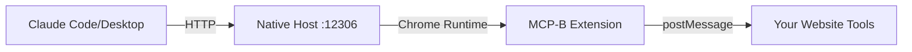

<Info>
**Unlock Desktop AI Integration**: The native host is a core feature that bridges your browser's WebMCP tools to desktop AI assistants. Use browser-based tools directly from Claude Code, Claude Desktop, or any MCP-compatible client!
</Info>

The native host bridges your browser's WebMCP tools to local MCP clients like Claude Code and Claude Desktop. This allows AI assistants running on your desktop to interact with tools you've registered on your websites.

<Info>
  **Prerequisites**:
  - [MCP-B Chrome Extension](https://chromewebstore.google.com/detail/mcp-b-extension/daohopfhkdelnpemnhlekblhnikhdhfa) installed from Chrome Web Store
  - Node.js 18+ installed
  - A website with WebMCP tools registered
</Info>

## How It Works

The native host acts as a proxy server that:
1. Runs locally on your machine (default port: 12306)
2. Communicates with the MCP-B Chrome extension
3. Exposes browser tools to desktop MCP clients via HTTP
4. Respects your browser's authentication (cookies, sessions)



## Installation

### Step 1: Install the Native Server

Install the native server globally via npm:

<Tabs>
  <Tab title="npm">
    ```bash
    npm install -g @mcp-b/native-server
    ```
  </Tab>

  <Tab title="pnpm">
    ```bash
    pnpm add -g @mcp-b/native-server
    ```
  </Tab>

  <Tab title="yarn">
    ```bash
    yarn global add @mcp-b/native-server
    ```
  </Tab>
</Tabs>

<Note>
  The native server must be installed **globally** to make the `@mcp-b/native-server` command available system-wide.
</Note>

### Step 2: Verify Installation

Check that the installation was successful:

```bash
# Check if command is available
which @mcp-b/native-server  # Mac/Linux
where @mcp-b/native-server  # Windows

# Check installed version
npm list -g @mcp-b/native-server
```

## Starting the Native Host

### Basic Usage

Start the native server with default settings:

```bash
@mcp-b/native-server
```

You should see output like:

```
Native host server running on http://127.0.0.1:12306
Extension connected: daohopfhkdelnpemnhlekblhnikhdhfa
Ready to accept MCP client connections
```

<Warning>
  Keep this terminal window open while using the native host. Closing it will stop the server.
</Warning>

### Configuration Options

The native server supports several configuration options:

<Tabs>
  <Tab title="Custom Port">
    ```bash
    @mcp-b/native-server --port 8080
    ```
  </Tab>

  <Tab title="Verbose Logging">
    ```bash
    @mcp-b/native-server --verbose
    ```
  </Tab>

  <Tab title="Multiple Options">
    ```bash
    @mcp-b/native-server --port 8080 --verbose
    ```
  </Tab>
</Tabs>

### Running as a Background Service

For continuous use, you can run the native server as a background service.

<Tabs>
  <Tab title="Mac/Linux (pm2)">
    ```bash
    # Install pm2
    npm install -g pm2

    # Start as service
    pm2 start @mcp-b/native-server --name mcp-native-host

    # Set to auto-start on boot
    pm2 startup
    pm2 save

    # Check status
    pm2 status

    # View logs
    pm2 logs mcp-native-host
    ```
  </Tab>

  <Tab title="Windows (NSSM)">
    ```powershell
    # Download and install NSSM
    # https://nssm.cc/download

    # Install as Windows service
    nssm install MCPNativeHost "C:\Program Files\nodejs\@mcp-b\native-server.cmd"

    # Start the service
    nssm start MCPNativeHost
    ```
  </Tab>
</Tabs>

## Connecting to Claude Code

Claude Code is Anthropic's command-line AI assistant that supports MCP.

### Step 1: Configure Claude Code

Add the native host to your Claude Code MCP configuration:

<Tabs>
  <Tab title="Mac/Linux">
    Edit `~/.config/claude/mcp.json`:

    ```json
    {
      "mcpServers": {
        "webmcp": {
          "type": "streamable-http",
          "url": "http://127.0.0.1:12306/mcp"
        }
      }
    }
    ```
  </Tab>

  <Tab title="Windows">
    Edit `%APPDATA%\claude\mcp.json`:

    ```json
    {
      "mcpServers": {
        "webmcp": {
          "type": "streamable-http",
          "url": "http://127.0.0.1:12306/mcp"
        }
      }
    }
    ```
  </Tab>
</Tabs>

### Step 2: Start Claude Code

Start Claude Code in your project directory:

```bash
cd your-project
claude
```

### Step 3: Verify Connection

Once Claude Code starts, ask it to list available tools:

```
You: What MCP tools are available?
```

You should see tools from any websites you have open with the MCP-B extension active.

<Tip>
  Open your website in Chrome with the MCP-B extension enabled **before** asking Claude Code to use tools. The native host can only access tools from active browser tabs.
</Tip>

## Connecting to Claude Desktop

Claude Desktop is Anthropic's desktop application that supports MCP.

### Step 1: Configure Claude Desktop

Add the native host to Claude Desktop's MCP settings:

<Tabs>
  <Tab title="Mac">
    Edit `~/Library/Application Support/Claude/claude_desktop_config.json`:

    ```json
    {
      "mcpServers": {
        "webmcp": {
          "type": "streamable-http",
          "url": "http://127.0.0.1:12306/mcp"
        }
      }
    }
    ```
  </Tab>

  <Tab title="Windows">
    Edit `%APPDATA%\Claude\claude_desktop_config.json`:

    ```json
    {
      "mcpServers": {
        "webmcp": {
          "type": "streamable-http",
          "url": "http://127.0.0.1:12306/mcp"
        }
      }
    }
    ```
  </Tab>
</Tabs>

### Step 2: Restart Claude Desktop

Restart Claude Desktop to load the new configuration:

1. Quit Claude Desktop completely
2. Reopen Claude Desktop
3. Wait a few seconds for MCP connections to initialize

### Step 3: Test the Connection

In Claude Desktop, ask about available tools:

```
What tools can you access from my browser?
```

Claude should list tools from your open browser tabs.

## Verifying the Setup

### Check Native Host Status

Verify the native host is running and accepting connections:

<Tabs>
  <Tab title="Browser Test">
    ```bash
    curl http://127.0.0.1:12306/health
    ```

    Expected response:
    ```json
    {
      "status": "ok",
      "extensionConnected": true,
      "version": "1.0.0"
    }
    ```
  </Tab>

  <Tab title="MCP Inspector">
    ```bash
    # Install MCP Inspector
    npm install -g @modelcontextprotocol/inspector

    # Connect to native host
    mcp-inspector http://127.0.0.1:12306/mcp
    ```

    This opens a web interface showing available tools and their schemas.
  </Tab>
</Tabs>

### Check Extension Connection

Verify the MCP-B extension is connected:

1. Open Chrome and click the MCP-B extension icon
2. Go to the "Settings" tab
3. Check for "Native Host: Connected" status
4. If disconnected, ensure the native server is running

### Test Tool Execution

Try calling a tool from your MCP client:

<Steps>
  <Step title="Open a website with WebMCP tools">
    Navigate to a site with tools registered (e.g., the [MCP-B demo](https://mcp-b.ai))
  </Step>

  <Step title="Ask Claude to use a tool">
    In Claude Code or Claude Desktop:
    ```
    Use the available tools to show me what you can do on this website
    ```
  </Step>

  <Step title="Verify execution">
    - Check that Claude successfully calls the tool
    - Verify the tool executes in the browser tab
    - Confirm Claude receives the tool's response
  </Step>
</Steps>

## Debugging Issues

### Native Server Won't Start

<AccordionGroup>
  <Accordion title="Port already in use">
    **Error**: `EADDRINUSE: address already in use :::12306`

    **Solution**: Another process is using port 12306

    ```bash
    # Find the process using the port
    lsof -i :12306  # Mac/Linux
    netstat -ano | findstr :12306  # Windows

    # Kill the process or use a different port
    @mcp-b/native-server --port 12307
    ```
  </Accordion>

  <Accordion title="Command not found">
    **Error**: `@mcp-b/native-server: command not found`

    **Solution**: Global npm modules not in PATH

    ```bash
    # Find npm global bin directory
    npm config get prefix

    # Add to PATH (Mac/Linux)
    export PATH="$PATH:$(npm config get prefix)/bin"

    # Or reinstall
    npm uninstall -g @mcp-b/native-server
    npm install -g @mcp-b/native-server
    ```
  </Accordion>

  <Accordion title="Extension not connecting">
    **Error**: `Extension not connected` in server logs

    **Solution**: Extension ID mismatch or extension not installed

    1. Verify the MCP-B extension is installed from the Chrome Web Store
    2. Check the extension is enabled at `chrome://extensions/`
    3. Restart Chrome
    4. Restart the native server
  </Accordion>
</AccordionGroup>

### MCP Client Can't Connect

<AccordionGroup>
  <Accordion title="Connection refused">
    **Error**: `ECONNREFUSED` when Claude tries to connect

    **Checklist**:
    1. Native server is running: `curl http://127.0.0.1:12306/health`
    2. Port matches config: Check both server and client config
    3. Firewall not blocking: Allow localhost connections
    4. Config file is valid JSON: Validate with a JSON linter
  </Accordion>

  <Accordion title="No tools available">
    **Issue**: Claude connects but can't see any tools

    **Checklist**:
    1. Browser tabs with WebMCP tools are open
    2. MCP-B extension is active (click icon to check)
    3. Tools are registered: Check extension "Tools" tab
    4. Native server is connected to extension: Check server logs

    ```bash
    # Enable verbose logging to debug
    @mcp-b/native-server --verbose
    ```
  </Accordion>

  <Accordion title="Tools fail to execute">
    **Issue**: Claude sees tools but execution fails

    **Debug steps**:

    1. Check browser console for errors:
       - Open DevTools (F12)
       - Look for errors when tool is called

    2. Check native server logs:
       ```bash
       @mcp-b/native-server --verbose
       ```

    3. Verify tab is still active:
       - If you closed or navigated away from the tab, tools won't work
       - Tools are scoped to specific pages

    4. Test directly in extension:
       - Click MCP-B extension icon
       - Go to "Tools" tab
       - Manually call the tool
       - Check for errors in extension popup
  </Accordion>
</AccordionGroup>

### Configuration Issues

<AccordionGroup>
  <Accordion title="Config file not found">
    **Issue**: Claude can't find the MCP configuration file

    **Solution**: Create the directory structure

    <Tabs>
      <Tab title="Claude Code (Mac/Linux)">
        ```bash
        mkdir -p ~/.config/claude
        echo '{"mcpServers":{}}' > ~/.config/claude/mcp.json
        ```
      </Tab>

      <Tab title="Claude Code (Windows)">
        ```powershell
        New-Item -ItemType Directory -Force -Path "$env:APPDATA\claude"
        Set-Content -Path "$env:APPDATA\claude\mcp.json" -Value '{"mcpServers":{}}'
        ```
      </Tab>

      <Tab title="Claude Desktop (Mac)">
        ```bash
        mkdir -p ~/Library/Application\ Support/Claude
        echo '{"mcpServers":{}}' > ~/Library/Application\ Support/Claude/claude_desktop_config.json
        ```
      </Tab>
    </Tabs>
  </Accordion>

  <Accordion title="Invalid JSON syntax">
    **Error**: Claude fails to load config

    **Solution**: Validate your JSON

    ```bash
    # Validate JSON syntax (Mac/Linux)
    cat ~/.config/claude/mcp.json | python -m json.tool

    # Common issues:
    # - Missing commas between entries
    # - Trailing commas (not allowed in JSON)
    # - Unquoted keys or values
    # - Incorrect URL format
    ```

    **Correct format**:
    ```json
    {
      "mcpServers": {
        "webmcp": {
          "type": "streamable-http",
          "url": "http://127.0.0.1:12306/mcp"
        }
      }
    }
    ```
  </Accordion>

  <Accordion title="Wrong URL format">
    **Issue**: Connection fails due to incorrect URL

    **Correct formats**:
    - ✅ `http://127.0.0.1:12306/mcp`
    - ✅ `http://localhost:12306/mcp`
    - ❌ `http://127.0.0.1:12306` (missing /mcp path)
    - ❌ `https://127.0.0.1:12306/mcp` (https not supported)
    - ❌ `ws://127.0.0.1:12306/mcp` (wrong protocol)
  </Accordion>
</AccordionGroup>

## Security Considerations

<Warning>
  The native host provides access to browser tools that can perform actions on your behalf. Only use it on trusted networks and with tools you control.
</Warning>

### Best Practices

<AccordionGroup>
  <Accordion title="Localhost Only">
    The native host should only listen on localhost (127.0.0.1), not on external network interfaces. This is the default behavior.

    **Avoid**:
    ```bash
    # Don't expose to network
    @mcp-b/native-server --host 0.0.0.0
    ```
  </Accordion>

  <Accordion title="Firewall Configuration">
    Ensure your firewall allows localhost connections but blocks external access:

    - Allow: `127.0.0.1:12306` → localhost only
    - Block: `0.0.0.0:12306` → all interfaces
  </Accordion>

  <Accordion title="Tool Permissions">
    Only expose tools that you would be comfortable executing through your browser's UI. Tools have the same permissions as your browser session.

    **Review tools carefully**:
    - Check what data they can access
    - Verify what actions they can perform
    - Ensure proper authentication checks
  </Accordion>

  <Accordion title="Monitor Tool Usage">
    Keep the native server logs visible or check them regularly to monitor tool execution:

    ```bash
    @mcp-b/native-server --verbose
    ```

    Watch for:
    - Unexpected tool calls
    - Failed authentication attempts
    - Unusual patterns of usage
  </Accordion>
</AccordionGroup>

## Advanced Usage

### Multiple Extension Support

If you're testing with both the Chrome Web Store extension and a development build:

<Warning>
  **Disable one version** to avoid port conflicts. Both versions will try to connect to the same native host.
</Warning>

1. Go to `chrome://extensions/`
2. Disable the version you're not using
3. Restart Chrome
4. Restart the native server

### Custom Extension IDs

For development builds with custom extension IDs, configure the native server:

```bash
# Set via environment variable
EXTENSION_ID=your-dev-extension-id @mcp-b/native-server

# Or create a config file
echo '{"extensionId":"your-dev-extension-id"}' > ~/.mcp-native-host/config.json
@mcp-b/native-server --config ~/.mcp-native-host/config.json
```

### Monitoring and Logging

Enable detailed logging for debugging:

<Tabs>
  <Tab title="Console Logging">
    ```bash
    @mcp-b/native-server --verbose --log-level debug
    ```
  </Tab>

  <Tab title="File Logging">
    ```bash
    @mcp-b/native-server --verbose > ~/mcp-native-host.log 2>&1
    ```
  </Tab>

  <Tab title="JSON Logging">
    ```bash
    @mcp-b/native-server --log-format json > ~/mcp-native-host.json
    ```
  </Tab>
</Tabs>

### Health Monitoring

Monitor the native host health with automated checks:

```bash
#!/bin/bash
# health-check.sh

# Check if server is responding
if curl -sf http://127.0.0.1:12306/health > /dev/null; then
  echo "✓ Native host is healthy"
  exit 0
else
  echo "✗ Native host is not responding"
  exit 1
fi
```

## Next Steps

<CardGroup cols={2}>
  <Card
    title="Claude Code Integration"
    icon="terminal"
    href="/tools/claude-code"
  >
    Deep dive into using Claude Code with WebMCP
  </Card>

  <Card
    title="Development Guide"
    icon="code"
    href="/development"
  >
    Learn how to develop WebMCP tools
  </Card>

  <Card
    title="Examples"
    icon="book-open"
    href="/examples"
  >
    Explore complete examples and patterns
  </Card>

  <Card
    title="Troubleshooting"
    icon="wrench"
    href="/troubleshooting"
  >
    More debugging tips and solutions
  </Card>
</CardGroup>

## Getting Help

If you encounter issues not covered here:

<Steps>
  <Step title="Check server logs">
    Run with verbose logging: `@mcp-b/native-server --verbose`
  </Step>

  <Step title="Test health endpoint">
    Verify server is running: `curl http://127.0.0.1:12306/health`
  </Step>

  <Step title="Check GitHub Issues">
    Search for similar problems: [WebMCP Issues](https://github.com/WebMCP-org/npm-packages/issues)
  </Step>

  <Step title="Join Discord">
    Ask the community: [WebMCP Discord](https://discord.gg/ZnHG4csJRB)
  </Step>
</Steps>

<Note>
  When reporting issues, include:
  - Native server version (`npm list -g @mcp-b/native-server`)
  - MCP-B extension version
  - Operating system and version
  - MCP client (Claude Code/Desktop) and version
  - Relevant log output with `--verbose` flag
</Note>
