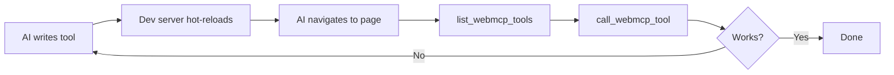

MCP server that lets AI agents control Chrome browsers via the Chrome DevTools Protocol, with WebMCP integration for calling tools registered on webpages.

<Card title="NPM Package" icon="npm" href="https://www.npmjs.com/package/@mcp-b/chrome-devtools-mcp">
  @mcp-b/chrome-devtools-mcp
</Card>

## Key features

- **28 browser automation tools** - navigation, input, screenshots, performance, debugging
- **WebMCP integration** - call tools registered via [@mcp-b/global](/packages/global)
- **AI-driven development** - build and test WebMCP tools in a tight feedback loop
- **Works with all MCP clients** - Claude Code, Cursor, VS Code, Gemini CLI, Windsurf

## AI-driven development workflow

The **build-test loop** lets AI agents write, deploy, discover, test, and iterate on WebMCP tools in real-time:



**Example workflow:**

1. Ask AI: *"Create a WebMCP tool called search_products"*
2. AI writes tool using [registerTool()](/concepts/tool-registration)
3. Dev server hot-reloads
4. AI navigates to `http://localhost:3000`, discovers and tests the tool
5. AI iterates until it works

<Info>
This is **TDD for AI** - agents build and verify their own tools in real-time.
</Info>

## Installation

```json "MCP Configuration"
{
  "mcpServers": {
    "chrome-devtools": {
      "command": "npx",
      "args": ["-y", "@mcp-b/chrome-devtools-mcp@latest"]
    }
  }
}
```

<AccordionGroup>
  <Accordion title="Claude Code">
    ```bash
    claude mcp add chrome-devtools npx @mcp-b/chrome-devtools-mcp@latest
    ```
  </Accordion>

  <Accordion title="Cursor">
    [Install in Cursor](https://cursor.com/en/install-mcp?name=chrome-devtools&config=eyJjb21tYW5kIjoibnB4IiwiYXJncyI6WyIteSIsIkBtY3AtYi9jaHJvbWUtZGV2dG9vbHMtbWNwQGxhdGVzdCJdfQ%3D%3D)
  </Accordion>

  <Accordion title="VS Code / Copilot">
    ```bash
    code --add-mcp '{"name":"chrome-devtools","command":"npx","args":["-y","@mcp-b/chrome-devtools-mcp@latest"]}'
    ```
  </Accordion>

  <Accordion title="Gemini CLI">
    ```bash
    gemini mcp add chrome-devtools npx @mcp-b/chrome-devtools-mcp@latest
    ```
  </Accordion>
</AccordionGroup>

**Test:** Ask your AI to *"Check the performance of https://developers.chrome.com"*

## Tools

<Tabs>
  <Tab title="WebMCP">
    | Tool | Description |
    |------|-------------|
    | `list_webmcp_tools` | Discover tools registered on the current page |
    | `call_webmcp_tool` | Call a website's MCP tool |
  </Tab>

  <Tab title="Input">
    `click`, `drag`, `fill`, `fill_form`, `handle_dialog`, `hover`, `press_key`, `upload_file`
  </Tab>

  <Tab title="Navigation">
    `navigate_page`, `new_page`, `close_page`, `list_pages`, `select_page`, `wait_for`
  </Tab>

  <Tab title="Debugging">
    `take_screenshot`, `take_snapshot`, `evaluate_script`, `list_console_messages`, `get_console_message`
  </Tab>

  <Tab title="Performance">
    `performance_start_trace`, `performance_stop_trace`, `performance_analyze_insight`, `list_network_requests`, `get_network_request`
  </Tab>
</Tabs>

## Built-in prompts

| Prompt | Use case |
|--------|----------|
| `webmcp-dev-workflow` | Guide through building WebMCP tools |
| `test-webmcp-tool` | Test tools with edge cases |
| `debug-webmcp` | Diagnose connection issues |

## Configuration

| Option | Description |
|--------|-------------|
| `--browserUrl` | Connect to running Chrome (e.g., `http://127.0.0.1:9222`) |
| `--headless` | Run without UI |
| `--isolated` | Use temporary profile, cleaned up on close |
| `--channel` | Chrome channel: `stable`, `canary`, `beta`, `dev` |

Run `npx @mcp-b/chrome-devtools-mcp@latest --help` for all options.

## Troubleshooting

| Issue | Solution |
|-------|----------|
| WebMCP not detected | Page needs [@mcp-b/global](/packages/global) loaded |
| Tool call fails | Check input matches schema via `list_webmcp_tools` |
| Browser won't start | Disable client sandboxing or use `--browserUrl` |

<Warning>
This server exposes browser content to MCP clients. Avoid sensitive data.
</Warning>

## Related

<CardGroup cols={2}>
  <Card title="@mcp-b/global" icon="globe" href="/packages/global">
    Register tools on your website
  </Card>
  <Card title="Tool Registration" icon="screwdriver-wrench" href="/concepts/tool-registration">
    How to write WebMCP tools
  </Card>
</CardGroup>
