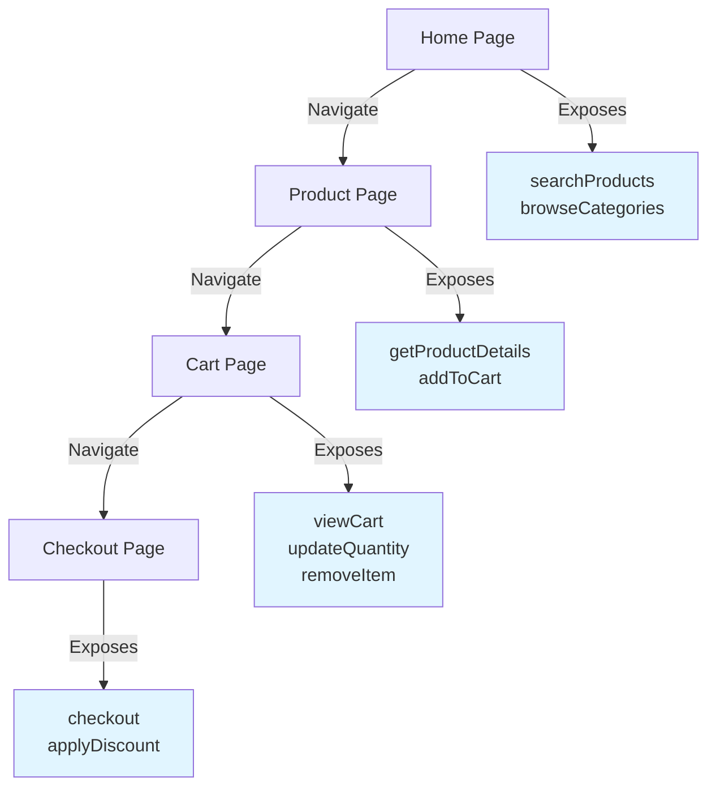

WebMCP competes with three existing approaches to connecting AI to the web. This guide compares all four across key dimensions: determinism, speed, UI resilience, authentication complexity, and human oversight. Understanding these tradeoffs will help you choose the right tool for your use case.

## The Problem with Current Approaches

Most solutions for connecting AI to the web fall into two categories: browser automation and remote APIs. Both have significant limitations.

### Browser Automation is Fundamentally Inefficient

When current AI tries to interact with a website using browser automation, here's what actually happens:

<Steps>
  <Step title="Take a screenshot">
    Capture the current page state (or parse the DOM)
  </Step>

  <Step title="Ask the model">
    "Where's the 'Add to Cart' button?"
  </Step>

  <Step title="Model responds">
    Provides coordinates or element selector
  </Step>

  <Step title="Click the button">
    Execute the interaction
  </Step>

  <Step title="Wait for update">
    Page reloads or updates
  </Step>

  <Step title="Verify">
    Take another screenshot and ask: "Did that work?"
  </Step>

  <Step title="Repeat">
    For every single interaction
  </Step>
</Steps>

<Warning>
**The core problem**: We're using a language model as an OCR engine with a mouse. Every click requires multiple round trips through the model, burning tokens on questions like "Is this button blue or gray?" and "Where is the search box?"
</Warning>

The model has to reorient itself with every page change, parse visual layouts, and hope the UI hasn't shifted by a pixel.

### Remote MCP Doesn't Solve the Same Problem

Remote MCP servers are designed for cloud-based, multi-tenant scenarios. While powerful, they come with significant challenges:

<AccordionGroup>
  <Accordion title="Authentication Complexity">
    Remote MCP requires OAuth2.1, which is currently only usable by local clients like Claude Desktop. Re-inventing auth for agents that act on behalf of users requires a complete reimagining of authorization systems.
  </Accordion>

  <Accordion title="Multi-Tenant Security Risks">
    Data leakage in multi-tenant apps with MCP servers is not a solved problem. Most remote MCPs that operate on user data are read-only for this reason.
  </Accordion>

  <Accordion title="No Human in the Loop">
    Remote MCPs are built for autonomous agents, but current models aren't reliable enough for fully autonomous work. For important tasks, humans need to be in the loop.
  </Accordion>

  <Accordion title="Premature Optimization">
    We're building infrastructure for autonomous cloud agents when what we actually need is human-supervised browser automation.
  </Accordion>
</AccordionGroup>

<Info>
Remote MCP is great for server-to-server communication and future autonomous agents. But for human-supervised web interactions happening right now, the browser is the right place.
</Info>

## The WebMCP Approach

Instead of teaching AI to use websites like a human, WebMCP lets websites expose their functionality directly as tools.

### Function Calls > UI Navigation

Compare these three approaches:

<Tabs>
  <Tab title="Computer Use">
    **What it does:**
    ```
    1. Parse these pixels
    2. Figure out what to click
    3. Hope the UI hasn't changed
    4. Click and verify
    ```

    **Issues:**
    - Non-deterministic
    - Requires vision model
    - Breaks when UI changes
    - Slow (multiple round trips)
  </Tab>

  <Tab title="Playwright MCP">
    **What it does:**
    ```
    1. Parse accessibility tree
    2. Figure out what to click
    3. Find the right element
    4. Click and verify
    ```

    **Issues:**
    - Still non-deterministic
    - Requires model to interpret UI
    - Breaks when structure changes
    - Slower than direct calls
  </Tab>

  <Tab title="WebMCP">
    **What it does:**
    ```javascript
    shop.addToCart({
      id: "abc123",
      quantity: 2
    })
    ```

    **Advantages:**
    - Deterministic (works or throws specific error)
    - No UI interpretation needed
    - Resilient to UI changes
    - Fast (direct function call)
  </Tab>
</Tabs>

### Comparison Matrix

| Approach | Determinism | Speed | UI Resilience | Auth Model | Human Oversight |
|----------|-------------|-------|---------------|------------|-----------------|
| **Computer Use** | Low | Slow | Breaks easily | Complex | Minimal |
| **Playwright MCP** | Medium | Medium | Breaks on changes | Complex | Minimal |
| **BrowserMCP** | Medium | Medium | Breaks on changes | Complex | Minimal |
| **Remote MCP** | High | Fast | N/A (no UI) | OAuth2.1 | Optional |
| **WebMCP** | High | Fast | UI-independent | Inherited | Built-in |

<Info>
**The key insight**: When you call `shop.addToCart({id: "abc123", quantity: 2})`, it either works or throws a specific error. When you try to click a button, you're hoping the UI hasn't changed, the element loaded, the viewport is right, and a dozen other things outside your control.
</Info>

## Good Websites Are Context Engineering

One of the biggest challenges in AI is **context engineering** - making sure the model only has context relevant to its task.

<Warning>
If you give a model 100 tools and ask it to do something where only one would be the right choice, things rarely go well. It's like giving someone an entire Home Depot when all they need is a saw, hammer, wood, and nails.
</Warning>

### WebMCP as a UI for LLMs

Just as websites don't put all content on one page, you can scope tools to different pages in your app:



Instead of overwhelming the model with all possible tools, you can:
- Limit tools based on current URL
- Show different tools based on user role
- Expose tools progressively as tasks advance
- Remove tools when components unmount

This creates a natural **progressive disclosure** pattern for AI, just like we do for human users.

## Why the Browser is the Right Place

The browser provides several unique advantages for human-supervised AI:

### 1. Authentication is Already Solved

<CardGroup cols={2}>
  <Card title="WebMCP" icon="check">
    Tools inherit the user's existing session cookies, auth headers, and permissions. No additional auth needed.
  </Card>

  <Card title="Remote MCP" icon="xmark">
    Requires OAuth2.1 implementation, token management, and complex multi-tenant authorization.
  </Card>
</CardGroup>

### 2. User-Scoped by Default

Client-side APIs in multi-tenant apps are already scoped to the current user. There's no risk of data leakage across tenants because the tools run with the same permissions as the user's browser session.

### 3. Human Visibility

The browser serves as both:
- **UI for the human** - See exactly what's happening
- **UI for the LLM** - Structured tools and clear context

The user can monitor every action the AI takes in real-time.

### 4. Damage Limitation

<Info>
Websites only expose tools they'd already expose as buttons or forms. If a website wants to expose a "delete all user data" tool, that's their choice - no different than putting a big red delete button on the page.
</Info>

WebMCP limits the potential damage by:
- Running in the user's browser context only
- Respecting same-origin policy
- Requiring explicit tool registration
- Making all actions visible to the user

### 5. Zero Backend Changes

Add AI capabilities to your website without:
- Deploying new backend services
- Implementing OAuth flows
- Managing API credentials
- Setting up multi-tenant isolation

## An Admission, Not a Prediction

<Info>
**WebMCP is an admission that AGI is not happening tomorrow.** If we're serious about automating parts of white-collar work, we need to build infrastructure for the models we have, not the models we wish we had.
</Info>

Browser automation approaches are betting that models will eventually be good enough to navigate any UI perfectly. That future may come, but it's not here yet and might not be for a while.

WebMCP acknowledges that:
- Current models work best with text and function calls
- Humans need to be in the loop for important work
- Determinism and reliability matter more than autonomy
- Web APIs are more robust than pixel parsing

## WebMCP vs Alternatives: Quick Reference

<AccordionGroup>
  <Accordion title="vs. Computer Use / Anthropic API">
    **When to use Computer Use:**
    - Apps without APIs or structured interfaces
    - One-off automation tasks
    - Exploring unfamiliar interfaces

    **When to use WebMCP:**
    - Websites you control or want to enhance
    - Repeated, reliable operations
    - When users need visibility into actions
    - Performance-critical operations
  </Accordion>

  <Accordion title="vs. Playwright MCP / Selenium">
    **When to use browser automation:**
    - Testing your website
    - Scraping data from sites you don't control
    - Temporary automation scripts

    **When to use WebMCP:**
    - Building features into your website
    - Long-term, maintainable integrations
    - When you control the website
    - When determinism matters
  </Accordion>

  <Accordion title="vs. Remote MCP Servers">
    **When to use Remote MCP:**
    - Server-to-server communication
    - Backend data access without UI
    - Future fully-autonomous agents
    - Multi-step cloud workflows

    **When to use WebMCP:**
    - Human-in-the-loop workflows
    - Browser-based user actions
    - Leveraging existing web sessions
    - When users need to see results
  </Accordion>

  <Accordion title="vs. BrowserMCP">
    **BrowserMCP** is another browser automation approach similar to Playwright MCP.

    **WebMCP difference:**
    - Direct function calls vs. DOM manipulation
    - Deterministic vs. heuristic
    - Website-defined tools vs. autonomous navigation
    - Fast execution vs. multi-step verification
  </Accordion>
</AccordionGroup>

## When NOT to Use WebMCP

WebMCP is designed for specific use cases. Don't use it when:

<Warning>
- **You need headless automation** - WebMCP requires an active browser with user present
- **You want fully autonomous agents** - WebMCP is for human-in-the-loop workflows
- **You don't control the website** - Can't add WebMCP to sites you don't own (use the MCP-B Extension to add tools to any site)
- **You need server-to-server communication** - Use standard MCP for backend integrations
- **The website has no JavaScript** - WebMCP requires JavaScript execution
</Warning>

## Next Steps

Ready to try the WebMCP approach?

<CardGroup cols={2}>
  <Card
    title="Quick Start"
    icon="rocket"
    href="/quickstart"
  >
    Add WebMCP to your website in minutes
  </Card>

  <Card
    title="Core Concepts"
    icon="diagram-project"
    href="/concepts/overview"
  >
    Understand WebMCP architecture
  </Card>

  <Card
    title="Examples"
    icon="code"
    href="/examples"
  >
    Working examples for different frameworks
  </Card>

  <Card
    title="Security Guide"
    icon="shield"
    href="/security"
  >
    Security best practices for tool design
  </Card>
</CardGroup>
